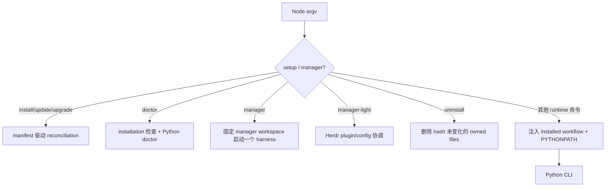

# CLI 机器接口契约
Active contributors: oldwinter, chendongdong

本项目有两个相邻但不同的 CLI 层：

- `bin/herdr-orchestrator.mjs` 是 npm 分发入口，负责项目安装与 ownership、手动 manager、
  manager-light，以及把 runtime 命令转发给包内 Python；
- `src/herdr_orchestrator/cli.py` 是运行时入口，负责 queue、readiness、Dashboard 和显式
  标准化交付。

自动化调用方必须同时收集 stdout、stderr 和退出码。两层都没有统一的顶层 JSON envelope。

## 通用输出与退出码

| 退出码 | 含义 | 典型命令 |
| --- | --- | --- |
| `0` | 命令或目标条件成功；长运行被 Ctrl-C 正常停止 | 大多数命令 |
| `1` | 命令完成，但健康、排空、恢复或 reconciliation 条件未满足 | `doctor`、`smoke`、`run --until-idle`、`resume`、部分 install/uninstall |
| `2` | 参数、配置、catalog、store、transport、tracker、artifact 或 wrapper 受控错误 | 两层 CLI |
| `3` | 标准化交付遇到必须交还用户的 secret/production decision | Python `deliver` |

规则：

1. `1` 经常仍有可解析 JSON stdout；不能把所有非零结果都当作“无响应”。
2. 受控 `2` 通常把稳定错误 token 或 `str(exception)` 写到 stderr，不保证 JSON。
3. argparse 自己也用 `2` 输出 usage；它发生在 Python handler 的异常捕获之前。
4. Node wrapper 的 runtime 子命令继承 Python 退出码；wrapper 自身异常统一为 `2`。
5. `catalog/profile --format text`、help、version 和 manager 不是 JSON 输出。

## Node npm 包装器

### 参数解析

`--project PATH` 对所有 wrapper 命令可用，默认当前目录。`--harness NAME` 只被
`install|update|upgrade|manager` 消费；runtime 命令中的 harness filter 会留在 `rest`
并转发给 Python。支持的安装 harness 为 `droid`、`grok`、`codex`、`pi`、`claude`、
`hermes`。



### `install`、`update`、`upgrade`

```text
herdr-orchestrator install --project PATH
  [--harness NAME ...]
  [--install-skill | --skip-skill]
```

`update` 和 `upgrade` 与 `install` 进入同一 reconciliation 逻辑。首次无显式 harness 时，
包装器依次执行六个 CLI 的 `--version` 探测；升级未传 harness 时沿用 manifest 列表。
输出：

```json
{
  "harnesses": ["droid", "codex"],
  "local_exclude": "managed",
  "manager": ".herdr-orchestrator/manager",
  "manifest": ".herdr-orchestrator/manifest.json",
  "ok": true,
  "preserved": [],
  "project": "/absolute/project",
  "skill": "managed",
  "unmanaged": [],
  "workflow": ".herdr-orchestrator/workflows/multi-harness.toml"
}
```

- `preserved[]` 是已由 manifest 管理但后来被用户修改、因而未覆盖的路径；
- `unmanaged[]` 是内容相同而由其他工具拥有、安装器复用但不接管的路径；
- `skill` 可为 `managed`、`existing_unmanaged`、`skipped` 或
  `skipped_existing_router`；
- 有 `preserved` 时 `ok=false`、退出 `1`；
- 未托管冲突、无 harness、非法 manifest 或 symlink guard 失败时退出 `2`。

### Wrapper `doctor`

```text
herdr-orchestrator doctor --project PATH [Python doctor options]
```

它把安装层和 Python runtime 层组合为一个对象：

```json
{
  "installation": {
    "manifest": true,
    "missing": [],
    "modified": [],
    "ok": true,
    "installed_version": "0.1.6",
    "runtime_version": "0.1.6",
    "version_skew": false
  },
  "ok": true,
  "project": "/absolute/project",
  "runtime": {
    "checks": [],
    "ok": true,
    "summary": {}
  }
}
```

只有 `installation.ok && runtime.ok` 时退出 `0`。安装 workflow 不存在时，runtime 保持
`{"checks":[],"ok":false}`；Python stdout 不是 JSON 时记录
`runtime_doctor_invalid_output`，而不是猜测成功。

### `uninstall`

```text
herdr-orchestrator uninstall --project PATH
```

输出：

```json
{
  "local_exclude": "removed",
  "ok": true,
  "preserved": [],
  "project": "/absolute/project"
}
```

只删除仍匹配 manifest SHA-256 的文件；用户改动列入 `preserved`，此时退出 `1`。处理后
manifest 被移除，保留项不再受包管理。

### `manager`

```text
herdr-manager [HARNESS]
herdr-orchestrator manager [HARNESS] [--project PATH]
```

该命令不输出 JSON；它继承 harness 的终端 stdio 和退出码。必须满足 `HERDR_ENV=1`。
显式 `HARNESS` 可选择六个受支持值之一；未显式指定时只按
`grok → codex → claude` 选择第一个可执行且在项目安装中启用的候选。
显式 `--project` 使用目标项目的 `.herdr-orchestrator/manager`；否则使用包内固定
`manager/`。Harness 以空参数数组启动，manager policy 不模拟 queue、lease、retry 或 receipt。

独立 `herdr-manager` npm 包的
`packages/herdr-manager/bin/herdr-manager.mjs` 只以固定 argv 调用运行包的 `manager`
入口，不使用 shell。

### `manager-light`

```text
herdr-orchestrator manager-light install|status|uninstall
```

`install`/`uninstall` 成功对象包含 `action`、`config`、`ok`、`plugin` 与 `runtime`；
`status` 包含 `action`、`config`、`ok` 与 `plugin`。例如：

```json
{
  "action": "status",
  "config": {
    "owned": true,
    "path": "/home/user/.config/herdr/config.toml",
    "state": "owned"
  },
  "ok": true,
  "plugin": {
    "enabled": true,
    "installed": true,
    "owned": true,
    "reachable": true
  }
}
```

`status` 在 config block、plugin enablement 或 plugin ownership 不完整时返回 `ok=false`
和退出 `1`。不支持的 Herdr 版本、外部 ownership、marker 损坏或候选配置校验失败返回 `2`。

### Runtime 转发

其余命令要求目标项目已有
`.herdr-orchestrator/workflows/multi-harness.toml`。包装器将其注入为 `--workflow`，
将 npm 包的 `src/` 注入 `PYTHONPATH`，其余参数原样转发。子进程无法启动是 wrapper 错误；
否则退出码原样透传。

## Python runtime 命令

直接调用 Python 时，每个子命令都要求 `--workflow PATH`。命令与 durable 影响：

| 分组 | 命令 | 状态影响 |
| --- | --- | --- |
| 发现与验证 | `catalog`、`profile`、`doctor`、`smoke` | 前两者只读；后两者创建受限 readiness turn |
| Queue 输入与查询 | `seed`、`enqueue`、`status` | 幂等写入或读取 SQLite |
| 执行与恢复 | `run`、`retry`、`resume`、`gc` | claim/dispatch、追加预算、恢复 blocked、清理 owned terminal |
| 本地观察 | `dashboard` | 初始化 DB 后提供只读 HTTP/SSE |
| 显式交付 | `deliver` | opt-in delivery 阶段机，不复用普通 queue 状态机 |

### `seed`

```json
{"added": 2, "existing": 1}
```

`added` 是新建 seed job；`existing` 是被 `(workflow, dedupe_key)` 去重的既有 job。

### `enqueue`

```json
{"created": true, "harness": "pi", "job_id": 9}
```

- `--harness auto` 与 `--placement auto` 是默认值；
- `--receipt-prefix` 去空白后必须为 1–256 字符且无 CR/LF；
- `--receipt-file` 必须是 execution root 下、1–500 字符、无 `..` 的相对路径；
- dedupe 命中时 `created=false`，返回既有 job 与原 harness。

### `status`

```json
{
  "counts": {
    "blocked": 0,
    "failed": 0,
    "pending": 1,
    "running": 0,
    "succeeded": 2
  },
  "jobs": [],
  "workflow": "multi-harness"
}
```

`jobs[]` 当前投影包含 ID/title/harness/placement/state、attempt budget、agent/error、
execution path/workspace、receipt 声明、`agent_settled`、`task_verified` 与
`correlation_id`；不包含 prompt。

### `run --once`

一次 wave 返回兼容的顶层五状态计数，以及：

```json
{
  "claimed": 1,
  "batch": {
    "blocked": 0,
    "failed": 0,
    "pending": 0,
    "running": 0,
    "succeeded": 1
  },
  "queue": {
    "blocked": 0,
    "failed": 0,
    "pending": 0,
    "running": 0,
    "succeeded": 1
  }
}
```

顶层状态计数与 `batch` 表示本 wave 结果；`queue` 是返回时的全 workflow 计数。Job 进入
blocked/failed 并不使“执行一次 wave”本身报 CLI 错误，因此 `--once` 仍退出 `0`。

### `run --until-idle` / `run --drain`

除累计 `batch`、`queue` 和 `claimed` 外，还包含：

| 字段 | 值或语义 |
| --- | --- |
| `mode` | `until_idle` |
| `scope` | `worker_pool` |
| `idle` | 当前 worker pool 是否排空 |
| `worker_pool_idle` / `queue_idle` | pool 与全 workflow 的独立判断 |
| `reason` | `queue_idle`、`worker_pool_idle`、`blocked` 或 `drain_timeout` |
| `waves` | 本次 drain 执行的 wave 数 |

`idle=true` 退出 `0`；blocked 或总 deadline 到期返回有效 JSON 和退出 `1`。
`--drain-timeout-seconds` 合法范围为 1–86400。

### 持续 `run`

未选择 mode 时进入 `run_forever()`，不为每轮打印 JSON。Ctrl-C 在 stderr 输出
`coordinator_stopped`，正常退出 `0`。

### `retry`

只接受 failed job，`--extra-attempts` 范围 1–10：

```json
{"attempts": 2, "job_id": 42, "max_attempts": 4, "state": "pending"}
```

它保留 job ID、dedupe key 与历史 receipts，只增加 attempt budget 并把当前投影置回 pending。

### `resume`

`--response-file` 必须存在且去空白后非空。命令恢复原 blocked agent、pane 和 attempt：

```json
{
  "agent_name": "worker-name",
  "agent_settled": true,
  "agent_state": "done",
  "attempt": 1,
  "error_code": null,
  "job_id": 42,
  "pane_id": "workspace:pane",
  "state": "succeeded",
  "task_verified": true,
  "queue": {}
}
```

只有 durable `state=succeeded` 时退出 `0`；再次 blocked、timeout 或验收失败返回 `1`，
同时仍追加同 attempt receipt。

### `gc`

必须二选一：`--succeeded-agents` 或 `--failed-agents`。默认 dry-run，`--apply` 才关闭：

- `dry_run`、`candidate_count`、`candidates[]`、`actions[]`、`states[]`；
- `skipped_blocked`、`skipped_worktrees`、`skipped_unowned`、`skipped_active`。

Worktree、blocked、复用/foreign、仍被活动 job 引用或缺少创建 receipt 的 terminal 不会被关。

### `catalog` 与 `profile`

`catalog --format json` 输出
`{"schema_version":1,"harnesses":[compact profiles...]}`。`profile HARNESS --format json`
输出 `{"schema_version":1,"profile":{...,"context":"..."}}`。默认格式分别是 JSON 和 text；
完整 Markdown context 只为被选 harness 加载。

### Python `doctor`

输出 `{checks, ok, summary}`。System check 覆盖 Herdr session 环境、Herdr/Git、可选 `gh`；
每个 harness 另有 executable、profile 和真实 readiness receipt。Readiness status 为：

`ready | auth_required | model_invalid | timeout | unavailable | error`

全部通过退出 `0`，否则退出 `1`。Probe timeout 范围为 5–300 秒；重复 `--harness` 只能选择
workflow 已启用项。

### `smoke`

```json
{
  "failures": [],
  "results": [
    {"harness": "codex", "state": "done", "task_verified": true}
  ]
}
```

每个选中 worker 都必须完成真实只读 turn 并产生当前 turn 的固定 output receipt；任一失败
退出 `1`。

### `dashboard`

绑定成功后立即 flush：

```json
{"status": "dashboard_started", "url": "http://127.0.0.1:8765"}
```

随后持续服务。默认 host/port/poll 为 `127.0.0.1`、`8765`、`2.0` 秒；Ctrl-C 在 stderr
输出 `dashboard_stopped` 并正常退出。HTTP wire contract 见
[Dashboard HTTP 与 SSE](dashboard-http-sse.md)。

### `deliver`

成功对象：

```json
{
  "artifact_root": "/repo/.orchestrator/deliveries/run-id",
  "integration_branch": "ho/slug/integration",
  "integration_commit": "commit-id",
  "review_rounds": 1,
  "run_id": "run-id",
  "status": "succeeded",
  "tickets_completed": 2,
  "tracker_references": {"ticket-id": "reference"}
}
```

成功只停在隔离 integration branch，不自动 push、PR、合并用户分支、release 或 deploy。
需要用户处理 protected category 时退出 `3` 并保留 artifact。

## 状态与成功含义

| 类型 | 值 |
| --- | --- |
| Durable `JobState` | `pending`、`running`、`succeeded`、`blocked`、`failed` |
| Runtime `AgentState` | `idle`、`working`、`blocked`、`done`、`unknown` |
| `PlacementTarget` | `tab`、`pane`、`worktree` |
| `ReceiptKind` | `output-prefix`、`file` |

`blocked` 与 `failed` 是不同的 durable 终态；blocked 只能由显式 `resume` 续答原 turn。
`idle/done` 只证明 settled。声明 receipt 后，`task_verified` 不为 `true` 就不能成功；
`unknown`、timeout、旧 receipt 和 prompt echo 都不是成功。

## 内部 Herdr subprocess 协议

`src/herdr_orchestrator/protocol.py` 的 JSON 成功响应必须是：

```json
{"id": "request-id", "result": {"agents": []}}
```

内部 `run_json()` 返回解包后的 `result`。Timeout 映射为 `herdr_timeout`，启动失败映射为
`herdr_unavailable`，非法成功 JSON 映射为 `herdr_invalid_response`。非零退出只接受 stderr
JSON 中匹配 `[a-z][a-z0-9_]{0,63}` 的 code；其他情况降级为
`herdr_command_failed`。这套 envelope 不应外推为顶层 CLI schema。

## 相关页面与源码

- [CLI 参考](../reference/cli-reference.md)
- [数据模型](../reference/data-models.md)
- [安装与分发](../systems/installation-and-distribution.md)
- [Coordinator 与队列](../systems/coordinator-and-queue.md)
- [Harness readiness](../features/harness-readiness-and-automation.md)
- `bin/herdr-orchestrator.mjs`
- `src/herdr_orchestrator/cli.py`
- `src/herdr_orchestrator/protocol.py`
- `tests/test_cli.py`
- `tests/test_distribution.py`
