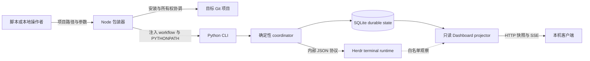

# 机器接口总览
Active contributors: oldwinter, chendongdong

Herdr Orchestrator 没有面向远程调用者的写入式网络 API。自动化消费者面对的是三条边界：

1. `bin/herdr-orchestrator.mjs` 提供安装、升级、诊断、卸载、手动管理会话和运行时转发；
2. `src/herdr_orchestrator/cli.py` 提供 durable queue、readiness、Dashboard 与标准化交付命令；
3. `src/herdr_orchestrator/dashboard/server.py` 提供只监听回环地址的只读 HTTP/SSE 投影。

Herdr CLI 的 JSON 是 coordinator 内部 transport 协议，不是顶层公共接口。详细命令形状见
[CLI 机器契约](cli-contracts.md)；Dashboard 路由和事件格式见
[Dashboard HTTP 与 SSE](dashboard-http-sse.md)。

## 接口分层

| 接口 | 主要消费者 | 成功输出 | 写入能力 | 稳定边界 |
| --- | --- | --- | --- | --- |
| Node 包装器 | `npx`、安装脚本、`herdr-manager` | 命令专属 JSON、版本文本，或继承的终端会话 | 受 manifest 约束的项目文件、可选 Herdr manager-light 配置 | `package.json`、`bin/herdr-orchestrator.mjs` |
| Python CLI | `just`、包装器、自动化脚本 | 命令专属 JSON；`catalog/profile` 可输出文本 | queue、SQLite、Herdr 与显式 delivery | `src/herdr_orchestrator/cli.py` |
| Dashboard HTTP/SSE | 本机浏览器、只读客户端 | snapshot schema v1、进程内 event ID | 无业务写路由 | `src/herdr_orchestrator/dashboard/server.py` |
| Herdr subprocess | 仓库内部 adapter | `{"result": {...}}` 的内部 envelope | pane、agent、workspace 操作 | `src/herdr_orchestrator/protocol.py` |

## 自动化消费原则

1. **先判断退出码，再解析 stdout。** `doctor`、`smoke`、`resume` 和
   `run --until-idle` 在“命令已执行但目标未达成”时返回 `1`，同时仍可能输出有效 JSON。
2. **不要假设统一 envelope。** 顶层 CLI 每个命令直接输出自己的对象；只有内部 Herdr
   JSON 协议要求对象型 `result`。
3. **把 stderr 当诊断通道。** 受控输入、配置或 transport 错误通常返回 `2`，错误文本不保证
   是 JSON；标准化交付的 protected-category escalation 返回 `3`。
4. **区分 durable 与 runtime 状态。** `idle`、`done` 只表示 agent turn 已稳定结束；
   声明 receipt 的任务还必须得到 `task_verified=true`。
5. **把 SSE 当最新值流。** 每个 `snapshot` 事件都是完整投影，event ID 只在当前 Dashboard
   进程内有效；持久历史来自 SQLite job 与 receipt。
6. **保留未知字段兼容性。** snapshot v1 和命令对象可能以 additive 方式扩展；消费者应读取
   自己需要的字段，并容忍降级快照缺少正常分区。

## 导航

- [CLI 机器契约](cli-contracts.md)：Node 包装器、Python 子命令、JSON、错误通道与退出码。
- [Dashboard HTTP 与 SSE](dashboard-http-sse.md)：只读路由、Host 防护、snapshot 与重连语义。
- [CLI 参考](../reference/cli-reference.md)：面向操作者的参数速查。
- [数据模型](../reference/data-models.md)：job、attempt、receipt、placement 与 delivery artifact。
- [Coordinator 与队列](../systems/coordinator-and-queue.md)：claim、lease、retry 和状态推进。
- [本地 Dashboard](../systems/dashboard.md)：observer、projector、feed 与前端投影。
- [收据与恢复](../features/receipts-and-recovery.md)：`agent_settled` 与 `task_verified`。
- [安全与信任边界](../security.md)：本地权限、secret、网络与外部副作用约束。

## 实现与测试锚点

| 完整仓库路径 | 作用 |
| --- | --- |
| `bin/herdr-orchestrator.mjs` | npm 包装器、manifest ownership、manager 与 runtime 转发 |
| `src/herdr_orchestrator/cli.py` | Python 参数、command handler、输出和退出码 |
| `src/herdr_orchestrator/protocol.py` | Herdr 子进程 JSON/text 协议 |
| `src/herdr_orchestrator/dashboard/server.py` | loopback HTTP、SSE、静态资源与安全响应头 |
| `src/herdr_orchestrator/dashboard/projector.py` | snapshot schema v1 |
| `tests/test_cli.py` | Python CLI 参数、JSON 和退出码 |
| `tests/test_distribution.py` | npm 安装、升级、manager 和 ownership |
| `tests/test_dashboard.py` | HTTP、Host、字段排除与 snapshot/feed |
