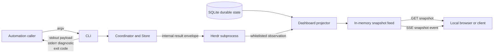

# API Lens：机器接口总览
Active contributors: oldwinter, chendongdong

本组页面描述 Herdr Orchestrator 面向自动化消费者的稳定边界，而不是重复命令帮助。仓库没有远程写 API：主要机器入口是一次性 CLI 的 stdout/stderr/退出码，以及仅监听本机回环地址的只读 Dashboard HTTP/SSE。Herdr 子进程 JSON 则是 coordinator 内部 transport 边界，不应被外部调用方误当成顶层 CLI 协议。

## 导航

- [CLI 机器接口契约](cli-contracts.md)：命令分组、成功 payload、退出码、状态枚举与内部 Herdr transport。
- [Dashboard HTTP 与 SSE](dashboard-http-sse.md)：loopback/Host 防护、GET 路由、snapshot schema v1、SSE 重连语义。
- [CLI Reference](../reference/cli-reference.md)：面向操作者的命令与参数速查。
- [Data Models](../reference/data-models.md)：durable job、receipt、dispatch 等核心数据模型。
- [Dashboard System](../systems/dashboard.md)：observer、projector、feed 与前端投影的系统设计。
- [Security](../security.md)：本地信任边界、secret 与外部副作用约束。

## 接口分层

| 层 | 面向谁 | 版本/稳定标记 | 写能力 |
| --- | --- | --- | --- |
| CLI | shell、脚本、`just` recipes | command-specific JSON 与退出码；没有全局 JSON envelope | 取决于命令；queue 命令可写本地 durable state |
| Dashboard HTTP/SSE | 本机浏览器或只读客户端 | snapshot 顶层 `schema_version: 1` | 无；只有 GET |
| Herdr subprocess protocol | 仓库内部 adapter | 成功响应必须含对象型 `result` | 内部控制面，非公开 API |

## 兼容性原则

1. **先判退出码，再解析 stdout。** 一些业务失败会保留可解析 JSON 并返回 `1`；配置、transport 或输入契约错误通常返回 `2`，诊断位于 stderr。
2. **不要假设全局 CLI envelope。** 每个命令直接输出自己的顶层对象；错误也不是统一 JSON。
3. **以 durable job state 为准。** Herdr agent 的 `idle`/`done` 只表示 settled，不能单独证明任务正确；声明 receipt 时还需 `task_verified=true`。
4. **snapshot v1 按分区消费。** 正常快照含 summary、jobs、attention、topology、timeline；monitor 自身异常时会发布字段更少的降级快照，客户端必须容忍缺失分区。
5. **SSE 是最新值流，不是事件日志。** event ID 只在当前 Dashboard 进程内递增；durable 生命周期证据在 snapshot 的 timeline 中。

## 源码锚点

- CLI 路由与输出：`src/herdr_orchestrator/cli.py`
- 公共枚举和 dataclass：`src/herdr_orchestrator/model.py`
- Herdr 子进程协议：`src/herdr_orchestrator/protocol.py`
- HTTP/SSE 服务：`src/herdr_orchestrator/dashboard/server.py`
- snapshot v1 投影：`src/herdr_orchestrator/dashboard/projector.py`
- 观察字段白名单：`src/herdr_orchestrator/dashboard/observer.py`
- 契约测试：`tests/test_cli.py`、`tests/test_dashboard.py`
