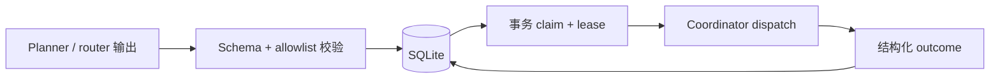

# 关键设计取舍与后果
Active contributors: oldwinter, chendongdong

## 说明

本页不是补写的 ADR 集合。它从当前文档、实现与提交历史中提取可验证的设计决定，并分别说明直接后果和代价。项目何时增加这些能力可从 `b4899a7`、`0e55a06`、`68044cf`、`76d01ce`、`2816491`、`fa0b310` 与 `b7c90e9` 等提交核验；没有记录的历史动机不作为事实陈述。

## 1. 确定性 control plane 拥有状态推进权

**可验证的决定**

- `src/herdr_orchestrator/runner.py` 的 `Coordinator` 决定 planner 何时运行、placement 何时补齐、哪些 job 可以 claim、并发波次如何收口，以及结果如何交给 store。
- `src/herdr_orchestrator/store.py` 用 SQLite 保存 job、attempt、lease、dedupe key 和 receipt；claim 在 `BEGIN IMMEDIATE` 事务中完成。
- Planner/router 只能生成受 schema 限制的 JSON。它不能提交 shell command，也不能直接将 job 标记为成功。



**后果**

- Coordinator 重启后可以根据 lease 和 attempt 恢复，而不依赖模型记忆或 pane 标题。
- 相同 `(workflow, dedupe_key)` 不会重复入队，外部副作用仍应由任务自己的幂等键保护。
- 状态机与 migration 必须保持向后兼容；增加状态或成功条件会同时影响 `src/herdr_orchestrator/model.py`、`src/herdr_orchestrator/store.py`、CLI、Dashboard 与测试。
- 模型灵活性被有意限制在决策 seam 内；控制面需要自行承担校验、重试和错误分类的实现复杂度。

详见 [Coordinator 与 durable queue](../systems/coordinator-and-queue.md)、[Durable execution](../features/durable-execution.md) 和 [任务与收据](../primitives/jobs-and-receipts.md)。

## 2. Herdr 是 terminal runtime，不是推理主控

**可验证的决定**

`src/herdr_orchestrator/herdr.py` 把 Herdr 当作结构化 transport：创建或复用 agent、发送 prompt、读取 lifecycle JSON、验证 workspace/pane 身份并等待 settled。Worker 选择、queue claim、retry、receipt 成功规则仍位于 coordinator/store。

**后果**

- Herdr 的 detach/reattach、PTY、pane、tab 与 workspace 能力可以被复用，而不会让 runtime 接管业务状态机。
- Herdr server 完整重启、机器睡眠或 harness session 丢失仍可能导致 lease 过期和重跑；worktree 不是安全沙箱。
- Coordinator 不能把 terminal output 当通用真相。输出只用于有界诊断、确定性 fatal signal 和显式 output-prefix receipt。
- Herdr CLI 的 JSON schema、lifecycle sequence 和 pane/workspace identity 成为 transport 协议的一部分。

详见 [Herdr runtime](../systems/herdr-runtime.md)。

## 3. 普通 durable queue 与标准化交付是两条运行面

**可验证的决定**

- 普通任务通过 `enqueue` / `run` / `retry` / `resume` / `gc` 进入 `src/herdr_orchestrator/runner.py` 与 SQLite queue。
- 只有显式 command、Skill 或规定的精确触发词才进入 `src/herdr_orchestrator/delivery.py` 的 `StandardizedDelivery`。
- 标准化交付使用 spec、ticket DAG、每 ticket 独立 worktree、commit receipt、双轴 review 和有界 repair；普通 queue 不使用这套 DAG 和 integration 协议。

**后果**

- 普通实现、修复、review 或 orchestrate 不会意外升级成会创建 tracker artifacts、branches 和多个 worktree 的长流程。
- 两条运行面可以共享 harness catalog、controller 选择与 Herdr transport，但不能混用状态语义：普通 queue 的 task receipt 不等同于 delivery ticket receipt。
- Dashboard 是两者之外的只读运维视图，不构成第三条执行面。
- 维护者需要同时保护 queue schema 与 delivery artifact schema 的恢复兼容性。

详见 [标准化交付系统](../systems/standardized-delivery.md)、[跨系统能力索引](../features/index.md) 和 [交付 Artifact](../primitives/delivery-artifacts.md)。

## 4. Harness catalog 分两级加载

**可验证的决定**

- `profiles/harnesses/*.toml` 是供 planner/router 使用的 compact catalog，只含选择所需元数据。
- `[[workers]]`、`[planner].worker_harnesses` 与 CLI override 逐层收窄可选集合。
- Job 被 claim 后，`src/herdr_orchestrator/catalog.py` 才读取所选 harness 的完整 `profiles/harnesses/*.md`，再与 task packet 一起注入 worker。
- Profile 路径、字段和大小 fail closed。

**后果**

- 未选 harness 的完整上下文不会进入当前 turn，controller 也不能选择 workflow 未启用的 worker。
- TOML metadata 与 Markdown execution context 各有职责；修改能力定位与修改执行契约需要进入不同文件。
- [推断] 这种分层减少了 controller 首轮上下文体积与无关 profile 的相互污染，但仓库没有把这一点记录成正式 ADR。
- Catalog 的简洁度会影响路由质量，因此 compact metadata 仍是需要测试和维护的接口。

详见 [Harness catalog 与路由](../systems/catalog-and-routing.md) 和 [Harness profile](../primitives/harness-profiles.md)。

## 5. Harness selection 与 placement 分离，并提供三种 placement

**可验证的决定**

Harness 回答“谁做”，placement 回答“在哪里做”。`src/herdr_orchestrator/topology.py` 的优先级是：

```text
显式 task override
  → worker default
  → 确定性读写信号
  → 模糊任务的受限 controller JSON
  → PlacementTarget 校验
```

三种目标分别是：

| Placement | 隔离与布局 | 直接后果 |
| --- | --- | --- |
| `pane` | 同一 `run_once` 批次共享 tab，每任务独立 pane/agent | 适合只读并行；仍共享 checkout。 |
| `tab` | 独立 full-size tab，共享 workflow checkout | 保留完整终端空间，但没有 checkout 隔离。 |
| `worktree` | Herdr 原生 workspace、独立 branch 与 checkout | 写任务可隔离；完成后不会自动 merge 或删除。 |

**后果**

- 只读任务不必为每个 job 创建 checkout，写任务则可使用稳定派生的 worktree 在 retry 时恢复。
- Placement 不能被 worker 身份暗含；新增 harness 不需要重新定义 topology 语义。
- 模糊任务需要一次受限 controller turn，且 Git 不可用时必须拒绝 `worktree`。
- Worktree 保留增加人工审查与磁盘占用；普通 GC 明确不负责删除它。

详见 [拓扑感知派发](../features/topology-aware-dispatch.md) 和 [Placement 与 worktree](../primitives/placement-and-worktrees.md)。

## 6. 声明过的 task receipt 必须 fail closed

**可验证的决定**

`src/herdr_orchestrator/herdr.py` 把 `agent_settled` 与 `task_verified` 分开。Output receipt 必须来自当前 turn 新增输出，且不能与 prompt 的独立行歧义；file receipt 必须在当前 turn 新建或内容变化。`src/herdr_orchestrator/store.py` 在声明 receipt 后只接受 `task_verified=true`，否则写入错误并按 attempt 策略处理。

**后果**

- `idle` / `done` 不再自动等同于“任务已完成”；旧输出、prompt echo 和既有未变文件不能充当新证据。
- 没有声明 receipt 的兼容任务仍可在 settled 且无 fatal signal 时成功，但 `task_verified=null`，这保留旧行为而不伪造验证。
- Receipt 证明的是窄机器契约，不替代代码质量、规格完整性或 review。
- 更严格的 freshness 会暴露过去被隐藏的假阳性，也要求任务作者选择稳定且不歧义的 receipt。

详见 [任务收据与恢复](../features/receipts-and-recovery.md)。

## 7. Dashboard 是只读旁路

**可验证的决定**

Dashboard 由 SQLite read-only observer 与 Herdr whitelist observer 经 `RuntimeProjector` 生成 snapshot，再通过 loopback HTTP/SSE 展示。它不读取 `jobs.prompt`、环境变量或 pane output；monitor 退出、断线或异常不改变 coordinator、lease 或 receipt。

**后果**

- 运维者能关联 `job → agent → pane → tab → workspace` 并观察 durable/runtime drift，而不把 UI 放进调度关键路径。
- SSE snapshot 是完整、幂等的当前投影；event ID 只服务当前 Dashboard 进程重连，durable 历史仍来自 job 与 receipt。
- 只读与字段白名单降低了浏览器暴露 prompt、secret 或 transcript 的风险。
- Dashboard 无权“修复” drift；操作仍需回到 CLI、queue 恢复命令或 Herdr 诊断。

详见 [本地 Dashboard](../systems/dashboard.md) 和 [可观测性与 Attention](../features/observability-and-attention.md)。

## 8. Observability 默认 local-first

**可验证的决定**

Coordinator 为 dispatch 生成 correlation ID，并通过 `src/herdr_orchestrator/observability.py` 在本机写入脱敏事件、指标与告警。Sentry、PostHog 和 HTTPS webhook exporter 默认关闭；观测失败不拥有 queue 状态。

**后果**

- Job、attempt receipt、phase timing 与 attention 可以在本机串联，默认不要求外部 SaaS。
- 远端 exporter 是显式配置，而不是运行成功的前置条件。
- 本地 artifact 与 runtime state 不能提交进 Git；有界摘要用于错误分类，不保存完整终端 transcript。
- [推断] 这种默认值有利于离线与敏感仓库使用，但代价是跨机器聚合和长期留存需要额外启用外部设施。

详见 [可观测性与 Attention](../features/observability-and-attention.md)。

## 9. Python runtime 保持零包依赖

**可验证的决定**

`pyproject.toml` 的 `[project].dependencies` 为空，生产 Python 实现使用 Python 3.12+ 标准库。开发质量工具位于独立 dependency group；Herdr、各 harness CLI、Git 和可选的 Node 安装包装器属于外部运行前提，不是 Python package dependency。

**后果**

- Runtime 安装面更小，依赖解析和供应链升级面受限。
- SQLite、HTTP、SSE、TOML、subprocess 与并发等能力需要依靠标准库或仓库内实现，维护成本由项目承担。
- “零包依赖”不等于“零前置条件”：真实执行仍要求 Herdr 环境和至少一个已登录 harness CLI。
- Dashboard 的 vendored 静态资产需要保留许可证与分发测试，不能把“无 Python 依赖”误解为没有任何第三方代码。

详见 [安装与分发](../systems/installation-and-distribution.md)。

## 10. 标准化交付必须 opt-in，且成功止于隔离 integration branch

**可验证的决定**

`src/herdr_orchestrator/delivery.py` 由确定性 coordinator 推进 `wayfinder? → spec/tickets → frontier implementation → integration → Standards ∥ Spec review → bounded repair`。Wayfinder 只在配置或 auto 判定需要澄清 decision fog 时运行；principal proxy 只处理规格内、本地、可逆的问题，secret 与 production 必须升级给用户。

**后果**

- 显式触发授权的是一套有边界的本地工程流程，不授权 push、PR、用户分支 merge、release 或 deploy。
- 每张 ticket 必须有 clean commit、匹配 `HEAD` 的 receipt、逐条 acceptance evidence 和检查结果；merge 后才关闭 ticket。
- Review 不是无限循环：两轴并行，controller 裁决 finding，repair 有配置上限。
- 失败保留 state、ledger、worktree 和 artifact 供恢复；成功也只停在隔离 integration branch，最终采用动作仍由用户决定。

详见 [标准化交付系统](../systems/standardized-delivery.md) 和 [交付 Artifact](../primitives/delivery-artifacts.md)。

## 总结：灵活性放在 seam，状态权留在确定性代码

这些取舍形成一个一致模式：模型可以在受限 seam 中做 harness、topology、spec、review 等判断；进入 queue、推进 stage、接受 receipt、恢复 attempt 和回收资源则由确定性代码验证。其收益是可恢复与可审计，代价是 schema、artifact、migration 和运行协议都必须被当作长期接口维护。
