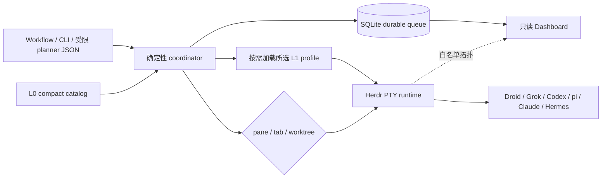

# 背景 Lens
Active contributors: oldwinter, chendongdong

## 这一组页面回答什么

Herdr Orchestrator 从一开始就不是“让一个 agent 调另一个 agent”的薄包装，而是一个本地优先、可恢复、可验证的多 harness 控制面。本 lens 解释当前形态背后的**可核验取舍**，以及真实多 harness 演练如何把若干隐含假设变成明确的运行契约。

这里不把后来的实现倒写成虚构 ADR，也不猜测作者未记录的心理动机。事实主要核对自 `README.md`、`docs/architecture.md`、`docs/runtime-troubleshooting.md`、`docs/standardized-delivery.md`、核心实现和 Git 历史；超出这些证据的解释会明确标为“推断”。

## 阅读路径

| 页面 | 重点 | 建议同时阅读 |
| --- | --- | --- |
| [关键设计取舍与后果](design-decisions.md) | 为什么调度权归确定性 coordinator、Herdr 只做 runtime、普通 queue 与标准化交付为何分面，以及 catalog、placement、receipt、Dashboard、依赖策略的边界 | [核心系统](../systems/index.md)、[跨系统能力](../features/index.md)、[领域原语](../primitives/index.md) |
| [运行时演练形成的经验](runtime-lessons.md) | 如何证明 prompt 真被接受、为什么 settled 要稳定、timeout/blocked/receipt/trust/GC 应怎样判定，以及真实 smoke 比 fixture 多证明了什么 | [Herdr runtime](../systems/herdr-runtime.md)、[Harness readiness 与自动化](../features/harness-readiness-and-automation.md)、[任务与收据](../primitives/jobs-and-receipts.md) |
| [项目 Lore](../lore.md) | 按提交历史查看项目从 durable queue 到 topology、Dashboard、可信收据与启动自动化的演进 | 本页的时间线 |

## 从提交历史能确认的演进

以下只复述提交内容与当前代码可交叉验证的变化，不把提交顺序解释成未记录的长期路线图。

| 提交 | 可确认的增量 |
| --- | --- |
| `b4899a7` | 初始化声明式 workflow、SQLite lease queue、受限 planner 输入、Herdr lifecycle transport 与测试。 |
| `0e55a06` | 加入两级 harness catalog 和 opt-in 标准化交付。 |
| `68044cf` | 加入 topology-aware 执行，形成 `tab`、`pane`、`worktree` 三种 placement。 |
| `76d01ce` | 加入 loopback-only、只读的本地 operations Dashboard。 |
| `2816491` | 把任务结果收紧为 readiness、真实 turn、settlement 与可选机器收据的分层证据。 |
| `fa0b310` | 强化 timeout reconciliation、receipt freshness、blocked resume 与保守 GC。 |
| `b7c90e9` | 固化六种 harness 的最大自动化启动参数，并为 Claude workspace trust 增加精确匹配边界。 |

## 当前系统的分工

这张图中的关键断点是：

- 模型可以提出任务、选择受限候选或生成严格 artifact，但不能直接推进 durable state；
- Herdr 提供 PTY、agent lifecycle 与 topology，不决定 queue、lease、retry 或成功标准；
- `idle` / `done` 只说明 agent settled；声明了 receipt 的任务还必须得到 `task_verified=true`；
- Dashboard 是旁路观察者，失效不能反向影响 coordinator；
- 标准化交付复用部分 catalog 与 transport，但拥有独立的阶段、artifact、worktree DAG 和完成协议。

## 证据边界

1. **当前实现真源**：`src/herdr_orchestrator/runner.py`、`src/herdr_orchestrator/store.py`、`src/herdr_orchestrator/herdr.py`、`src/herdr_orchestrator/topology.py`、`src/herdr_orchestrator/delivery.py`。
2. **公开运行契约**：`docs/architecture.md`、`docs/runtime-troubleshooting.md`、`docs/standardized-delivery.md`。
3. **历史增量**：Git commit message 与对应 diff，只用于说明“何时增加了什么”。
4. **推断限制**：例如“这种分层可能降低 controller context 污染”只有在标为推断时才采用；它不是仓库已经记录的 ADR。

继续阅读：[关键设计取舍与后果](design-decisions.md) · [运行时演练形成的经验](runtime-lessons.md) · [项目 Lore](../lore.md)
