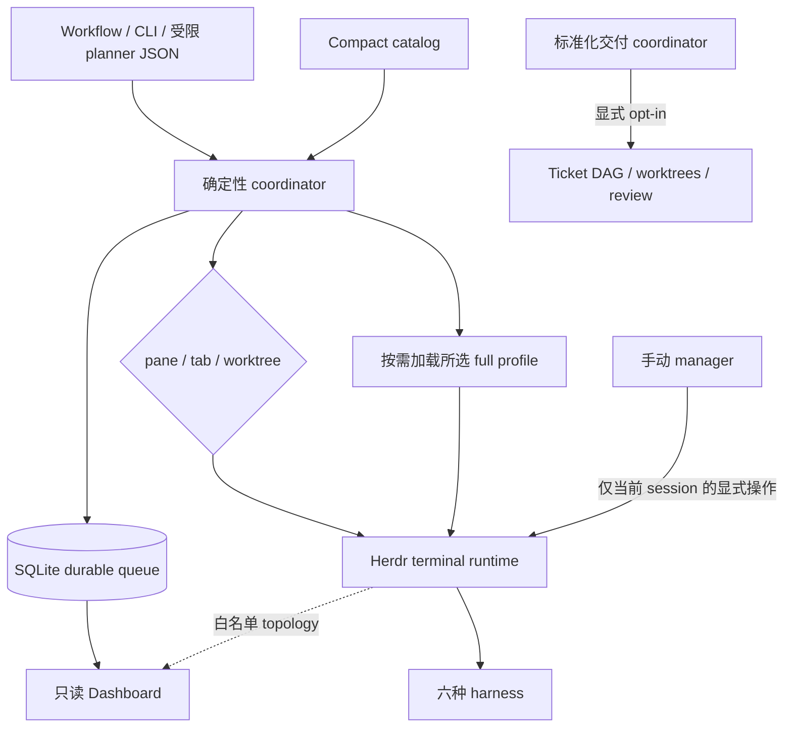

# 项目背景
Active contributors: oldwinter, chendongdong

Herdr Orchestrator 的历史不是“一个 agent 调另一个 agent”的功能堆叠，而是不断把运行时
歧义变成确定性契约：先建立 durable queue，再把 catalog、placement、Dashboard、receipt、
readiness、安装 ownership 和手动管理会话分成明确运行面。

本组页面只陈述可由 `origin/main` 提交、当前源码和公开文档交叉核验的事实；未记录的作者
动机不倒写成虚构 ADR。

## 阅读路径

| 页面 | 回答的问题 | 配套页面 |
| --- | --- | --- |
| [关键设计取舍](design-decisions.md) | 哪些边界被刻意放在确定性代码中，这些选择带来什么收益和代价？ | [系统索引](../systems/index.md)、[能力索引](../features/index.md)、[原语索引](../primitives/index.md) |
| [运行时经验](runtime-lessons.md) | 真实多 harness 演练如何改变 readiness、turn、settlement、receipt、resume 与 cleanup 契约？ | [Herdr runtime](../systems/herdr-runtime.md)、[Harness readiness](../features/harness-readiness-and-automation.md) |
| [项目 Lore](../lore.md) | 项目按提交历史如何演进？ | 本页时间线 |
| [清理机会](../cleanup-opportunities.md) | 当前有哪些有证据、可执行，但尚未证明为 dead code 的维护项？ | [安全](../security.md)、[贡献约定](../how-to-contribute/index.md) |

## 可确认的演进阶段

| 日期与提交 | 可确认变化 |
| --- | --- |
| 2026-08-23 `b4899a7` | 初始化声明式 workflow、SQLite lease queue、planner schema、Herdr transport 与测试。 |
| 2026-08-23 `4e0670f` | 增加 Grok harness 和同 harness replicas。 |
| 2026-08-24 `0e55a06` | 引入 compact/full 两级 catalog 与 opt-in 标准化交付。 |
| 2026-08-24 `68044cf` | 把“谁执行”与“在哪里执行”分开，加入 pane/tab/worktree placement。 |
| 2026-08-24 `76d01ce` | 增加 coordinator 旁路的 loopback-only、只读 Dashboard。 |
| 2026-08-24 `8c8e330` | 增加 manifest 驱动的一键项目安装器。 |
| 2026-08-24 `cb85dca` | 增加 npm registry 版本 gate 与 Trusted Publishing。 |
| 2026-08-25 `a6b2560` | Dashboard 增加 topology Canvas。 |
| 2026-08-25 `2816491` | 将运行结果分成 readiness、turn、settlement 和机器 receipt 多层证据。 |
| 2026-08-25 `fa0b310` | 强化 timeout reconciliation、receipt freshness、blocked resume 与保守 GC。 |
| 2026-08-25 `4d3bc36` | 加入覆盖率、稳定性、安全、复杂度、构建和 profiling 等质量 gate。 |
| 2026-08-25 `b7c90e9` | 固化六 harness 的最大自动化参数和 Claude execution-root trust guard。 |
| 2026-08-27 `5aa115e`–`1f344b9` | 增加并简化手动 manager workspace/命令，并固定默认 Grok→Codex→Claude。 |
| 2026-08-28 `2b9ab77` | 增加显式 opt-in 的 manager-light plugin 与 sidebar projection。 |
| 2026-08-28 `7291093` | 增加独立 `herdr-manager` 薄 npm 包、双包 release plan 和发布。 |

Merge commit 只表明变更进入主线；上表优先列可直接对应功能增量的提交。

## 当前系统分工

不可混淆的断点：

- 模型可提出受限决策，但不能直接 claim、写 lease、接受 receipt 或推进 delivery stage；
- Herdr 承载 PTY 和 topology，不拥有 durable queue；
- Manual manager 面向当前 session，不模拟 queue、retry、lease 或 receipt；
- Manager-light 只投影 sidebar 状态，不成为 daemon、调度器或成功判定器；
- Dashboard 是只读旁路，失败不能改变 job；
- 标准化交付与普通 queue 共享部分基础设施，但状态机、授权和 artifact 各自独立。

## 证据边界

| 证据 | 能说明什么 | 不能说明什么 |
| --- | --- | --- |
| `git log origin/main` 与 commit diff | 某项能力何时进入主线、涉及哪些文件 | 未记录的主观动机或未来路线图 |
| `docs/architecture.md` | 当前公开的 queue、runtime、Dashboard、manager 与 delivery 语义 | 每个实现分支的完整细节 |
| `docs/runtime-troubleshooting.md` | 2026-08-24 演练及其固化的运行规则 | 所有 provider/网络故障均已覆盖 |
| `src/herdr_orchestrator/` 与 Node 包装器 | 当前可执行真源 | 已发布 registry tarball 必然等于工作树 |
| Tests/CI | 已固定的行为与拒绝路径 | 不在 fixture 或真实环境中的未知故障 |
| `security-findings.json` | 一次指定范围的扫描快照 | 当前树或未来 release 无漏洞 |

## 继续阅读

- [关键设计取舍](design-decisions.md)
- [运行时经验](runtime-lessons.md)
- [系统架构](../overview/architecture.md)
- [CLI 机器契约](../api/cli-contracts.md)
- [部署与发布](../deployment.md)
- [安全与信任边界](../security.md)
