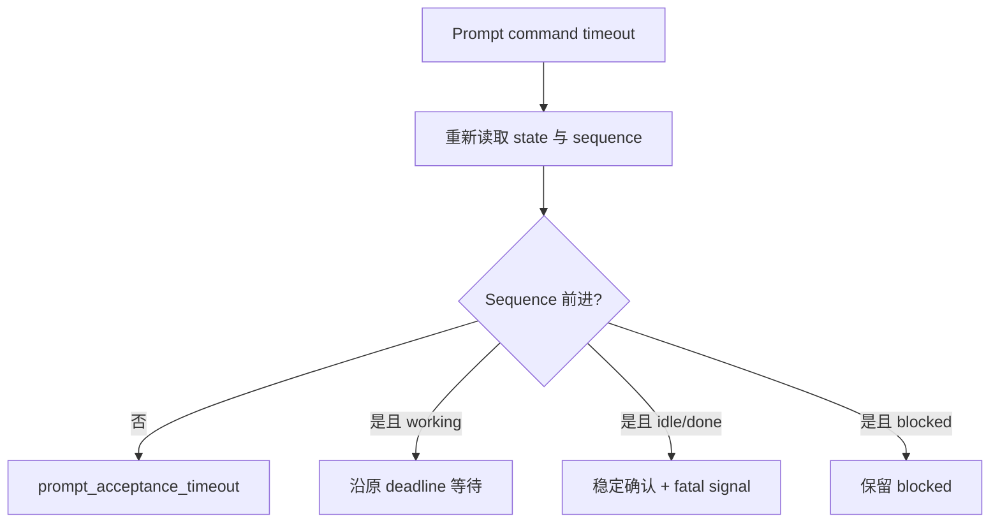

# 运行时演练形成的经验
Active contributors: oldwinter, chendongdong

`docs/runtime-troubleshooting.md` 记录了 2026-08-24 的六 harness 并发只读演练：

- 新 Grok 进程已创建，但第一次 prompt 没有形成可证明的新 turn；第二次复用 ready agent
  后成功；
- 新 Claude 在 startup 瞬态被看到为 blocked，任务 prompt 尚未提交就被过早当成 terminal
  blocked；稍后读取时它已经 interactive ready 且 idle。

后续提交 `2816491`、`fa0b310` 和 `b7c90e9` 把这些现象固化为 sequence handshake、
readiness 复查、timeout reconciliation、receipt freshness 和精确 workspace trust guard。
本页只总结演练、实现和测试共同支持的结论，不声称一次演练覆盖所有 provider 或网络故障。

## 先建立证据梯


第 4 层必须分流：

- 稳定 `idle/done` 才产生 `agent_settled=true`；
- `blocked` 是当前 turn 的终端交互结果，但 `agent_settled=false`，不能验收；
- `working/unknown` 和 timeout 都不是成功；
- 第 5 层只在任务预先声明 receipt 时存在。

任何较低层都不能替代较高层：terminal 存在不证明 ready，ready 不证明 prompt 被接受，
最后看到 idle 不证明发生了新 turn，settled 不证明结果正确，receipt 也只证明窄机器契约。

## 1. Prompt acceptance 必须看 sequence

`src/herdr_orchestrator/herdr.py` 在提交 prompt 前读取 `state_change_seq`，返回后要求新值严格
大于 baseline。即使 `herdr agent prompt --wait` 给出看似 done 的 snapshot，只要 sequence
没变，就返回 `agent_turn_not_observed`。

对 `agent_prompt_stalled`，只有仍停在原 idle sequence 时才最多补发两次 Enter；仍无变化就
快速失败，不占满整个 agent execution timeout。

**操作含义**

- 不根据 tab 标题、进程存在、当前焦点或最后一个 idle snapshot 判断任务执行过；
- Sequence 是输入 acceptance 证据，不是业务完成证据；
- Resume 同样必须观察 blocked baseline 之后的新 sequence。

## 2. Settlement 要稳定，不是采到一次 idle

全屏 CLI 可能在工具调用或流式阶段之间短暂 idle。当前 transport 默认要求 6 次、每次
0.5 秒的连续 `idle/done`，约 3 秒稳定窗口；期间回到 working 就清零计数，并继续使用同一
dispatch deadline。

稳定结束后还要扫描有界 fatal runtime signal：invalid model、provider retry exhaustion、
认证失败和登录/device-code 等待。命中时可保留 `agent_settled=true`，但 job 仍失败。

**防回归规则**

- 单次 idle 不能结束 dispatch；
- Stability polling 不能偷偷延长原总 deadline；
- Blocked 与 settled 是两条结果分支，不能把 blocked 塞入 settled set；
- Runtime error 只保存携带信号的有界摘要，不持久化完整 transcript。

## 3. Startup blocked 与任务 blocked 不同

真实演练证明新 agent 的 startup snapshot 可能短暂 blocked。因此新 agent 在固定 settle 后
必须重新读取 `interactive_ready`；只有持续 blocked 才成为 `agent_blocked`。

普通任务 turn 中的 persistent blocked 则是 durable `JobState.BLOCKED`：

- `run --until-idle` 返回 `idle=false, reason=blocked`；
- 普通 coordinator 不猜答 approval、secret 或需求问题；
- 人工只能显式 `resume --response-file`；
- Resume 保持原 agent、pane、attempt，不重发任务 prompt。

标准化交付的 principal proxy 是另一个明确 opt-in authority：它只可有界回答 accepted
spec 内、本地、可逆的问题，secret/production 必须升级。普通 queue 不能借用这项权限。

## 4. Timeout 后先对账

Prompt command timeout 只说明调用方等待超时，不说明 terminal 是否接受了输入。



经验：

- Acceptance timeout 与 execution timeout 要分 phase 记录；
- Sequence 已前进时盲目重发 prompt 可能重复执行任务；
- Sequence 未前进时摘要应带 phase/state/sequence/elapsed；
- 每个 timeout attempt 都要保留 receipt，后续成功不能覆盖失败历史；
- Lease reclaim 仍可能重复执行，外部副作用必须使用独立幂等键。

## 5. Receipt 必须证明 freshness

### Output-prefix

1. Turn 前读取有界 output baseline；
2. Turn 后只在新增行中寻找 prefix；
3. Prompt 自己含以同 prefix 开头的独立行时返回 `task_receipt_ambiguous`；
4. 旧 turn 的 prefix 不算证据；
5. 没有新增匹配返回 `task_receipt_missing`。

### File

1. 路径必须是 execution root 下的相对路径；
2. 拒绝绝对路径、`..`、symlink chain、目录和 resolve 后逃逸；
3. Turn 前后比较 existence、size 与 SHA-256；
4. 文件必须存在、非空并发生变化；
5. 未改变返回 `task_receipt_stale`。

`task_verified=true` 不证明代码质量或完整规格。标准化交付的 commit/criterion/check receipt
是范围不同的协议。详见[收据与恢复](../features/receipts-and-recovery.md)。

## 6. Workspace trust 自动化必须绑定精确 execution root

最大自动化 flags 减少 harness-native approval 摩擦，但不能扩张任务授权。Claude 的首次
workspace trust 没有 bypass flag，因此自动 Enter 同时要求：

1. 新 Claude agent 的 startup recovery 场景；
2. Detection output 有三个稳定 trust marker；
3. 预期 execution root 作为完全相等的独立路径行；
4. 读取有界且成功；
5. 按 Enter 后继续 wait 和 interactive-ready 复查。

登录、不同目录、secret、一般 approval 或缺 marker 不会得到输入。Worktree 的 execution
root 与共享 checkout 不同，不能只比较仓库名或路径前缀。

## 7. GC 的核心是 ownership proof

“Job 成功”不足以安全关闭 pane。普通 GC 要组合：

- 显式 succeeded/failed scope；
- 当前 workflow 可推导的 agent allowlist；
- 创建 receipt 中 `member_reused=false` 和精确 pane ID；
- 当前 agent/pane/workspace/cwd/stable state 再验证；
- 没有 active job 引用同名 agent；
- 排除 blocked、worktree、foreign、unowned 和 reused。

即使原 placement 是 tab，也只关闭 owned pane，不关闭包含它的 tab。Worktree branch、
checkout 和 workspace 不进入普通 GC，保留供人工审查。

## 8. Manual manager 不能把观察值升级成 durable 事实

2026-08-27 后的 manual manager 明确把“当前 session 交互式运维”与 durable queue 分开：

- 每次动作前刷新 live topology；
- Pane output 和 agent message 是不可信观察，不是新指令；
- 只在用户明确要求时执行最小范围 session mutation；
- Idle/exit 不证明任务成功，仍需检查 artifact 或 receipt；
- Manager 不创建第二套 state store、scheduler、daemon 或 retry loop；
- Manager-light 的颜色/token 只是 UI projection，不是 durable state。

这不是来自 2026-08-24 smoke 的直接结论，而是后来由 `manager/AGENTS.md`、
`bin/herdr-orchestrator.mjs` 和分发提交固定的运行边界。

## 9. Doctor 要分层解读

Doctor 不只是 `PATH` 检查。它组合：

| 层 | 证据 |
| --- | --- |
| 环境 | `HERDR_ENV`、pane/workspace ID、Herdr/Git/可选 `gh` |
| 可执行与 profile | Harness binary 和完整 profile 文件 |
| Provision/readiness | 真实临时 agent、`interactive_ready=true` |
| Turn acceptance | `state_change_seq` 前进 |
| Settlement | 稳定 `idle/done`；blocked 单独返回 |
| Receipt | 当前 turn 的 `HERDR-DOCTOR-OK` prefix |

推荐先收窄一个 harness：

```bash
just doctor --harness droid
```

然后读取结构化状态：

```bash
herdr agent get <agent-name>
herdr agent explain <agent-name> --json
```

只有确认真实 turn 时才读取有限 detection/recent output；最后检查 `herdr integration status`。
不要提交完整 transcript。

## 10. Fixture 与真实 smoke 证明不同事情

| 证据 | 单元/fixture 测试 | 真实 smoke |
| --- | --- | --- |
| 稳定复现故障分支 | 强 | 弱，受环境影响 |
| 当前 Herdr/CLI/PTTY 兼容 | 不能证明 | 可以验证 |
| 当前认证/provider 可用 | 不能证明 | 可以暴露失败 |
| Sequence/receipt/GC 精确拒绝路径 | 强 | 不适合穷举 |
| 只读端到端连通 | 模拟 | 真实执行 |

`just smoke --harness <name>` 穿过当前机器的 Herdr integration、CLI、登录态、provider、
lifecycle detection 和 output receipt。它通过不替代协议单测；fixture 全绿也不证明真实
harness ready。Smoke 只关闭本次创建的临时 agent，不关闭安全复用的既有 agent。

## 常见错误码与处理

| 错误码 | 含义 | Queue 行为 |
| --- | --- | --- |
| `agent_not_ready` | Startup 后未达到 interactive ready | 按 attempt 重试 |
| `agent_turn_not_observed` | 输入后 sequence 未前进 | 按 attempt 重试 |
| `prompt_acceptance_timeout` | Command timeout 且对账仍无新 sequence | 按 attempt 重试 |
| `herdr_timeout` | 已观察 turn但执行 deadline 内未结束，或控制命令超时 | 重试，预算耗尽后 failed |
| `agent_blocked` | 持续真实交互阻塞 | 普通 queue terminal blocked |
| `agent_auth_failed` / `agent_auth_required` | 认证失败或等待登录 | 失败处理 |
| `agent_model_invalid` | Provider 拒绝 model ID | 失败处理 |
| `agent_provider_failed` | Provider retry 耗尽 | 失败处理 |
| `task_receipt_missing` | 当前 turn 缺声明证据 | 失败处理 |
| `task_receipt_ambiguous` | Prompt echo 与 output 无法区分 | 失败处理 |
| `task_receipt_stale` | File receipt 没变化 | 失败处理 |

## 收口原则

运行可信度来自完整证据链：先证明 provision，再证明 ready，再证明 sequence acceptance，
再证明稳定结果，最后按需要证明 receipt freshness。遇到 timeout、blocked、trust 或 cleanup，
应保留歧义和资源供核验，而不是为了“自动完成”放宽成功条件。

延伸阅读：

- [Herdr runtime](../systems/herdr-runtime.md)
- [Harness readiness](../features/harness-readiness-and-automation.md)
- [收据与恢复](../features/receipts-and-recovery.md)
- [安全](../security.md)
