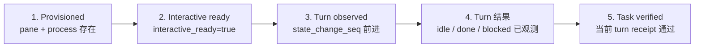
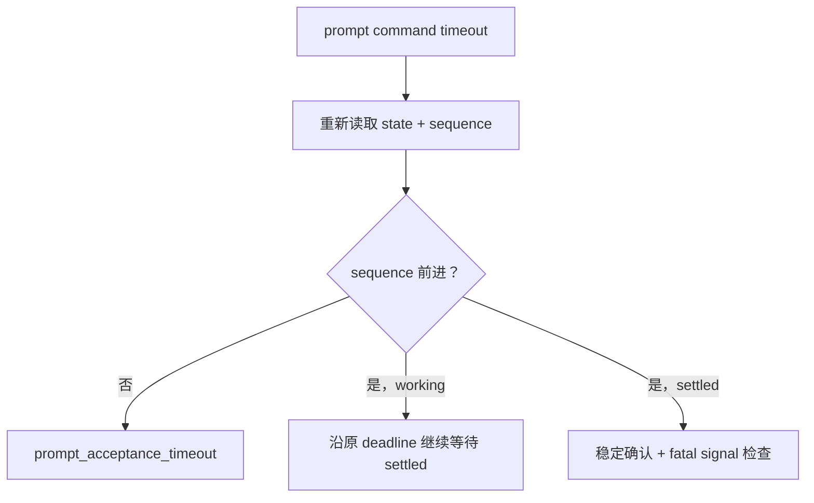

# 运行时演练形成的经验
Active contributors: oldwinter, chendongdong

## 证据来源与范围

`docs/runtime-troubleshooting.md` 记录了 2026-08-24 的六 harness 并发只读演练：新 Grok 进程存在但第一次 prompt 没有形成可证明的 turn；新 Claude 的 startup 瞬态曾被过早判为 terminal blocked，稍后读取时实际已经 interactive ready 且 idle。后续提交 `2816491`、`fa0b310` 与 `b7c90e9` 把这些边界固化为实现和防回归测试。

本页只总结已经由演练、当前代码或测试契约支持的经验。它不声称一次演练能证明所有 provider、网络或终端故障都已覆盖。

## 先建立证据梯

前四层是 doctor 与 runtime troubleshooting 的核心证据层次。第 4 层必须分流：
稳定 `idle` / `done` 才产生 `agent_settled=true`；`blocked` 虽然终止当前 turn，
但仍是未 settled 的非成功结果，需要人工 resume。第 5 层只有任务预先声明了 receipt
才存在。任何较低层证据都不能替代较高层：

- Pane 存在不证明 harness 已 ready；
- Ready 不证明 prompt 被接受；
- 最终看到 idle 不证明发生过新 turn；
- Settled 不证明任务内容正确；
- Receipt 通过也只证明声明的窄机器契约。

对应系统说明见 [Herdr runtime](../systems/herdr-runtime.md)、[Harness readiness 与自动化](../features/harness-readiness-and-automation.md) 和 [任务与收据](../primitives/jobs-and-receipts.md)。

## 1. Prompt acceptance 必须以 sequence 为准

`src/herdr_orchestrator/herdr.py` 在发送 prompt 前读取 `state_change_seq`，随后要求新 snapshot 的 sequence 严格前进。即使 `herdr agent prompt --wait` 返回一个看似 settled 的状态，只要 sequence 没变，就返回 `agent_turn_not_observed`，不能记成功。

这条规则来自真实失败形态：进程已经创建、UI 也可能显示 idle，但 prompt 并未形成可证明的 turn。对 `agent_prompt_stalled`，transport 只会在仍停留于原 idle sequence 时最多补发两次 Enter；仍无变化就快速失败，而不是占满整个任务执行 timeout。

**运维含义**

- 不根据 tab 标题、当前 pane 焦点或最后一个 idle 快照判断任务执行过。
- `state_change_seq` 是 acceptance handshake，不是业务完成证明。
- 每次 resume 也必须等待 blocked baseline 之后的新 lifecycle sequence。

## 2. Settlement 必须稳定，而不是采到一次 idle

全屏 CLI 可能在工具调用、流式输出或内部阶段切换之间短暂回到 idle/done。当前 transport 对普通 settled state 做 6 次、每次 0.5 秒的连续确认，也就是稳定约 3 秒；期间重新进入 working 会清零计数并继续等待同一个 deadline。

`blocked` 不使用同样的稳定 idle 窗口，因为它代表另一种需要明确处理的终态；startup 的 blocked 则另有复查规则，不能混淆。

**防回归规则**

- 单次 idle snapshot 不能结束 dispatch。
- 稳定确认必须受原 dispatch deadline 约束，不能悄悄延长任务。
- Settled 后仍要检查有界 fatal runtime signal，例如认证墙、无效 model 或 provider retry exhaustion。

## 3. Blocked 不是成功，startup blocked 也不一定是任务阻塞

普通 queue 中，persistent `blocked` 是 terminal `JobState.BLOCKED`：

- `run --until-idle` 返回 `idle=false`、`reason=blocked`；
- coordinator 不自动猜答 approval 或需求问题；
- 人工审查后只能显式 `resume --response-file`，并复用原 agent、pane 和 attempt，不重发任务 prompt。

但演练也证明 startup 的单次 blocked snapshot 可能只是 TUI 瞬态。新 agent 在固定 settle 后必须重新读取 `interactive_ready`；只有持续 blocked 才进入 `agent_blocked`。这一区分避免把尚未提交任务 prompt 的 startup 画面误记成用户问题。

标准化交付的 principal proxy 是明确 opt-in 的另一条规则：它可以有界回答规格内、本地、可逆的问题，但 secret 或 production 必须升级。普通 queue 不能借用这项权限。详见 [标准化交付系统](../systems/standardized-delivery.md)。

## 4. Timeout 后先 reconciliation，再决定重试原因

Prompt command timeout 存在歧义：命令调用者超时，不代表 runtime 没有接受输入。当前逻辑在 timeout 后重新读取 agent：

**经验**

- Prompt acceptance timeout 与 task execution timeout 必须分 phase 记录。
- 若 sequence 已前进，盲目重发 prompt 可能重复执行任务；应继续观察原 turn。
- 若 sequence 未前进，错误摘要应包含 `phase=prompt_acceptance`、elapsed、state 与 sequence，便于区分 transport 接受失败和执行超时。
- Timeout attempt 必须保留自己的 receipt 行；后续 retry 成功不能覆盖第一次失败证据。

这也是 durable retry 只追加 attempt budget、保留原 job id 和 dedupe key 的原因之一。详见 [任务收据与恢复](../features/receipts-and-recovery.md)。

## 5. Receipt 必须证明 freshness，并排除 authorship 歧义

仅检查“某行或某文件存在”会产生两类假阳性：旧 artifact 被重复使用，或者 prompt 自己把期望前缀回显到了终端。当前实现因此在 turn 前后取 baseline。

### Output-prefix receipt

- Turn 前保存有界 output snapshot；
- Turn 后只在新增行中查找前缀；
- 如果 prompt 本身包含以同一 receipt 开头的独立行，返回 `task_receipt_ambiguous`；
- 没有当前 turn 新增匹配行则返回 `task_receipt_missing`。

### File receipt

- Turn 前记录文件是否存在、大小和 SHA-256；
- Turn 后要求文件存在且非空；
- Snapshot 完全未变则返回 `task_receipt_stale`；
- 路径必须是 execution root 内的相对路径，拒绝绝对路径、`..`、symlink 逃逸和目录替代。

**边界**

`task_verified=true` 证明“该 turn 满足了已声明的机器契约”，不证明实现质量。标准化交付中的 commit/acceptance/check receipt 是另一种更强、但仍有明确范围的协议。参见 [任务与收据](../primitives/jobs-and-receipts.md) 与 [交付 Artifact](../primitives/delivery-artifacts.md)。

## 6. Workspace trust 自动化必须精确绑定 execution root

最大自动化启动参数减少了本地 approval、hook 与 sandbox 摩擦，但不能扩大任务授权。Claude 没有原生 workspace-trust bypass，因此 `src/herdr_orchestrator/herdr.py` 只在以下条件同时满足时自动发送一次 Enter：

1. 新建 agent 的 detection output 同时包含三个稳定 trust marker；
2. 输出中存在与预期 execution root 完全匹配的独立路径行；
3. Harness 确实是 Claude；
4. 场景是 startup 的 not-ready 或 blocked recovery。

其他登录、secret、未知 approval 或需求问题不会得到自动输入。复用既有 agent 时还必须验证 kind、`cwd`、`foreground_cwd`、`interactive_ready` 和 settled state。

**经验**

- “自动按 Enter”必须绑定可验证的提示文本、agent kind 和 workspace identity。
- Worktree 的 execution root 与共享 workflow checkout 不同，不能只验证仓库名或路径前缀。
- 最大自动化 flag 是 control plane 固定映射，planner 与 task prompt 不能注入启动参数。

## 7. GC 的核心不是状态，而是 ownership proof

“Job 成功”不足以证明一个 pane 可以安全关闭。普通 GC 默认 dry-run，并在 `src/herdr_orchestrator/runner.py` 中组合多项证据：

- 只处理显式 `succeeded` 或独立 `failed` scope；
- Agent name 必须属于当前 workflow 可稳定派生的 slot；
- Receipt 必须证明 `member_reused=false`，即 pane 由本 workflow 创建；
- 当前 pane ID 必须与创建 receipt 一致；
- 同名 agent 不能仍被 active job 使用；
- `blocked`、`worktree`、foreign、unowned 和 active agent 一律跳过；
- 即使原 placement 是 `tab`，也只关闭拥有的 pane，不关闭整个 tab。

Worktree workspace、checkout 与 branch 永不进入普通 GC；它们被保留供人工检查。详见 [拓扑感知派发](../features/topology-aware-dispatch.md) 与 [Placement 与 worktree](../primitives/placement-and-worktrees.md)。

## 8. Doctor 要按四层证据解读，而不是看一个绿色结果

Doctor 的价值不是“某个 executable 在 PATH 中”，而是把 readiness 收窄到单一或少数 harness，并呈现 compact summary、总耗时和 provision/turn/receipt phase timing。排障时依次问：

| 层 | 要证明什么 | 典型证据 |
| --- | --- | --- |
| Provisioned | Herdr 创建了 pane 与 harness 进程 | 结构化 pane/agent identity |
| Interactive ready | Agent 能接收输入 | `interactive_ready=true` |
| Turn observed | Probe prompt 真的形成新 turn | `state_change_seq` 前进 |
| Turn 结果 | 同一 turn 已有终端观测 | 稳定 `idle` / `done` 产生 settled；`blocked` 单独返回且未 settled |

声明 probe receipt 时还要继续检查 `task_verified=true`。推荐先用 `just doctor --harness <name>` 收窄，再读 `herdr agent get` / `herdr agent explain --json`；只有需要确认真实 turn 时才读取有限 detection/recent output，最后检查 `herdr integration status`。完整 transcript 和原始 runtime output 不应提交进 Git。

## 9. 真实 smoke 与 fixture 测试证明的是不同事情

Fixture/unit test 可以稳定覆盖：

- JSON shape、sequence 分支和错误码；
- settle 轮询、timeout reconciliation 与 Enter 重试上限；
- receipt baseline/freshness/ambiguity；
- claim、lease、retry、resume 和 GC ownership；
- 不同 harness 的固定启动参数。

真实 `just smoke` 则额外穿过当前机器上的 Herdr integration、PTY、已安装 CLI、登录态、provider、TUI lifecycle 和 output detection。它要求每个选中 harness 执行只读 probe，观察到真实 turn、返回 settled，并产生指定 prefix receipt。

| 证据 | Fixture/unit test | 真实 smoke |
| --- | --- | --- |
| 分支可重复、故障可注入 | 强 | 弱，受环境影响 |
| 当前 Herdr/CLI 真实兼容 | 不能证明 | 可以直接验证 |
| 当前认证与 provider 可用 | 不能证明 | 能暴露失败 |
| 不修改目标仓的最小联通检查 | 模拟 | 真实只读执行 |
| 适合作为日常快速回归 | 是 | 应按 harness 收窄使用 |

因此，fixture 全绿不等于真实 harness ready；真实 smoke 通过也不替代协议单测的故障分支覆盖。Smoke 创建的临时 tab 在结束后清理，但安全复用的既有 agent 不会被关闭，这同样遵守 ownership 规则。

## 收口原则

运行时可信度来自证据链，而不是某一个状态词：先证明 provision，再证明 ready，再证明 sequence acceptance，再证明 stable settlement，最后按需要证明 receipt freshness。遇到 blocked、timeout、trust 或 cleanup 时，优先保留歧义和资源供核验，而不是为了“自动完成”放宽成功条件。
