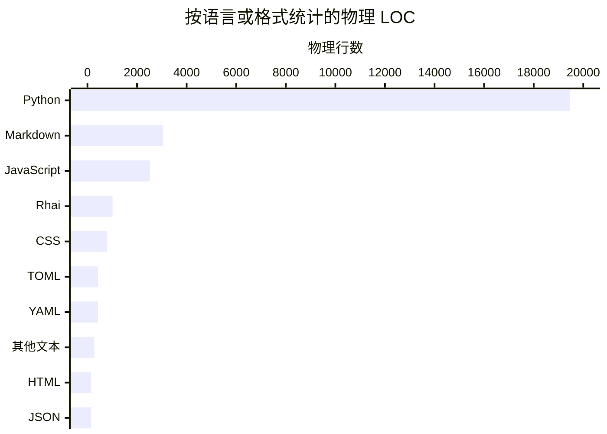
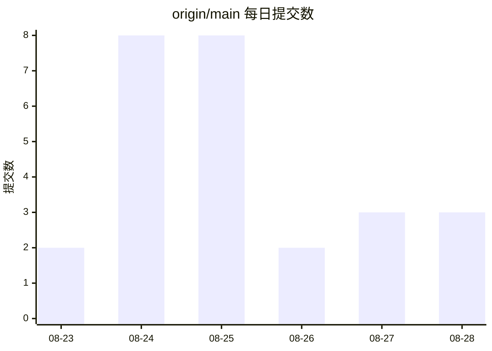

# 数字中的代码库

数据采集日期为 **2026-08-29**。Git 历史基线是 `origin/main` 的 `7291093`
（同时标记为 `v0.1.6`）；统计时又核对了当前工作树，除本次重建的 Wiki 页面外，
纳入统计的代码与该提交没有差异。

## 统计口径

- 文件清单来自仓库根目录执行的 `git ls-files -z`，只统计 Git 跟踪内容；物理行数按
  UTF-8 文本的 `splitlines()` 计算，不是去空行、去注释后的 SLOC。
- 主统计排除 `droid-wiki/**`、`.factory/video/**`、所有 `package-lock.json`、
  `uv.lock`、`.secrets.baseline`、`docs/generated/**`、`security-findings.json`，
  以及 vendored/minified 文件
  `src/herdr_orchestrator/dashboard/static/cytoscape.min.js`。这些分别代表本 Wiki、
  视频制作资产、锁定结果、安全/生成报告或第三方生成物，不应冒充一方源码。
- 原始树有 222 个跟踪条目。排除上述内容后剩 145 个条目，其中
  `.agent/skills` 与 `.claude/skills` 是符号链接；下文 LOC、字节数和平均值以其余
  **143 个普通文本文件**为分母。
- 语言按扩展名映射；“其他文本”包括 `justfile`、ignore、INI、license、CODEOWNERS
  和没有单独语言映射的纯文本。

## 语言与物理 LOC

| 语言或格式 | 文件数 | 物理 LOC | 占比 |
| --- | ---: | ---: | ---: |
| Python | 55 | 19,459 | 68.9% |
| Markdown | 45 | 3,054 | 10.8% |
| JavaScript（含 `.mjs`） | 8 | 2,516 | 8.9% |
| Rhai | 2 | 1,012 | 3.6% |
| CSS | 1 | 791 | 2.8% |
| TOML | 10 | 427 | 1.5% |
| YAML | 8 | 422 | 1.5% |
| 其他文本 | 9 | 274 | 1.0% |
| HTML | 1 | 151 | 0.5% |
| JSON | 4 | 150 | 0.5% |
| **合计** | **143** | **28,256** | **100.0%** |

占比以 28,256 行为分母并四舍五入，因此显示值可能有微小舍入误差。

## 源码、测试与配置

三个分类用于回答不同问题，可以有概念交集，不能把文件数直接相加：

| 分类 | 文件数 | 物理 LOC | 口径 |
| --- | ---: | ---: | --- |
| 一方源码 | 43 | 13,374 | `src/herdr_orchestrator/**`、`scripts/**`、`bin/herdr-orchestrator.mjs`、`packages/herdr-manager/bin/herdr-manager.mjs` 与 `plugins/manager-light/*.mjs` 中的 `.py/.js/.mjs/.css/.html`，继续应用总排除规则 |
| 测试源码 | 22 | 9,543 | `tests/*.py` |
| 配置 | 27 | 1,206 | 跟踪的 `.toml/.yml/.yaml/.json`，另含 `.env.example`、`.importlinter`、`.npmignore`、`.gitignore` 与 `justfile`，继续应用总排除规则 |

`src/herdr_orchestrator/**/*.py` 共有 **26 个包内 Python 模块、9,916 行**；
`scripts/*.py` 另有 7 个 Python 工具模块。测试与源码的物理行比为：

- 同语言口径：9,543 行 Python 测试 ÷ 9,916 行包内 Python = **96.2%**，
  即约 **0.96:1**。
- 宽口径：9,543 行测试 ÷ 13,374 行全部一方源码 = **71.4%**，
  即约 **0.71:1**。

这两个比值衡量的是文件体量，不是覆盖率。测试命令和覆盖率门禁见
[测试指南](how-to-contribute/testing.md)。

## Git 活动与最近趋势

`origin/main` 从 **2026-08-23** 到 **2026-08-28** 共有 **26 个可达提交**：

| 日期 | 提交数 | 新增行 | 删除行 | churn |
| --- | ---: | ---: | ---: | ---: |
| 2026-08-23 | 2 | 3,329 | 15 | 3,344 |
| 2026-08-24 | 8 | 13,990 | 238 | 14,228 |
| 2026-08-25 | 8 | 9,955 | 1,534 | 11,489 |
| 2026-08-26 | 2 | 584 | 247 | 831 |
| 2026-08-27 | 3 | 581 | 89 | 670 |
| 2026-08-28 | 3 | 2,042 | 80 | 2,122 |
| **合计** | **26** | **30,481** | **2,203** | **32,684** |

churn 是对 `git log origin/main --numstat` 中“新增 + 删除”的路径级累加，并应用与
当前树相同的排除规则。仓库历史只有六天，因此“最近 90 天”会等于全部历史；这里不把短样本
包装成长期趋势。可以可靠描述的是：前 3 天贡献 18/26 个提交和 88.9% 的 churn；
2026-08-26 至 2026-08-27 明显收窄，2026-08-28 随 manager-light 与一键
`herdr-manager` 分发工作回升。churn 只表示改动量，不代表生产率或质量。

### churn 热点

| 完整仓库路径 | 新增 | 删除 | churn |
| --- | ---: | ---: | ---: |
| `tests/test_herdr.py` | 2,438 | 45 | **2,483** |
| `src/herdr_orchestrator/herdr.py` | 1,705 | 289 | **1,994** |
| `src/herdr_orchestrator/cli.py` | 1,235 | 392 | **1,627** |
| `tests/test_distribution.py` | 1,291 | 29 | **1,320** |
| `src/herdr_orchestrator/store.py` | 1,088 | 224 | **1,312** |
| `src/herdr_orchestrator/dashboard/static/dashboard.js` | 863 | 284 | **1,147** |
| `src/herdr_orchestrator/delivery.py` | 1,047 | 71 | **1,118** |
| `src/herdr_orchestrator/runner.py` | 978 | 104 | **1,082** |

初始化提交会天然抬高长寿大文件的 churn；热点更适合作为阅读导航，而不是风险排行。

### Git 可识别的 bot 归因下界

- 26 个提交中有 10 个的提交正文带可识别 bot trailer，均为
  `Co-authored-by: factory-droid[bot]`：**38.5%**。
- `origin/main` 没有以可识别 bot account 作为主 author 的提交。

统计只匹配 author account 与 `Co-authored-by` / `Signed-off-by` trailer。
没有写入 Git 身份或 trailer 的自动化协作无法被历史证明，所以 **38.5% 只是可识别
bot-attributed commit 百分比的下界**，不是 AI 生成代码比例。本页不做个人贡献排行。

## 文件大小

- 143 个普通文本文件平均 **197.6 行、7,126 字节**；中位数为 **62 行**。
- 43 个一方源文件平均 **311.0 行**。
- 排除项之后，按行数和字节数最大的文件都是 `tests/test_herdr.py`：
  **2,393 行、90,538 字节**。
- 最大的一方非测试源文件是 `src/herdr_orchestrator/herdr.py`：
  **1,416 行、51,029 字节**。

若不排除生成物，`src/herdr_orchestrator/dashboard/static/cytoscape.min.js`
会以 435,503 字节压过一方文件，而 `uv.lock` 有 259,798 字节；这正是主统计不把
vendored bundle 与锁文件算作维护规模的原因。

## 可重复测得的复杂度

使用仓库环境中的 **Radon 6.0.1** 对 `src/herdr_orchestrator/**/*.py` 执行
cyclomatic complexity 分析：

- 共分析 **432 个类、函数和方法**，平均复杂度 **3.65（A）**；
- A 级 349 个、B 级 55 个、C 级 28 个，没有 D/E/F 级；
- 最大值为 **20（C）**，出现在
  `src/herdr_orchestrator/store.py` 的 `record_outcome`、
  `src/herdr_orchestrator/runner.py` 的 `_gc_agents`、
  `src/herdr_orchestrator/herdr.py` 的 `_prompt`，以及
  `src/herdr_orchestrator/dashboard/projector.py` 的 `_topology`。

另以 Python AST 解析包内直接 import：26 个模块形成 **56 条包内直接依赖边，
没有强连通环**。前者是工具定义的分支复杂度，后者只是模块耦合信号；两者都不是代码质量
总分。如何在整体结构中定位这些模块，见[架构总览](overview/architecture.md)。
