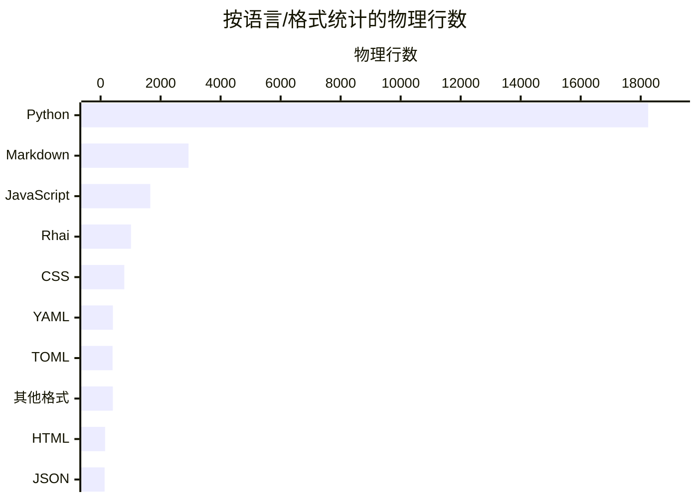

# 代码库数字
Active contributors: oldwinter, chendongdong

> 数据采集于 2026-08-26，基线是当前 `HEAD` / `origin/main` 的同一提交
> `61400e5`。Wiki 目录尚未被 Git 跟踪，因此不进入代码统计。

## 统计口径

- 文件清单来自在 `.` 执行的 `git ls-files -z`：共 139 个跟踪条目，其中 137 个普通文件、2 个兼容性符号链接。
- 下文行数均为物理行数（按字节内容的 `splitlines()` 计数），不是去空行后的 SLOC。
- 主统计排除 vendored 文件 `src/herdr_orchestrator/dashboard/static/cytoscape.min.js`，也排除两个锁文件；因此覆盖 134 个普通文件、26,140 行。
- `droid-wiki/` 在采集时未被 Git 跟踪，不进入任何代码统计；工作区中的其他未跟踪文件同样不进入统计。

## 语言构成

| 语言或格式 | 文件数 | 物理行数 | 占比 |
| --- | ---: | ---: | ---: |
| Python | 54 | 18,249 | 69.8% |
| Markdown | 42 | 2,931 | 11.2% |
| JavaScript（含 `.mjs`） | 4 | 1,656 | 6.3% |
| Rhai | 2 | 1,012 | 3.9% |
| CSS | 1 | 791 | 3.0% |
| YAML | 8 | 410 | 1.6% |
| TOML | 9 | 398 | 1.5% |
| 其他专用/纯文本格式 | 9 | 408 | 1.6% |
| HTML | 1 | 151 | 0.6% |
| JSON | 4 | 134 | 0.5% |
| **合计** | **134** | **26,140** | **100.0%** |

“其他专用/纯文本格式”合并了 Justfile、INI、ignore、license、CODEOWNERS 和无已映射扩展名的文本；占比以 26,140 为分母并四舍五入，因此显示值合计可能有舍入误差。语言按扩展名映射，完整根路径为 `.`。

### 锁文件与 vendored 文件

| 单独处理的文件 | 物理行数 | 字节数 | 处理方式 |
| --- | ---: | ---: | --- |
| `package-lock.json` | 19 | 357 | 锁文件，不并入语言、文件大小或测试比统计 |
| `uv.lock` | 1,484 | 259,798 | 锁文件，不并入语言、文件大小或测试比统计 |
| `src/herdr_orchestrator/dashboard/static/cytoscape.min.js` | 31 | 435,503 | vendored/minified，完全排除 |

两个锁文件合计 1,503 行、260,155 字节；它们反映依赖解析结果而不是手写实现。依赖含义见[依赖参考](reference/dependencies.md)。

## 文件、测试与配置

| 指标 | 数量 | 行数 | 计算口径 |
| --- | ---: | ---: | --- |
| 运行时代码 | 30 个文件 | 11,253 | `src` 下的 `.py/.js/.css/.html`；排除 Cytoscape vendored 文件和 license 文本 |
| 工具与入口代码 | 9 个文件 | 1,257 | `scripts` 下 8 个 `.py/.mjs`，加 `bin/herdr-orchestrator.mjs` |
| **源文件合计** | **39 个文件** | **12,510** | 上述两类相加 |
| 测试代码 | 21 个文件 | 8,337 | `tests` 下所有已跟踪 `.py` |
| 配置 | 23 个文件 | 1,089 | 仓库级 `.toml/.yml/.yaml/.json`，另含 `.env.example`、`.importlinter`、`justfile`；排除锁文件、`security-findings.json` 报告及源码目录内文件 |

Python AST 中共有 **198 个**名称以 `test_` 开头的测试函数；这是静态定义数，不等同于参数化展开后的 pytest case 数。运行方式与质量门禁见[测试指南](how-to-contribute/testing.md)。

### 测试代码比

- 同语言口径：`tests` 的 8,337 行 Python ÷ `src` 的 9,481 行 Python = **87.9%**，即约 **0.88:1**。
- 宽口径：8,337 行测试 ÷ 12,510 行全部源代码 = **66.6%**，即约 **0.67:1**。

同语言比更适合观察测试投入；宽口径会把 CSS、HTML、JavaScript 和 npm 包装入口计入分母。两者都只比较物理行数，不代表覆盖率。

## 提交活动

采集时 `origin/main` 与本地 `HEAD` 都指向 `61400e5`，当前分支历史共
**19 个提交**。计算命令分别等价于 `git rev-list --count origin/main` 和
`git rev-list --count HEAD`；这里只看当前分支可达历史，不统计其他远端分支。

| 日期 | `origin/main` 提交数 | 本地 `HEAD` 提交数 |
| --- | ---: | ---: |
| 2026-08-23 | 2 | 2 |
| 2026-08-24 | 8 | 8 |
| 2026-08-25 | 8 | 8 |
| 2026-08-26 | 1 | 1 |

19 个提交集中在 4 天内，其中 16 个（84.2%）发生于 8 月 24—25 日；按主题行前缀归类为
9 个 `feat`、2 个 `ci`、2 个 `fix`、5 个 merge 和 1 个非 Conventional Commit 标题。
仓库历史仅从 2026-08-23 开始，样本很短，不宜外推长期开发速度。

### Git 中可见的 bot 协作证据

- 当前 `HEAD` / `origin/main` 的 19 个提交中，8 个带有
  `Co-authored-by: factory-droid[bot]` trailer：**42.1%**。
- 没有可达提交以 bot 身份作为主 author。

这里仅匹配 Git author 身份和提交正文中的 bot `Co-authored-by` trailer。未写入 trailer 的模型使用无法从 Git 证明，所以这些百分比只是 **AI 辅助提交占比的下限**，不是对代码生成比例的估算。统计不提供个人贡献排名。

## 最近 90 天 churn 热点

窗口为 2026-05-28 至 2026-08-26；以当前 `HEAD` 执行 `git log --since=2026-05-28 --numstat`，对每个路径累加“新增行 + 删除行”。同样排除 Cytoscape vendored 文件和两个锁文件。由于仓库在窗口内才创建，这实际上覆盖当前分支的全部历史；合计 **28,184 行新增、2,042 行删除、30,226 行 churn**。

| 路径 | 新增 | 删除 | churn |
| --- | ---: | ---: | ---: |
| `tests/test_herdr.py` | 2,438 | 45 | **2,483** |
| `src/herdr_orchestrator/herdr.py` | 1,705 | 289 | **1,994** |
| `src/herdr_orchestrator/cli.py` | 1,235 | 392 | **1,627** |
| `src/herdr_orchestrator/store.py` | 1,088 | 224 | **1,312** |
| `src/herdr_orchestrator/dashboard/static/dashboard.js` | 863 | 284 | **1,147** |
| `src/herdr_orchestrator/delivery.py` | 1,047 | 71 | **1,118** |
| `src/herdr_orchestrator/runner.py` | 978 | 104 | **1,082** |
| `tests/test_runner.py` | 938 | 27 | **965** |

表格按 churn 降序取前 8 个路径。churn 衡量改动量而非质量或缺陷风险；初始化提交会天然抬高大文件数值。结构关系见[架构概览](overview/architecture.md)，可维护性后续项见[清理机会](cleanup-opportunities.md)。

## 规模与复杂度信号

- 排除项后的 134 个普通文件平均 **195.1 行/文件**，中位数 **70 行/文件**；计算式为 26,140 ÷ 134。
- 39 个源文件平均 **320.8 行/文件**；计算式为 12,510 ÷ 39。
- 全仓最长文件是 `tests/test_herdr.py`，**2,393 行**；最长源文件是 `src/herdr_orchestrator/herdr.py`，**1,416 行**。
- `src` 的 26 个 Python 模块有 **139 个公共顶层符号代理**：79 个类、60 个函数。口径是 AST 顶层 `class`/`def` 名称不以下划线开头；它表示可见 API 表面积，不保证符号一定被包级导出。
- 内部 Python import 图有 **26 个节点、56 条直接边、0 个环**。最长简单链为 7 个模块：`src/herdr_orchestrator/__main__.py` → `src/herdr_orchestrator/cli.py` → `src/herdr_orchestrator/dashboard/__init__.py` → `src/herdr_orchestrator/dashboard/server.py` → `src/herdr_orchestrator/store.py` → `src/herdr_orchestrator/observability.py` → `src/herdr_orchestrator/feature_flags.py`。口径是 Python AST 中指向 `herdr_orchestrator` 包内模块的直接 `import`/`from ... import ...`；标准库和第三方依赖不计入。

这些数值是模块尺寸、API 表面积和依赖深度的导航信号，不是复杂度评分。
