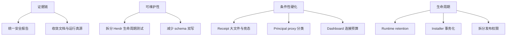

# 清理机会
Active contributors: oldwinter, chendongdong

本页记录**能由当前代码、配置、测试或文档直接证明，但尚未形成已编号工作项**的维护机会。它不是缺陷清单，也不假定存在未公开 issue；每项都明确当前风险、保留现状的取舍和适合处理的触发条件。

仓库的 `scripts/check_repository.py` 会拒绝没有 issue 与 owner 的行内债务标记，因此“此类标记很少或为零”只能说明没有无主便签，不能推出没有技术债。完整边界见[安全](security.md)，结构背景见[系统架构](overview/architecture.md)和[设计决策](background/design-decisions.md)。

## 机会地图

这些节点不是优先级排序。是否实施取决于触发条件；当前 local-first、单 OS 用户和零运行时依赖的设计本身也是需要保留的价值。

## 1. 统一安全报告的机器真源

**事实依据**

- `justfile` 的 `security` recipe 生成 run-scoped Bandit 与 pip-audit artifacts，secret scan 通过进程退出状态报告。
- `.github/workflows/ci.yml` 根据 `just security` 的 outcome 阻断 gate，并在 `main` 失败时维护一个 insight issue。
- `security-findings.json` 是一次独立的 14 文件、零 finding 快照；`.factory/security-config.json` 另行保存 STRIDE pattern 与 severity policy。
- 当前树中没有 `scripts/check_security_report.py`，也没有现存代码证明这三类机器结果会合并或验证 freshness。

**风险**

维护者可能把 `security-findings.json` 的“零 finding”误当作当前 CI 结果，或在 threat-model version、severity policy、scanner output 之间发生无提示漂移。公开 insight 只指向 Actions run，无法在本地用一个稳定 schema 重放相同判定。

**取舍**

统一报告需要定义 Bandit、pip-audit、secret scan 与 STRIDE 的归一化 schema、去重和 freshness 规则；若只是复制原始结果，会增加又一个可漂移 artifact。报告还必须避免写入 prompt、terminal output、credential 和 exploit details。

**何时处理**

在把 `security-findings.json` 用作 release/merge 证据、增加新 scanner、修改 `.factory/security-config.json` 门槛，或需要跨 CI run 比较 finding 前处理。此前应继续把 `just security` 和 CI outcome 视为实际 gate，把静态 JSON 视为时间点证据。

相关：[安全报告流程](security.md#扫描报告与响应流程) · [可观测性与 Attention](features/observability-and-attention.md)

## 2. 在行数门槛触发前拆分 Herdr 生命周期测试

**事实依据**

- `src/herdr_orchestrator/herdr.py` 当前约 1,416 行；`scripts/check_repository.py` 对 Python source 的上限是 1,500 行。
- `tests/test_herdr.py` 当前约 2,393 行；测试 Python 文件上限是 2,500 行。
- 两个文件同时承载 startup、readiness、prompt reconciliation、settlement、runtime error、blocked response、receipt 与 cleanup ownership。

**风险**

下一次增加 lifecycle 或 receipt 分支就可能碰到硬门槛；更早的风险是修改者难以判断 fake runner 的长响应序列属于哪个 phase，安全拒绝路径容易与一般 happy path 混杂。

**取舍**

按 startup、turn、receipt、resume/cleanup 拆测试会改善导航，但过度抽 helper 可能隐藏完整 Herdr argv 顺序和 timeout 证据。拆 production 模块也可能把 thread-local deadline、创建 ownership 与 settlement 状态分散到更浅的接口。

**何时处理**

在下一次新增 harness startup 分支、receipt kind、runtime error detector 或 blocked/cleanup 行为时进行，而不是仅为降低行数机械搬运。拆分后仍应让 `tests/test_harness_automation.py` 固定最大自动化参数与 Claude execution-root guard。

相关：[Herdr runtime](systems/herdr-runtime.md) · [任务收据与恢复](features/receipts-and-recovery.md) · [运行时经验](background/runtime-lessons.md)

## 3. 减少模型 artifact 的 prompt/schema 双写

**事实依据**

- `src/herdr_orchestrator/planner.py` 同时手写 planner/router prompt 中的 JSON shape 与对应 loader 的 exact-key/长度规则。
- `src/herdr_orchestrator/topology.py` 同样分别维护 prompt schema 和 `load_topology_decision()`。
- `src/herdr_orchestrator/delivery_prompts.py` 描述交付 artifact，`src/herdr_orchestrator/delivery_protocol.py` 再独立实现 exact-key、枚举、DAG、commit 和长度校验。
- 当前测试覆盖 loader 拒绝路径与主要交付流程，没有证据表明现有 shape 已发生漂移。

**风险**

未来只更新 prompt 或只更新 loader 时，模型会被要求写出 coordinator 必然拒绝的文件；在两次 artifact retry 的上限内，这表现为昂贵但不易定位的稳定失败。

**取舍**

从单一声明生成 prompt 与 validator 能减少双写，但也可能模糊当前精确、可测试的错误码，并引入复杂生成框架或新的运行时依赖。项目当前的手写 schema 很直接，不能为了抽象而牺牲 fail-closed 可读性。

**何时处理**

在新增 artifact 版本、同一字段第三次跨 prompt/loader/renderer 修改，或出现真实 schema drift 回归时处理。合适结果可以只是测试共享的 schema fixture，不必立即引入通用 JSON Schema 引擎。

相关：[Harness catalog 与路由](systems/catalog-and-routing.md) · [交付 Artifact](primitives/delivery-artifacts.md) · [数据模型参考](reference/data-models.md)

## 4. 为 file receipt 定义大小预算与更窄的文件读取原语

**事实依据**

- `src/herdr_orchestrator/herdr.py` 的 file receipt 会在 prompt 前后用 `Path.read_bytes()` 读取完整文件，再计算 size 与 SHA-256。
- 路径已拒绝绝对值、`..`、symlink chain 和 resolve 后逃逸；`tests/test_herdr.py` 覆盖旧文件、空文件、当前 turn 新文件和 symlink。
- 当前 workflow 没有 file receipt 最大字节数；威胁模型接受同 OS 用户为信任域。

**风险**

误把大 artifact 声明为 receipt 会在每次 baseline/verification 中分配整文件内存，造成局部资源耗尽。路径检查与后续读取也不是跨进程原子的；在更弱的本地信任模型下，检查后替换仍是竞态。

**取舍**

流式 hash 可降低内存峰值，但不能单独消除 pathname TOCTOU；基于 file descriptor、regular-file metadata 和 no-follow 的实现更稳健，却需要平台语义与额外测试。新增大小上限会改变已存在的大 receipt 的兼容行为。

**何时处理**

在 file receipt 被用于构建产物、支持远程/低信任 worker、出现大文件案例，或项目改变“同 OS 用户可信”假设时处理。当前小型 sentinel 文件场景可以继续依赖现有简单实现。

相关：[任务收据与恢复](features/receipts-and-recovery.md) · [安全](security.md#receiptpane-ownership-与路径安全)

## 5. 明确 runtime state 的 retention、权限与压缩边界

**事实依据**

- `src/herdr_orchestrator/store.py` 持久化原始 job prompt，并以 append-only receipts 保留 attempt 历史。
- `src/herdr_orchestrator/observability.py` 持续 append `events.jsonl`、`metrics.jsonl` 和 `alerts.jsonl`；代码不设置最大文件数、时间或大小。
- 标准化交付失败会保留 artifact、branch 和 worktree 以支持恢复；普通 GC 明确不删除 worktree。
- `docs/observability.md` 把本地文件生命周期交给操作者的 filesystem retention policy。

**风险**

长期运行会累积 prompt、路径、receipt、ledger 和 telemetry；共享账号、备份或磁盘压力会放大本地信息披露与可用性风险。默认创建依赖进程 umask，没有独立的权限/加密层。

**取舍**

自动 prune 会损失 crash recovery、审计时间线、失败现场和幂等 artifact；删除 worktree 还可能丢失未集成代码。压缩/轮转增加恢复与 Dashboard 读取复杂度，应用层加密又引入密钥生命周期。

**何时处理**

在引入常驻 supervisor、共享开发机、合规保留要求、明显磁盘增长或备份 runtime state 前处理。应先区分可重建 telemetry、durable queue、失败交付证据和用户 worktree，不能用单一清空命令处理全部数据。

相关：[Durable execution](features/durable-execution.md) · [可观测性与 Attention](features/observability-and-attention.md) · [Placement 与 worktree](primitives/placement-and-worktrees.md)

## 6. 收敛 observability 目录命名的文档漂移

**事实依据**

- `src/herdr_orchestrator/runner.py` 构造 telemetry root 为 `config.state_db.parent / "telemetry"`。
- `src/herdr_orchestrator/observability.py` 写入该目录下三个 JSONL。
- `docs/observability.md` 当前写成 `.orchestrator/observability/`，而实现和现有 Wiki 的可观测性页面使用 `.orchestrator/telemetry/`。

**风险**

运维人员可能在错误目录排查或清理 incident evidence；脚本若按文档路径采集，会静默漏掉实际 telemetry。

**取舍**

只修文档最小但保留“类名 Observability / 目录 telemetry”的术语差异；迁移代码目录会影响已有本地数据和外部采集脚本，需要兼容读取或明确迁移。

**何时处理**

在下一次修改 `docs/observability.md`、增加 telemetry collector、实现 retention，或把该路径纳入稳定 API 前处理。当前实现路径应被视为运行真源。

相关：[可观测性与 Attention](features/observability-and-attention.md) · [配置参考](reference/configuration.md)

## 7. 扩展 principal-proxy 的受保护类别检测策略

**事实依据**

- `src/herdr_orchestrator/delivery.py` 在调用 controller 前，用一个关键词正则检查 API key、credential、password、secret、token、production/prod。
- `src/herdr_orchestrator/delivery_protocol.py` 强制 `secret`/`production` category 只能 escalate。
- 每个 blocked turn 最多 8 轮，ledger 不记录实际回答；`tests/test_delivery.py` 覆盖明确的 production API token 文本。

**风险**

不含现有英文关键词的敏感问题、其他语言、个人数据、付款、权限变更或生产同义词可能绕过第一层词法 guard，转而依赖不可信 controller 正确分类。

**取舍**

扩大关键词会提高误升级率并打断本地可逆工作；通用敏感信息分类器又会引入模型依赖和不确定性。当前窄 guard 与 strict decision schema 是双层防护，不能用更复杂 prompt 替代确定性 escalation。

**何时处理**

在 principal proxy 获得新的 authority category、覆盖更多语言、允许外部副作用，或真实 blocked transcript 暴露漏检类别时处理。每个新增类别都应先有 fail-closed test 和明确用户升级路径。

相关：[标准化交付](systems/standardized-delivery.md) · [安全](security.md#standardized-deliveryprincipal-proxy-与-tracker-限权)

## 8. 为 Dashboard SSE 增加显式连接预算

**事实依据**

- `src/herdr_orchestrator/dashboard/server.py` 使用 `ThreadingHTTPServer`，每个 `/api/events` 连接在循环中等待 feed，并每 15 秒 heartbeat。
- Server 只绑定 `127.0.0.1`/`localhost`、验证 Host，且没有写路由；`tests/test_dashboard.py` 固定这些边界。
- 当前没有认证、最大 SSE 连接数、每客户端总时长或全局 thread budget。

**风险**

同一 OS 用户下的恶意或故障本地进程可以建立大量连接并消耗线程/文件描述符。当前 loopback 信任假设降低了外部攻击面，但不消除本地 DoS。

**取舍**

连接上限、idle cutoff 或单线程 async server 会增加状态和兼容复杂度，也可能误断浏览器重连。为当前单用户只读工具加入网络认证，会显著扩大配置与 secret 管理面，未必比保持 loopback 更安全。

**何时处理**

在 Dashboard 变成长驻服务、出现多客户端、观察到连接泄漏，或任何人提议扩大 bind 范围前处理。若要远程访问，应重新设计认证/授权/CSRF，而不是只提高连接上限。

相关：[本地 Dashboard](systems/dashboard.md) · [安全](security.md#dashboardloopbackhostcsp-与白名单)

## 9. 提升 npm installer 多文件协调的崩溃一致性

**事实依据**

- `bin/herdr-orchestrator.mjs` 会先计算 conflicts、preserved、removals 和 desired files，再逐项 unlink/write，最后写 manifest 和 Git exclude。
- Hash ownership、symlink guard 和用户修改保留已经由 `tests/test_distribution.py` 覆盖。
- 多个目标文件及 Git exclude 的更新不是一个文件系统事务；进程在中途崩溃可能留下部分新内容和旧/缺 manifest。

**风险**

异常退出、磁盘满或机器中断后，doctor 可能只能报告 partial installation，用户需要重新 install 或人工判断 ownership。当前逻辑防止越界覆盖，但不保证跨文件原子可见。

**取舍**

临时目录加 rename 能改善单文件原子性，却无法把项目文件、manifest 和 Git common-dir exclude 纳入同一事务；完整 rollback journal 会增加 installer 状态、恢复规则和测试矩阵，与当前零 npm runtime dependency 的简单性相冲突。

**何时处理**

在托管根/文件数量继续增长、installer 用于无人值守批量部署，或出现真实 partial-install 事故时处理。此前保留 stable doctor 输出和可重复 install，比假装存在跨文件原子性更重要。

相关：[安装与分发](systems/installation-and-distribution.md) · [依赖参考](reference/dependencies.md)

## 10. 对齐 npm publish 的实际权限、文档与测试

**事实依据**

- `.github/workflows/ci.yml` 的 `publish` job 当前同时拥有 `contents: write` 与 `id-token: write`；前者用于 `gh release create`，后者用于 npm Trusted Publishing。
- `docs/installation.md` 仍写“publish job 只有 `contents: read` 与 `id-token: write`”。
- `tests/test_release.py` 验证 OIDC、main/version gate、GitHub-hosted runner、无 `NODE_AUTH_TOKEN` 和 action SHA，但没有固定 `contents` permission。

**风险**

维护者可能基于过时文档误判 least-privilege 边界；未来 workflow 变更也可能在没有测试提示的情况下扩大或缩小 repository write 权限。

**取舍**

把 npm publish 与 GitHub release 拆成两个 job 可让 registry publish 保持 `contents: read`，但会增加 job、权限交接和失败恢复状态；保留单 job 更简单，则需要准确记录 `contents: write` 的用途并由测试固定。

**何时处理**

在下一次修改 release workflow、Environment policy、release notes 或 npm Trusted Publishing 配置时处理。无论选择拆分还是保留，都应以 `.github/workflows/ci.yml` 为运行真源，并保持 contributor code 不进入 self-hosted/OIDC 写权限边界。

相关：[安装与分发](systems/installation-and-distribution.md) · [安全](security.md#ci-与-npm-oidc) · [部署与发布](deployment.md)

## 刻意不列为“清理”的设计边界

以下行为看似可以“自动收拾”，但当前证据表明它们是安全或恢复不变量，不应在普通维护中顺手改变：

| 不应顺手做的事 | 原因 |
| --- | --- |
| 自动删除失败/成功 worktree、branch 或 checkout | Worktree 是可恢复任务与未集成代码证据；普通 GC 明确排除它 |
| 让普通 queue 自动回答 blocked agent | 人工 `resume --response-file` 是权限边界；只有显式标准化交付有有界 principal proxy |
| 把 Dashboard 变成 retry/resume/focus 控制面 | 当前无认证模型只适用于 loopback、只读投影 |
| 把 `idle`/`done` 当成任务成功 | Settlement 与 `task_verified` 是两个独立事实 |
| 把标准化交付合并进普通 SQLite job 状态机 | 两条运行面的授权、artifact、退出码和恢复语义刻意分离 |
| 让 installer 接管内容相同的既有 Skill | 内容相同不等于 ownership；现有测试要求复用但不接管 |

创建正式工作项前，应先用对应测试复现风险、确认 owner 与范围，再按仓库债务策略记录；本页本身不替代 issue tracker。
