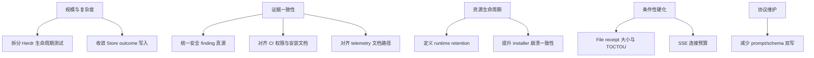

# 可执行的清理机会
Active contributors: oldwinter, chendongdong

本页只记录能由当前代码、配置、测试、文档或 `origin/main` 直接证明的维护机会。它不是缺陷
清单，不声称存在 dead code，也不代替 issue tracker。每项都给出证据、风险、动作和触发
条件，避免把安全/恢复不变量误当成“可以顺手删掉的东西”。

## 基线检查

### 债务标记

`scripts/check_repository.py` 要求四类行内债务关键词必须采用“关键词 + issue 编号 +
owner”的受跟踪格式。对 `origin/main` 搜索后：

- 仓库自有源码没有未跟踪的行内债务便签；
- 命中来自 policy checker 自身的正则/示例，以及 vendored
  `src/herdr_orchestrator/dashboard/static/cytoscape.min.js` 的单行第三方 bundle；
- 因此没有证据可据此宣布某段代码“已废弃”或“无人维护”。

另外，`just lint` 运行 `vulture --min-confidence 90`。这说明 dead-code 检查已有 gate，但仍
不能把一次静态扫描解释为仓库不存在任何维护成本。

### 文件大小

当前主要热点：

| 文件 | 行数 | 字节 | 仓库门槛 |
| --- | ---: | ---: | ---: |
| `src/herdr_orchestrator/herdr.py` | 1,416 | 51,029 | Python source 1,500 行 |
| `tests/test_herdr.py` | 2,393 | 90,538 | Python test 2,500 行 |
| `src/herdr_orchestrator/delivery.py` | 976 | 35,754 | 1,500 行 |
| `src/herdr_orchestrator/runner.py` | 874 | 31,403 | 1,500 行 |
| `src/herdr_orchestrator/store.py` | 864 | 33,119 | 1,500 行 |
| `src/herdr_orchestrator/cli.py` | 843 | 29,918 | 1,500 行 |
| `bin/herdr-orchestrator.mjs` | 912 | 27,816 | 通用文本 2,000 行 |
| `tests/test_distribution.py` | 1,262 | 48,247 | Python test 2,500 行 |

门槛真源是 `scripts/check_repository.py`：普通文件 512 KiB、Python source 1,500 行、test
2,500 行、其他文本 2,000 行；vendored Cytoscape 与 overview video 有明确 size exemption。

### 复杂度与依赖

`just lint` 用 Xenon 强制 `--max-absolute C --max-modules B --max-average A`，并运行 Ruff、
Black、mypy、Pylint、Vulture、import-linter 与 deptry。一个不替代 Xenon 的标准库 AST
分支计数用于导航时，热点集中在：

- `Store.record_outcome()`：约 20；
- `Store.record_resume_outcome()`、`Coordinator._gc_agents()`、
  `HerdrTransport._prompt()`：各约 19；
- `RuntimeProjector._topology()`：约 18；
- CLI `doctor()`：约 17。

这些数字只是维护 triage，不是质量评分或正式 gate 结果；正式复杂度标准仍以 Xenon 退出码
为准。

依赖配置显示：

- Python `[project].dependencies = []`；
- 根 `package.json` 无 npm dependencies；
- `packages/herdr-manager/package.json` 只有
  `herdr-orchestrator ^0.1.6` 一个 runtime dependency；
- Python dev tools 在 `uv.lock` 中精确锁定，包括 Radon 6.0.1 与 Xenon 0.9.3；
- `package-lock.json` 根包无第三方 dependency tree。

因此清理方案不应随意引入 runtime framework；新增依赖必须证明标准库/现有薄包边界无法满足。

## 机会地图

这些节点不表示优先级。实施前应建立 issue、owner、触发条件和拒绝路径测试。

## 1. 在行数硬门槛前拆分 Herdr 生命周期测试

**证据**

- `src/herdr_orchestrator/herdr.py` 距 1,500 行上限只剩 84 行；
- `tests/test_herdr.py` 距 2,500 行上限只剩 107 行；
- 两者同时承载 startup、readiness、prompt reconciliation、settlement、fatal signal、
  blocked response、receipt 和 cleanup；
- `_prompt()` 的分支复杂度也处于当前热点。

**风险**

下一次加入 startup/provider/receipt 分支会直接撞仓库门槛；长 fake-runner 响应序列也难以
判断属于哪个 phase，安全拒绝路径容易和 happy path 混杂。

**可执行动作**

先按测试责任拆为 startup/readiness、turn/reconciliation、receipt、resume/cleanup 等文件，
共享最小 fixture builder，同时保留每个用例可见的完整 Herdr argv/sequence。生产代码只有在
形成清晰深模块接口时再拆，不为降低行数机械搬运私有函数。

**触发条件**

下一次新增 harness startup 分支、receipt kind、fatal detector 或 blocked/cleanup 行为时。
拆分后仍由 `tests/test_harness_automation.py` 单独固定最大自动化 flags 与 Claude trust guard。

## 2. 收敛普通 dispatch 与 resume 的 outcome 持久化

**证据**

`src/herdr_orchestrator/store.py::record_outcome()` 和 `record_resume_outcome()` 分别约有
20/19 的分支计数，并重复：

- Receipt fail-closed 错误折叠；
- `agent_settled` 默认推导；
- bounded error summary；
- Job current projection update；
- Attempt receipt insert。

两者不能简单合并：普通 dispatch 可进入 pending/failed 并退避，resume 只能
succeeded/blocked，且 resume 不增加 attempt。

**风险**

未来新增 receipt/error/correlation 字段时只改一条路径，可能让普通 dispatch 与同 attempt
resume 的持久证据发生漂移。

**可执行动作**

提取无状态的“verification/error normalization”和共享 receipt-row 构造；保留两个公开事务
方法及各自 state precondition。不要抽掉 `running` 与 `blocked` 的不同状态检查，也不要把
resume 变成新 attempt。

**触发条件**

新增 outcome 字段、receipt kind、job state，或同一字段第三次同时修改两种 record 方法时。
先用 `tests/test_store.py` 固定两条路径的差异。

## 3. 统一安全 finding 的机器真源

**证据**

- `just security` 生成 Bandit、pip-audit 和 secret-scan outcome；
- `.factory/security-config.json` 记录 threat-model version 和 severity policy；
- `security-findings.json` 是 `origin/main..staged`、23 个文件、零 finding 的时间点快照；
- 在 `justfile`、`scripts/`、`.github/` 和 tests 中没有对
  `security-findings.json` 的消费或 freshness 校验。

**风险**

维护者可能把静态“零 finding”误认为当前 CI 结果，或者 scanner、threat-model version、
severity policy 与报告 scope 无提示漂移。

**可执行动作**

先定义最小统一 schema：scanner、scope/commit range、generated-at、threat-model version、
severity、fingerprint、source artifact；再实现只读 validator，明确 snapshot 与 merge gate
的关系。不得把 prompt、terminal、credential 或完整 exploit 写进聚合报告。

**触发条件**

当 `security-findings.json` 要用于 release/merge 证据、加入新 scanner、修改 severity policy
或需要跨 run 比较 finding 时。此前以 `just security` 和 CI outcome 为实际 gate。

## 4. 减少模型 artifact 的 prompt/schema 双写

**证据**

- `src/herdr_orchestrator/planner.py` 同时手写 planner/router prompt shape 与 loader；
- `src/herdr_orchestrator/topology.py` 分别维护 topology prompt 和 decision loader；
- `src/herdr_orchestrator/delivery_prompts.py` 描述交付 artifact，
  `delivery_protocol.py` 再独立实现 exact-key、长度、枚举、DAG 和 commit 校验。

当前没有证据表明 schema 已漂移。

**风险**

未来只更新 prompt 或只更新 loader，模型会被要求生成必然被 coordinator 拒绝的 artifact，
并消耗有限 retry。

**可执行动作**

优先增加共享的测试 fixture/字段常量，对比 prompt 示例与 loader 接受对象；不必立即引入
JSON Schema framework。保留现有稳定错误码和 fail-closed 可读性。

**触发条件**

新增 artifact version、同一字段再次跨 prompt/loader/renderer 修改，或发生真实 drift 回归。

## 5. 为 file receipt 增加大小预算与更窄读取原语

**证据**

`src/herdr_orchestrator/herdr.py::_file_receipt_snapshot()` 使用 `Path.read_bytes()` 在 turn 前后
整文件读入内存，再计算 size/SHA-256。路径 containment、symlink 和 freshness 已有测试，
但 workflow 没有 file receipt 最大字节数。

**风险**

误把大型 build artifact 当 receipt 会在 baseline 和 verification 各分配整文件内存。路径
检查与后续读取也不是同一原子操作；更弱本地信任模型下存在 pathname TOCTOU。

**可执行动作**

先为 intended sentinel 用例定义兼容的 size policy；采用流式 hash 降低内存峰值。若信任
模型扩大，再评估 file descriptor、regular-file metadata 和 no-follow 的平台实现。

**触发条件**

File receipt 开始用于构建产物、出现大文件案例、支持低信任 worker，或改变“同 OS 用户可信”
假设时。

## 6. 定义 runtime state 的 retention 与权限边界

**证据**

- SQLite 保存原始 job prompt 与 append-only attempt receipts；
- `src/herdr_orchestrator/observability.py` 持续追加
  `events.jsonl`、`metrics.jsonl`、`alerts.jsonl`，没有时间/文件数/大小上限；
- Delivery 失败保留 artifact、branch 和 worktree；
- 普通 GC 明确不删除 worktree；
- 文件 mode 依赖进程 umask，没有应用层加密。

**风险**

长期运行会积累 prompt、path、receipt、ledger、telemetry 和 checkout；共享账号、备份和磁盘
压力会放大信息泄露与可用性风险。

**可执行动作**

先把数据分为：可重建 telemetry、durable queue、失败 delivery evidence、用户 worktree。
分别定义默认权限、观察/归档/删除命令和保留窗口；删除必须预览并保守处理未集成代码。

**触发条件**

引入常驻 supervisor、共享开发机、合规保留要求、自动备份或可观测磁盘增长时。不得提供一个
不区分类别的“全部清空”命令。

## 7. 收敛 telemetry 目录的文档漂移

**证据**

- `src/herdr_orchestrator/runner.py` 把 root 设为 `state_db.parent / "telemetry"`；
- `src/herdr_orchestrator/observability.py` 写入该目录；
- `docs/observability.md` 仍写 `.orchestrator/observability/`。

**风险**

Incident 采集或人工清理会查错目录，静默漏掉实际 telemetry。

**可执行动作**

把 `docs/observability.md` 对齐到 `.orchestrator/telemetry/`；如果未来改实现路径，必须提供
兼容读取/迁移，而不是只重命名目录。

**触发条件**

下一次修改 observability 文档、增加 collector、实现 retention 或把该路径定义为稳定 API 时。

## 8. 为 Dashboard SSE 增加显式连接预算

**证据**

`src/herdr_orchestrator/dashboard/server.py` 使用 `ThreadingHTTPServer`。每个
`/api/events` 连接在循环中等待 feed，每 15 秒 heartbeat；当前没有连接数、总时长或 thread
budget。Server 只绑定 loopback、验证 Host 且无写路由。

**风险**

同 OS 用户下的故障或恶意本地进程可建立大量连接，消耗线程和文件描述符。Loopback 降低远程
攻击面，但不消除本地 DoS。

**可执行动作**

先加可测试的全局连接计数与明确 429/503 行为，确保断线释放；仅在真实并发需求出现后评估
async server。远程访问必须另行设计 auth/CSRF，不能用“提高连接上限”代替。

**触发条件**

Dashboard 变成长驻服务、出现多客户端/连接泄漏，或有人提议扩大 bind 范围前。

## 9. 提升 npm installer 的崩溃一致性

**证据**

`bin/herdr-orchestrator.mjs` 先计算 conflict/preserved/removal/desired files，再逐项
unlink/write，最后写 manifest 和 Git exclude。Hash ownership、symlink guard 和用户修改保留
已有测试；但跨多个项目文件、manifest 与 Git common-dir exclude 不是一个文件系统事务。

**风险**

磁盘满、进程异常或机器中断可能留下部分新内容与旧/缺 manifest。Doctor 可以发现部分问题，
但用户仍需重跑或人工判断 ownership。

**可执行动作**

优先为每个文件使用同目录 temporary + fsync/rename，并记录最小 reconciliation journal；
设计可重复恢复测试。不要声称可以把项目 checkout 和外部 Git common dir 纳入真正单事务。

**触发条件**

受管文件继续增长、进入无人值守批量安装，或出现真实 partial-install 事故时。

## 10. 对齐发布文档、实际权限和回归测试

**证据**

当前 `.github/workflows/ci.yml`：

- `test` 在 `ubuntu-latest`；
- 只有 `release-plan` 在 self-hosted runner；
- `publish` 拥有 `contents: write` 与 `id-token: write`；
- 发布两个 npm 包，运行包发布后创建 GitHub Release。

但 `docs/installation.md` 仍写 test 在 self-hosted runner，并写 publish 只有
`contents: read` 与 `id-token: write`。`tests/test_release.py` 固定 runner 数量、OIDC、无
token 和 action pinning，但没有断言 `contents` permission 及其用途。

**风险**

维护者会基于过时文档误判不可信代码与 write permission 边界；未来 workflow 权限变化也
可能缺少测试提示。

**可执行动作**

先把 `docs/installation.md` 对齐当前 workflow；再在 `tests/test_release.py` 中断言：
test/release-plan 的只读边界、publish 的 `contents: write`/`id-token: write`，以及
GitHub Release 是 contents write 的唯一当前用途。若拆分 npm publish 与 GitHub Release
job，则同步降低前者权限并更新恢复文档。

**触发条件**

应立即在下一次安装/发布文档或 CI 变更中处理，因为运行真源与文档已可证明不一致。

## 刻意不列为清理的边界

| 不应顺手做的事 | 原因 |
| --- | --- |
| 自动删除成功/失败 worktree、branch 或 checkout | 它们可能含未集成代码和恢复证据；普通 GC 明确排除 |
| 让普通 queue 自动回答 blocked agent | 人工 resume 是授权边界；只有显式 delivery 有有界 proxy |
| 给 Dashboard 增加 retry/resume/focus | 当前无认证模型只适用于 loopback 只读 |
| 把 `idle/done` 当任务成功 | Settlement 与 verification 是独立事实 |
| 合并普通 queue 与 delivery 状态机 | 两者授权、artifact、退出码和恢复语义刻意分离 |
| 让 installer 接管内容相同的外部 Skill | 内容相同不等于 ownership |
| 删除“似乎重复”的 store/herdr 分支 | 分支承载 running/blocked、attempt、pane ownership 等不同前置条件 |
| 因根包零依赖就内联 `herdr-manager` 薄包 | 薄包提供独立 `npx herdr-manager` 分发面，并通过单依赖复用真源 |

创建正式工作项前，应先用相关测试复现维护风险，确认 owner、兼容范围与验收标准，再采用仓库
要求的带 issue/owner 债务格式；本页本身不替代 issue。

## 相关页面

- [安全与信任边界](security.md)
- [设计取舍](background/design-decisions.md)
- [运行时经验](background/runtime-lessons.md)
- [依赖参考](reference/dependencies.md)
- [贡献约定](how-to-contribute/patterns-and-conventions.md)
