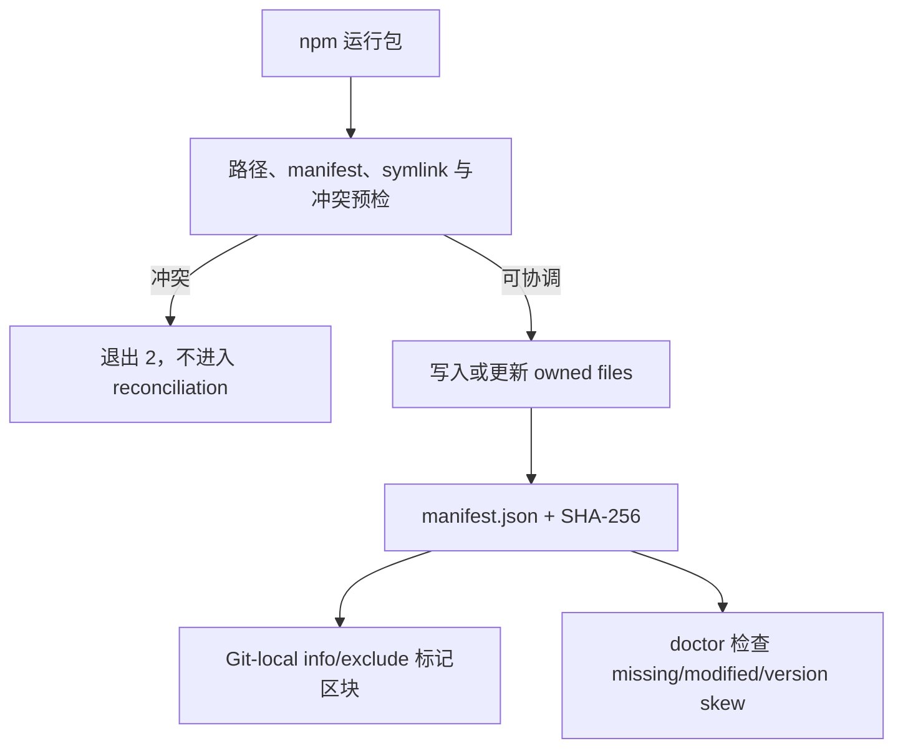
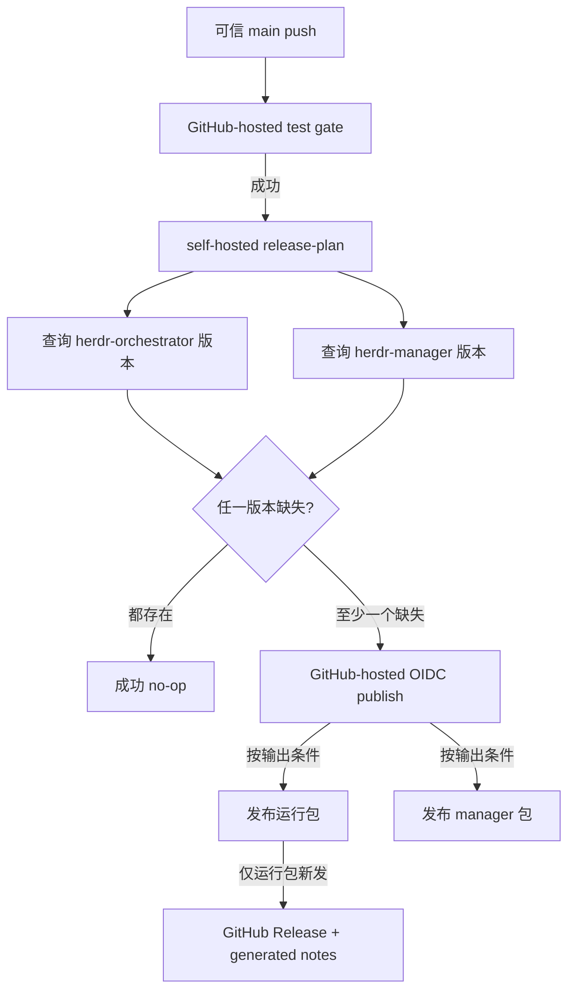

# 部署、分发与发布
Active contributors: oldwinter, chendongdong

本项目没有常驻生产服务部署。仓库中的“发布”是把两个 npm 包发布到 registry，并在运行包
发版时创建对应 GitHub Release；使用者仍需在自己的 Git 仓库中显式安装、诊断和启动本地
控制面。

当前分发单元：

| 包 | 当前仓库版本 | 入口 | 责任 |
| --- | --- | --- | --- |
| `herdr-orchestrator` | `0.1.6` | `bin/herdr-orchestrator.mjs` | 完整安装器、Python runtime、manager、manager-light |
| `herdr-manager` | `0.1.0` | `packages/herdr-manager/bin/herdr-manager.mjs` | 只把固定 argv 转发到运行包的 `manager` 命令 |

版本号是仓库快照，不是“最新 registry 版本”的动态承诺。采用时可显式固定需要的不可变 npm
版本。

## 运行前提与依赖边界

- `package.json` 要求 Node.js 20+；Python 控制面由 `pyproject.toml` 要求 Python 3.12+。
- `herdr-orchestrator` 根 npm 包没有 npm runtime dependency；Python
  `[project].dependencies` 也为空。
- `herdr-manager` 有一个 runtime dependency：
  `herdr-orchestrator ^0.1.6`，因此它与完整运行包共享实现而不复制控制逻辑。
- 真实 dispatch 仍要求 Herdr、Git、至少一个受支持且已登录的 harness CLI。
- Manager-light 要求 Herdr 0.8.2+。

完整依赖表见[依赖参考](reference/dependencies.md)，安装器内部见
[安装与分发系统](systems/installation-and-distribution.md)。

## 使用方安装

### 完整控制面

在目标 Git 仓库执行：

```bash
npx --yes herdr-orchestrator@0.1.6 install --project .
```

自动探测不适合时，显式指定 harness：

```bash
npx --yes herdr-orchestrator@0.1.6 install --project . \
  --harness droid \
  --harness codex
```

如果目标已有 `.agents/skills/` router，Skill 注入默认跳过；确需由 manifest 管理时：

```bash
npx --yes herdr-orchestrator@0.1.6 install \
  --project . \
  --install-skill
```

安装后先执行：

```bash
npx --yes herdr-orchestrator@0.1.6 doctor --project .
```

只有 `installation.ok`、`runtime.ok` 和顶层 `ok` 都为 true 才健康。Wrapper/manifest
版本不同会报告 `version_skew`。

### 只安装可移植 Skill

```bash
npx skills add oldwinter/herdr-orchestrator \
  --skill herdr-orchestrator --agent '*' -y
```

这只安装 `skills/herdr-orchestrator/SKILL.md`，不复制 Python 控制面，也不创建 workflow。

### 手动 manager

一次性启动：

```bash
npx --yes herdr-manager@0.1.0
npx --yes herdr-manager@0.1.0 claude
```

它必须在 Herdr session 内运行；默认按 Grok、Codex、Claude 选择。源码 checkout 的高频入口：

```bash
just install-manager
herdr-manager
```

`just install-manager` 先全局安装当前运行包，再显式执行
`herdr-orchestrator manager-light install`。裸 `npm install --global .` 本身不修改 Herdr
配置；manager-light 是独立 opt-in side effect。

## 项目本地 ownership



| 目标路径 | 用途 |
| --- | --- |
| `.herdr-orchestrator/manifest.json` | schema、包版本、harness、Skill 偏好和 owned hashes |
| `.herdr-orchestrator/workflows/` | 项目相对 workflow 与 planner prompt |
| `.herdr-orchestrator/profiles/` | 仅已选 harness 的 compact/full profile |
| `.herdr-orchestrator/manager/` | 固定手动 manager policy workspace |
| `.agents/skills/herdr-orchestrator/` | 可选 portable Skill |
| `.orchestrator/.gitignore` | 阻止 runtime state 被提交 |

安装器还在 Git-local `info/exclude` 中维护带标记区块，不改 tracked `.gitignore`。它遵守：

- 未托管且内容冲突：任何目标写入前停止；
- 未托管但内容相同：复用，不取得 ownership；
- 已托管但被用户修改：重装、升级、卸载均保留，并返回 `preserved`；
- Manifest 和受管路径拒绝路径逃逸与 symlink redirection；
- 卸载只删除仍匹配记录 hash 的文件，随后移除 manifest。

详细 JSON 和退出码见 [CLI 机器契约](api/cli-contracts.md)。

## Manager-light 的配置发布面

Manager-light 不属于目标项目 manifest。它操作用户 Herdr 配置和包内 plugin：

1. 检查 Herdr 版本和 plugin 列表；
2. 拒绝 symlink config、损坏 marker、外部拥有的 Agent row 或同名外部 plugin；
3. 生成临时候选配置并用 `herdr config check` 验证；
4. 原子 rename 候选，链接/启用 plugin；
5. reload config 并刷新 token projection。

卸载只移除完整 owned block 和 owned plugin。配置区块外字节保持不变。状态检查：

```bash
herdr-orchestrator manager-light status
herdr-orchestrator manager-light uninstall
```

## 版本协调

运行包版本必须同步：

1. `package.json` 的 `version`；
2. `package-lock.json` 的 root version；
3. `pyproject.toml` 的 `project.version`；
4. `src/herdr_orchestrator/__init__.py` 的 `__version__`。

`packages/herdr-manager/package.json` 有独立版本，并需要保持对
`herdr-orchestrator` 的依赖范围兼容。常规准备：

```bash
npm version patch --no-git-tag-version
# 同步 pyproject.toml 与 src/herdr_orchestrator/__init__.py

npm version patch --no-git-tag-version --prefix packages/herdr-manager

npm run release:plan
npm pack --dry-run --json
npm pack --dry-run --json ./packages/herdr-manager
just check
```

只在对应包内容变化时增加该包版本。npm 版本不可变；代码变化但版本不变会在 release-plan
阶段成为成功 no-op。

## CI 质量 gate

`.github/workflows/ci.yml` 在 pull request 和 `main` push 上运行。`test` job 使用
GitHub-hosted `ubuntu-latest`，而不是持久 self-hosted runner：

1. checkout 时 `persist-credentials: false`；
2. 安装 Python 3.12、Node.js 24、uv 0.12.5 和 rust-just 1.57.0；
3. `uv sync --locked`；
4. 编译 `src/`、`tests/`、`scripts/`；
5. 分别收集 lint、branch coverage、flaky stability、security、package metrics 与 profiling；
6. 始终生成并上传 `.orchestrator/quality/`，保留 14 天；
7. 最后的 enforcement 要求六个 outcome 全部成功。

质量步骤的 `continue-on-error` 只为收集完整证据，最终仍 fail closed。

PR 的自动评论位于独立 `pr-review` job：它只有 `pull-requests: write`，不 checkout
contributor code，只下载质量 artifact 并更新评论。默认分支 security gate 失败时，
独立 `security-insight` job 才有 `issues: write`，按固定标题创建或更新 insight。

## 双包 release plan 与发布



### Release plan

只有成功的 `main` 测试进入标签
`[self-hosted, Linux, X64, herdr-orchestrator]` 的仓库专属 runner。该 job 分别运行：

```bash
node scripts/npm-release-plan.mjs --package-json package.json
node scripts/npm-release-plan.mjs \
  --package-json packages/herdr-manager/package.json
```

`scripts/npm-release-plan.mjs` 严格校验包名和 SemVer，然后查询
`npm view <name> versions --json`：

- 版本存在：`publish=false, reason=version_exists`；
- 版本缺失：`publish=true, reason=version_missing`；
- 明确 npm `E404`：视为尚无版本；
- 其他失败或非法响应：退出 `2`，不把网络歧义当新版本。

Persistent runner 只处理可信 `main` 的版本查询，不执行 pull request 代码。Checkout
不持久化 credential。

### OIDC Trusted Publishing

任一包缺失时，`publish` 在 GitHub-hosted `ubuntu-latest` 运行，并绑定 Environment `npm`：

- `id-token: write` 用于 npm Trusted Publishing；
- `contents: write` 用于随后创建运行包的 GitHub Release；
- 不使用 `NODE_AUTH_TOKEN` 或长期 npm token；
- 安装 npm 12.0.2，执行 `npm ci --ignore-scripts`；
- 按 release-plan 输出分别发布运行包和 manager 包。

npm Trusted Publishing 不支持 self-hosted runner，因此真正 publish 不能迁移到 release-plan
runner。两个 npm 包都必须在 npm 侧配置与仓库、`.github/workflows/ci.yml` 和 Environment
`npm` 精确匹配的 trusted publisher。Brand-new package name 的首次 bootstrap 是单独、
显式授权的 release 动作。

只有运行包新发时才执行：

```bash
gh release create "v$VERSION" \
  --repo "$GITHUB_REPOSITORY" \
  --target "$GITHUB_SHA" \
  --title "v$VERSION" \
  --generate-notes
```

Manager-only 发布不会创建以 manager 版本命名的 GitHub Release。

## 失败恢复

| 失败位置 | Registry 状态 | 恢复 |
| --- | --- | --- |
| 编译/质量 gate | 未变 | 修复后运行 `just check`，通过正常 PR/main 流程重试 |
| Registry 查询 | 未知，plan 失败 | 恢复 registry 后重跑；不得手工猜 `publish=true` |
| Hosted runner、Environment、OIDC | 缺失版本尚未发布 | 修复 GitHub/npm trusted publisher 配置后重跑 |
| 某包 publish 前失败 | 该包仍缺失 | 重跑，release plan 会再次选中精确版本 |
| 运行包已发布、manager 未发布 | 运行包变为 no-op，manager 仍缺失 | 重跑只发布 manager |
| npm 成功、GitHub Release 失败 | 运行包版本已存在，整条重跑可能 no-op | 核验发布提交后，显式补建 Release |
| 已发布包有缺陷 | 版本不可覆盖 | 修复并发布新 SemVer；必要时在 registry deprecate 旧版本 |
| 目标安装返回 `preserved` | 用户改动未覆盖 | 人工合并，恢复 manifest 一致性后再运行 doctor |

手工补建 Release 时，target 必须是实际 npm 发布对应的精确提交，不能使用当前分支上的任意
更新提交。

## 不自动执行的动作

CI 与 npm 包不会自动：

- 在使用方仓库执行 `install`、`upgrade`、`run` 或 `dashboard`；
- push、合并、创建 PR、部署服务、修改生产数据或扩大权限；
- 提交 `.orchestrator/`、原始 prompt 或 terminal output；
- 把 harness 最大自动化参数解释为 production 授权。

标准化交付成功也只停在隔离 integration branch。采用、升级、运行和生产变更仍需责任人
显式授权。

## 关键文件与延伸阅读

- `package.json`
- `packages/herdr-manager/package.json`
- `bin/herdr-orchestrator.mjs`
- `packages/herdr-manager/bin/herdr-manager.mjs`
- `scripts/npm-release-plan.mjs`
- `.github/workflows/ci.yml`
- `docs/installation.md`
- `tests/test_distribution.py`
- `tests/test_release.py`
- [安全与信任边界](security.md)
- [CLI 机器契约](api/cli-contracts.md)
- [依赖参考](reference/dependencies.md)
