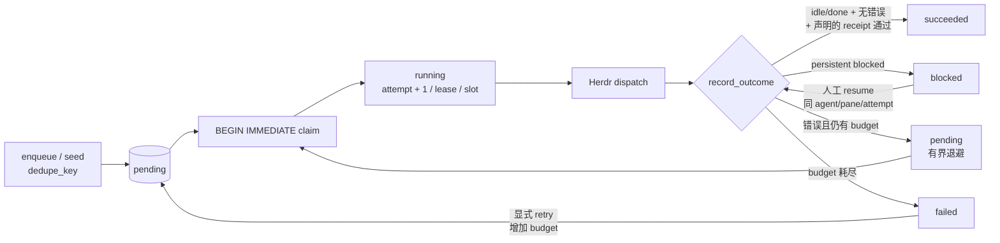

# Durable execution
Active contributors: oldwinter, chendongdong

## Purpose

Durable execution 是普通任务派发的持久控制面：Coordinator 决定任务何时入队、claim、重试、阻塞和完成，SQLite 保存可恢复事实，Herdr 只承载交互式 agent。Coordinator 重启后，queue、lease、attempt、dedupe 和 receipt 仍可恢复；因此持久性来自数据库状态机，不来自某个永不退出的 Python 线程或 terminal pane。

相关页面：[Coordinator 与 durable queue](../systems/coordinator-and-queue.md) · [Herdr runtime](../systems/herdr-runtime.md) · [任务与收据](../primitives/jobs-and-receipts.md) · [任务收据与恢复](receipts-and-recovery.md) · [本地 Dashboard](../systems/dashboard.md)

## 布局

普通 queue 有三个彼此独立但串联的运行面：

| 运行面 | 真源 | 负责 | 不负责 |
| --- | --- | --- | --- |
| Durable control | SQLite `jobs` / `receipts` | 状态、attempt、lease、dedupe、retry、resume 前置条件 | 推理、终端布局 |
| Coordinator | `Coordinator` + workflow policy | claim wave、replica 限制、deadline、dispatch、结果持久化 | 成为第二套状态数据库 |
| Interactive runtime | Herdr agent/pane/tab/worktree | Agent 进程、输入、lifecycle 观测 | 决定 job 是否 succeeded |

### Durable 状态

`JobState` 只有五个值：`pending`、`running`、`succeeded`、`blocked`、`failed`。

- `pending`：等待 `available_at`、placement 和可用 replica slot。
- `running`：已 claim，持有 `lease_until`，attempt 已增加。
- `succeeded`：agent 已稳定 `idle` / `done`、无错误；如声明 task receipt，还要求 `task_verified=true`。
- `blocked`：agent 持续要求人工输入。普通 queue 不自动回答，也不把它转为 retry。
- `failed`：attempt budget 已耗尽；只能经显式 `retry` 回到 `pending`。

`working`、`unknown`、timeout、协议错误都不是 job 成功。Agent lifecycle 与 durable job state 的区别见[Herdr runtime](../systems/herdr-runtime.md)。

## 执行模式

### `run_once`

`Coordinator.run_once()` 依次：初始化 store；按需运行 planner；为未放置 job 决定 topology；创建本 wave 的 `batch_key`；按 `max_parallel`、worker pool 与 replica slot claim；用 `ThreadPoolExecutor` 并发 dispatch；最后逐项 `record_outcome()`。

返回报告同时保留：

- 顶层本 wave 各状态计数；
- `claimed`：本 wave claim 数；
- `batch`：本 wave状态计数副本；
- `queue`：结束时全 workflow 的 durable 状态快照。

### `run_until_idle`

`Coordinator.run_until_idle(timeout_seconds=...)` 在一个总 deadline 内重复 `run_once()`：planner、topology 和每个 worker dispatch 都只能使用剩余时间。它不会把每个 wave 都重新获得完整 timeout。

| 字段 / reason | 语义 |
| --- | --- |
| `worker_pool_idle` | 本次允许的 harness 范围内没有 `pending` / `running` / `blocked` |
| `queue_idle` | 全 workflow 没有 `pending` / `running` / `blocked` |
| `reason=queue_idle` | 所选 pool 与全局 queue 都排空 |
| `reason=worker_pool_idle` | 所选 pool 排空，但被排除 harness 仍有活动 job |
| `reason=blocked` | 所选 pool 出现 blocked，立即返回 `idle=false` |
| `reason=drain_timeout` | 总 deadline 用尽，返回 `idle=false` |

`failed` 与 `succeeded` 是完成态，不阻止 idle。空 wave 在尚未 idle 时按 `poll_seconds` 有界休眠，避免 busy loop。

## Lease、attempt、replica 与 dedupe

### Claim 与 lease

`Store.claim()` 在 `BEGIN IMMEDIATE` 内完成，避免两个 Coordinator 同时 claim 同一个 attempt。候选是已到 `available_at` 的 pending job，或 lease 已过期且仍有 budget 的 running job。成功 claim 时：

1. `attempts += 1`；
2. 写入 `lease_until = now + lease_seconds`；
3. 选择未占用的确定性 `agent_name`；
4. 为本次 dispatch 生成 `uuid4().hex` correlation ID；
5. 返回不可变 `ClaimedJob`。

过期 running job 若已耗尽 budget，claim 前由 `_expire_exhausted()` 转为 `failed`，错误码 `lease_expired`。Store 写结果时还会核对 durable state 仍是同一 running attempt；迟到 worker 会收到 `job_lease_lost`，不能覆盖后来 attempt。

lease 没有 heartbeat，也不会在过期时终止原 agent。配置时必须考虑旧执行与新 attempt 重叠；有外部副作用的任务仍需自己使用稳定幂等键。

### Replica slot

- 一个 wave 最多 claim `coordinator.max_parallel` 个 job。
- 每个 harness 的有效并发上限来自 worker `replicas`。
- Tab/pane 使用稳定 replica 名；worktree 使用带 job ID 的任务专属 slot。
- 带未过期 lease 的 running job 占用 harness count 和 agent name；不能再次分配同一 slot。

因此 replica 为 1 时，同 harness 的三个 pending job 会跨三个 wave 串行执行，即使全局 `max_parallel` 更高。

### Dedupe 与 retry

`jobs` 表的 `UNIQUE(workflow, dedupe_key)` 是入队幂等的最终约束。重复 enqueue 通过 `ON CONFLICT DO NOTHING` 返回原 job ID，不创建新 attempt；`seed()` 因而可安全重复运行。

普通失败在尚有 budget 时回到 pending，退避为 `min(60, 2 ** (attempt - 1))` 秒。`Store.retry_failed()` 只接受 failed job，允许一次增加 1–10 个 `max_attempts`，清空当前错误/验证投影并回到 pending；原 job ID、dedupe key 和历史 receipts 不变。Pending、running、blocked 或 succeeded 都拒绝 retry。

Dedupe 只保证“同一 workflow/key 只有一条 job”，不保证 exactly-once execution。

## 关键抽象

| 抽象 | 责任 | 完整路径（仓库根目录相对） |
| --- | --- | --- |
| `Coordinator.run_once` | 单 wave 的 planner、placement、claim、dispatch 与报告 | `src/herdr_orchestrator/runner.py` |
| `Coordinator.run_until_idle` | 共享总 deadline 的连续 wave 与 idle 判定 | `src/herdr_orchestrator/runner.py` |
| `Store.claim` | 事务 claim、lease 回收、attempt 和 replica 分配 | `src/herdr_orchestrator/store.py` |
| `Store.record_outcome` | 将 runtime outcome 原子映射为 job 状态与 receipt | `src/herdr_orchestrator/store.py` |
| `Store.retry_failed` | 为 failed job 追加有界 attempt budget | `src/herdr_orchestrator/store.py` |
| `JobState` / `ClaimedJob` / `NewJob` | Durable 状态和值对象 | `src/herdr_orchestrator/model.py` |
| `replica_slot_names` / `worktree_agent_name` | 稳定 slot 与任务专属 agent identity | `src/herdr_orchestrator/herdr.py` |

## 恢复与 GC 边界

- **崩溃恢复**：Coordinator 重启后重新读取 SQLite；lease 到期才允许回收 running job。
- **Blocked 恢复**：只经人工 `resume --response-file`；保持原 attempt、agent 和 pane，不重发原任务 prompt。详见[任务收据与恢复](receipts-and-recovery.md)。
- **Worktree**：普通 queue 不自动 merge、删除 branch/checkouts 或关闭 workspace。详见[Placement 与 worktree](../primitives/placement-and-worktrees.md)。
- **GC**：succeeded 与 failed 分 scope；默认 `dry_run=true`。只候选当前 workflow 可证明创建、身份/pane/workspace/cwd/placement 匹配且已 settled 的 tab/pane agent；blocked、worktree、active、foreign 和预先存在的 reused agent跳过。即使 placement 是 tab，也只关闭 owned pane，不关闭整个 tab。
- **Runtime state**：SQLite 保存 prompt，是本地敏感状态；`.orchestrator/` 不进入 Git。Dashboard observer 刻意不读取 prompt 或完整 terminal transcript。

## 集成

- `src/herdr_orchestrator/cli.py` 把 `run-once`、`run-until-idle`、`run`、`retry`、`resume` 与 `gc` 映射到 Coordinator/Store。
- `workflows/multi-harness.toml` 提供 `poll_seconds`、`max_parallel`、`lease_seconds`、`max_attempts`、`agent_timeout_seconds` 与 worker replicas。
- Placement 必须在 claim 前确定；决策链见[拓扑感知派发](topology-aware-dispatch.md)。
- Herdr transport 只返回 `DispatchOutcome`；Store 才拥有 durable 状态转换权。
- `src/herdr_orchestrator/observability.py` 使用 attempt correlation ID 发出事件；[本地 Dashboard](../systems/dashboard.md)只读 store 与 runtime 投影。
- 总体恢复契约在 `docs/architecture.md`，现场排错在 `docs/runtime-troubleshooting.md`。

## 修改入口

| 想修改的行为 | 首选入口 | 必须保持 / 验证 |
| --- | --- | --- |
| 状态转换、退避、lease 回收 | `src/herdr_orchestrator/store.py` | `BEGIN IMMEDIATE`、stale outcome 防护、migration、`tests/test_store.py` |
| Wave、deadline、drain 报告 | `src/herdr_orchestrator/runner.py` | worker-pool/global idle 区分、`tests/test_runner.py` |
| Replica/agent naming | `src/herdr_orchestrator/herdr.py` | slot key、worktree job scope、GC ownership |
| Coordinator policy | `workflows/multi-harness.toml` | workflow schema、timeout/lease 重叠风险 |
| Retry/resume CLI | `src/herdr_orchestrator/cli.py` | 稳定错误原因、自动化 JSON、状态前置条件 |
| SQLite 字段或版本 | `src/herdr_orchestrator/store.py` | v1→当前版本的顺序 migration 与旧 DB 兼容 |

## Key source files

- `src/herdr_orchestrator/runner.py`
- `src/herdr_orchestrator/store.py`
- `src/herdr_orchestrator/model.py`
- `src/herdr_orchestrator/herdr.py`
- `src/herdr_orchestrator/cli.py`
- `workflows/multi-harness.toml`
- `docs/architecture.md`
- `docs/runtime-troubleshooting.md`
- `tests/test_store.py`
- `tests/test_runner.py`
- `tests/test_herdr.py`
