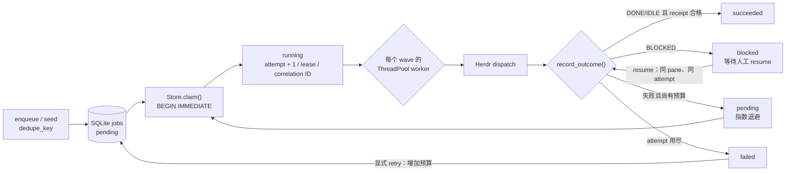

# Durable execution
Active contributors: oldwinter, chendongdong

Active contributors: oldwinter, chendongdong

Durable execution 是普通任务派发的持久化执行面：coordinator 决定任务何时入队、由谁 claim、何时重试以及何时写入 receipt；Herdr 只负责承载交互式 agent。进程重启后，SQLite 中的 queue、attempt、lease 和 receipt 仍然存在，因此“长期运行”依赖的是可恢复状态机，而不是某个一直存活的终端进程。

相关页面：[Coordinator 与队列](../systems/coordinator-and-queue.md) · [Dashboard](../systems/dashboard.md) · [可观测性与 Attention](observability-and-attention.md) · [安全边界](../security.md)

## 执行主链路

`Coordinator.run_once()` 先初始化 schema，按需执行 planner，并为尚未 placement 的任务确定 topology；随后最多 claim `coordinator.max_parallel` 个任务，以本 wave 的 `batch_key` 并发派发，最后逐个将 outcome 转换为 durable state 和 receipt。默认 workflow 的全局并发是 6、lease 是 900 秒、单次 agent timeout 是 300 秒、默认最大尝试次数是 2；这些值来自 `workflows/multi-harness.toml`。

`Coordinator.run_forever()` 在 `run_once()` 之间按 `poll_seconds` 休眠，适合常驻 worker。它本身不是服务管理器：进程崩溃后应由外部 supervisor 重新启动；恢复依据仍是 SQLite，而不是 Python 线程。

## Lease 与崩溃恢复

claim 在 `BEGIN IMMEDIATE` 事务内完成，确保多个 coordinator 不会同时拿到同一个 attempt。claim 会：

1. 选择已到 `available_at` 的 `pending` 任务，或 lease 已过期的 `running` 任务；
2. 将 `attempts` 加一，写入固定的 `lease_until`、确定性 `agent_name` 和本 attempt 的随机 `correlation_id`；
3. 同步占用 harness replica slot，然后才把 `ClaimedJob` 交给 dispatcher。

lease 过期但尚有 attempt 预算时，任务可被下一次 claim 回收；预算已耗尽时，`_expire_exhausted()` 将其标记为 `failed`，稳定错误码为 `lease_expired`。写 outcome 时，store 再校验任务仍为 `running` 且 attempt 未变化；旧 worker 在任务已被重新 claim 后写回，会收到 `job_lease_lost`，不能覆盖新 attempt。

当前 lease 是一次性期限，没有 heartbeat 或续租协议，也不会在期限到达时杀死 Herdr agent。因此 `lease_seconds` 应明显大于预期 dispatch 上限；修改 timeout/lease 时要同时验证“旧执行仍在运行、新 attempt 已启动”的重叠风险。

## Idempotency 与 receipt

- **入队幂等**：`jobs` 表的 `UNIQUE(workflow, dedupe_key)` 是最终约束；`INSERT ... ON CONFLICT DO NOTHING` 返回原 job ID。`seed()` 因而可重复执行。
- **执行不是 exactly-once**：lease 到期、进程崩溃或 provider 状态不明都可能让同一任务产生多个 attempt。外部副作用必须由任务自身使用稳定 key 做幂等保护。
- **attempt 级关联**：每次 claim 生成新的 correlation ID，写入当前 job，并随 attempt receipt 保存；详见[可观测性与 Attention](observability-and-attention.md)。
- **成功 fail-closed**：只有无 `error_code` 的 `IDLE`/`DONE` 才可成功；如果任务声明了 `TaskReceipt`，`task_verified` 还必须为 `true`。缺失验证变成 `task_receipt_missing`，显式失败变成 `task_receipt_invalid`。`idle`/`done` 只说明 agent settled，不单独证明任务完成。
- **错误重试**：未用尽预算的普通失败回到 `pending`，退避为 `min(60, 2^(attempt-1))` 秒；用尽预算才进入 `failed`。`retry_failed()` 是人工动作，每次可增加 1–10 次预算。
- **blocked 不自动回答**：`blocked` 对普通 queue 是终态；`resume_blocked()` 必须显式提供非空 response，并校验最近 receipt 中的 pane。恢复沿用原 agent、pane 和 attempt，只为恢复动作加临时 lease。

## Worker pool 与 waves

并发受到三层约束：

| 层级 | 约束 |
| --- | --- |
| wave | 一次 `run_once()` 最多 claim `coordinator.max_parallel` 个 job |
| harness | `slot_limits[harness]` 来自 worker 的 `replicas`，同一 harness 的有效 `running` 数不能超限 |
| slot | tab/pane 使用确定性 replica 名；worktree 使用 job 专属 agent 名；已被有效 lease 占用的名字不会重复分配 |

`ThreadPoolExecutor` 只为本 wave 已 claim 的任务创建线程，不是另一套 queue。`run_until_idle(timeout_seconds=...)` 在一个总 deadline 内连续运行 waves，汇总每个状态、claimed 数和 queue 快照。它区分：

- `queue_idle`：全 workflow 没有 `pending`、`running`、`blocked`；
- `worker_pool_idle`：本次 `allowed_harnesses` 范围内没有上述状态；
- `reason=worker_pool_idle`：选定 worker pool 已排空，但被排除 harness 仍可能有 pending job；
- `reason=blocked`：范围内出现 blocked，立即停止 drain 并等待人工处理；
- `reason=drain_timeout`：总 deadline 到达；planner、topology 选择和 worker dispatch 都共享该 deadline。

空 wave 会按 `poll_seconds` 等待，避免 busy loop。对 replica 为 1、队列中有 3 个同 harness 任务的情况，测试证明会分 3 个 wave 顺序排空，而不是绕过 slot 限制。

## 持久化模型与边界

SQLite 使用 WAL、外键检查和显式事务。`jobs` 保存当前投影，`receipts` 追加每个观察到的 attempt outcome，`metadata` 保存 planner 等周期状态；schema migration 从 v1 顺序升级到当前 v4，新增字段时必须保持迁移链与旧数据库兼容。

必须明确以下边界：

- durable queue 不是安全沙箱；worktree 只隔离 checkout，任务仍需遵守[安全边界](../security.md)。
- SQLite 持久化 prompt，因此 state DB 是本地敏感 runtime state，不应提交 Git；Dashboard observer 刻意不读取 prompt。
- timeout、`unknown`、`working` 都不是成功；未 settled 的 outcome 会得到 `agent_not_settled`。
- coordinator 不自动 push、merge、发布、发消息、删除或修改生产数据；任务中的外部副作用也不能因“有 queue”而视为安全。
- GC 只处理本 workflow 创建且已记录 pane 的 owned tab/pane agent；跳过 worktree、复用 agent、active agent 和 blocked job，也不会关闭其他运行创建的 pane。
- `run_forever()` 没有内建多进程选主、OS 级守护或无限续租；高可用部署必须在这些边界外设计。

## 关键抽象与源文件

| 抽象 / 契约 | 完整路径 | 作用 |
| --- | --- | --- |
| `Coordinator` | `src/herdr_orchestrator/runner.py` | enqueue、claim、并发 dispatch、waves、resume、GC 与 deadline |
| `Store` | `src/herdr_orchestrator/store.py` | SQLite schema/migration、事务 claim、lease、幂等、状态转换和 receipt |
| job / outcome / receipt 模型 | `src/herdr_orchestrator/model.py` | `JobState`、`ClaimedJob`、`DispatchOutcome`、`TaskReceipt` 等类型 |
| workflow 配置 | `workflows/multi-harness.toml` | coordinator policy、worker replicas、placement 和 planner |
| coordinator 行为测试 | `tests/test_runner.py` | waves、deadline、worker pool、resume、GC、seed 和 receipt 集成 |
| store 行为测试 | `tests/test_store.py` | claim 竞争、replica、lease 回收、重试、迁移和验证闭环 |

## 集成点与修改入口

| 想修改的行为 | 首要入口 | 同步检查 |
| --- | --- | --- |
| 状态转换、退避或 lease 回收 | `src/herdr_orchestrator/store.py` | migration、receipt 追加语义、`tests/test_store.py` |
| wave、总 deadline 或 drain 报告 | `src/herdr_orchestrator/runner.py` | `worker_pool_idle` 与 `queue_idle` 的区别、`tests/test_runner.py` |
| 全局并发、lease、attempt、poll | `workflows/multi-harness.toml` | agent timeout、replicas、workflow schema 和长期运行重叠风险 |
| worker replica/agent 命名 | `src/herdr_orchestrator/herdr.py` | slot key 与 owned-agent GC 规则 |
| receipt 成功条件 | `src/herdr_orchestrator/store.py` 与 `src/herdr_orchestrator/herdr.py` | `agent_settled`、`task_verified`、稳定错误码 |
| attempt 诊断信号 | `src/herdr_orchestrator/observability.py` | correlation ID、sanitization、Dashboard attention |

任何 schema 或状态机修改都应先加最小回归测试，随后运行 `just check`；不得把 `.orchestrator/`、原始 prompt 或完整终端输出纳入 Git。
