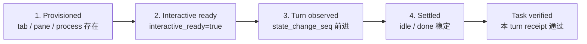

# Harness readiness 与自动化
Active contributors: oldwinter, chendongdong

Harness 进程存在不代表它能执行任务。Herdr Orchestrator 用分层证据证明 Droid、Grok Build、Codex、pi、Claude Code 和 Hermes 已真正接收并完成一个 turn；同时由 control plane 注入每种 CLI 的固定最大自动化参数，避免 planner 或 task packet 改写启动权限。

## 四层运行证据

| 层 | 代码如何证明 | 不能推出什么 |
| --- | --- | --- |
| Provisioned | `HerdrLayout.provision()` 返回 workspace/tab/pane ID，pane shell 已可见 | Harness 已 ready 或 prompt 已提交 |
| Interactive ready | 新 agent 固定 settle 后重新读取 `interactive_ready=true`，且状态为 `idle` / `done` | 已发生任务 turn |
| Turn observed | Prompt 前后 `state_change_seq` 必须增加 | 任务结果正确 |
| Settled | `idle` / `done` 默认稳定 3 秒；期间回到 `working` 则继续等待 | 声明的输出/文件契约已满足 |

第 3、4 层合起来只证明 `agent_settled=true`。Doctor 和 smoke 还声明 output-prefix receipt，只有收到当前 turn 的新增前缀才算 ready/smoke success。

## Doctor 与 smoke

### Doctor：环境、安装、profile 和真实 turn

入口是 `src/herdr_orchestrator/cli.py::doctor`。它先检查：

- `HERDR_ENV=1`、`HERDR_PANE_ID`、`HERDR_WORKSPACE_ID`；
- `herdr`、`herdr --version` 和 `git`；
- GitHub tracker 启用时的 `gh`；
- 每个启用 harness 的 executable；
- 对应完整 profile 文件。

静态检查通过后，`probe_harness_readiness()` 为每种 harness 创建稳定的 `doctor-<harness>-<digest>` agent，发送只读 prompt，并要求当前 turn 输出 `HERDR-DOCTOR-OK harness=<name>`。结果包含 compact summary、总 readiness 时间以及 `provision_ready`、`receipt_baseline`、`turn_settlement`、`receipt_verification`、`total` 等 phase timing。

`doctor --harness droid --harness codex` 可重复过滤 enabled harness；请求未启用 harness 会返回 `doctor_harness_not_enabled`。Probe 结束后只关闭本次创建的临时 agent terminal。

### Smoke：受限目标上的真实只读连通

`src/herdr_orchestrator/cli.py::smoke` 读取有限目标：workspace 的 `README.md` 与 workflow TOML。Prompt 明确禁止写文件、网络和外部动作，并要求 `HERDR-SMOKE-OK harness=<name>` output receipt。

Smoke 可按 `--harness` 收窄；每个 worker 都必须满足：

- 无 transport error；
- 最终为 `idle` 或 `done`；
- `task_verified=true`。

Doctor 更适合快速分类环境、安装、profile、认证和模型问题；smoke 更接近真实 worker turn。二者都不是业务结果质量测试，也不授权修改仓库。

## 固定最大自动化 flags

`src/herdr_orchestrator/herdr.py::MAXIMUM_AUTOMATION_ARGUMENTS` 是唯一真源：

| Harness | 固定 native arguments |
| --- | --- |
| Droid | `--auto high` |
| Grok Build | `--always-approve --permission-mode bypassPermissions` |
| Codex | `--dangerously-bypass-approvals-and-sandbox --dangerously-bypass-hook-trust` |
| pi | `--approve` |
| Claude Code | `--dangerously-skip-permissions` |
| Hermes | `--yolo --accept-hooks` |

`HerdrTransport._start_agent()` 构造 `herdr agent start ... -- <native arguments>`。Workflow、planner、router 和 task prompt 都没有字段覆盖或附加这些 flags。这些参数只减少本地 CLI 的确认，不扩大任务授权：普通 queue 仍不授权 push、merge、发布、发送、删除、改权限或 production 操作。

## Claude workspace trust guard

Claude 首次进入 workspace 的 trust prompt 没有原生 bypass flag。`_accept_claude_workspace_trust()` 只在**新 Claude agent 的 startup recovery** 中考虑自动按一次 Enter，并要求 detection output 同时具备：

1. `Accessing workspace:`
2. `Quick safety check:`
3. `Yes, I trust this folder`
4. 预期 execution root 的绝对路径作为独立行出现

这四项必须全部匹配。不同 cwd、`/login`、认证、secret、approval、需求澄清或任何其他 startup block 都不会自动回答。Guard 可处理 `agent start` 返回 `agent_not_ready` 或成功 payload 暂时为 `blocked` 的两条路径；按 Enter 后仍需 `agent wait` 和 interactive-ready 复查。

测试真源 `tests/test_harness_automation.py` 覆盖正确 workspace、blocked startup、非 trust 阻塞和不同 workspace，防止把一般 principal-proxy 能力误引入普通 queue。

## Startup、acceptance 与 settlement

`src/herdr_orchestrator/herdr.py::HerdrTransport` 使用一个 dispatch deadline 约束 provisioning、start recovery、prompt acceptance、settlement 和 receipt：

1. 只复用 kind、cwd/foreground cwd、interactive-ready 和 settled state 都匹配的 agent。
2. 新 pane 先等待 shell process ready。
3. `agent start` 的 `agent_pane_busy` 最多有界重试；`agent_not_ready` 或 working/unknown payload 进入 recovery wait。
4. 固定 settle 后轮询 `interactive_ready`；startup 的瞬态 blocked 会复查，持续 blocked 才返回 `agent_blocked`。
5. Prompt 使用 Herdr 默认 `agent prompt --wait`，但 acceptance 仍要求 sequence 前进。
6. Prompt command timeout 后重新读取 agent：若 sequence 已前进则继续当前 turn，否则返回带 phase/state/sequence 摘要的 `prompt_acceptance_timeout`。
7. `agent_prompt_stalled` 且仍停在原 idle sequence 时最多重发两次 Enter；仍无新 sequence 则快速返回 `agent_turn_not_observed`。
8. 观察到 turn 后，在 workflow agent timeout 内等待稳定 settlement，再检查 bounded fatal runtime signal 和 task receipt。

后台 tab/pane 始终使用 `--no-focus`。当前前台 pane 没看到活动不是失败证据，应查询结构化 agent state。

## 错误分类

### Transport 稳定错误码

| 类别 | 错误码 | 含义 |
| --- | --- | --- |
| Provision/readiness | `not_in_herdr`, `pane_shell_not_ready`, `agent_not_ready`, `agent_blocked` | 环境、shell、interactive-ready 或 persistent block 不满足 |
| Turn acceptance | `agent_prompt_stalled`, `agent_turn_not_observed`, `prompt_acceptance_timeout` | Prompt transport 卡住、无新 sequence 或 acceptance 超时 |
| Execution | `herdr_timeout`, `agent_not_settled` | 已有 turn 但 deadline 内未 settled，或状态无法接受 |
| Runtime fatal signal | `agent_auth_failed`, `agent_auth_required`, `agent_model_invalid`, `agent_provider_failed` | Settled output 命中认证、登录墙、invalid model 或 provider retry exhaustion |
| Task evidence | `task_receipt_missing`, `task_receipt_ambiguous`, `task_receipt_stale`, `task_receipt_invalid` | 机器验收缺失、来源歧义、旧文件或空/无效证据 |

Runtime fatal 检查只读取 bounded detection output，并将匹配内容折叠空白、截断为最多 300 字符的 `error_summary`；不会保存完整 transcript。检查优先识别 invalid model、provider exhaustion、认证失败，再识别登录等待。

### Doctor status

`probe_harness_readiness()` 把 transport 结果压缩为适合 automation 的 status：

| Doctor status | 典型来源 |
| --- | --- |
| `ready` | `idle` / `done` 且 output receipt verified |
| `auth_required` | `agent_auth_failed` 或 `agent_auth_required` |
| `model_invalid` | `agent_model_invalid` |
| `timeout` | `herdr_timeout`、`timeout`、`prompt_acceptance_timeout` |
| `unavailable` | executable/profile/Herdr 环境缺失，或 `herdr_unavailable` / `not_in_herdr` |
| `error` | Provider failure、receipt failure、未分类 transport failure 或 probe exception |

Doctor 任一 check 失败时退出码为 1；参数、配置或预期异常由 CLI 顶层返回 2。Smoke 任一 harness 失败也返回 1。

## 关键抽象与源文件

| 抽象 | 完整路径 | 责任 |
| --- | --- | --- |
| `HerdrTransport` | `src/herdr_orchestrator/herdr.py` | 环境、agent start/reuse、turn、settlement、fatal signal、receipt |
| `MAXIMUM_AUTOMATION_ARGUMENTS` | `src/herdr_orchestrator/herdr.py` | 六 harness 固定启动 flags |
| `HerdrLayout` | `src/herdr_orchestrator/herdr_layout.py` | 后台 terminal provision 与 execution root |
| `doctor` / `probe_harness_readiness` | `src/herdr_orchestrator/cli.py` | 静态依赖检查、真实 probe 和 status 分类 |
| `smoke` | `src/herdr_orchestrator/cli.py` | 六 harness 只读真实 turn |
| `DispatchOutcome` | `src/herdr_orchestrator/model.py` | `agent_settled`、`task_verified`、timings 和错误传播 |

## 集成点与修改入口

- 新增 harness：必须联动 `src/herdr_orchestrator/model.py`、`MAXIMUM_AUTOMATION_ARGUMENTS`、profile、workflow worker、doctor/smoke 和 `tests/test_harness_automation.py`。
- 修改 startup/readiness：以 `tests/test_herdr.py` 的 shell-ready、interactive-ready、startup transient block、start recovery 和 turn-sequence 用例为回归契约。
- 修改 doctor/smoke 分类或输出：同步 `tests/test_cli.py`，保持 JSON 字段和退出码适合 automation。
- Claude guard 只允许精确 trust pattern；不要把 auth、approval 或一般 blocked response 加入该函数。
- 现场经验和诊断顺序位于 `docs/runtime-troubleshooting.md`；整体 adapter 语义位于 `docs/architecture.md`。
