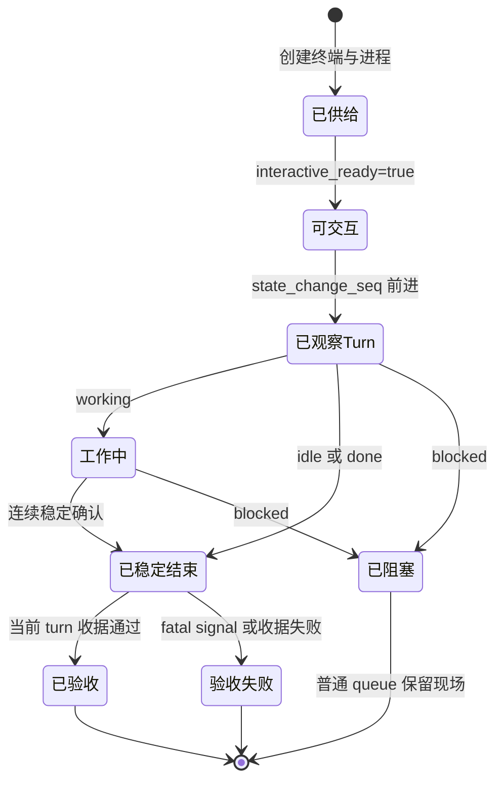
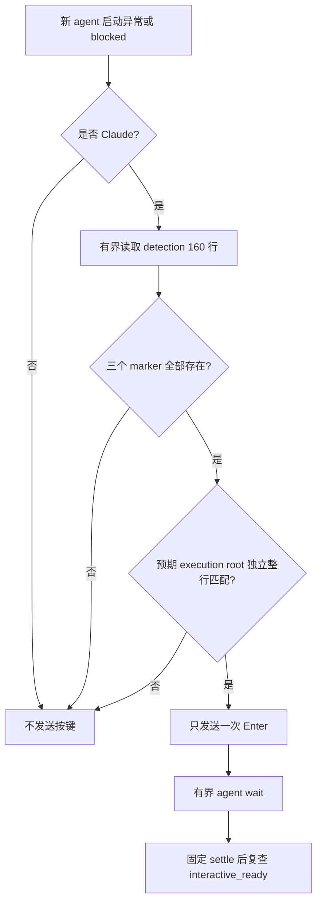
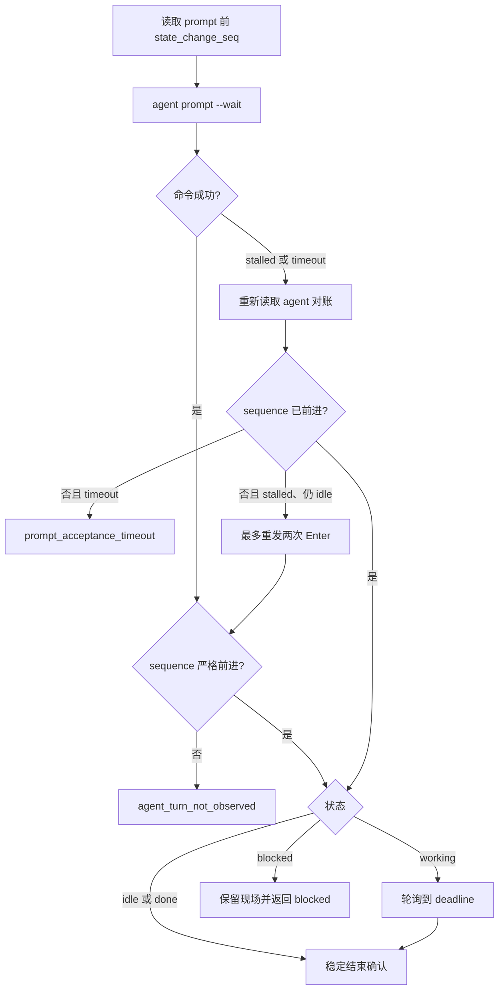
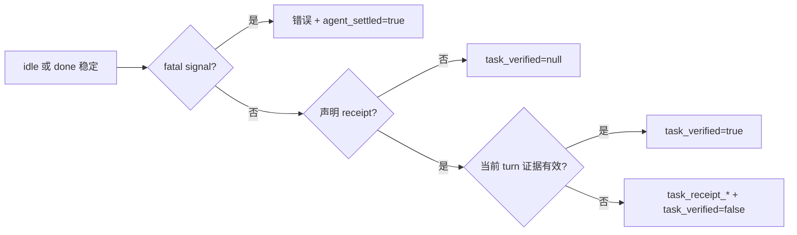

# Harness 就绪性与自动化
Active contributors: oldwinter, chendongdong

> **核心定义**：Harness 进程存在，只能证明终端已创建；不能证明 CLI 已可交互、prompt 已形成新 turn，更不能证明任务结果正确。Herdr Orchestrator 用“已供给 → 可交互 → 已观察 turn → 已稳定结束 → 收据通过”的证据链做保守判定，并由确定性控制面为六种 harness 注入固定的最高自动化参数。

## 目的与边界

本领域负责回答三个问题：

1. **能否真实执行**：`doctor` 与 `smoke` 不止检查 executable，而是在总 deadline 内发起一个真实、只读、带机器收据的 turn。
2. **如何无人值守启动**：`HerdrTransport` 为 Droid、Grok Build、Codex、pi、Claude Code 与 Hermes 使用固定原生参数；workflow、planner、router 与任务 prompt 均不能覆盖。
3. **什么可以算成功**：生命周期、致命运行信号和任务收据逐层验收；任一证据缺失都 fail closed。

本领域不负责选择业务任务应该交给哪个 harness，也不把最大自动化参数解释为额外授权。Harness 能力选择由 compact catalog 与所选完整 profile 完成；队列、权限、production、secret、push、merge、发布和外部动作仍受控制面边界约束。整体运行时关系见 [Herdr runtime](../systems/herdr-runtime.md)，安全含义见[安全与信任边界](../security.md)。

## 领域词汇与不变量

| 术语 | 可证明的事实 | 不能据此推出 |
| --- | --- | --- |
| **已供给（Provisioned）** | Herdr workspace/tab/pane 与 harness 进程已创建，pane shell 可见 | Harness 已能接收 prompt |
| **可交互（Interactive ready）** | `herdr agent get` 的 `interactive_ready` 是布尔值 `true`，状态适合接收输入 | 当前任务 turn 已发生 |
| **已观察 turn（Turn observed）** | Prompt 前后 `state_change_seq` 严格增加 | Turn 已结束或结果正确 |
| **已稳定结束（Settled）** | 当前 turn 稳定处于 `idle` 或 `done` | 声明的输出或文件契约已满足 |
| **阻塞（Blocked）** | 当前 turn 明确需要输入，是终端状态 | `agent_settled=true` 或可由普通 queue 自动回答 |
| **已验收（Verified）** | 当前 turn 的新 output-prefix 或变化后的安全文件通过验证 | 超出收据声明范围的业务质量 |

必须始终保持以下不变量：

- `SETTLED_STATES` 只包含 `idle` 与 `done`；`blocked` 虽会终止当前 turn，但不等于 settled success。
- `agent_settled=true` 与 `task_verified=true` 是两个独立事实。
- 新 agent 的固定等待只是 settle 缓冲，之后仍须重新读取 `interactive_ready=true`。
- Prompt 返回 `idle` 或 `done` 时，若 `state_change_seq` 没有前进，必须拒绝成功。
- 只有当前 turn 的新增 output 或新建/改变的文件可以成为 task receipt。
- Runtime fatal signal 即使出现在已 settled 的输出中，也必须把结果降为错误，而不是成功。
- `unknown`、timeout、协议错误、持续 blocked、未观察到 turn、fatal signal 与 receipt failure 都不是成功。



## `doctor`：静态诊断加真实就绪 turn

入口是 `src/herdr_orchestrator/cli.py` 中的 `doctor()` 与 `probe_harness_readiness()`。默认 probe timeout 为 30 秒，CLI 只接受 5–300 秒。

### 静态检查

`doctor` 先检查：

- `HERDR_ENV=1`；
- `HERDR_PANE_ID` 与 `HERDR_WORKSPACE_ID` 非空；
- `herdr` executable 存在，且 `herdr --version` 在 10 秒内成功；
- `git` executable 存在；
- GitHub tracker 启用时，`gh` executable 存在；
- 每个启用 harness 的 executable 存在；
- 对应完整 profile 的 `context_file` 是文件。

启用集合来自 workflow workers；若 planner 固定了额外 harness，也会加入且去重。`--harness` 可重复使用以收窄集合：

```bash
just doctor --harness droid
just doctor --harness droid --harness codex
```

过滤值必须属于当前启用集合，否则返回 `doctor_harness_not_enabled`。这里的 profile 存在性检查与 harness catalog 分工明确：

- `src/herdr_orchestrator/catalog.py` 负责 TOML profile 的严格加载、worker/profile 对应、compact catalog 与完整 context；
- `doctor` 只证明所需 executable、profile 文件和真实运行链路可用；
- Compact catalog 描述“适合做什么”，readiness probe 描述“此刻是否真的能完成一个 turn”，两者不能互相替代。

### 有界真实 probe

静态前置条件满足后，每个 harness 都执行一个真实 dispatch：

1. 使用 `doctor-<harness>-<6位摘要>` 的稳定 agent name；
2. placement 固定为独立 `tab`；
3. Prompt 明确要求只读，不修改文件或外部状态；
4. 要求输出 `HERDR-DOCTOR-OK harness=<name>`；
5. 声明同值的 `OUTPUT_PREFIX` task receipt；
6. 在 `probe_timeout_seconds` 的总 dispatch deadline 内完成 provision、turn、settlement、fatal-signal 扫描与 receipt；
7. `finally` 调用 `close_created_agent()`；只关闭当前 transport 实际创建的临时 terminal，复用 agent 不受影响。

结果暴露 `duration_ms`，并透传以下 phase timing：

| Timing | 覆盖范围 |
| --- | --- |
| `provision_ready` | 环境检查、agent 查找/创建、shell、start recovery 与 interactive readiness |
| `receipt_baseline` | Prompt 前的 output/file 收据快照 |
| `turn_settlement` | Prompt acceptance、turn 观察与稳定结束 |
| `receipt_verification` | 当前 turn 收据验证 |
| `total` | 整次 dispatch |

### Doctor 状态与退出码

| `status` | 典型来源 |
| --- | --- |
| `ready` | 最终为 `idle`/`done`，且 `task_verified=true` |
| `auth_required` | `agent_auth_failed`、`agent_auth_required` |
| `model_invalid` | `agent_model_invalid` |
| `timeout` | `herdr_timeout`、`timeout`、`prompt_acceptance_timeout` |
| `unavailable` | 环境/executable/profile 不可用，或 `herdr_unavailable`、`not_in_herdr` |
| `error` | Provider failure、receipt failure、persistent block、协议错误或未分类异常 |

全部 checks 通过时退出 0，任一 check 失败时退出 1；CLI 顶层的参数、配置与受控异常退出 2。JSON summary 包含总 check 数、通过/失败数、实际 probe 的 harness 列表和累计 `readiness_ms`，适合 automation 消费。

## `smoke`：对真实仓库目标做只读连通检查

`smoke()` 同样位于 `src/herdr_orchestrator/cli.py`。它依次对选中的 workflow workers 发起真实 turn，deadline 使用 `workflow.coordinator.agent_timeout_seconds`。

Smoke 目标只从实际存在的以下路径产生：

- Workflow workspace 下的 `README.md`；
- 当前 workflow TOML。

若两者都不存在，返回 `smoke_target_not_found`。Prompt 要求使用本地只读工具检查这些目标，并禁止创建/修改文件、访问网络和执行外部动作。每个 harness 必须产生当前 turn 的：

```text
HERDR-SMOKE-OK harness=<name>
```

成功条件同时要求：

- `error_code is None`；
- 最终状态为 `idle` 或 `done`；
- `task_verified is True`。

`--harness` 可重复使用：

```bash
just smoke --harness grok
just smoke --harness pi --harness claude
```

Smoke 只清理本次创建的 agent terminal，并保留安全复用的既有 agent；cleanup 异常也会进入 failure 列表。任一目标失败时退出 1，否则退出 0。

### Doctor 与 smoke 的区别

| 维度 | Doctor | Smoke |
| --- | --- | --- |
| 首要用途 | 分类环境、安装、profile、认证、模型与 provider 问题 | 验证 worker 对真实仓库目标的只读 turn 连通性 |
| Timeout | 每 probe 5–300 秒，默认 30 秒 | Workflow 的 agent timeout |
| 范围 | Workers 加可选固定 planner | Workers |
| 目标 | 精确回复 readiness prefix | 只读检查 README 与 workflow 后回复 smoke prefix |
| 输出 | Check 列表、状态分类、总耗时与 phase timings | `results` 与 `failures` |

二者都不是业务结果质量测试，也不授权修改仓库。它们证明的是“该 harness 在当前 Herdr 环境中完成了一个有界、可验收的只读 turn”。

## 六种 harness 的固定最高自动化参数

唯一真源是 `src/herdr_orchestrator/herdr.py` 中的 `MAXIMUM_AUTOMATION_ARGUMENTS`：

| Harness | 固定原生 argv |
| --- | --- |
| Droid | `--auto high` |
| Grok Build | `--always-approve --permission-mode bypassPermissions` |
| Codex | `--dangerously-bypass-approvals-and-sandbox --dangerously-bypass-hook-trust` |
| pi | `--approve` |
| Claude Code | `--dangerously-skip-permissions` |
| Hermes | `--yolo --accept-hooks` |

`HerdrTransport._start_agent()` 始终构造：

```text
herdr agent start <name> --kind <harness> --pane <pane-id> --timeout <ms> -- <固定原生 argv>
```

这张映射以 `Harness` 枚举为键，没有 workflow、catalog、planner、router 或 task packet 的扩展入口。`catalog.py` 产生的 compact/full profile 只描述和注入 harness 执行上下文，不生成启动 argv。

这些 flags 代表 harness CLI 的最高本地自动化模式，可能跳过自身 approval、sandbox、hook 或 permission UI；它们不是 OS 沙箱，也不会扩大任务授权。普通 queue 仍默认不授权 push、merge、发布、发送、删除、权限变更、secret 处理或 production 操作。详见[安全与信任边界](../security.md)。

## Claude workspace trust 精确闸门

Claude 没有跳过首次 workspace trust 的原生 flag。`HerdrTransport._accept_claude_workspace_trust()` 只在新 Claude agent 的 startup recovery 中处理这一个已知首屏。

必须同时满足：

1. Harness 精确为 `Harness.CLAUDE`；
2. `agent start` 返回 `agent_not_ready`，或成功 payload 的状态明确为 `blocked`；
3. 有界读取 `detection` source 最近 160 行成功；
4. 输出包含全部三个稳定 marker：
   - `Accessing workspace:`
   - `Quick safety check:`
   - `Yes, I trust this folder`
5. 当前 placement 的 `execution_workspace.resolve()` 以独立整行出现；只允许行首尾空白，不允许子串或不同路径；
6. 全部命中后才执行一次 `herdr agent send-keys <name> enter`，随后走有界 `agent wait` 与 interactive-ready 复查。



因此，不同 workspace、`/login`、device authentication、secret、一般 approval、需求澄清和其他 blocked UI 都不会被自动回答。普通 queue 没有通用 principal-proxy 能力。正反例契约位于 `tests/test_harness_automation.py`。

## 启动、prompt acceptance 与 settlement

### 一个总 deadline

`dispatch()` 为每次调用设置 thread-local 总 deadline。`_bounded_runner()` 把每个 Herdr 子命令自己的 timeout 裁剪到剩余预算；provision、shell wait、start recovery、readiness、prompt、poll、fatal-signal scan 和 receipt read 均不能越界。

Provision lock 只覆盖 agent 查找/创建临界区，不覆盖整个长 turn，避免并发任务重复创建同一资源，又不会把所有执行串行化。

### 新建或复用

复用既有 agent 时必须同时匹配：

- Agent identity 与 harness；
- `cwd`、`foreground_cwd` 和预期 execution workspace；
- `interactive_ready=true`；
- 状态为 `idle` 或 `done`。

新建 agent 的顺序是：

1. `HerdrLayout.provision()` 创建 terminal；
2. 最多等待 10 秒，确认 pane foreground process 中存在 shell PID；
3. 使用固定最高自动化 argv 执行 `agent start`；
4. `agent_pane_busy` 最多有界重试两次，总计三次 start attempt；
5. `agent_not_ready` 或非终态 start payload 进入有界 `agent wait` recovery；
6. Start 后固定等待 3 秒；
7. 最多等待 10 秒轮询 `interactive_ready=true`，并再次验证 identity 与状态；
8. 持续 blocked 返回 `agent_blocked`，不能用一次 startup snapshot 或固定 sleep 假定 ready。

后台 tab/pane 使用 `--no-focus`。当前前台 pane 没有活动不是失败证据，应读取结构化 agent 状态。

### Prompt acceptance



`agent prompt --wait` 的内部 wait timeout 比剩余 command budget 少 1 秒，为 timeout reconciliation 留出时间。关键规则是：

- Timeout 后若 sequence 已前进，说明 turn 已被接受，继续等待而不是重复提交；
- Timeout 且 sequence 未前进，返回 `prompt_acceptance_timeout`，有界 summary 包含 phase、耗时、state 与 sequence；
- `agent_prompt_stalled` 且仍位于原 idle sequence 时，最多重发两次 Enter；
- 两次后仍无新 sequence，返回 `agent_turn_not_observed`；
- 一旦观察到 sequence，`working` 会每 0.5 秒轮询；
- `idle`/`done` 默认要求连续 6 次、每次间隔 0.5 秒的确认；期间回到 `working` 会重置计数；
- `blocked` 立即成为当前 turn 的终端交互结果，但 `agent_settled=false`。

完整 blocked 恢复语义见[任务收据与恢复](receipts-and-recovery.md)；普通 queue 只能由用户审查后显式 `resume`，不能复用普通 prompt 路径自动回答。

## Fatal signal 与 task receipt：两道 fail-closed 闸门

生命周期 settled 只说明 CLI 停止工作。Transport 之后先检查 runtime fatal signal，再验证 task receipt。

### 有界 fatal-signal 扫描

仅在状态为 `idle`/`done` 时读取 `detection` source 最近 80 行，按以下优先级匹配：

| 优先级 | 错误码 | 典型信号 |
| --- | --- | --- |
| 1 | `agent_model_invalid` | invalid、unknown、unsupported 或 not-found model identifier |
| 2 | `agent_provider_failed` | Provider/API 在 N 次 retries/attempts 后失败 |
| 3 | `agent_auth_failed` | 401/403、authentication/authorization failed、invalid/expired key/token/credentials |
| 4 | `agent_auth_required` | Device login、`/login`、sign-in required、waiting for authentication |

命中后：

- `error_code` 使用稳定分类；
- `error_summary` 只保留匹配片段，折叠空白并截断到 300 字符；
- `agent_settled=true` 仍被保留，说明生命周期确已结束；
- Outcome state 为 `unknown`，不能记成功；
- 若声明了 receipt，`task_verified=false`，不会继续把屏幕内容验为成功。

Invalid model 优先于同屏 provider retry 文本，保证最具体的根因胜出。实现与优先级回归位于 `tests/test_herdr.py`。

### 当前 turn 收据

Doctor 与 smoke 都声明 output-prefix receipt。Transport 在 prompt 前读取 `recent-unwrapped` 最近 120 行作为 baseline，settlement 后只检查新增行：

- Prefix 可直接位于行首，或位于已知 assistant UI marker 后；
- 旧 turn 已存在的同 prefix 不算；
- Prompt 中若有独立行也以该 prefix 开头，返回 `task_receipt_ambiguous`；
- 新输出中缺失 prefix，返回 `task_receipt_missing`；
- Agent 为 blocked 或其他非 settled state 时，直接令 `task_verified=false`。

一般 queue 还支持 file receipt：路径必须位于 execution root 下，且拒绝绝对路径、`..`、symlink 和 resolve 后逃逸；文件必须在当前 turn 新建或内容改变，并且非空。详细 freshness 与路径规则见[任务收据与恢复](receipts-and-recovery.md)。



对 doctor/smoke 而言，`task_verified=null` 也不够；二者显式要求 `true`。

## 协议层与稳定错误分类

`src/herdr_orchestrator/protocol.py` 把 Herdr subprocess 包装为 `Command`、`run_json()`、`run_text()` 与 `TransportError`：

- Subprocess timeout 统一映射为 `herdr_timeout`；
- OS 启动失败映射为 `herdr_unavailable`；
- JSON 命令必须返回 object，且含 object 类型的 `result`；
- 非零退出只接受 stderr JSON 中匹配 `[a-z][a-z0-9_]{0,63}` 的 code；
- 非法 envelope、JSON 或字段返回 `herdr_invalid_response`；
- 无法提取合法错误码时返回 `herdr_command_failed`。

常见 transport 错误按证据层分类：

| 层 | 稳定错误码 | 含义 |
| --- | --- | --- |
| 环境/供给 | `not_in_herdr`、`herdr_pane_id_missing`、`herdr_workspace_id_missing`、`pane_shell_not_ready` | Herdr 环境或 terminal shell 不满足 |
| Readiness | `agent_not_ready`、`agent_blocked`、`agent_not_settled` | 可交互、startup block 或状态不满足 |
| Prompt acceptance | `agent_prompt_stalled`、`agent_turn_not_observed`、`prompt_acceptance_timeout` | Prompt 未形成可证明的新 turn |
| 执行 | `herdr_timeout` | 总 deadline 内未完成控制命令或 turn |
| Runtime fatal | `agent_auth_failed`、`agent_auth_required`、`agent_model_invalid`、`agent_provider_failed` | Settled output 暴露致命运行问题 |
| Task evidence | `task_receipt_missing`、`task_receipt_ambiguous`、`task_receipt_stale`、`task_receipt_invalid` | 当前 turn 的机器验收失败 |
| 协议 | `herdr_unavailable`、`herdr_invalid_response`、`herdr_command_failed` | CLI 不可调用或结构化协议不可信 |

现场诊断顺序与每个错误的下一步见[调试与运行态排障](../how-to-contribute/debugging.md)。

## 集成点

| 上下游 | 本领域提供或消费的契约 |
| --- | --- |
| Harness catalog | 消费已选择的 `Harness` 与完整 profile；catalog 决定能力上下文，不决定 readiness 或 native argv |
| Herdr layout | 消费 provisioned terminal、execution workspace、pane/workspace identity；不把 terminal 存在当作 ready |
| Coordinator | 接收 timeout、agent name 与 `DispatchContext`；返回 `DispatchOutcome` 的 state、error、timings、settlement 和 verification |
| Durable queue/store | 以 `agent_settled`、`task_verified` 和稳定错误码决定 retry、failed、blocked 或 succeeded；Store 对声明 receipt 的任务再次 fail closed |
| Doctor | 把静态检查与真实 dispatch 压缩为 automation-friendly JSON status |
| Smoke | 对 worker pool 执行真实只读 turn，并只接受 `idle`/`done` 加 verified receipt |
| Dashboard/status | 投影结构化状态和 timing；不应依赖完整 terminal transcript |

相关页面：

- [Herdr runtime](../systems/herdr-runtime.md)：完整 transport、topology、prompt 与 settlement 语义；
- [任务收据与恢复](receipts-and-recovery.md)：output/file freshness、attempt receipt、retry 与 resume；
- [安全与信任边界](../security.md)：最大自动化参数、Claude trust、receipt 与权限边界；
- [调试与运行态排障](../how-to-contribute/debugging.md)：从 queue 到 agent state 的现场诊断顺序；
- [系统架构](../overview/architecture.md)：Coordinator、durable queue 与 Herdr 的总体分工。

## 修改入口与回归契约

| 修改目标 | 首要完整路径 | 必须同步验证 |
| --- | --- | --- |
| Doctor/smoke 参数、过滤、状态分类、JSON 或退出码 | `src/herdr_orchestrator/cli.py` | `tests/test_cli.py` |
| Start argv、deadline、readiness、prompt、settlement、fatal signal、receipt | `src/herdr_orchestrator/herdr.py` | `tests/test_herdr.py` |
| 六 harness 最大自动化参数或 Claude trust guard | `src/herdr_orchestrator/herdr.py` | `tests/test_harness_automation.py` |
| Herdr subprocess/JSON/error-code 协议 | `src/herdr_orchestrator/protocol.py` | 为成功与拒绝路径补 transport 测试 |
| Compact catalog、profile 约束与完整 context 加载 | `src/herdr_orchestrator/catalog.py` | Catalog 测试及 doctor 的 profile 检查 |
| 现场错误码、诊断顺序与真实演练契约 | `docs/runtime-troubleshooting.md` | 同步本页与调试页 |

新增 harness 时至少同步：

1. `Harness` 枚举与 workflow worker；
2. `profiles/harnesses/` 下的 compact TOML 与完整 Markdown profile；
3. `MAXIMUM_AUTOMATION_ARGUMENTS`；
4. Doctor/smoke 的启用集合和行为；
5. `tests/test_harness_automation.py` 与相关 CLI/transport 测试。

修改生命周期后的最小验证：

```bash
cd <repository-root>
PYTHONPATH=src python3 -m unittest -v \
  tests.test_herdr \
  tests.test_harness_automation \
  tests.test_cli
just check
```

真实运行验证应先用单 harness、只读 turn 收窄变量：

```bash
just doctor --harness droid
just smoke --harness droid
```

不要先扩大为六 harness 写任务，也不要为排障关闭非本运行创建的 pane。

## 关键源文件

| 完整路径 | 责任 |
| --- | --- |
| `src/herdr_orchestrator/cli.py` | Doctor/smoke 命令、静态 checks、真实 probe、状态分类、JSON 与退出码 |
| `src/herdr_orchestrator/herdr.py` | 固定 argv、Claude trust、agent lifecycle、fatal signal 与 task receipt 真源 |
| `src/herdr_orchestrator/protocol.py` | Herdr subprocess 与 JSON envelope、稳定 `TransportError` |
| `src/herdr_orchestrator/catalog.py` | Harness profile 严格加载、compact catalog 与完整 context |
| `docs/runtime-troubleshooting.md` | 四层证据、真实演练经验、错误码和诊断顺序 |
| `README.md` | 用户入口、smoke、最大自动化参数与普通 queue 授权边界 |
| `tests/test_harness_automation.py` | 六 harness argv 与 Claude trust 正反例 |
| `tests/test_herdr.py` | Readiness、sequence、timeout reconciliation、settlement、fatal signal 与 receipt 契约 |
| `tests/test_cli.py` | Doctor status/timing/filter、smoke receipt/target 与 CLI 退出行为 |
