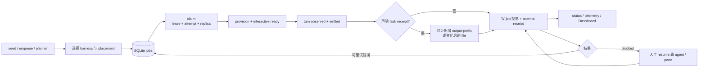

# 跨系统能力
Active contributors: oldwinter, chendongdong

## Purpose

本节按“使用者得到什么能力”组织 Herdr Orchestrator，而不是按 Python 包拆页。普通任务从入口到完成会同时经过 CLI、确定性 Coordinator、SQLite durable queue、Herdr runtime 和只读观测面；这里解释这些模块如何共同提供持久执行、收据、恢复、拓扑派发、harness readiness 与可观测性。

系统内部结构请配合阅读[系统总览](../systems/index.md)；领域值对象请从[核心原语](../primitives/index.md)进入。

## 布局

| 能力页 | 主要问题 | 关键边界 | 相关系统页 |
| --- | --- | --- | --- |
| [Durable execution](durable-execution.md) | Coordinator 重启、lease 过期或 provider 瞬态失败后，任务如何有界继续 | SQLite 是 job 状态真源；Herdr 不推进 durable 状态 | [Coordinator 与 durable queue](../systems/coordinator-and-queue.md) |
| [任务收据与恢复](receipts-and-recovery.md) | 如何区分 agent 停稳与任务机器契约完成，如何 retry / resume | `agent_settled` 与 `task_verified` 分离；blocked 只经人工 resume | [Herdr runtime](../systems/herdr-runtime.md) |
| [拓扑感知派发](topology-aware-dispatch.md) | 任务应在 pane、tab 还是 worktree 中运行 | Harness 决定“谁做”，placement 决定“在哪里做” | [Coordinator 与 durable queue](../systems/coordinator-and-queue.md) |
| [Harness readiness 与自动化](harness-readiness-and-automation.md) | 如何证明六种 CLI 已 ready、观察到真实 turn 并稳定结束 | 启动参数固定在 control plane；认证、secret 和未知阻塞不自动回答 | [Herdr runtime](../systems/herdr-runtime.md) |
| [可观测性与 Attention](observability-and-attention.md) | 如何关联 job、attempt、receipt、telemetry 与 runtime drift | 观测为本地、只读、best-effort 旁路，不改变 queue/lease | [本地 Dashboard](../systems/dashboard.md) |

显式的[标准化交付](../systems/standardized-delivery.md)使用独立阶段状态机和 artifact 协议；它不是普通 durable queue 的隐式升级路径。

## 一次任务的能力组合

这条链路的证据逐层增强：进程存在不等于 interactive ready，ready 不等于观察到新 turn，`idle` / `done` 不等于任务正确；声明过 task receipt 时，只有当前 turn 的验证证据才能令 `task_verified=true`。

## 关键抽象

| 抽象 | 责任 | 完整路径（仓库根目录相对） |
| --- | --- | --- |
| `Coordinator` | 编排 enqueue、placement、claim、并发 wave、drain、resume 与 GC | `src/herdr_orchestrator/runner.py` |
| `Store` | 保存 job 当前投影、lease、attempt、dedupe 与追加式 receipt | `src/herdr_orchestrator/store.py` |
| `HerdrTransport` | 建立/复用 agent，证明 readiness、turn、settlement 与 task receipt | `src/herdr_orchestrator/herdr.py` |
| `JobState` / `TaskReceipt` / `DispatchOutcome` | 定义跨模块传递的 durable 与 runtime 事实 | `src/herdr_orchestrator/model.py` |
| `HerdrLayout` | Provision pane、tab、原生 worktree 并返回真实 ID | `src/herdr_orchestrator/herdr_layout.py` |
| `Observability` / Dashboard projector | 发出脱敏事件并只读关联 durable/runtime 投影 | `src/herdr_orchestrator/observability.py`、`src/herdr_orchestrator/dashboard.py` |

Job、attempt 与 receipt 的字段级关系见[任务与收据](../primitives/jobs-and-receipts.md)，placement 见[Placement 与 worktree](../primitives/placement-and-worktrees.md)。

## 集成

- `workflows/multi-harness.toml` 提供 coordinator policy、workers、replicas、placement 和 planner；字段契约见 `docs/workflow-schema.md`。
- `src/herdr_orchestrator/cli.py` 把 `enqueue`、`run-once`、`run-until-idle`、`retry`、`resume`、`gc`、`status` 和 `doctor` 映射到上述抽象。
- `src/herdr_orchestrator/protocol.py` 负责固定 argv 与 JSON 边界；planner/worker 不得提交 shell command 来推进控制面。
- `docs/architecture.md` 是 queue、topology、恢复和 Herdr adapter 语义总览；`docs/runtime-troubleshooting.md` 给出现场证据层级与错误码。
- Dashboard 只读数据库与 Herdr 白名单字段；Dashboard 中断不会改变 job、lease、attempt 或 receipt。

## 修改入口

| 想修改的能力 | 首选入口 | 必须同步验证 |
| --- | --- | --- |
| Queue 状态、lease、attempt、dedupe、retry | `src/herdr_orchestrator/store.py` | migration、`tests/test_store.py`、`tests/test_runner.py` |
| Wave、drain deadline、blocked resume、GC | `src/herdr_orchestrator/runner.py` | worker-pool/global idle 区分、所有权约束 |
| Readiness、turn、fatal signal、task receipt | `src/herdr_orchestrator/herdr.py` | `tests/test_herdr.py`、运行诊断错误码 |
| Pane/tab/worktree 选择与 provision | `src/herdr_orchestrator/topology.py`、`src/herdr_orchestrator/herdr_layout.py` | `tests/test_topology.py`、`tests/test_herdr_layout.py` |
| CLI 用户契约 | `src/herdr_orchestrator/cli.py` | 自动化 JSON、稳定错误原因、`tests/test_cli.py` |
| 观测/Attention 投影 | `src/herdr_orchestrator/observability.py`、`src/herdr_orchestrator/dashboard.py` | 脱敏、只读边界、Dashboard 测试 |

## Key source files

- `src/herdr_orchestrator/runner.py`
- `src/herdr_orchestrator/store.py`
- `src/herdr_orchestrator/herdr.py`
- `src/herdr_orchestrator/model.py`
- `src/herdr_orchestrator/herdr_layout.py`
- `src/herdr_orchestrator/topology.py`
- `src/herdr_orchestrator/observability.py`
- `src/herdr_orchestrator/cli.py`
- `docs/architecture.md`
- `docs/runtime-troubleshooting.md`
