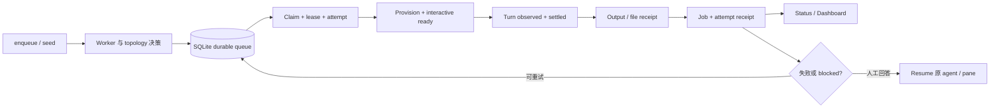

# 跨系统能力
Active contributors: oldwinter, chendongdong

Herdr Orchestrator 的能力通常不属于单一模块：CLI 接收契约，Coordinator 决定状态推进，SQLite 保存 durable 事实，Herdr adapter 证明真实 turn，Dashboard 或交付协议再投影这些事实。本节按“用户能获得什么”组织这些跨系统能力，而不是重复各模块的内部实现。

## 能力地图

| 能力 | 解决的问题 | 主要边界 |
| --- | --- | --- |
| [Durable execution](durable-execution.md) | Coordinator 重启、lease 过期或 provider 瞬态失败后，任务仍可有界继续 | SQLite queue 是状态真源；模型不推进 job 状态 |
| [任务收据与恢复](receipts-and-recovery.md) | 区分“agent 停下了”和“机器契约已完成”，并保留每次 attempt 的证据 | `agent_settled` 与 `task_verified` 分开；旧输出和旧文件不能充当新证据 |
| [拓扑感知派发](topology-aware-dispatch.md) | 在共享 pane、独立 tab 和原生 worktree 之间确定性选择执行位置 | Harness 决定“谁做”，placement 决定“在哪里做” |
| [Harness readiness 与自动化](harness-readiness-and-automation.md) | 证明六种 CLI 真正可接收并完成 turn，同时减少无意义的本地确认 | 自动化 flag 固定在 control plane；认证、secret 和未知阻塞不自动回答 |
| [可观测性与 Attention](observability-and-attention.md) | 用 correlation ID 关联 job、receipt、telemetry 与 runtime drift，并把异常投影为可处理的 Attention | 本地优先、best-effort、只读旁路；观测失败不改变 queue 或 lease |
| [Opt-in 标准化交付](../systems/standardized-delivery.md) | 把清晰目标推进为 spec、ticket DAG、隔离实现、双轴 review 和有界 repair | 仅显式触发；成功停在隔离 integration branch，不自动 push、merge 或 deploy |

## 一次普通任务如何穿过这些能力

关键原则是“证据逐层增加”：进程存在不等于 interactive ready，ready 不等于已观察到新 turn，settled 不等于任务内容正确。只有声明过 task receipt 且本 turn 验证成功时，`task_verified=true`。

## 关键抽象与源文件

| 抽象 | 完整路径 | 责任 |
| --- | --- | --- |
| `Coordinator` | `src/herdr_orchestrator/runner.py` | 组合路由、topology、claim、并发 dispatch、恢复和 GC |
| `Store` | `src/herdr_orchestrator/store.py` | 持久化 job、lease、attempt、placement 和 receipt |
| `HerdrTransport` | `src/herdr_orchestrator/herdr.py` | Provision、readiness、turn acceptance、settlement、fatal signal 与 task receipt |
| `HerdrLayout` | `src/herdr_orchestrator/herdr_layout.py` | 创建或恢复 pane、tab 和原生 worktree |
| Topology policy | `src/herdr_orchestrator/topology.py` | 静态规则、受限 controller JSON 和可见 label |
| CLI surface | `src/herdr_orchestrator/cli.py` | `doctor`、`smoke`、`enqueue`、`run`、`retry`、`resume`、`gc` |

## 集成点

- Workflow 配置从 `workflows/multi-harness.toml` 进入 `Coordinator`；更改字段前先看 `docs/workflow-schema.md`。
- 共享领域枚举和 dataclass 位于 `src/herdr_orchestrator/model.py`。跨模块增加状态、placement 或 receipt kind 时，应先更新这里，再更新 store migration、CLI 和测试。
- Herdr 命令必须通过 `src/herdr_orchestrator/protocol.py` 的 argv/JSON 协议调用，不能让 planner 输出 shell command。
- 运行时证据层次、常见错误和人工诊断顺序记录在 `docs/runtime-troubleshooting.md`。

## 修改入口

| 要修改的行为 | 首选入口 | 必须联动检查 |
| --- | --- | --- |
| Queue 状态或恢复规则 | `src/herdr_orchestrator/store.py` | schema migration、`tests/test_store.py`、`tests/test_runner.py` |
| Turn/readiness/receipt 证据 | `src/herdr_orchestrator/herdr.py` | `tests/test_herdr.py`、`tests/test_harness_automation.py` |
| Pane/tab/worktree 布局 | `src/herdr_orchestrator/herdr_layout.py` | `tests/test_herdr_layout.py`、GC 所有权规则 |
| Topology 选择优先级 | `src/herdr_orchestrator/topology.py` | `tests/test_topology.py`、`tests/test_runner.py` |
| 用户命令或诊断分类 | `src/herdr_orchestrator/cli.py` | `tests/test_cli.py`、生成的 CLI reference |
