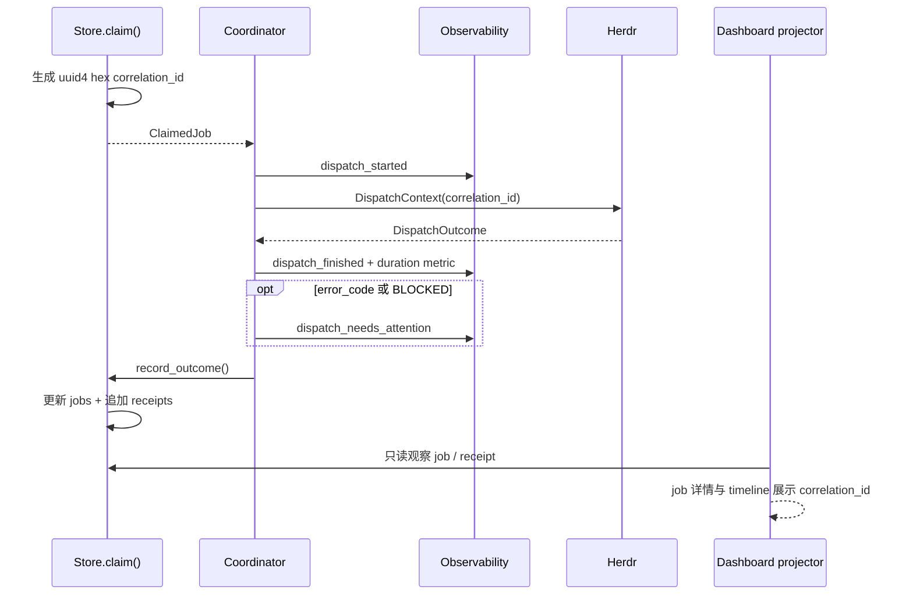
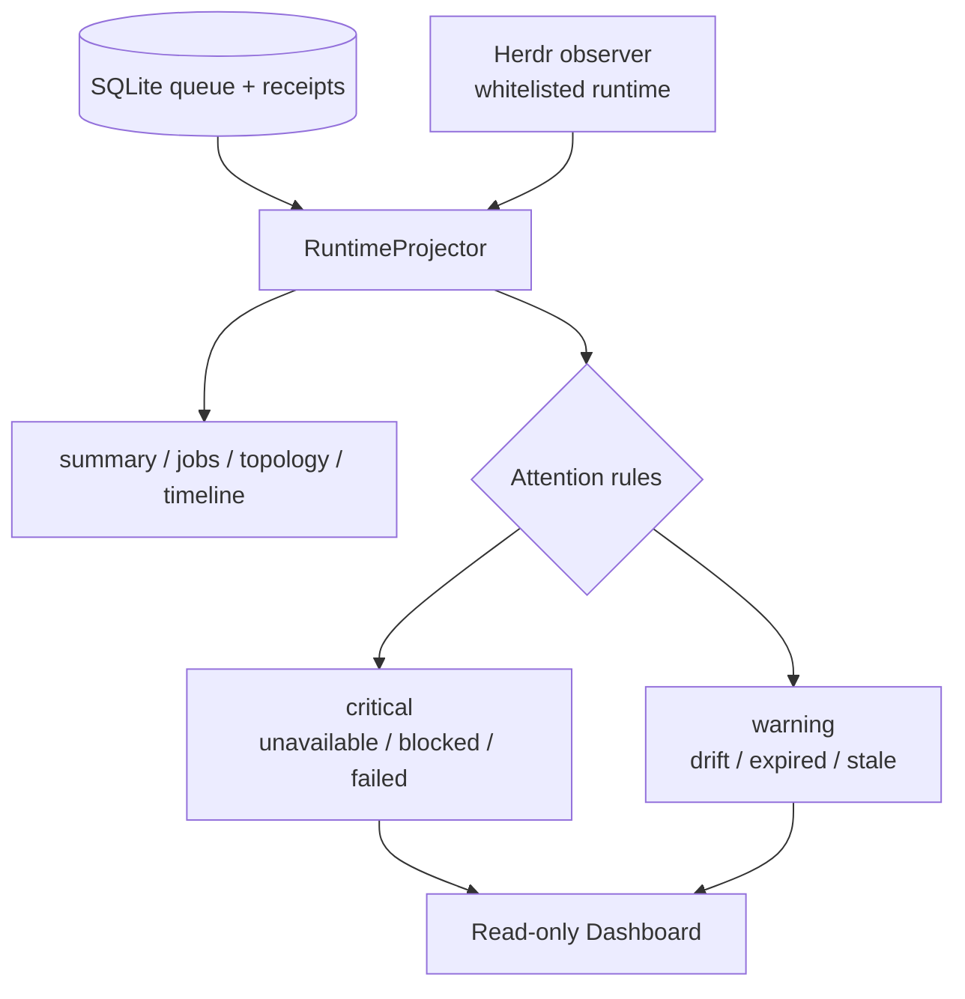

# 可观测性与 Attention
Active contributors: oldwinter, chendongdong

Active contributors: oldwinter, chendongdong

本系统采用 local-first、best-effort 的可观测性：每次 dispatch attempt 用 correlation ID 串起 durable job、receipt、结构化 JSONL 和 Dashboard timeline；网络 exporter 全部默认关闭。Dashboard 的 Attention 则把 queue 状态、Herdr 运行时和两者之间的 drift 投影成人可处理的告警项，不修改 queue。

相关页面：[Durable execution](durable-execution.md) · [Coordinator 与队列](../systems/coordinator-and-queue.md) · [Dashboard](../systems/dashboard.md) · [安全边界](../security.md)

## Correlation ID：以 attempt 为单位的关联键

`Store.claim()` 为每个新 attempt 生成随机 `uuid4().hex`。coordinator 把它放入 `DispatchContext`，并强制写回 `DispatchOutcome`；store 随后同时更新 job 当前投影并追加 receipt。lease 过期后重新 claim 会得到新的 correlation ID，因此排障时应使用“job ID + attempt + correlation ID”，不能只按 job ID 合并多个执行。

Dashboard 的 job 投影保留当前 correlation ID，receipt timeline 保留各 attempt 的 correlation ID。它们与 `events.jsonl`、`metrics.jsonl`、`alerts.jsonl` 的顶层 `correlation_id` 一致，可在不复制 prompt 或终端输出的情况下完成关联。

## 本地 events、metrics 与 alerts

默认 `Coordinator` 将 telemetry root 构造为 `config.state_db.parent / "telemetry"`。当前 workflow 的 state DB 是 `.orchestrator/state.db`，因此实现上的默认文件是：

| 完整路径 | 内容 | 触发点 |
| --- | --- | --- |
| `.orchestrator/telemetry/events.jsonl` | dispatch 生命周期与有界字段 | `dispatch_started`、`dispatch_finished` |
| `.orchestrator/telemetry/metrics.jsonl` | 数值测量 | `dispatch_duration_seconds` |
| `.orchestrator/telemetry/alerts.jsonl` | 需要关注的 dispatch 信号 | outcome 有 `error_code` 或 agent 为 `BLOCKED` 时的 `dispatch_needs_attention` |

每行都是独立 JSON，公共字段为 `schema_version`、`workflow`、`event`、`observed_at` 和 `correlation_id`。本地目录创建或 append 的 `OSError` 会被吞掉，网络请求也有界且失败静默，因此 telemetry 存储/网络不可用不会阻断正常 outcome 记录。指标目前只写本地，不发送给三个可选 exporter。

注意：dispatch alert 在 `Store.record_outcome()` 之前产生；由 durable receipt 校验阶段才生成的错误（例如 `task_receipt_missing`）主要通过 job 状态和 Dashboard Attention 暴露，而不一定出现在该 attempt 的 `alerts.jsonl`。

## Sanitization 与数据边界

所有自定义 telemetry `fields` 在建 payload 时进入中央 `sanitize()`；外发前整个 payload 再清洗一次。规则包括：

- key 匹配 `authorization`、`cookie`、`credential`、`password`、`prompt`、`secret`、`session`、`terminal` 或 `token` 时，值直接替换为 `[REDACTED]`；
- 文本中的常见 GitHub/OpenAI/Bearer token 形状，以及 `authorization/password/secret/token = ...` 赋值形状会被擦除；
- 空白归一化，字符串最多 300 个字符；
- mapping、list 和 tuple 递归处理；布尔、数字与 `null` 保持类型；
- store 写入 `error_summary` 前复用相同 sanitizer，避免未约束错误文本进入 job/receipt 与 Dashboard。

prompt 和完整终端输出不是 telemetry 字段；Dashboard 的 SQLite observer 也使用白名单查询，测试明确验证不会读取 `jobs.prompt`。Herdr observer 同样只投影 workspace/tab/pane/agent/worktree 的允许字段，过滤 terminal title、terminal ID 和未知 secret 字段。操作者仍不得主动把姓名、邮箱、IP、凭证或其他 PII 添加到 event fields。

`anonymous_install_id()` 是对传入目录 resolved path 的 SHA-256 前 16 位摘要；默认 exporter 使用 telemetry root 的父目录（即 `.orchestrator`）生成此 ID。它用于 Sentry/PostHog 的匿名关联，不替代 attempt correlation ID，也不应被理解为跨 workspace 的用户身份。

## 三个默认关闭的 exporter

feature flag 是 typed `FeatureFlag`，环境变量未设置时默认为 `false`；只接受 `1/true/yes/on`、`0/false/no/off` 和空值，其他拼写抛出稳定的 `feature_flag_invalid`。不要把真实凭证写入仓库中的 `.env.example`。

| Exporter | 默认关闭 flag | 额外配置 | 输出与限制 |
| --- | --- | --- | --- |
| Sentry | `HERDR_FEATURE_SENTRY_EXPORT=false` | `SENTRY_DSN`，可选 `HERDR_RELEASE` | 仅 events；DSN 必须匹配 HTTPS 格式；增加匿名 install ID、release、error level |
| PostHog | `HERDR_FEATURE_POSTHOG_ANALYTICS=false` | `POSTHOG_API_KEY`，可选 HTTPS `POSTHOG_HOST` | 仅 events；distinct ID 为匿名 install ID；缺 key 或非 HTTPS host 时不发送 |
| Webhook alerts | `HERDR_FEATURE_WEBHOOK_ALERTS=false` | HTTPS `HERDR_ALERT_WEBHOOK_URL` | 仅 alerts；缺 URL 或非 HTTPS 时不发送 |

三个出口都调用标准库 `urllib`，POST JSON，timeout 为 2 秒，并在 `OSError` 时返回。flag 打开但 credential/endpoint 缺失或格式不安全时不发送；测试覆盖了 HTTPS、sanitized payload 和 fail-closed 行为。非法布尔值会直接抛出 `FeatureFlagError`，因此启用前应先校验环境配置，而不是依赖运行时忽略拼写错误。

feature flag 的生命周期规则在 `docs/feature-flags.md`：每个 flag 必须有 owner/purpose、生产消费者、fail-closed 测试、`.env.example` 配置和退出条件；退休时需要在代码、测试、示例和文档中同批删除。`scripts/check_feature_flags.py` 负责检查漂移。

## Dashboard Attention

`RuntimeProjector.snapshot()` 合并两个只读观察源：

1. SQLite queue：job 当前状态、receipt timeline、lease、verification 和 correlation ID；
2. Herdr runtime：限定 workspace 内的 workspace/tab/pane/agent/worktree topology 与 source health。

Attention 是从快照即时计算的投影，不是 `alerts.jsonl` 的镜像，也不写回 queue：

| Severity | Code | 条件 |
| --- | --- | --- |
| critical | `herdr_unavailable` | Herdr observer health 非 `ok` |
| critical | `job_blocked` | durable job 为 `blocked` |
| critical | `job_failed` | durable job 为 `failed` |
| warning | `running_agent_missing` | job 为 `running`，但找不到同名 runtime agent |
| warning | `terminal_job_agent_working` | job 已 `succeeded`/`blocked`/`failed`，agent 却仍为 `working` |
| warning | `workspace_mismatch` | receipt/job 中的 Herdr workspace 与 runtime agent 不一致 |
| warning | `lease_expired` | job 仍为 `running`，但 `lease_until <= generated_at` |
| warning | `job_stale` | `running` job 超过 5 分钟没有 durable state 变化 |

同一 job 可以同时产生多个 attention item，例如缺 agent、lease 过期且 stale。`summary.needs_attention` 是 item 数，不是去重后的 job 数；`summary.active_agents` 统计 `working`/`blocked` runtime agents。timeline 按时间倒序，最多投影 100 条 enqueued/receipt 事件。更完整的 UI、SSE 和 loopback-only 访问语义见 [Dashboard](../systems/dashboard.md)。

## Alert runbook

1. 从 Attention 或 `alerts.jsonl` 记录 `job_id`、attempt 和 correlation ID；不要复制完整终端输出。
2. 运行 `just status`，确认 durable job 状态、attempt、稳定 `error_code`、`agent_settled` 与 `task_verified`。
3. 在 Dashboard 对照 queue 与 Herdr runtime：检查 agent/pane/workspace 是否缺失、lease 是否过期、是否有 terminal/runtime drift。
4. 按 `docs/runtime-troubleshooting.md` 分类稳定错误码。依赖或源代码 finding 还应查看 CI quality artifact，并用 `just security` 本地复现。
5. 如果怀疑 exporter 泄露或异常，立即把全部 `HERDR_FEATURE_*` 设为 `false`；在所属服务轮换已暴露 credential，按本机保留策略处理 runtime JSONL，只保存 sanitized evidence。
6. `blocked` 任务需要人工判断后，通过显式 response file 恢复同一 agent/pane；`failed` 任务只有在根因处理后才增加 attempt 预算。执行语义见 [Durable execution](durable-execution.md)。
7. 添加聚焦回归测试并运行 `just check`；只有默认分支恢复绿色后才关闭 insight/incident。系统不会自动部署生产。npm 已发布版本不可变，应修复后发布新版本，必要时 deprecate 受影响版本。

## 关键抽象与源文件

| 抽象 / 契约 | 完整路径 | 作用 |
| --- | --- | --- |
| `Observability` / `sanitize` | `src/herdr_orchestrator/observability.py` | JSONL、payload schema、清洗、三个 exporter |
| `FeatureFlag` / `enabled` | `src/herdr_orchestrator/feature_flags.py` | typed flag、环境变量映射和严格布尔解析 |
| dispatch instrumentation | `src/herdr_orchestrator/runner.py` | attempt 事件、duration metric、dispatch alert 与 correlation 传递 |
| durable correlation | `src/herdr_orchestrator/store.py` | claim 生成 ID，job/receipt 持久化，错误摘要清洗 |
| `RuntimeProjector` | `src/herdr_orchestrator/dashboard/projector.py` | summary、drift、Attention、topology 和 timeline |
| operator 配置模板 | `.env.example` | 三个默认关闭 flag 与 exporter 配置项 |
| observability 运维文档 | `docs/observability.md` | 数据处理、exporter 和 incident runbook |
| flag 生命周期 | `docs/feature-flags.md` | owner、review/exit 条件和删除规则 |
| telemetry/flag 测试 | `tests/test_observability.py` | redaction、correlation、HTTPS 与 fail-closed |
| Dashboard 测试 | `tests/test_dashboard.py` | prompt 不读取、字段白名单、drift、Attention 和 server 边界 |

## 集成点与修改入口

| 想修改的行为 | 首要入口 | 必须同步 |
| --- | --- | --- |
| 新 event/metric/alert 或 payload 字段 | `src/herdr_orchestrator/runner.py` 与 `src/herdr_orchestrator/observability.py` | sanitizer 测试、schema_version 兼容性、禁止 prompt/terminal |
| 新敏感 key/token 规则 | `src/herdr_orchestrator/observability.py` | 嵌套数据与外发 payload 回归测试，误报/漏报评估 |
| 新 exporter | `src/herdr_orchestrator/feature_flags.py` | `.env.example`、`docs/observability.md`、`docs/feature-flags.md`、check script 和 fail-closed 测试 |
| correlation ID 生命周期 | `src/herdr_orchestrator/store.py` | schema migration、job/receipt/timeline、retry 与 resume 语义 |
| Attention/drift 规则 | `src/herdr_orchestrator/dashboard/projector.py` | `tests/test_dashboard.py`、severity/code 稳定性和 UI 展示 |
| Dashboard 可见字段 | Dashboard observer 与 projector | 白名单、安全审查及 [安全边界](../security.md)；绝不加入 prompt 或完整 terminal data |

扩展任何外发能力时，应保持 opt-in、HTTPS、短 timeout、sanitized payload 和无 credential 配置即不发送；修改完成后运行最小相关 unittest，并在收口前运行 `just check`。
