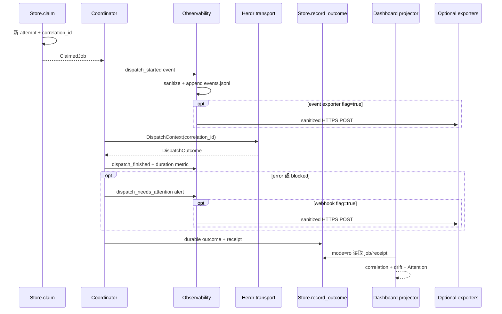
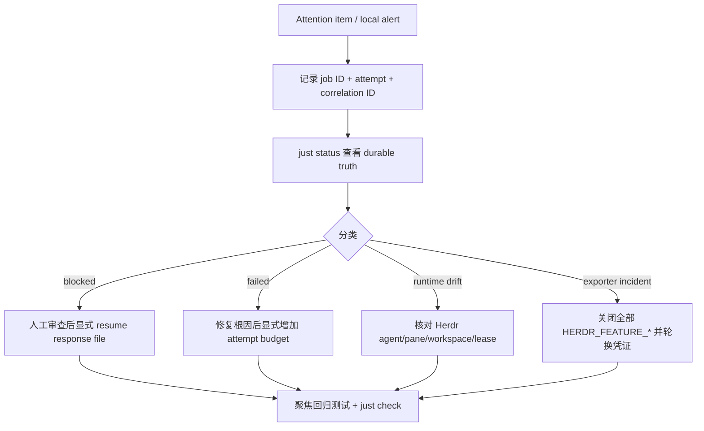

# 可观测性与 Attention
Active contributors: oldwinter, chendongdong

## Purpose

Herdr Orchestrator 的可观测性是 **local-first、best-effort、中央脱敏** 的。每个 dispatch attempt 使用 correlation ID 关联 durable job、attempt receipt、本地 JSONL 与 Dashboard timeline；Dashboard Attention 再把 queue 状态、Herdr lifecycle 和二者的 drift 投影为需要人工判断的条目。

本地记录默认开启，但写入失败不会改变 queue outcome。Sentry、PostHog 与 HTTPS webhook 都由 typed feature flag 控制并默认关闭；没有显式启用和安全配置时不会外发。Attention 也是只读计算结果，不自动 retry、resume、关闭 pane 或修改 durable state。

## 布局

```text
src/herdr_orchestrator/
├── observability.py                    # payload、sanitize、JSONL 与可选 exporter
├── feature_flags.py                    # typed flags、env 映射、严格布尔解析
├── runner.py                           # dispatch event/metric/alert 埋点
├── store.py                            # correlation 持久化与 error_summary 清洗
└── dashboard/
    ├── observer.py                     # queue/Herdr 白名单观察
    └── projector.py                    # runtime drift 与 Attention 投影

.env.example                            # 默认 false 的 exporter 配置模板
docs/observability.md                   # 数据处理、exporter 与 incident runbook
docs/feature-flags.md                   # flag owner、review 与退出条件
scripts/check_feature_flags.py          # 声明/消费者/文档/测试一致性检查
tests/test_observability.py             # 脱敏、JSONL、HTTPS 与 fail-closed
tests/test_dashboard.py                 # correlation、drift、Attention 与白名单
```

运行态默认位于 `WorkflowConfig.state_db` 同级的 `telemetry/`。默认 workflow 使用 `.orchestrator/state.db`，因此当前 Coordinator 实现写入：

```text
.orchestrator/telemetry/events.jsonl
.orchestrator/telemetry/metrics.jsonl
.orchestrator/telemetry/alerts.jsonl
```

这些是 Git 忽略的本地运行数据，仍应按操作者文件系统的保留和删除策略保护。

## 关键抽象

### Correlation ID：attempt 级关联键

`src/herdr_orchestrator/store.py` 在每次 claim 时生成新的随机 correlation ID，并保存到当前 job；dispatch outcome 与 append-only receipt 继承它。lease reclaim/retry 的下一次 attempt 会获得新 ID，blocked resume 则继续原 attempt 的关联语义。

排障应使用 `job_id + attempt + correlation_id`：仅用 job ID 会混淆多次尝试，仅用 SSE event ID 又无法跨 Dashboard 重启。Dashboard job 展示当前 correlation，receipt timeline 保留各 receipt 的 correlation；本地 telemetry 也把 correlation 放在 payload 顶层。

### `Observability`：三个本地信号通道

`src/herdr_orchestrator/observability.py` 的 `Observability` 提供三个方法：

| 方法 | 本地文件 | 当前 Coordinator 触发 |
| --- | --- | --- |
| `event(name, ...)` | `events.jsonl` | `dispatch_started`、`dispatch_finished` |
| `metric(name, value, ...)` | `metrics.jsonl` | `dispatch_duration_seconds` |
| `alert(name, ...)` | `alerts.jsonl` | outcome 有 `error_code` 或 agent 为 blocked 时的 `dispatch_needs_attention` |

公共 payload 固定包含 `schema_version: 1`、`workflow`、`event`、`observed_at`、`correlation_id`，可选 `fields`；metric 另有 numeric `value`。目录创建/append 发生 `OSError` 时直接返回，网络 exporter 也以 2 秒 timeout 和 `OSError` 吞吐保持 fail-soft。

当前 metric 只本地落盘；Sentry/PostHog 只消费 event，webhook 只消费 alert。dispatch alert 在 `Store.record_outcome()` 之前产生，因此 durable receipt 校验阶段才出现的错误（如 task receipt 无效）主要通过 job/receipt 与 Dashboard Attention 暴露，不保证出现在 `alerts.jsonl`。

### `sanitize()`：中央数据最小化

所有 `fields` 在 payload 构造时清洗，所有网络 POST payload 在发送前再次整体清洗：

- key 命中 `authorization|cookie|credential|password|prompt|secret|session|terminal|token` 时，值替换为 `[REDACTED]`；
- 清除常见 GitHub/OpenAI/Bearer token 形状；
- 清除文本中的 `authorization/password/secret/token: value` 或 `= value`；
- 递归处理 mapping、list 和 tuple；
- 字符串归一空白并截断到 300 字符；数字、布尔和 `null` 保持类型；
- `src/herdr_orchestrator/store.py` 在持久化 `error_summary` 前复用同一 sanitizer。

prompt 和完整 terminal output 不是 telemetry 字段；Dashboard 的 SQLite/Herdr observers 也分别从查询和字段白名单层排除它们。Sanitizer 是事故缓解而不是通用 DLP：姓名、邮箱、IP 或未知 secret 格式不一定被识别，因此调用者不得主动把 PII/secret 放进 fields、title、dedupe key 或路径。

### Anonymous install ID

`anonymous_install_id()` 对 resolved workspace path 做 SHA-256，并只取前 16 个十六进制字符。Exporter 以 telemetry root 的父目录生成该值：Sentry 使用 `install_id`，PostHog 使用 `distinct_id`。它是工作区级的单向关联值，不是用户身份，也不替代 attempt correlation ID。

### Typed feature flags

`src/herdr_orchestrator/feature_flags.py` 只声明三个 `FeatureFlag`：

| 枚举值 | 环境变量 | 默认 |
| --- | --- | --- |
| `sentry_export` | `HERDR_FEATURE_SENTRY_EXPORT` | `false` |
| `posthog_analytics` | `HERDR_FEATURE_POSTHOG_ANALYTICS` | `false` |
| `webhook_alerts` | `HERDR_FEATURE_WEBHOOK_ALERTS` | `false` |

解析接受 `1/true/yes/on` 与 `0/false/no/off/空值`（忽略大小写与首尾空白）。其他值抛出稳定 `feature_flag_invalid: <ENV>`，而不是猜测启用状态。I/O/网络失败是 fail-soft；非法 flag 则是应先修复的显式配置错误。

`docs/feature-flags.md` 还要求每个 flag 有 owner/purpose、生产消费者、fail-closed test、`.env.example` 配置和退出条件；退休必须同时删除代码、测试、示例和文档。

### Dashboard Attention

`src/herdr_orchestrator/dashboard/projector.py` 每次 snapshot 都即时计算 Attention。它不是 `alerts.jsonl` 的回放：前者关联当前 durable/runtime 事实，后者记录 dispatch 时刻的 observability alert。

| Severity | Code | 条件 |
| --- | --- | --- |
| critical | `herdr_unavailable` | Herdr observation health 非 `ok` |
| critical | `job_blocked` | durable job 为 `blocked` |
| critical | `job_failed` | durable job 为 `failed` |
| warning | `running_agent_missing` | running job 找不到同名 runtime agent |
| warning | `terminal_job_agent_working` | terminal job 对应 agent 仍为 `working` |
| warning | `workspace_mismatch` | durable workspace 与 runtime agent workspace 不一致 |
| warning | `lease_expired` | running job 的 `lease_until <= generated_at` |
| warning | `job_stale` | running job 超过 300 秒无 durable state change |

同一 job 可同时产生多个 item；`summary.needs_attention` 是 item 数而非去重 job 数。`summary.active_agents` 则统计 runtime 中 `working|blocked` 的 agent。

## 工作原理



本地信号、可选外发和 Dashboard 都不拥有状态推进权；只有 Store/Coordinator 根据 settlement、receipt、attempt 与 lease 更新 durable state。

## Exporter 行为

| Exporter | 启用条件 | 配置与 fail-closed 条件 | 发送内容 |
| --- | --- | --- | --- |
| Sentry | `HERDR_FEATURE_SENTRY_EXPORT=true` | `SENTRY_DSN` 必须符合 HTTPS DSN；可选 `HERDR_RELEASE` | event payload + anonymous install ID、`level=error`、platform/release |
| PostHog | `HERDR_FEATURE_POSTHOG_ANALYTICS=true` | `POSTHOG_API_KEY` 非空，`POSTHOG_HOST` 必须 HTTPS；默认 host 为 `https://us.i.posthog.com` | event name + workflow/fields properties + anonymous distinct ID |
| Webhook | `HERDR_FEATURE_WEBHOOK_ALERTS=true` | `HERDR_ALERT_WEBHOOK_URL` 必须以 `https://` 开头 | alert payload |

所有请求使用标准库 `urllib.request`、JSON content type、2 秒 timeout。缺 credential、DSN/host 格式不合法或 endpoint 非 HTTPS时不发送。真实值不得提交到 `.env.example` 或任何仓库文件。

## Attention 处理流程



不要把完整 prompt 或 terminal transcript 复制到 incident 记录。优先使用稳定 error code、job/attempt/correlation、已清洗摘要与 durable receipt；运行时错误分类参见 `docs/runtime-troubleshooting.md`。

## 集成点

| 上下游 | 接口 | 约束 |
| --- | --- | --- |
| `src/herdr_orchestrator/runner.py` | `Observability.event/metric/alert` | 每个 dispatch attempt 传同一 correlation；telemetry 不决定 outcome |
| `src/herdr_orchestrator/store.py` | job/receipt correlation 与 `error_summary` | durable truth；写入前清洗；retry 生成新 attempt correlation |
| `src/herdr_orchestrator/dashboard/observer.py` | 只读 SQLite/Herdr observations | 不读取 prompt/terminal output；只取白名单字段 |
| `src/herdr_orchestrator/dashboard/projector.py` | current-state Attention 和 timeline | 不读取 JSONL、不写 queue；Attention code 应保持稳定 |
| `.env.example` | flag 与 endpoint/key 占位 | 只保存空值/默认 false，不保存真实 secret |
| `docs/feature-flags.md` | flag lifecycle contract | 新增/退休 flag 必须同步代码、测试、示例和文档 |
| `scripts/check_feature_flags.py` | 静态一致性检查 | 防止声明、生产消费者、测试和文档漂移 |

## 修改入口

| 目标 | 首要修改入口 | 必须同步 |
| --- | --- | --- |
| 新 event/metric/alert | `src/herdr_orchestrator/runner.py`、`src/herdr_orchestrator/observability.py` | payload 最小化、correlation、schema 兼容与 `tests/test_observability.py` |
| 新敏感 key/token 规则 | `src/herdr_orchestrator/observability.py` | nested/scalar/token 正反例，评估误报与漏报 |
| 新 exporter | `src/herdr_orchestrator/observability.py`、`src/herdr_orchestrator/feature_flags.py` | 默认关闭、HTTPS、2 秒 timeout、全 payload 清洗、`.env.example`、两份 docs、check script、fail-closed tests |
| 改 flag 布尔语义 | `src/herdr_orchestrator/feature_flags.py` | 保持 typed mapping 和非法值稳定错误；同步 `tests/test_observability.py` |
| 改 correlation lifecycle | `src/herdr_orchestrator/store.py`、`src/herdr_orchestrator/runner.py` | claim/retry/resume、job/receipt/timeline 与 migration 兼容 |
| 改 Attention/drift | `src/herdr_orchestrator/dashboard/projector.py` | severity/code 稳定、计数语义、`tests/test_dashboard.py` 和 UI |
| 改 Dashboard 可见字段 | `src/herdr_orchestrator/dashboard/observer.py`、`src/herdr_orchestrator/dashboard/projector.py` | SQL/Herdr 白名单和安全审查；禁止 prompt、receipt value、terminal output |

## Key source files

| 完整仓库路径 | 阅读重点 |
| --- | --- |
| `src/herdr_orchestrator/observability.py` | `sanitize()`、payload schema、本地 append、anonymous ID 与三个 exporter |
| `src/herdr_orchestrator/feature_flags.py` | `FeatureFlag`、环境变量映射和严格布尔解析 |
| `src/herdr_orchestrator/runner.py` | dispatch instrumentation、duration metric 与 attention alert 触发时序 |
| `src/herdr_orchestrator/store.py` | attempt correlation、job/receipt 持久化与 error summary 清洗 |
| `src/herdr_orchestrator/dashboard/observer.py` | observability 到 Dashboard 之间的读取/字段边界 |
| `src/herdr_orchestrator/dashboard/projector.py` | drift、Attention、summary 与 durable timeline |
| `.env.example` | 三个默认关闭 flag 与 credential/endpoint 占位 |
| `docs/observability.md` | 数据处理、exporter 和 incident runbook |
| `docs/feature-flags.md` | flag owner、review date、exit condition 和退休规则 |
| `scripts/check_feature_flags.py` | feature flag 生命周期一致性 gate |
| `tests/test_observability.py` | default-off、非法值、redaction、本地文件、HTTPS、fail-closed |
| `tests/test_dashboard.py` | correlation 投影、Attention/drift 与敏感字段排除 |

## 交叉链接

- [本地 Dashboard](../systems/dashboard.md)：observer、projector、页面与 loopback-only 安全模型。
- [Dashboard HTTP 与 SSE](../api/dashboard-http-sse.md)：snapshot 中的 jobs、attention、timeline 和 source health。
- [Coordinator 与队列](../systems/coordinator-and-queue.md)：claim、lease、attempt 和 telemetry 触发时序。
- [任务收据与恢复](receipts-and-recovery.md)：settlement、verification、retry 与 blocked resume。
- [安全与信任边界](../security.md)：secret/PII、本地敏感状态和 exporter 风险。
- [API 索引](../api/index.md)：Dashboard API 与 CLI contract 导航。
