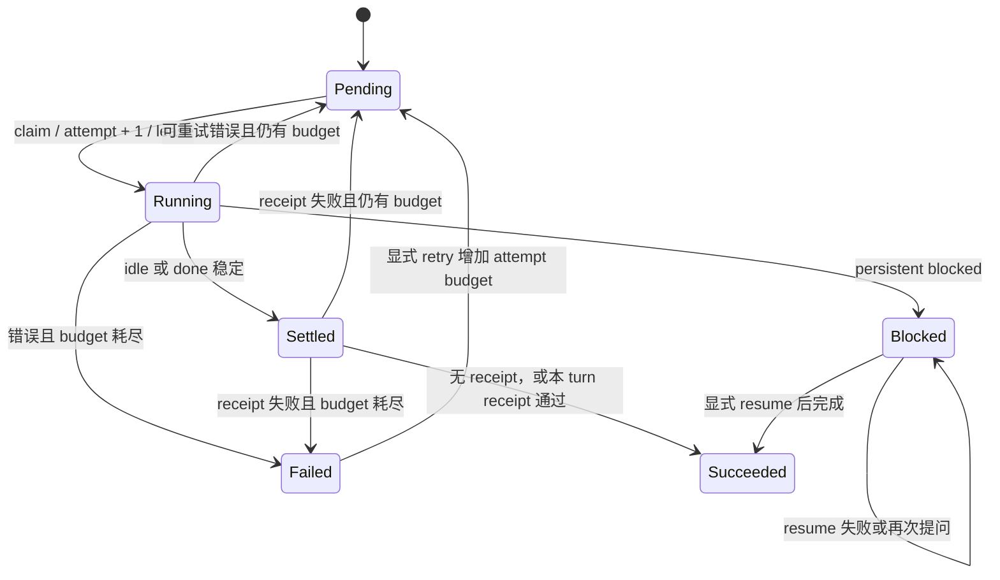

# 任务收据与恢复
Active contributors: oldwinter, chendongdong

任务收据把两类容易混淆的事实分开：

1. **Attempt receipt**：每次 dispatch 或 resume 的持久生命周期记录，回答“这次尝试发生了什么”。
2. **Task receipt**：enqueue 时声明的 output-prefix 或 file 机器契约，回答“当前 turn 是否产生了指定的新证据”。

因此 `idle` / `done` 只会使 `agent_settled=true`；只有声明的 task receipt 通过才会得到 `task_verified=true`。未声明 task receipt 的兼容任务保持 `task_verified=null`。

## 从 settlement 到成功



`src/herdr_orchestrator/herdr.py` 的 `_prompt()` 先读取 `state_change_seq` 基线。提交 prompt 后 sequence 必须前进，否则即使返回 `done` 也会得到 `agent_turn_not_observed`。观察到 `idle` / `done` 后，默认连续 6 次、每次间隔 0.5 秒确认稳定；期间重新进入 `working` 会重置计数。`blocked` 不伪装成 settled success。

## Output receipt：只接受当前 turn 的新增输出

CLI 用 `enqueue --receipt-prefix <PREFIX>` 声明输出收据。验证过程是：

1. Prompt 前从 `recent-unwrapped` 保存有界 output baseline。
2. Turn settled 后再次读取 output。
3. `_lines_after_snapshot()` 先找前后文本的最长首尾重叠；无重叠时用行计数排除旧行。
4. 只在新增行中寻找 exact prefix；允许已知 assistant UI marker，例如 `•`、`●`、`⧬` 后再出现 prefix。

以下情况 fail closed：

| 情况 | 错误码 | 原因 |
| --- | --- | --- |
| Prefix 只存在于旧 turn | `task_receipt_missing` | Freshness 不成立 |
| Prompt 自身有一整行以同一 prefix 开头 | `task_receipt_ambiguous` | 无法证明是 assistant 输出而不是 prompt echo |
| Agent 最终为 `blocked` | `task_verified=false` | Settlement 前不验收 prompt echo |
| 新增输出中找不到 prefix | `task_receipt_missing` | 机器契约未满足 |

“Prompt 提到 prefix”本身不一定歧义；只有 prompt 的独立行也以该 prefix 开头时才拒绝。这样 doctor/smoke 可以在自然语言中说明预期字符串，同时避免把单独回显行当成作者身份的证据。

## File receipt：内容必须在本 turn 新建或改变

CLI 用 `enqueue --receipt-file <RELATIVE_PATH>` 声明文件收据。路径相对于任务 execution root：

- `pane` / `tab`：workflow workspace；
- `worktree`：任务的独立 checkout。

Prompt 前后都记录 `_FileReceiptSnapshot(exists, size, sha256)`。通过条件是文件存在、非空，且 snapshot 与 baseline 不同。已有文件内容未改变会返回 `task_receipt_stale`，不存在返回 `task_receipt_missing`，空文件返回 `task_receipt_invalid`。

路径验证同时拒绝绝对路径、`..`、root 外解析结果和路径链上的 symlink。入口分别位于：

- CLI 早期验证：`src/herdr_orchestrator/cli.py::_task_receipt_from_args`
- Execution-root 验证：`src/herdr_orchestrator/herdr.py::_receipt_file_path`
- Freshness 验证：`src/herdr_orchestrator/herdr.py::_verify_task_receipt`

## Attempt receipt 与 durable 记录

`src/herdr_orchestrator/store.py` 的 `receipts` 表按 append-only 方式保留每次观察。关键字段包括：

| 字段 | 含义 |
| --- | --- |
| `attempt` | 本次 claim 的 attempt；retry/lease reclaim 会增加，resume 不增加 |
| `state` / `agent_state` | Queue 结果与 Herdr lifecycle 结果 |
| `agent_name` / `pane_id` / `member_reused` | Agent 身份、所在 pane 和是否复用 |
| `placement` / `execution_path` / `herdr_workspace_id` | 执行拓扑证据 |
| `agent_settled` / `task_verified` | 生命周期完成与机器验收两个独立事实 |
| `error_code` / `error_summary` | 稳定分类和有界、清洗后的诊断摘要 |
| `correlation_id` | 关联该 dispatch attempt 的 job、receipt 与本地 telemetry |

`Store.record_outcome()` 在同一个 `BEGIN IMMEDIATE` 事务中更新 job 当前投影并插入 attempt receipt。它要求 job 仍为同一 `running` attempt，否则返回 `job_lease_lost`，避免 stale coordinator 覆盖新结果。后续成功不会删除或覆盖早先的 timeout receipt。

## 自动恢复、retry 与 resume

### Lease 与自动重试

- `pending` job 被 claim 时 attempt 加一并获得 `lease_until`。
- Coordinator 崩溃后，未耗尽 budget 的过期 `running` job 可再次 claim。
- 普通 dispatch 错误在仍有 budget 时回到 `pending`，backoff 为 `min(60, 2 ** (attempt - 1))` 秒。
- 过期 lease 已耗尽 budget 时，job 进入 `failed`，错误码为 `lease_expired`。

任务可能因 lease 回收而重复执行；有副作用的任务仍需用 `dedupe_key` 和外部幂等键保护。

### 显式 retry

`retry --job-id ID --extra-attempts N` 只接受已经 `failed` 的 job，`N` 范围为 1–10。它在原 job ID 和原 `dedupe_key` 上增加 `max_attempts`，清理当前错误投影并回到 `pending`；历史 receipts 保留。`pending`、`running`、`blocked` 或 `succeeded` 都返回 `job_not_retryable`。

### 显式 resume

普通 queue 不自动回答 `blocked`。人工审查后：

```bash
herdr-orchestrator resume \
  --workflow /absolute/path/to/workflow.toml \
  --job-id 42 \
  --response-file /absolute/path/to/response.txt
```

恢复链路由 `src/herdr_orchestrator/runner.py::Coordinator.resume_blocked` 发起：

1. `Store.claim_blocked_for_resume()` 锁定 job 并读取最后一条 receipt 的 pane。
2. 保持原 attempt，验证记录中的 agent、pane、placement 和 execution workspace。
3. `HerdrTransport.respond()` 用 `herdr pane send-text` 写 literal text，再用 agent `enter` 提交；不会重发原任务 prompt，也不会调用普通 `agent prompt`。
4. 等待比 blocked baseline 更大的 lifecycle sequence。
5. 成功进入 `succeeded`；失败、timeout 或再次提问仍保持 `blocked`，并追加同 attempt 的新 receipt。

## 关键抽象与源文件

| 抽象 | 完整路径 | 责任 |
| --- | --- | --- |
| `TaskReceipt`, `ReceiptKind`, `DispatchOutcome` | `src/herdr_orchestrator/model.py` | 声明收据与传递验证结果 |
| `HerdrTransport.dispatch/respond` | `src/herdr_orchestrator/herdr.py` | Baseline、turn、settlement、freshness 和 blocked response |
| `Store.record_outcome` | `src/herdr_orchestrator/store.py` | 状态转换和 attempt receipt 原子持久化 |
| `Store.retry_failed` | `src/herdr_orchestrator/store.py` | 给 failed job 追加有界 attempt budget |
| `Coordinator.resume_blocked` | `src/herdr_orchestrator/runner.py` | 恢复原 agent/pane 并记录结果 |
| CLI `enqueue/retry/resume/status` | `src/herdr_orchestrator/cli.py` | 用户契约与 JSON 输出 |

## 集成点与修改入口

- 新增 receipt kind：先修改 `src/herdr_orchestrator/model.py`，再扩展 `src/herdr_orchestrator/store.py` schema/migration、`herdr.py` baseline/verification 和 `cli.py` 互斥参数。
- 改变成功判定：同时检查 `HerdrTransport.dispatch()` 与 `Store.record_outcome()`；store 会在声明 receipt 却没有 `task_verified=true` 时再次 fail closed。
- 改变 retry/resume：保持 attempt receipt 历史、状态前置条件和原 agent/pane 身份校验。
- 主要回归测试位于 `tests/test_herdr.py`、`tests/test_store.py`、`tests/test_runner.py` 和 `tests/test_cli.py`。
- 运行契约与现场诊断见 `docs/runtime-troubleshooting.md`；状态机总览见 `docs/architecture.md`。
