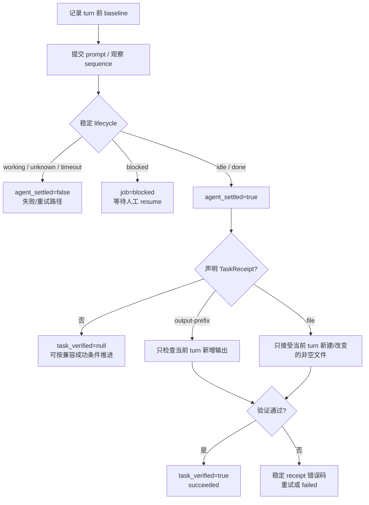

# 任务收据与恢复
Active contributors: oldwinter, chendongdong

## Purpose

任务收据与恢复解决两个问题：如何证明一次 agent turn 真正停稳并满足了机器契约；失败或阻塞后，如何在不丢失历史、不冒充成功的前提下继续。系统刻意区分 runtime lifecycle、durable job state 和任务正确性，避免把 `idle` / `done` 误当成“内容已验证”。

相关页面：[Durable execution](durable-execution.md) · [Herdr runtime](../systems/herdr-runtime.md) · [Coordinator 与 durable queue](../systems/coordinator-and-queue.md) · [任务与收据](../primitives/jobs-and-receipts.md) · [可观测性与 Attention](observability-and-attention.md)

## 布局

系统中有两种普通 queue receipt：

| Receipt | 产生时机 | 回答的问题 | 持久位置 |
| --- | --- | --- | --- |
| **Task receipt** | Enqueue 时可选声明，turn 前后由 transport 验证 | “当前 turn 是否产生了约定的新 output/file 证据？” | 声明保存在 `jobs.receipt_kind/value`，结果保存在 `task_verified` |
| **Attempt receipt** | 每次 dispatch 或 blocked resume 结束时追加 | “这次观测到的 agent/job 状态、错误与执行位置是什么？” | SQLite `receipts` 表 |

两个布尔事实必须分开：

- `agent_settled=true`：当前 turn 稳定到达 `idle` / `done`，或错误对象明确携带 settled 事实。
- `task_verified=true`：声明的 task receipt 对当前 turn 验证通过。
- 未声明 task receipt 的兼容任务保存 `task_verified=null`；这不是机器验收成功。



## Settlement：只证明 turn 停稳

`HerdrTransport._prompt()` 在提交 prompt 前读取 `state_change_seq`。提交后必须观察到 sequence 前进；即使 Herdr 返回 `done`，sequence 未变化也会失败为 `agent_turn_not_observed`。进入 `idle` / `done` 后，transport 默认执行 6 次、每次 0.5 秒的稳定确认；期间重新进入 `working` 会重置确认计数。Persistent `blocked` 直接返回 blocked，不经过成功分支。

Turn 已 settled 后，transport 还检查有界 fatal runtime 信号，例如认证失败、device login、provider retry exhaustion 与 invalid model；命中后保留稳定 `error_code` 和脱敏/截断 `error_summary`，不会因 agent 已停下而成功。

四层诊断证据（provisioned、interactive ready、turn observed、settled）详见 `docs/runtime-troubleshooting.md` 和[Harness readiness 与自动化](harness-readiness-and-automation.md)。

## Output-prefix receipt

CLI 通过 `enqueue --receipt-prefix <PREFIX>` 声明 `ReceiptKind.OUTPUT_PREFIX`。验证链路：

1. Turn 前读取 agent 的 `recent-unwrapped` 有界输出作为 baseline。
2. Turn settled 后再次读取同一输出源。
3. `_lines_after_snapshot()` 优先使用前后文本的最长首尾重叠；无重叠时按行计数排除 baseline 既有行。
4. 只在新增行开头匹配 prefix；可忽略已知 assistant UI marker（如 `•`、`●`、`⧬`）及其后空白。

| 情况 | 结果 | 原因 |
| --- | --- | --- |
| Prefix 仅存在于旧 turn | `task_receipt_missing` | 不满足 freshness |
| 当前新增输出没有 prefix | `task_receipt_missing` | 机器契约未满足 |
| Prompt 中有独立行也以 prefix 开头 | `task_receipt_ambiguous` | 无法排除 prompt echo |
| Agent 未 settled 或进入 blocked | `task_verified=false` | 不验收未完成 turn 的输出 |
| 当前新增输出含 prefix | `task_verified=true` | 仅证明该前缀契约 |

自然语言中提及 prefix 不自动构成歧义；只有 prompt 的独立行也以相同 prefix 开头时 fail closed。

## File receipt

CLI 通过 `enqueue --receipt-file <RELATIVE_PATH>` 声明 `ReceiptKind.FILE`。路径相对于任务 execution root：tab/pane 使用 workflow workspace，worktree 使用任务独立 checkout。

Turn 前后都生成 `_FileReceiptSnapshot(exists, size, sha256)`；文件必须存在、非空，且快照相对 baseline 有变化。

| 情况 | 错误码 |
| --- | --- |
| 文件不存在 | `task_receipt_missing` |
| 文件存在但为空 | `task_receipt_invalid` |
| 文件在 turn 前后完全相同 | `task_receipt_stale` |
| 文件不可读 | `task_receipt_unreadable` |
| 路径违反 execution-root 边界 | `task_receipt_path_invalid` |

路径验证拒绝绝对路径、空路径、`..`、解析到 root 外的目标，以及路径链上的 symlink，防止 receipt 越过任务执行根。File receipt 只证明指定文件在本 turn 新建或改变且非空，不证明内容满足更广泛质量要求。

## Attempt receipt

`Store.record_outcome()` 在一个事务内更新 `jobs` 当前投影并向 `receipts` 追加一行。关键字段：

| 字段 | 含义 |
| --- | --- |
| `attempt` | claim 次数；lease reclaim / retry 后再 claim 会增加，resume 不增加 |
| `state` / `agent_state` | Durable queue 结果与 Herdr lifecycle 结果 |
| `agent_name` / `pane_id` / `member_reused` | Agent 身份、pane 和是否复用 |
| `placement` / `execution_path` / `herdr_workspace_id` | 执行拓扑证据 |
| `agent_settled` / `task_verified` | Lifecycle 与机器契约两个独立事实 |
| `error_code` / `error_summary` | 稳定错误分类与有界、清洗后的摘要 |
| `correlation_id` | 关联 job、receipt 与本地 telemetry 的 attempt ID |
| `observed_at` | 本条 receipt 的持久观察时间 |

后续成功不会覆盖早先 timeout/blocked receipt。一次 attempt 也可有多条 receipt：首次 dispatch blocked 后，人工 resume 沿用同一 attempt 并追加新行。

Store 会二次 fail closed：声明了 task receipt 而 `task_verified is not True` 且没有更具体错误时，注入 `task_receipt_missing`；显式 `task_verified=False` 则注入 `task_receipt_invalid`。因此 transport 忘记报告验证结果也不能令 job 成功。

## 恢复路径

### Lease 回收与自动重试

- Pending job claim 时增加 attempt 并写 lease。
- Coordinator 崩溃后，lease 过期且仍有 budget 的 running job可再次 claim。
- 普通 dispatch 错误在仍有 budget 时回到 pending，使用 `min(60, 2 ** (attempt - 1))` 秒退避。
- Lease 过期且已耗尽 budget 时转为 `failed/lease_expired`。
- 每个 claim 都生成新 correlation ID，历史 attempt receipts 保留。

恢复可能重复执行任务；`dedupe_key` 是队列行幂等键，不是外部副作用的 exactly-once 保证。

### 显式 retry

`retry --job-id ID --extra-attempts N` 只接受 failed job，`N` 为 1–10。它在原 job ID 与 dedupe key 上增加 `max_attempts`，清理当前错误、settlement、verification 和 correlation 投影，回到 pending；历史 receipts 不删除。Pending、running、blocked、succeeded 都拒绝 retry。

### 显式 resume

普通 queue 不自动回答 blocked；必须由人工审查 response 文件：

```bash
herdr-orchestrator resume \
  --workflow /absolute/path/to/workflows/multi-harness.toml \
  --job-id 42 \
  --response-file /absolute/path/to/response.txt
```

恢复步骤：

1. `Store.claim_blocked_for_resume()` 要求 job 为 blocked、没有仍有效的 resume lease，并读取最新 receipt 的 pane ID。
2. Coordinator 构建原 placement、receipt、task key 与 worktree root 的 `DispatchContext`。
3. `HerdrTransport.respond()` 读取 live blocked agent，验证 agent/pane/execution workspace。
4. Transport 用 `herdr pane send-text` 写入 literal response，再用 `herdr agent send-keys ... enter` 提交；不会重发原 prompt，也不走普通 `agent prompt`。
5. 等待比 blocked baseline 更大的 lifecycle sequence，再执行 settlement 与 task receipt 验证。
6. 无错误且 settled/verified 时进入 succeeded；timeout、错误或再次 blocked 都保持 blocked，并追加同 attempt receipt。

Blocked resume 是人工恢复原会话，不是 retry。它不增加 attempt，不能在原 pane/agent 身份无法证明时“新开一个 agent 继续”。

## 关键抽象

| 抽象 | 责任 | 完整路径（仓库根目录相对） |
| --- | --- | --- |
| `TaskReceipt` / `ReceiptKind` | 声明 output-prefix 或 file 契约 | `src/herdr_orchestrator/model.py` |
| `DispatchOutcome` | 传递 lifecycle、验证、错误与拓扑事实 | `src/herdr_orchestrator/model.py` |
| `HerdrTransport.dispatch` | 建立 baseline、观察 turn/settlement、验证 task receipt | `src/herdr_orchestrator/herdr.py` |
| `HerdrTransport.respond` | 验证并回答原 blocked agent/pane | `src/herdr_orchestrator/herdr.py` |
| `Store.record_outcome` / `record_resume_outcome` | 原子推进 job 并追加 attempt receipt | `src/herdr_orchestrator/store.py` |
| `Store.retry_failed` | 给 failed job 追加有界 budget | `src/herdr_orchestrator/store.py` |
| `Coordinator.resume_blocked` | 组合 durable claim、runtime response 与结果持久化 | `src/herdr_orchestrator/runner.py` |

## 集成

- `src/herdr_orchestrator/cli.py` 将 `--receipt-prefix` / `--receipt-file` 解析为互斥 `TaskReceipt`，并提供 retry/resume/status 命令。
- `Coordinator.enqueue_prompt_file()` 将声明持久化；claim 后通过 `DispatchContext.receipt` 送入 transport。
- Topology 决定 file receipt 的 execution root；见[拓扑感知派发](topology-aware-dispatch.md)与[Placement 与 worktree](../primitives/placement-and-worktrees.md)。
- `src/herdr_orchestrator/observability.py` 对 error summary 脱敏；[本地 Dashboard](../systems/dashboard.md)只读 job/receipt 白名单，不读取完整 terminal output。
- Error code 与诊断顺序以 `docs/runtime-troubleshooting.md` 为准；总体状态机见 `docs/architecture.md`。

## 修改入口

| 想修改的行为 | 首选入口 | 必须保持 / 验证 |
| --- | --- | --- |
| 新增 receipt kind | `src/herdr_orchestrator/model.py` | Store schema/migration、CLI 互斥、transport baseline/verification |
| Output freshness / prompt echo | `src/herdr_orchestrator/herdr.py` | 当前 turn 证据、UI marker、`tests/test_herdr.py` |
| File freshness / 路径边界 | `src/herdr_orchestrator/herdr.py` | execution root、symlink/`..` 拒绝、snapshot 对比 |
| Job 成功条件 | `src/herdr_orchestrator/store.py` | Store 二次 fail-closed、历史 receipt 追加语义 |
| Retry | `src/herdr_orchestrator/store.py`、`src/herdr_orchestrator/cli.py` | 仅 failed、1–10 budget、原 ID/dedupe/history |
| Blocked resume | `src/herdr_orchestrator/runner.py`、`src/herdr_orchestrator/herdr.py` | 原 agent/pane/attempt、literal response、新 sequence |

## Key source files

- `src/herdr_orchestrator/model.py`
- `src/herdr_orchestrator/herdr.py`
- `src/herdr_orchestrator/store.py`
- `src/herdr_orchestrator/runner.py`
- `src/herdr_orchestrator/cli.py`
- `docs/architecture.md`
- `docs/runtime-troubleshooting.md`
- `tests/test_herdr.py`
- `tests/test_store.py`
- `tests/test_runner.py`
