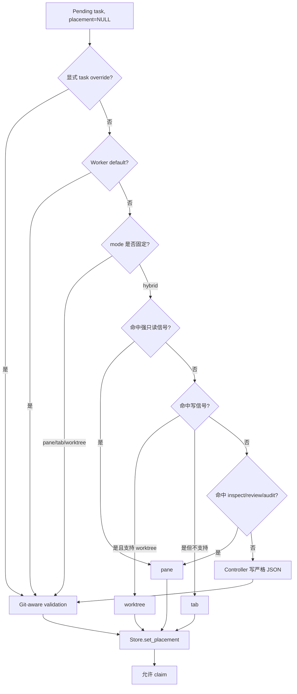

# 拓扑感知派发
Active contributors: oldwinter, chendongdong

## Purpose

拓扑感知派发把已接受任务映射到 Herdr 的 `pane`、`tab` 或 `worktree`。Harness selection 决定“谁做”，placement 决定“在哪里做”；两者是独立 seam。最终 placement 在 claim 前持久化，dispatch、retry、receipt、Dashboard 和 GC 都消费同一结果。

这一功能属于普通 durable queue。Standardized delivery 有自己的 integration/ticket worktree DAG，不与这里的 placement 状态混用。Queue 状态机见 [Durable execution](durable-execution.md)，三个 placement 的领域对象见 [Placement 与 worktree](../primitives/placement-and-worktrees.md)。

下文源码路径均为仓库根目录完整路径。

## 目录布局

```text
src/herdr_orchestrator/model.py          # PlacementMode/Target、DispatchContext
src/herdr_orchestrator/config.py         # placement TOML 与 runtime root 校验
src/herdr_orchestrator/topology.py       # 静态规则、controller protocol、label/slug
src/herdr_orchestrator/runner.py         # claim 前 placement、agent slots、dispatch context
src/herdr_orchestrator/store.py          # placement 持久化与 claim 前置条件
src/herdr_orchestrator/herdr_layout.py   # tab/pane/worktree provision 与局部 cleanup
src/herdr_orchestrator/herdr.py          # transport、agent identity 与 GC terminal 边界
workflows/multi-harness.toml              # hybrid 默认策略
workflows/grok-research.toml              # worker 默认 pane 的样例
tests/test_topology.py                    # 规则、controller JSON、Git 能力、label
tests/test_herdr_layout.py                # 原生 Herdr 命令、split、worktree 保留
```

## 关键抽象

| 抽象 | 完整源码路径 | 责任 |
| --- | --- | --- |
| `PlacementMode` | [`src/herdr_orchestrator/model.py`](../../src/herdr_orchestrator/model.py) | Workflow 策略：`hybrid`、`tab`、`pane`、`worktree`。 |
| `PlacementTarget` | [`src/herdr_orchestrator/model.py`](../../src/herdr_orchestrator/model.py) | 已落定且可持久化的三种 target。 |
| `PlacementConfig` | [`src/herdr_orchestrator/model.py`](../../src/herdr_orchestrator/model.py) | 保存 mode 与 `worktree_root`。 |
| `static_placement()` | [`src/herdr_orchestrator/topology.py`](../../src/herdr_orchestrator/topology.py) | 应用 override、worker default、固定 mode 和 hybrid 文本规则。 |
| `topology_decision_prompt()` / `load_topology_decision()` | [`src/herdr_orchestrator/topology.py`](../../src/herdr_orchestrator/topology.py) | 对歧义任务定义 controller allowlist 与 exact JSON 校验。 |
| `DispatchContext` | [`src/herdr_orchestrator/model.py`](../../src/herdr_orchestrator/model.py) | 把 placement、title、task/batch key、worktree root 与 receipt 交给 transport。 |
| `HerdrLayout` | [`src/herdr_orchestrator/herdr_layout.py`](../../src/herdr_orchestrator/herdr_layout.py) | 将 target 转换为 Herdr 原生 tab、pane 或 worktree 操作。 |
| `ProvisionedTerminal` | [`src/herdr_orchestrator/herdr_layout.py`](../../src/herdr_orchestrator/herdr_layout.py) | 记录真实 pane/tab/workspace/cwd 及允许清理的对象。 |

## 决策工作流



### 1. 优先级固定

[`src/herdr_orchestrator/topology.py`](../../src/herdr_orchestrator/topology.py) 的 `static_placement()` 按以下顺序短路：

1. 单任务显式 override，例如 `enqueue --placement` 或 seed placement；
2. 对应 `WorkerConfig.placement`；
3. 非 `hybrid` 的 workflow mode；
4. `hybrid` 文本规则；
5. 返回 `None`，由 controller 处理歧义。

显式值和 worker default 也必须通过 worktree 能力校验。Coordinator 当前以 workflow workspace 下是否存在 `.git` 判断 `supports_worktree`。不支持时，任何显式或模型伪造的 `worktree` 都报 `topology_worktree_requires_git`。

### 2. Hybrid 规则保守且有顺序

静态规则把 title 与 prompt 合并后做 `casefold()`。强只读信号先判断，包括“只读”“不得修改”“不要修改”“do not modify”“read only”“read-only”；这防止“不得修改”中的“修改”被后续写规则误判。

写信号覆盖中英文实现、修复、修改、创建文件、写入、`implement`、`fix`、`modify`、`edit`、`write`、`create file`、`refactor`。支持 worktree 时返回 `worktree`，否则返回 `tab`。一般读信号目前只有 `inspect`、`review`、`audit`，命中后返回 `pane`。未命中不猜测，进入 controller seam。

这些词表是确定性启发式，不是自然语言权限判定；任务授权仍来自外层任务契约。

### 3. 歧义任务只允许 topology JSON

Controller 不执行任务，只能把一个 runtime artifact 写到 planner output 目录：

```json
{"placement":"tab|pane|worktree","rationale":"..."}
```

[`src/herdr_orchestrator/topology.py`](../../src/herdr_orchestrator/topology.py) 要求 key 集恰为 `placement` 与 `rationale`；rationale 必须非空且不超过 2,000 字符，placement 必须能转为 `PlacementTarget`。不支持 worktree 时，prompt 的 allowlist 只含 `tab|pane`，loader 仍会做第二次能力校验。

[`src/herdr_orchestrator/runner.py`](../../src/herdr_orchestrator/runner.py) 为 artifact 使用由 workflow 与 dedupe key 派生的 `topology-<12位摘要>.json`。Controller turn 必须无 error 并以 `idle` 或 `done` 结束；读取后无论成功与否都删除 artifact。

### 4. Placement 在 claim 前一次性落库

[`src/herdr_orchestrator/runner.py`](../../src/herdr_orchestrator/runner.py) 的 `_assign_pending_placements()` 遍历当前 worker pool 中 `placement IS NULL` 的 pending jobs，先跑静态规则，必要时再调用 controller，最后交给 [`src/herdr_orchestrator/store.py`](../../src/herdr_orchestrator/store.py) 的 `set_placement()`。

`set_placement()` 只更新同时满足以下条件的行：

```text
state = pending
attempts = 0
placement IS NULL
```

Store 的 claim 查询只选择 `placement IS NOT NULL` 的 job。因此模型决策没有通过校验时任务不会进入 running；retry 复用已持久化 target，不重新做 topology 分类。

## 三种执行位置

| Placement | Checkout / terminal 隔离 | Provision | 保留与清理 |
| --- | --- | --- | --- |
| `pane` | 同一 `run_once` batch 共享 tab 与 checkout；每 task 独立 pane/agent | 首任务创建 batch tab；后续对 pane 执行 split | Root pane 失败时关闭本次 batch tab；子 pane 失败只关闭该 pane |
| `tab` | 每 task 独立 full-size tab；共享 workflow checkout | `herdr tab create --no-focus` | Provision/临时失败可关闭本次创建的 tab；GC 只关闭经证明拥有的 agent pane |
| `worktree` | 独立 branch、checkout、Herdr workspace、tab、pane 和 agent | `herdr worktree create/open` | 普通 queue 永不自动 merge、关闭 workspace、删除 checkout 或 branch |

原生命令与返回 JSON 的解析真源是 [`src/herdr_orchestrator/herdr_layout.py`](../../src/herdr_orchestrator/herdr_layout.py)。Herdr 的 readiness 与 settlement 语义见 [Herdr runtime](../systems/herdr-runtime.md)。

### Pane：批次共享，分割最大区域

`pane` 要求非空 `DispatchContext.batch_key`。`HerdrLayout` 在进程内以 batch key 缓存 `_BatchTab`：第一个任务创建一个短标题 tab，并使用 root pane；后续任务先读取 `herdr pane layout`，从具有合法 width/height 的 panes 中选 `width × height` 最大者。若该 pane `width >= height × 2` 则向右 split，否则向下 split。

该策略减少连续按同一方向切割造成的窄 TUI。若 batch root terminal 清理，cache 中整个 batch entry 删除；子 pane 清理时只移除对应 pane ID。

### Tab：可见标题与内部 identity 分离

`short_display_label()` 压缩 title 空白，默认最长 32 字符；超长时保留 31 字符并添加 `…`。用户看到的是 task title，不是带摘要的 agent name。复用 tab agent 时只执行 tab rename，agent identity 不变。

### Worktree：稳定坐标与恢复

[`src/herdr_orchestrator/herdr_layout.py`](../../src/herdr_orchestrator/herdr_layout.py) 根据 workflow、task key 与 title 生成：

```text
digest     = sha256("<workflow>\0<task_key>")[:7]
identifier = <stable_slug(title, max=32)>-<digest>
path       = <worktree_root>/<stable_slug(workflow, max=32)>/<identifier>
branch     = ho/<stable_slug(workflow)>/<identifier>
```

若 path 不存在，执行 `herdr worktree create --base HEAD`。若 path 已存在，先用 `herdr worktree list` 查找对应 `open_workspace_id`，再从该 workspace 查找 cwd 精确等于 path 的 pane：匹配时直接复用；找不到可复用 terminal 时执行 `herdr worktree open`。Retry 因稳定 task key 返回同一 checkout，而不是创建随机目录。

Worktree 是 checkout 隔离，不是安全沙箱：secret、网络、端口、数据库和生产系统仍可能共享。普通 queue 保留它作为 durable task evidence。

## Agent slot 与 outcome

[`src/herdr_orchestrator/runner.py`](../../src/herdr_orchestrator/runner.py) 为 `tab` 和 `pane` 按 harness、placement、replica 生成稳定 slot；worktree 则为每个 job ID 生成独立 agent name。三种 placement 都受 worker 的 `replicas` 总并发限制，不能靠多建 worktree 绕过 slot 上限。

Dispatch 时 `DispatchContext` 包含：

- 已持久化 placement；
- title 与稳定 dedupe task key；
- wave 的 batch key；
- 已校验的 worktree root；
- 可选 task receipt。

`DispatchOutcome` 再带回 placement、真实 execution path 和 Herdr workspace ID，写入 job/attempt receipt，供 status、恢复与 Dashboard 投影。

## 安全 GC

GC 是显式操作且默认 dry-run。它不删除 job、receipt 或 worktree。普通 terminal 候选只有在 durable receipt 与 live Herdr facts 同时证明所有权后才能关闭：

- Job 属于选定的 `succeeded` 或 `failed` scope；
- placement 不是 `worktree`，状态也不是 `blocked`；
- agent name 属于当前 workflow、harness、placement 与 replica 推导的 allowlist；
- receipt 证明该 pane 是本 workflow 新建而非复用；
- 同名 agent 没有 active job；
- live agent 的 identity、pane、workspace、cwd 与 settled state 匹配。

即使原 placement 是 `tab`，最终 cleanup 也只关闭经证明拥有的 agent pane，不关闭整个 tab。详细 queue/GC 语义见 [Coordinator 与队列](../systems/coordinator-and-queue.md)。

## 集成点

| 上下游 | 接口 |
| --- | --- |
| Workflow 配置 | [`src/herdr_orchestrator/config.py`](../../src/herdr_orchestrator/config.py) 解析 `[placement]` 与 worker default，并把 worktree root 限制在 workspace 的 `.orchestrator` 内。 |
| Durable store | [`src/herdr_orchestrator/store.py`](../../src/herdr_orchestrator/store.py) 保存 target，拒绝 claim 未 placement job，并记录 execution path/workspace。 |
| Coordinator | [`src/herdr_orchestrator/runner.py`](../../src/herdr_orchestrator/runner.py) 在 claim 前决策，构造 slot 与 `DispatchContext`。 |
| Herdr runtime | [`src/herdr_orchestrator/herdr_layout.py`](../../src/herdr_orchestrator/herdr_layout.py) provision topology；[`src/herdr_orchestrator/herdr.py`](../../src/herdr_orchestrator/herdr.py) 驱动 agent 生命周期。 |
| Dashboard | [`src/herdr_orchestrator/dashboard/projector.py`](../../src/herdr_orchestrator/dashboard/projector.py) 只读关联 job → agent → pane → tab → workspace/worktree，不参与选择。 |
| 配置文档 | [配置参考](../reference/configuration.md) 记录 override 与字段范围；[`docs/workflow-schema.md`](../../docs/workflow-schema.md) 是 schema 说明。 |

## 修改入口

| 想修改的行为 | 首要入口 | 必须同步 |
| --- | --- | --- |
| 改优先级、信号或 controller schema | [`src/herdr_orchestrator/topology.py`](../../src/herdr_orchestrator/topology.py) | [`tests/test_topology.py`](../../tests/test_topology.py)、[`src/herdr_orchestrator/runner.py`](../../src/herdr_orchestrator/runner.py)。 |
| 改 placement 持久化时机 | [`src/herdr_orchestrator/runner.py`](../../src/herdr_orchestrator/runner.py)、[`src/herdr_orchestrator/store.py`](../../src/herdr_orchestrator/store.py) | Claim 查询、retry/recovery、migration 与 runner/store 测试。 |
| 改 pane split、label 或 worktree 坐标 | [`src/herdr_orchestrator/herdr_layout.py`](../../src/herdr_orchestrator/herdr_layout.py) | [`tests/test_herdr_layout.py`](../../tests/test_herdr_layout.py)；坐标变化需兼容已有 checkout。 |
| 改 mode、root 或 worker default | [`src/herdr_orchestrator/config.py`](../../src/herdr_orchestrator/config.py)、[`workflows/*.toml`](../../workflows/) | [配置参考](../reference/configuration.md)、[`tests/test_config.py`](../../tests/test_config.py)。 |
| 新增 placement target | [`src/herdr_orchestrator/model.py`](../../src/herdr_orchestrator/model.py) | Config enum、topology、Store migration、slot key、layout match、status/receipt、Dashboard、GC 与测试。 |
| 改 GC | [`src/herdr_orchestrator/runner.py`](../../src/herdr_orchestrator/runner.py)、[`src/herdr_orchestrator/herdr.py`](../../src/herdr_orchestrator/herdr.py) | 保留默认 dry-run、owned pane 证据、active/worktree/blocked 排除。 |

## Key source files

| 仓库根目录完整路径 | 作用 |
| --- | --- |
| [`src/herdr_orchestrator/topology.py`](../../src/herdr_orchestrator/topology.py) | 决策优先级、hybrid 信号、严格 controller JSON、label 与 slug。 |
| [`src/herdr_orchestrator/herdr_layout.py`](../../src/herdr_orchestrator/herdr_layout.py) | 三种 placement 的 Herdr provision、复用、坐标与局部 cleanup。 |
| [`src/herdr_orchestrator/model.py`](../../src/herdr_orchestrator/model.py) | Placement enum/config、`DispatchContext`、outcome 模型。 |
| [`src/herdr_orchestrator/config.py`](../../src/herdr_orchestrator/config.py) | Placement TOML、worker default 与 runtime root 校验。 |
| [`src/herdr_orchestrator/runner.py`](../../src/herdr_orchestrator/runner.py) | Claim 前 placement、controller turn、slot map 与 dispatch context。 |
| [`src/herdr_orchestrator/store.py`](../../src/herdr_orchestrator/store.py) | Placement 一次性写入、claim gate 与执行坐标持久化。 |
| [`src/herdr_orchestrator/herdr.py`](../../src/herdr_orchestrator/herdr.py) | Stable agent identity、runtime lifecycle 与 owned-pane cleanup。 |
| [`workflows/multi-harness.toml`](../../workflows/multi-harness.toml) | `hybrid` 与默认 worktree root。 |
| [`workflows/grok-research.toml`](../../workflows/grok-research.toml) | Worker `placement = "pane"` 优先于 hybrid 的样例。 |
| [`tests/test_topology.py`](../../tests/test_topology.py) | Read/write/ambiguous、override、Git-aware validation 与 label 测试。 |
| [`tests/test_herdr_layout.py`](../../tests/test_herdr_layout.py) | Batch pane、最大 pane split、tab label 与 worktree retention 测试。 |
