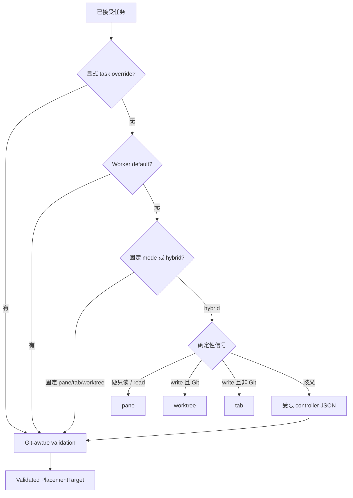

# 拓扑感知派发
Active contributors: oldwinter, chendongdong

Topology decision 与 harness selection 是两个独立 seam：harness 决定“谁做”，placement 决定“在哪里做”。普通 durable queue 支持 `pane`、`tab` 和 `worktree`，并把最终 placement 持久化到 job；retry 因而可以恢复同一 agent slot 或同一 worktree checkout。

## 决策优先级



优先级实现位于 `src/herdr_orchestrator/topology.py::static_placement`：

1. `enqueue --placement` 的显式 override；
2. Workflow 中该 worker 的默认 placement；
3. 非 `hybrid` workflow 的固定 mode，或 `hybrid` 下的确定性读写规则；
4. 仍歧义时，由 controller 写严格 topology JSON。

Hybrid 规则首先识别“只读 / 不得修改 / do not modify / read-only”等硬只读信号并选 `pane`；再识别实现、修复、修改、写入、refactor 等写信号，在 Git checkout 中选 `worktree`，否则选 `tab`；普通 inspect/review/audit 选 `pane`。未命中才返回 `None` 进入 controller，而不是猜测。

Controller 只能写：

```json
{"placement":"tab|pane|worktree","rationale":"..."}
```

`load_topology_decision()` 要求 key 精确为 `placement` 和 `rationale`，rationale 非空且不超过 2000 字符，placement 必须在当前 allowlist 中。Workspace 没有 `.git` 时，prompt 不提供 `worktree`，即便伪造该值也会得到 `topology_worktree_requires_git`。

## 三种执行位置

| Placement | 隔离与复用 | 创建方式 | 生命周期 |
| --- | --- | --- | --- |
| `pane` | 同一 `run_once` 批次共享一个 tab；每任务独立 pane 和 agent；共享 checkout | 首任务 `herdr tab create --no-focus`，后续 `herdr pane split --no-focus` | 适合只读或协作任务；失败 pane 可按所有权清理 |
| `tab` | 每任务 full-size tab；共享 workflow checkout | `herdr tab create --no-focus` | 适合需要完整终端但不需要独立 checkout 的任务 |
| `worktree` | 独立 branch、checkout、Herdr workspace、tab、pane 和 agent | `herdr worktree create`，已有 checkout 时 `list/open` | Durable evidence；普通 queue 不自动 merge、close 或删除 |

实现真源是 `src/herdr_orchestrator/herdr_layout.py::HerdrLayout`。

### Pane 布局

Pane placement 要求 `DispatchContext.batch_key`。`HerdrLayout` 为每个 batch 缓存一个 `_BatchTab`；新增 pane 前调用 `herdr pane layout`，按 `width * height` 选择当前面积最大的 pane。若 `width >= height * 2` 则向右 split，否则向下 split，避免连续把同一方向机械切窄。

### Tab 与用户可见 label

内部 agent name 带稳定 digest，用于跨 replica、workspace 和重启保持唯一。用户可见 tab label 使用 `short_display_label()`：压缩空白、最多 32 字符、超长时以省略号结尾，不暴露 hash。复用 tab agent 时只刷新 tab label，不改变 agent identity。

### Worktree 恢复

`HerdrLayout._worktree_coordinates()` 从 workflow name、task key 和 title 稳定派生：

- Path：`<worktree_root>/<workflow-slug>/<task-slug>-<7位digest>`
- Branch：`ho/<workflow-slug>/<task-slug>-<7位digest>`

若路径已经存在，adapter 先用 `herdr worktree list --cwd <repo>` 查找 `open_workspace_id`，并复用 cwd 匹配的 pane；尚未打开则执行 `herdr worktree open`。因此 retry 不会随意创建第二个 checkout。Worktree 是 checkout 隔离，不是安全沙箱，也不代表 coordinator 会 merge 或删除 branch。

## Coordinator 与 store 的衔接

`src/herdr_orchestrator/runner.py` 在 claim 前运行 `_assign_pending_placements()`：

1. 查询 `src/herdr_orchestrator/store.py::unplaced_jobs()`；
2. 尝试 `_static_placement()`；
3. 歧义任务调用 `_select_topology()`；
4. `Store.set_placement()` 只允许尚未 attempt 的 `pending` job 从 `NULL` 设置一次；
5. `_slot_names()` 按 harness + placement 提供 agent slot，worktree agent 额外按 job ID 隔离。

Dispatch 时 `DispatchContext` 携带 placement、title、dedupe key、batch key、worktree root 和 receipt。Outcome 再把 placement、execution path 和 Herdr workspace ID 写回 job 与 attempt receipt，供 status、恢复、GC 和 Dashboard 使用。

## GC：证明所有权后只关闭 pane

GC 是显式操作，默认 dry-run：

```bash
herdr-orchestrator gc --workflow /absolute/path/to/workflow.toml --succeeded-agents
herdr-orchestrator gc --workflow /absolute/path/to/workflow.toml --failed-agents
# 审核 JSON 后才追加 --apply
```

`Coordinator._gc_agents()` 对 succeeded 和 failed 使用独立 scope。候选必须同时满足：

- 非 `worktree`；
- agent name 属于当前 workflow、worker、replica 和 placement 的稳定 slot；
- 历史 receipt 证明该 agent 由本 workflow 创建，即 `member_reused=false` 且记录过 pane；
- 同名 agent 没有 pending/running/blocked 等非目标 job；
- 当前 runtime agent 的 identity、pane、workspace、cwd/foreground cwd 与记录匹配；
- 当前状态为 `idle` 或 `done`。

`blocked`、worktree、active、foreign、预先存在且被复用的 agent 都跳过。即使原 placement 是 `tab`，`HerdrTransport.close_agent_terminal()` 也只执行 `herdr pane close <owned-pane>`，不会关闭整个 tab，避免误伤后来移动到同一 tab 的用户 pane。Pane ID 漂移会返回 `agent_pane_mismatch` 而不是继续清理。

## 关键抽象与源文件

| 抽象 | 完整路径 | 责任 |
| --- | --- | --- |
| `PlacementMode`, `PlacementTarget`, `DispatchContext` | `src/herdr_orchestrator/model.py` | Topology 领域模型 |
| `static_placement` / controller protocol | `src/herdr_orchestrator/topology.py` | Override、worker default、规则和严格 JSON |
| `Coordinator._assign_pending_placements` | `src/herdr_orchestrator/runner.py` | Claim 前完成并持久化 placement |
| `HerdrLayout` / `ProvisionedTerminal` | `src/herdr_orchestrator/herdr_layout.py` | Provision pane、tab 和 worktree |
| Agent slot 与安全 GC | `src/herdr_orchestrator/herdr.py` | 稳定名称、runtime identity/cwd 验证和 pane close |
| Placement persistence | `src/herdr_orchestrator/store.py` | Placement、execution path、workspace ID 和 receipt |

## 集成点与修改入口

- 改决策顺序或关键词：修改 `src/herdr_orchestrator/topology.py`，同步 `tests/test_topology.py` 和 `tests/test_runner.py`。
- 改 pane split、label 或 worktree 命名：修改 `src/herdr_orchestrator/herdr_layout.py`，同步 `tests/test_herdr_layout.py`；稳定坐标变化必须考虑已有 checkout 的恢复。
- 新增 placement：必须联动 model、workflow schema、store migration、slot key、layout provision、receipt/status、Dashboard projection 与 GC fail-closed 规则。
- 改 GC：同时检查 `src/herdr_orchestrator/runner.py::_gc_agents` 和 `src/herdr_orchestrator/herdr.py::close_agent_terminal`，保留“只关闭已证明拥有的 pane”边界。
- 架构语义见 `docs/architecture.md`；现场 topology 诊断见 `docs/runtime-troubleshooting.md`。
