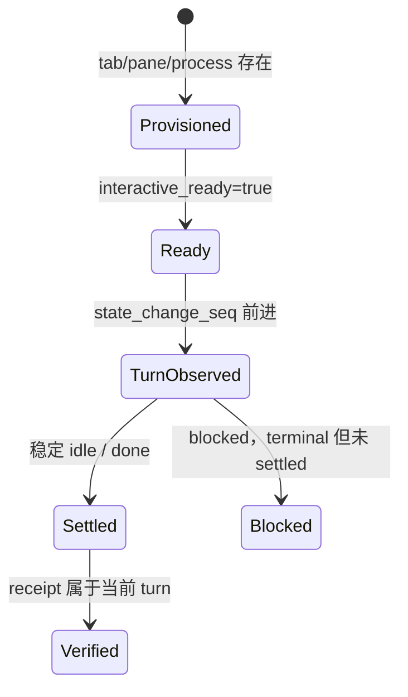

# 调试与运行态排障
Active contributors: oldwinter, chendongdong

排障目标是确定失败发生在哪个证据层，而不是从 pane 标题或一段终端文本猜结论。生命周期
实现主要位于 `src/herdr_orchestrator/herdr.py`，编排与状态分别位于
`src/herdr_orchestrator/runner.py` 和 `src/herdr_orchestrator/store.py`；设计约束见
[模式与约定](patterns-and-conventions.md)。

## 四层运行证据



| 层 | 可证明内容 | 不能据此声称 |
| --- | --- | --- |
| Provisioned | 后台 tab、pane、进程存在 | agent 已 ready 或开始任务 |
| Interactive ready | agent 可接收输入 | prompt 已被接受 |
| Turn observed | prompt 后 lifecycle sequence 前进 | turn 已结束或内容正确 |
| Settled | 当前 turn 稳定为 `idle` 或 `done`，`agent_settled=true` | output 满足任务 |
| Blocked | 当前 turn 明确需要输入，terminal 但 `agent_settled=false` | 任务成功或可自动回答 |
| Verified | 当前 turn 的 output/file receipt 通过 | 超出 receipt 声明的质量 |

`agent_settled=true` 与 `task_verified=true` 必须区分。`blocked`、`unknown`、timeout、
未观察到 sequence 变化和协议错误都不是成功。

## 从 durable queue 开始

第一步始终是：

```bash
just status
```

检查 job 的 state、attempt、error、`agent_settled`、`task_verified`、`placement`、
`execution_path` 与 `herdr_workspace_id`。用户可见标题和内部 agent identity 是两套字段，
不要从 tab 标题推断 agent name。

Topology 解释：

- `pane`：同批次任务在共享 tab 的独立 pane；
- `tab`：任务拥有独立 tab；
- `worktree`：任务使用 Herdr 原生 worktree workspace。

任务完成不会自动 merge 或删除原生 worktree。需要确认时使用：

```bash
herdr worktree list --cwd .
```

不要为了排障清理用户或其他运行的 pane、branch、checkout、未跟踪文件。

## 用 doctor 收窄真实环境

按单一 harness 运行真实 readiness 诊断：

```bash
just doctor --harness droid
just doctor --harness codex
```

可重复 `--harness`，但先从一个开始。doctor 的 JSON summary 和 phase timing 可区分
provision、turn、receipt 耗时，并暴露 executable、认证、模型或 Herdr integration 问题。
它需要主机真实 Herdr 0.8.2+、`HERDR_ENV=1` 所代表的 Herdr pane 环境和已登录 harness；
它不是 `just check` 的替代品。

## 读取结构化 agent 状态

拿到准确 agent name 后：

```bash
herdr agent get <agent-name>
herdr agent explain <agent-name> --json
```

重点记录 `interactive_ready`、state、sequence、block reason、pane/workspace identity 和
相关 timing。只有为确认真实 turn 或已知认证错误时，才读取有限终端内容：

```bash
herdr agent read <agent-name> --source detection --lines 120
herdr agent read <agent-name> --source recent-unwrapped --lines 120
```

最后检查 integration：

```bash
herdr integration status
```

只引用携带信号的少量行。不要复制完整 transcript，不要把 prompt、terminal output、
环境变量、token 或 `.orchestrator/` 诊断产物提交到 Git/issue。

## 常见错误与下一步

| 稳定错误码 | 解释 | 建议检查 |
| --- | --- | --- |
| `agent_not_ready` | startup 后有界时间内未 ready | executable、integration、startup UI、timing |
| `agent_turn_not_observed` | prompt/Enter 后 sequence 未前进 | prompt acceptance 与 agent state |
| `agent_prompt_stalled` | acceptance 窗口无状态变化 | 有界 Enter 重发是否发生；不要无限重试 |
| `prompt_acceptance_timeout` | command timeout 且复查仍无新 sequence | acceptance phase summary 与 sequence |
| `herdr_timeout` | turn 已开始但执行 deadline 未 settled，或控制命令超时 | working 状态、workflow timeout、provider |
| `agent_blocked` | settle 后仍需交互 | 普通 queue 人工审查后显式 resume |
| `agent_auth_failed`、`agent_auth_required` | 登录失败或等待 device login | harness 自身登录态，不要记录 credential |
| `agent_model_invalid` | provider 拒绝模型标识 | harness/provider 配置 |
| `agent_provider_failed` | provider 重试耗尽 | provider 状态与有界重试 receipt |
| `task_receipt_missing` | 声明 receipt 不存在 | 当前 turn 输出或目标文件 |
| `task_receipt_ambiguous` | prefix 可能只是 prompt echo | authorship 与新增输出边界 |
| `task_receipt_stale` | file receipt 当前 turn 前后未变化 | mtime/content 与 execution root |

普通 queue 的真实 `blocked` 是 terminal，不会由 coordinator 自动回答。人工确认问题与权限后，
使用响应文件恢复原 agent/pane/attempt：

```bash
just resume 43 approval.txt
```

失败任务需要额外 attempt budget 时：

```bash
just retry 42 --extra-attempts 1
```

不要通过重新 enqueue 或直接向未知 pane 输入来绕过 ownership、attempt 和 receipt 记录。
只有 opt-in standardized delivery 的 principal proxy 才能在规格内做有界回答；secret、
credential 和 production 问题始终升级给用户。

## smoke 的正确用法

只有在 unit tests 通过、且问题涉及真实 harness 启动/turn/settle 时，才运行：

```bash
just smoke --harness grok
```

smoke 是真实只读 turn，会核验生命周期与 receipt。优先单 harness；无过滤的 `just smoke`
会触达所有启用 harness，成本与环境变量更多。以下现象不能单独证明成功：

- pane 或进程存在；
- 当前前台 pane 没有输出；
- tab 标题变为任务名；
- agent 最终显示 `done`；
- scrollback 中看到了 prompt 文本。

后台 tab 使用 `--no-focus` 是预期行为。full-screen agent 历史也可能不完整进入 scrollback。

## 从失败回到测试

运行态问题应固化为可重复测试，而不是留下人工步骤：

- lifecycle/receipt 回归放在 `tests/test_herdr.py`，使用 fake command runner 和明确 sequence；
- queue/attempt/resume 放在 `tests/test_store.py`、`tests/test_runner.py`；
- startup 参数和 Claude workspace trust 放在 `tests/test_harness_automation.py`；
- topology ownership 放在 `tests/test_herdr_layout.py`、`tests/test_topology.py`；
- CLI 错误分类与退出码放在 `tests/test_cli.py`。

例如：

```bash
PYTHONPATH=src uv run pytest tests/test_herdr.py -q
just check
```

先复现最小失败，再修实现，再跑 focused test，最后运行完整门禁。更多测试策略见
[测试](testing.md)，质量 artifact 的解读见[工具与质量门禁](tooling.md)。

## 用户改动保护

排障命令以读取为先。执行任何 cleanup 前确认资源由当前运行创建、pane identity 与 receipt
一致，并先用 dry-run：

```bash
just gc
```

`just gc --apply` 只应关闭当前 workflow 已成功且 settled、并有 ownership 证据的 agent
pane；`blocked`、foreign、active 和 worktree 不属于常规回收。绝不为“重现干净环境”丢弃
用户未提交或未跟踪文件。

## 导航

- [贡献指南](index.md)
- [开发工作流](development-workflow.md)
- [测试](testing.md)
- [工具与质量门禁](tooling.md)
- [模式与约定](patterns-and-conventions.md)
