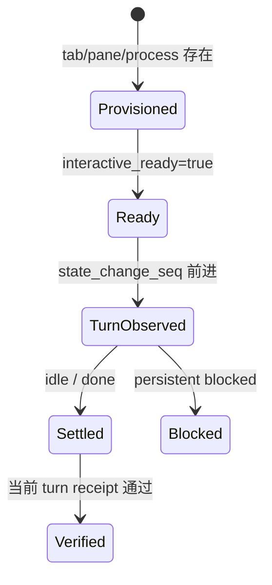

# 调试与运行态排障

排障应确定失败落在哪个证据层，并保留稳定、最小、脱敏的证据，而不是从 pane 标题或一段
终端文字猜结论。生命周期、编排与持久状态分别位于
`src/herdr_orchestrator/herdr.py`、`src/herdr_orchestrator/runner.py` 和
`src/herdr_orchestrator/store.py`；设计边界见[模式与约定](patterns-and-conventions.md)。

## 四层运行证据



| 层 | 需要的结构化证据 | 能证明什么 | 不能证明什么 |
| --- | --- | --- | --- |
| 1. Provisioned | 后台 tab、pane 与 harness process identity | 资源已经创建 | agent ready、prompt 已提交 |
| 2. Interactive ready | `interactive_ready=true` | agent 可以接收输入 | 已观察到当前任务 turn |
| 3. Turn observed | prompt 后 `state_change_seq` 前进 | 新 turn 确实开始 | turn 已结束、输出正确 |
| 4. Settled | 同一 turn 稳定为 `idle` 或 `done`，`agent_settled=true` | turn 已结束 | 任务内容已验收 |

receipt 验证位于四层 lifecycle 之后：只有当前 turn 的 output prefix 或发生变化的 file receipt
通过，才能得到 `task_verified=true`。`agent_settled=true` 与 `task_verified=true` 必须分开；
persistent `blocked` 是 terminal 分支但不算 settled；`blocked`、`unknown`、timeout、
未观察到 sequence 变化和协议错误都不是成功。

## 诊断顺序

### 1. 先看 durable queue

```bash
just status
```

检查 job state、attempt、error、`agent_settled`、`task_verified`、`placement`、
`execution_path` 与 `herdr_workspace_id`。用户可见 tab 标题与内部 agent identity 是不同字段，
不要用标题推断 agent name。

placement 含义：

- `pane`：同批任务在共享 tab 的独立 pane；
- `tab`：任务拥有独立 tab；
- `worktree`：任务使用 Herdr 原生 worktree workspace。

完成任务不会自动 merge 或删除 worktree。只读确认使用：

```bash
herdr worktree list --cwd .
```

### 2. 用 doctor 收窄环境

```bash
just doctor --harness droid
just doctor --harness codex
```

优先一次检查一个 harness。doctor JSON 的 compact summary 与 provision/turn/receipt phase timing
可区分 executable、Herdr integration、认证、模型和 readiness 问题。它要求主机 Herdr
0.8.2+、Herdr pane 环境与已登录 harness，不替代 `just check`。

### 3. 读取结构化 agent 状态

拿到准确 agent name 后：

```bash
herdr agent get <agent-name>
herdr agent explain <agent-name> --json
```

记录 `interactive_ready`、state、sequence、block reason、pane/workspace identity 和 timing。
只有为确认真实 turn 或稳定 fatal signal 时才读取有限终端内容：

```bash
herdr agent read <agent-name> --source detection --lines 120
herdr agent read <agent-name> --source recent-unwrapped --lines 120
```

最后检查 integration：

```bash
herdr integration status
```

只引用携带信号的少量行；不复制完整 transcript，不把 prompt、terminal output、环境变量、
token 或 `.orchestrator/` 诊断产物提交到 Git、PR 或 issue。

## 稳定错误码

| 错误码 | 含义 | Queue 行为与下一步 |
| --- | --- | --- |
| `agent_not_ready` | startup 后未在有界时间达到 interactive ready | 按 attempt 重试；检查 executable、integration、startup UI 与 timing |
| `agent_turn_not_observed` | prompt/Enter 后 sequence 未前进 | 按 attempt 重试；检查 acceptance 与 agent state |
| `agent_prompt_stalled` | acceptance 窗口没有状态变化 | transport 最多有界重发 Enter；不得无限重试 |
| `prompt_acceptance_timeout` | prompt command timeout，复查仍无新 sequence | 按 attempt 重试；查看 phase/state/sequence 摘要 |
| `herdr_timeout` | 已观察到 turn 但执行 deadline 未 settled，或控制命令超时 | 按 attempt 重试，耗尽后 failed；检查 working、workflow timeout、provider |
| `agent_blocked` | settle 后仍存在真实交互阻塞 | 普通 queue terminal blocked；人工审查后显式 resume |
| `agent_auth_failed` | settled output 命中明确认证失败 | 按 attempt 失败处理；修复 harness 登录态但不记录 credential |
| `agent_auth_required` | 命中登录墙或 device-code 等待 | 按 attempt 失败处理；由用户完成认证 |
| `agent_model_invalid` | provider 拒绝模型标识 | 按 attempt 失败处理；检查 harness/provider 配置 |
| `agent_provider_failed` | provider 请求重试耗尽 | 按 attempt 失败处理；保存有界摘要 |
| `task_receipt_missing` | 声明的 output prefix 或非空文件不存在 | 按 attempt 失败处理；检查当前 turn 输出或执行根目录 |
| `task_receipt_ambiguous` | output prefix 可能只是独立 prompt echo | 按 attempt 失败处理；无法证明 authorship |
| `task_receipt_stale` | file receipt 在当前 turn 前后未变化 | 按 attempt 失败处理；检查内容/mtime 与 execution root |

CLI 与 automation 应断言这些代码或结构化字段，不依赖易变的完整人类错误文本。新增错误分类时
同时更新 `src/herdr_orchestrator/herdr.py`、`src/herdr_orchestrator/cli.py`、对应测试和
`docs/runtime-troubleshooting.md`。

## blocked、retry 与 resume

普通 queue 的 persistent blocked 是 terminal，不自动回答。人工确认问题、权限与响应内容后，
用文件恢复原 agent、pane 和 attempt：

```bash
just resume 43 approval.txt
```

失败任务确实需要额外 attempt budget 时：

```bash
just retry 42 --extra-attempts 1
```

不要重新 enqueue 或直接向未知 pane 输入来绕过 ownership、attempt 与 receipt。只有明确触发的
standardized delivery principal proxy 可在规格内有界回答；secret、credential 与 production
问题始终升级给用户。

## smoke 的正确用法

只有单元测试通过且问题涉及真实 harness startup/turn/settle 时，才运行：

```bash
just smoke --harness grok
```

smoke 是真实只读 turn，会核验 prompt acceptance、sequence、settled 与 receipt。优先单一
harness；无过滤 `just smoke` 会触达全部启用 harness。以下现象不能单独证明成功：

- pane 或 process 存在；
- 前台 pane 没有输出；
- tab 标题变化；
- agent 显示 `done`；
- scrollback 出现 prompt 文本。

后台 tab 使用 `--no-focus` 是预期行为，full-screen agent 的历史也可能不完整进入 scrollback。

## 把运行失败固化为测试

- lifecycle、startup、receipt：`tests/test_herdr.py`，使用 fake runner 和明确 sequence；
- queue、attempt、resume：`tests/test_store.py`、`tests/test_runner.py`；
- harness 参数与 Claude trust：`tests/test_harness_automation.py`；
- topology ownership：`tests/test_herdr_layout.py`、`tests/test_topology.py`；
- CLI 错误分类与退出码：`tests/test_cli.py`、`tests/test_protocol.py`。

```bash
PYTHONPATH=src uv run pytest tests/test_herdr.py -q
just check
```

先最小复现，再修实现并运行 focused test，最终通过完整门禁。测试策略见[测试](testing.md)，
质量 artifact 见[工具与质量门禁](tooling.md)。

## 安全清理

排障以只读命令为先。任何 cleanup 前都要确认资源由当前 workflow 创建、pane identity 与
receipt 一致，并先 dry-run：

```bash
just gc
```

只有显式 `just gc --apply` 才执行回收，而且只应触达当前 workflow 已成功、settled、有 ownership
证据且非 worktree 的 agent pane。`blocked`、foreign、active 和 worktree 不属于常规回收。
绝不为“干净重现”丢弃用户未提交或未跟踪文件。

## 相关页面

- [贡献指南](index.md)
- [开发工作流](development-workflow.md)
- [测试](testing.md)
- [工具与质量门禁](tooling.md)
- [模式与约定](patterns-and-conventions.md)
