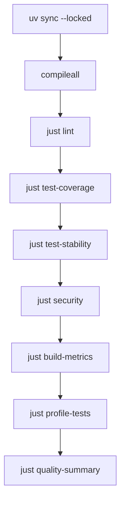

# 测试

本仓库以 pytest 执行行为测试，但大量测试用 `unittest.TestCase` 组织断言与生命周期；
`pyproject.toml` 要求 Python 3.12、`tests/test_*.py` 命名，并启用 pytest 的
`--strict-config --strict-markers`。测试必须证明 config、queue、lease、lifecycle、receipt、
ownership 和错误码，而不是相信模型输出。实现模式见[模式与约定](patterns-and-conventions.md)。

## 反馈阶梯

先跑最小相关测试，再逐级扩大：

```bash
# 单个文件
PYTHONPATH=src uv run pytest tests/test_store.py -q

# 单个 unittest 风格用例
PYTHONPATH=src uv run pytest tests/test_store.py::StoreTests::test_expired_lease_is_reclaimed -q

# 全套测试与 JSON report
just test

# 分支覆盖率与 80% 门槛
just test-coverage

# 完整合并门禁
just check
```

`just test` 把 pytest JSON 写入 `.orchestrator/quality/tests.json`；
`just test-coverage` 额外启用 `--cov=herdr_orchestrator --cov-branch`，把结果写入
`.orchestrator/quality/coverage.json`，低于 80% 失败。focused test 提供快速反馈，但不能替代
跨模块、静态、安全和打包门禁。

## 测试套件地图

| 测试文件 | 主要契约 |
| --- | --- |
| `tests/test_config.py` | workflow 解析、枚举、timeout、controller/worker 约束 |
| `tests/test_catalog.py`、`tests/test_selection.py` | 两级 catalog、按需 profile、worker/controller 选择 |
| `tests/test_planner.py`、`tests/test_topology.py` | 严格 planner JSON、placement 路由、路径与 Git 前置条件 |
| `tests/test_store.py` | dedupe、claim、lease、migration、retry、resume、receipt |
| `tests/test_runner.py` | 多波排空、blocked、GC ownership、router 与 dispatch 编排 |
| `tests/test_herdr.py` | provision、ready、turn、settle、timeout、auth、receipt、pane ownership |
| `tests/test_harness_automation.py`、`tests/test_herdr_layout.py` | harness 启动参数、Claude trust、tab/pane/worktree 布局 |
| `tests/test_cli.py`、`tests/test_protocol.py` | CLI 参数/退出码、固定 argv 协议与稳定错误解析 |
| `tests/test_dashboard.py`、`tests/test_topology_js.py` | 只读白名单、runtime drift、SSE/HTTP、无 DOM topology 逻辑 |
| `tests/test_observability.py` | feature flag 默认关闭、脱敏、HTTPS exporter fail closed |
| `tests/test_distribution.py`、`tests/test_manager_light.py`、`tests/test_release.py` | npm 安装/卸载/manager、registry gate、OIDC 发布约束 |
| `tests/test_delivery.py`、`tests/test_delivery_protocol.py`、`tests/test_tracker.py` | opt-in delivery、principal proxy、DAG、review、tracker |
| `tests/test_skill_package.py` | Skill 触发词、别名和可移植 runtime 契约 |

## Fixture 与隔离方式

仓库没有把所有状态隐藏在一个全局 fixture 中。优先使用靠近测试的显式 fixture 和构造器：

- `tempfile.TemporaryDirectory()` 为 SQLite、workflow、Git 仓库、npm 安装目录和 receipt 文件
  提供一次性隔离；需要跨用例生命周期的类在 `setUp()`/清理阶段持有临时目录。
- `tests/test_herdr.py`、`tests/test_harness_automation.py`、`tests/test_herdr_layout.py` 使用局部
  `FakeRunner`；`tests/test_runner.py` 使用 `FakeDispatcher`；
  `tests/test_delivery.py` 使用 `ScriptedDeliveryDispatcher`。这些 fake 应记录完整 argv、timeout、
  调用顺序和结构化结果。
- Dashboard 用 `tests/test_dashboard.py` 中的局部 observer/projector fake，避免绑定真实 Herdr
  或读取真实 queue。
- 环境变量、当前目录和进程调用必须在用例结束时恢复；文件系统测试只操作临时路径，不能依赖
  开发者账号、真实 pane、全局 npm 状态或仓库 `.orchestrator/`。

新增 fixture 时优先让依赖显式、作用域最小、失败证据可读。不要通过共享可变状态、无界 wait
或固定 sleep 猜 readiness。

## Node.js 测试

`tests/test_topology_js.py` 是 pytest 原生风格测试。它定义 module scope 的 `node_bin` fixture：
找不到 `node` 时明确 skip；找到后用 Node.js `--input-type=commonjs -e` 加载并执行
`src/herdr_orchestrator/dashboard/static/topology.js`。该生产模块保持无 DOM，使节点身份、布局、
状态 class 与增量更新规则能在命令行确定性验证。

`tests/test_distribution.py`、`tests/test_manager_light.py` 和 `tests/test_release.py` 也会通过 Node.js
子进程验证 `bin/herdr-orchestrator.mjs`、manager hooks、npm tarball 和
`scripts/npm-release-plan.mjs`。常规测试不得执行真实 `npm publish`；发布信任边界由测试与
`.github/workflows/ci.yml` 约束。

## 选对测试形态

### 纯 Python 契约

config、protocol、store 与 delivery protocol 应使用输入/输出明确的单元测试。错误路径断言
稳定错误码、结构化字段、状态和退出码，不断言易变的完整异常文本。

### 外部命令与 Herdr

Herdr adapter 使用 fake command runner，验证固定 argv、timeout、状态读取顺序和 ownership。
生命周期测试应分别证明：

1. tab/pane/process 已 provision；
2. `interactive_ready=true`；
3. prompt 后 `state_change_seq` 前进；
4. 当前 turn settled；
5. 声明 receipt 时 `task_verified=true`。

进程存在、pane 标题或最终 `done` 都不能替代这些断言。

### 文件系统、Git 与 npm

在临时 Git 仓库中构造 managed/unmanaged、symlink、linked worktree 和用户修改场景，证明
installer、upgrade、uninstall 不覆盖或删除用户自有文件。npm 包验证使用 dry-run、临时安装
和固定子进程，不用真实发布替代测试。

### Dashboard 与数据边界

验证 Dashboard 只读取白名单字段，不读取 prompt、环境变量或 terminal output，并拒绝非
loopback bind。纯 topology 计算保留在
`src/herdr_orchestrator/dashboard/static/topology.js`，浏览器渲染与计算分离。

## 完整门禁中的测试证据



- `scripts/test_stability.py` 连续执行 `tests/` 三次，比较每个 pytest nodeid 的 outcome；任一
  执行失败或结果不一致都会使门禁失败，并写入 `.orchestrator/quality/stability.json`。
- `just profile-tests` 用标准库 `cProfile` 执行 `tests/test_protocol.py`，输出
  `.orchestrator/quality/tests.pstats`。
- `.github/workflows/ci.yml` 使用相同锁文件和命令。各质量阶段先 `continue-on-error` 是为了
  收集完整 artifact，最终步骤仍逐项要求成功。

更多静态、安全、coverage 与 artifact 细节见[工具与质量门禁](tooling.md)。

## 真实 doctor 与 smoke

常规测试和 `just check` 不需要真实 Herdr。以下命令需要在 Herdr pane 内运行，主机安装
Herdr 0.8.2+，目标 harness CLI 已登录且模型可用：

```bash
just doctor --harness droid
just smoke --harness droid
```

`doctor` 检查 executable、integration、认证/模型 readiness 和阶段耗时；`smoke` 发起真实
只读 turn 并核验 lifecycle 与 receipt。优先单 harness 收窄，不让 CI 依赖个人登录态，
也不把 smoke 改成写测试。诊断顺序见[调试与运行态排障](debugging.md)。

## 新增测试检查表

- [ ] 名称描述外部行为，不绑定实现细节。
- [ ] 正常路径之外覆盖非法输入、timeout、stale caller、并发/ownership 与隐私边界。
- [ ] fake 断言完整 argv 和调用顺序；fixture 最小、隔离且可重复。
- [ ] 文件系统和 Git 测试证明不会伤害未提交、未跟踪或未托管文件。
- [ ] Node.js 测试无真实发布、账号或网络副作用。
- [ ] focused test 通过后运行 `just lint`，收口运行 `just check`。

## 相关页面

- [贡献指南](index.md)
- [开发工作流](development-workflow.md)
- [调试与运行态排障](debugging.md)
- [工具与质量门禁](tooling.md)
- [模式与约定](patterns-and-conventions.md)
