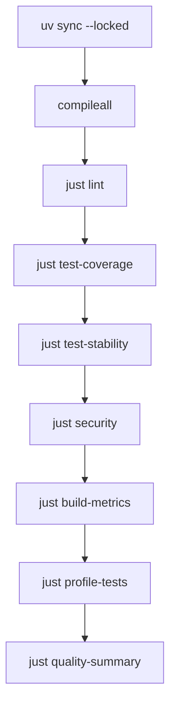

# 测试
Active contributors: oldwinter, chendongdong

本仓库测试围绕行为契约组织：模型输出可以不可信，但 config、queue、lease、lifecycle、
receipt、ownership 和错误码必须可重复验证。测试结构应继续遵循
[模式与约定](patterns-and-conventions.md)。

## 反馈阶梯

先跑最小相关测试，再逐级扩大，最终必须通过 `just check`：

```bash
# 单个文件
PYTHONPATH=src uv run pytest tests/test_store.py -q

# 单个用例
PYTHONPATH=src uv run pytest \
  tests/test_store.py::StoreTests::test_expired_lease_is_reclaimed -q

# 全部测试（生成 run-scoped JSON report，通过 manifest 定位）
just test

# 分支覆盖率与 80% 门槛
just test-coverage

# 完整合并门禁
just check
```

不要一开始只跑全套：focused test 更快暴露契约错误。也不要停在 focused test：跨模块契约、
静态质量、安全和打包问题只有完整门禁会发现。

## 测试套件地图

| 测试文件 | 主要契约 |
| --- | --- |
| `tests/test_config.py` | workflow 解析、枚举、timeout、controller/worker 约束 |
| `tests/test_catalog.py`、`tests/test_selection.py` | 两级 catalog、按需 profile、worker/controller 选择 |
| `tests/test_planner.py`、`tests/test_topology.py` | 严格 planner JSON、placement 路由、路径与 Git 前置条件 |
| `tests/test_store.py` | dedupe、claim、replica、lease、migration、retry、resume、receipt |
| `tests/test_runner.py` | 多波排空、blocked、GC ownership、router 与 dispatch 编排 |
| `tests/test_herdr.py` | provision、ready、turn、settle、timeout、auth、receipt、pane ownership |
| `tests/test_harness_automation.py`、`tests/test_herdr_layout.py` | harness 固定启动参数、Claude trust、tab/pane/worktree 布局 |
| `tests/test_cli.py`、`tests/test_protocol.py` | CLI 参数/退出码、argv 协议与稳定错误解析 |
| `tests/test_dashboard.py`、`tests/test_topology_js.py` | 只读白名单、runtime drift、SSE/HTTP、无 DOM topology 逻辑 |
| `tests/test_observability.py` | feature flag 默认关闭、脱敏、HTTPS exporter fail closed |
| `tests/test_distribution.py`、`tests/test_release.py` | npm ownership/symlink/幂等、registry gate、OIDC 发布约束 |
| `tests/test_delivery.py`、`tests/test_delivery_protocol.py`、`tests/test_tracker.py` | opt-in delivery、principal proxy、DAG、review、tracker |
| `tests/test_skill_package.py` | Skill 精确触发词、别名和可移植 runtime 契约 |

`tests/test_topology_js.py` 需要 Node.js，因为它直接求值
`src/herdr_orchestrator/dashboard/static/topology.js`；该生产文件保持无 DOM，便于确定性测试。

## 选对测试形态

### 纯 Python 契约

config、protocol、store 和 delivery protocol 优先使用输入/输出明确的 unit test。对错误路径
断言稳定错误码、结构化字段和状态，而不是脆弱的异常全文。

### 外部命令与 Herdr

Herdr adapter 测试使用 fake command runner，断言完整 argv、timeout、状态读取顺序和
ownership。不要让常规测试依赖真实账号、真实 pane 或固定 sleep。涉及 lifecycle 时应分别
证明：

1. provisioned；
2. `interactive_ready=true`；
3. prompt 后 `state_change_seq` 前进；
4. 当前 turn settled；
5. 声明 receipt 时 `task_verified=true`。

进程存在或最终 `done` 都不足以替代这些断言。

### 文件系统、Git 与 npm

distribution 测试在临时 Git 仓库中构造 managed/unmanaged、symlink、linked worktree 和
用户修改场景。测试必须只操作临时路径，尤其要证明 installer/upgrade/uninstall 不覆盖或
删除用户自有文件。npm 打包行为由 `tests/test_distribution.py` 和
`tests/test_release.py` 覆盖，不应用真实发布替代测试。

### Dashboard 与数据边界

Dashboard 测试要验证投影只读取白名单字段，不读取 prompt、环境变量或 terminal output，
并拒绝非 loopback bind。前端 topology 计算继续放在无 DOM 的
`src/herdr_orchestrator/dashboard/static/topology.js` 中，浏览器渲染与纯计算分离。

## `just check` 实际覆盖什么



- `just test-coverage` 对 `herdr_orchestrator` 启用 branch coverage，低于 80% 失败。
- `just test-stability` 运行 `tests/` 三次；任一退出失败或相同 nodeid 结果不一致即失败。
- `just profile-tests` 用标准库 `cProfile` 运行 `tests/test_protocol.py`，输出通过 run manifest
  定位的 profile artifact。
- 其余静态、安全与构建阶段见[工具与质量门禁](tooling.md)。

`.github/workflows/ci.yml` 使用同一锁文件和命令。各质量阶段即使先标为
`continue-on-error` 以便收集完整证据，末尾仍会逐项强制所有 outcome 为 success，因此
不能把生成了 summary 误解为门禁通过。

## doctor 与 smoke 的真实边界

常规 unit/integration test 和 `just check` 不需要真实 Herdr。以下命令需要在 Herdr pane
内、主机安装 Herdr 0.8.2+，并有已登录且模型可用的 harness CLI：

```bash
just doctor --harness droid
just smoke --harness droid
```

- `doctor` 是真实环境诊断：检查 executable、Herdr integration、认证/模型 readiness，并
  报告 provision/turn/receipt phase timing。它不是静态安装检查。
- `smoke` 是真实只读 turn：启动或安全复用 agent，验证 prompt 被接受、生命周期变化、
  settled 和机器 receipt；成功或失败后只关闭自己创建的临时资源。
- 优先单 harness 收窄；只有需要覆盖所有启用 harness 时才运行无过滤的 `just smoke`。
- `doctor`/`smoke` 不属于 `.github/workflows/ci.yml` 的常规门禁，不应让 CI 依赖个人登录态。
- 不把 smoke 改成写测试，也不把终端 scrollback 当完整 transcript。

真实失败的证据顺序见[调试与运行态排障](debugging.md)。

## 新增测试的评审清单

- 测试名描述行为，不描述实现细节。
- 正常路径之外，覆盖非法输入、timeout、stale caller、并发/ownership 和隐私边界。
- fake runner 断言完整命令与调用顺序，不使用无界 wait 或固定 sleep 猜 readiness。
- 文件系统测试证明不会伤害未提交或未托管文件。
- 测试可重复、无账号依赖，不向仓库写入运行态。
- focused test 通过后执行 `just lint`，收口执行 `just check`。

## 导航

- [贡献指南](index.md)
- [开发工作流](development-workflow.md)
- [调试与运行态排障](debugging.md)
- [工具与质量门禁](tooling.md)
- [模式与约定](patterns-and-conventions.md)
