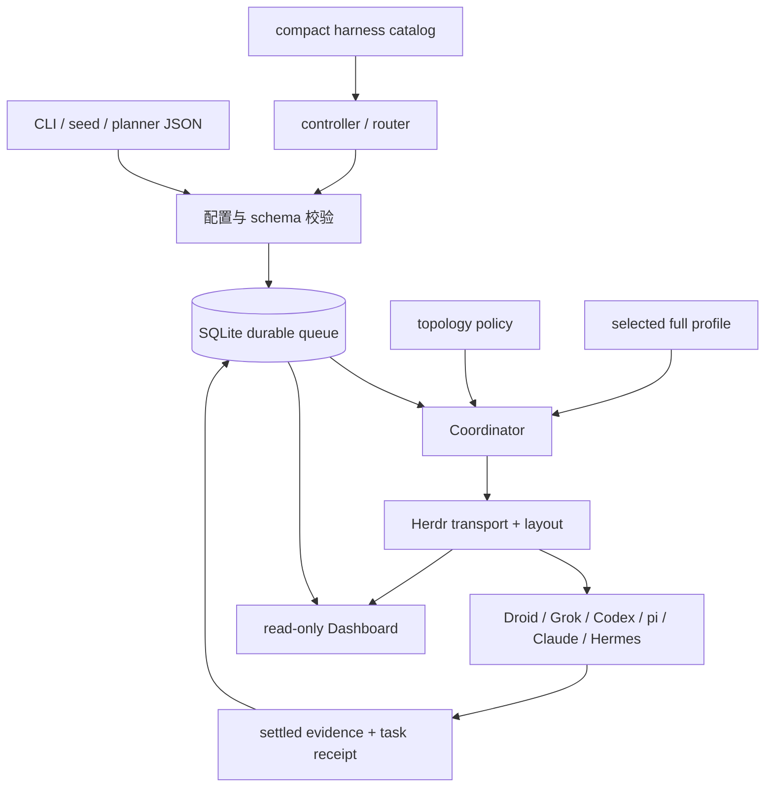
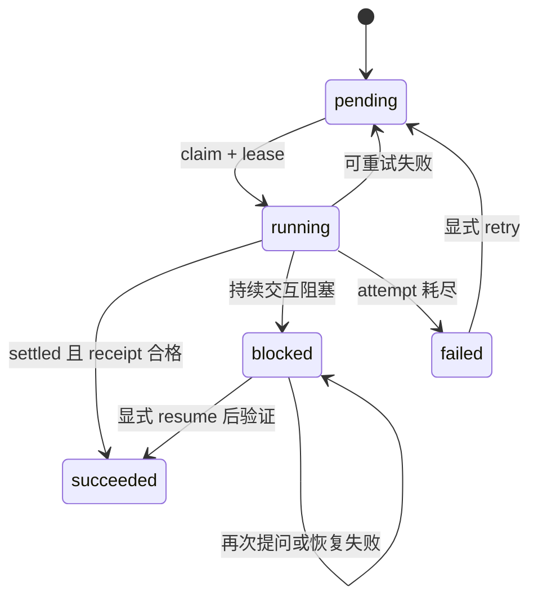

# 系统架构

Herdr Orchestrator 把“选择谁执行”“选择在哪里执行”“何时认为任务成功”拆成三个独立决策。推理 agent 只产生受 schema 约束的建议，队列状态和阶段推进始终由确定性代码拥有。

## 总体结构

`src/herdr_orchestrator/runner.py` 实现 Coordinator，`src/herdr_orchestrator/store.py` 是 durable state 真源。`src/herdr_orchestrator/herdr.py` 和 `src/herdr_orchestrator/herdr_layout.py` 把任务放入 Herdr PTY。Dashboard 通过 `src/herdr_orchestrator/dashboard/` 只读观察这两侧。

## 三条核心决策链

### Harness 选择

`profiles/harnesses/*.toml` 提供 compact catalog。Planner 或 router 只能从当前 workflow 和 runtime override 允许的候选中返回 harness 枚举。真正 dispatch 前，`src/herdr_orchestrator/catalog.py` 才读取对应 Markdown profile，并与 task packet 一起注入 worker。

### Topology 选择

`src/herdr_orchestrator/topology.py` 按以下优先级选择 `tab`、`pane` 或 `worktree`：

1. enqueue 或 seed 的显式 override；
2. worker 默认 placement；
3. 只读/写仓库的确定性规则；
4. 模糊任务交给 controller 输出严格 JSON；
5. 校验 Git 能力与枚举后写入 queue。

`src/herdr_orchestrator/herdr_layout.py` 把选择落到真实布局。Pane 任务在同一 wave 共享 tab；worktree 任务使用 Herdr 原生 worktree，并保留 checkout、workspace 与 branch 供人工审查。

### 成功判定

`src/herdr_orchestrator/model.py` 定义 `JobState`、`AgentState` 与 `DispatchOutcome`。任务可以不声明 receipt，此时兼容路径记录 `task_verified=null`；声明 `output-prefix` 或 `file` receipt 后，`src/herdr_orchestrator/herdr.py` 必须证明本 turn 产生了对应证据。

## 独立运行面

### 手动 Manager

`bin/herdr-orchestrator.mjs` 在 `manager/` 固定目录启动 Grok、Codex 或 Claude。Manager 只操作当前 Herdr session，不实现 queue、lease 或 receipt。Manager Light 位于 `plugins/manager-light/`，只投影 sidebar metadata，不改变 Agent lifecycle。

### 标准化交付

`src/herdr_orchestrator/delivery.py` 有自己的 Wayfinder、spec、ticket DAG、worktree integration 和 review protocol。它显式触发后才运行，不复用普通 queue 的 blocked 处理语义。详见[标准化交付](../systems/standardized-delivery.md)。

### Dashboard 与可观测性

`src/herdr_orchestrator/dashboard/observer.py` 只查询 SQLite 白名单列和 Herdr topology 白名单字段。`src/herdr_orchestrator/observability.py` 在 `.orchestrator/` 下写经过脱敏的事件、指标与告警；外部 exporter 由 `src/herdr_orchestrator/feature_flags.py` 默认关闭。

## 技术栈

主要运行时是无第三方生产依赖的 Python 3.12 标准库程序。Node.js 20+ 用于 npm 安装器、`herdr-manager` 包装器、Manager Light 插件和 Dashboard JavaScript 契约测试。开发依赖与质量门禁锁定在 `pyproject.toml`、`uv.lock`、`package.json` 和 `justfile`。

## 关键源文件

| 文件 | 用途 |
| --- | --- |
| `src/herdr_orchestrator/model.py` | 跨模块枚举与数据对象 |
| `src/herdr_orchestrator/config.py` | Workflow TOML 加载与 fail-closed 校验 |
| `src/herdr_orchestrator/runner.py` | 普通 queue 的调度控制 |
| `src/herdr_orchestrator/store.py` | SQLite durable state 与 migration |
| `src/herdr_orchestrator/topology.py` | Placement 决策 seam |
| `src/herdr_orchestrator/herdr.py` | Agent lifecycle 与 receipt 验证 |
| `src/herdr_orchestrator/dashboard/projector.py` | Durable/runtime 的只读关联投影 |
| `src/herdr_orchestrator/delivery.py` | Opt-in 标准化交付状态机 |

继续阅读[术语表](glossary.md)或[系统页面](../systems/index.md)。
