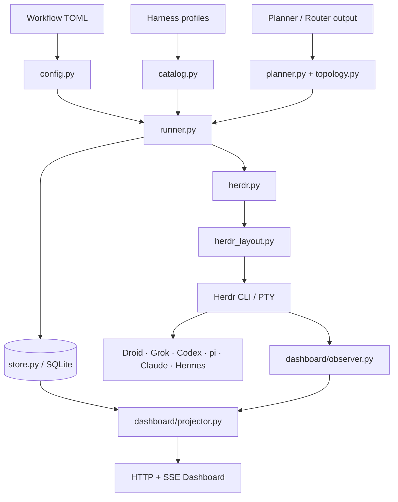
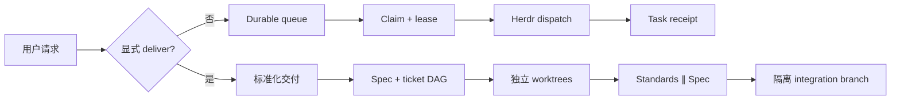
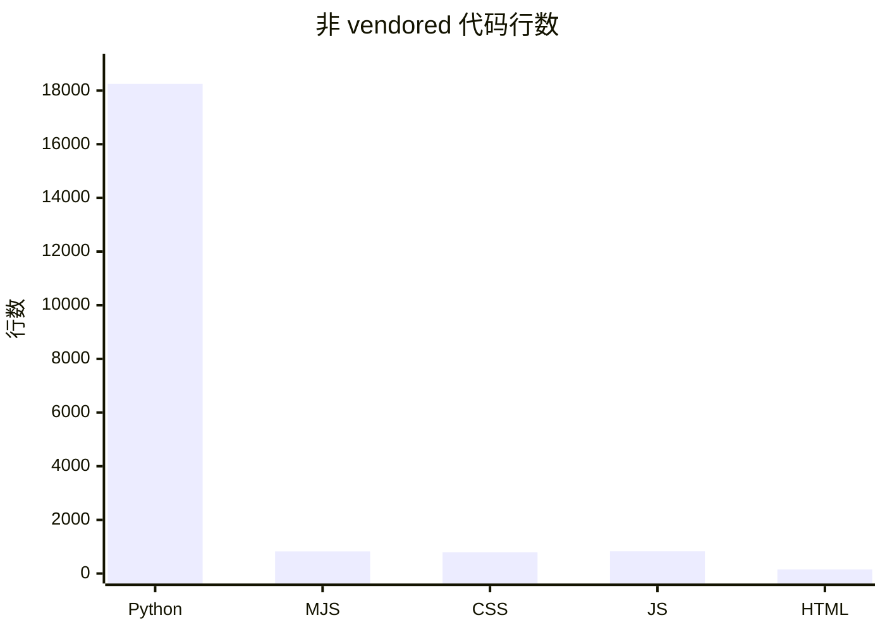

# 系统架构
Active contributors: oldwinter, chendongdong

Herdr Orchestrator 把不可信的模型输出与可信的状态推进分开。模型只产生受 schema 约束的任务、路由或交付 artifact；`src/herdr_orchestrator/runner.py`、`src/herdr_orchestrator/store.py` 和 `src/herdr_orchestrator/delivery.py` 负责验证、持久化与阶段推进。

## 总体结构

`src/herdr_orchestrator/model.py` 和 `src/herdr_orchestrator/protocol.py` 是刻意保持独立的叶子模块，`.importlinter` 禁止它们依赖 coordinator、store、delivery 或 CLI。这样领域对象与子进程协议可以在测试中单独构造。

## 控制流

1. `src/herdr_orchestrator/config.py` 读取 TOML，解析相对路径并验证 timeout、lease、worker、profile 和 runtime 目录。
2. `src/herdr_orchestrator/runner.py` 幂等入队，必要时调用受限 router 或 topology controller。
3. `src/herdr_orchestrator/store.py` 在 `BEGIN IMMEDIATE` 事务中 claim 任务，分配 replica slot、attempt、lease 和 correlation ID。
4. `src/herdr_orchestrator/catalog.py` 只在任务实际 dispatch 前加载被选中 harness 的完整 Markdown profile。
5. `src/herdr_orchestrator/herdr.py` 和 `src/herdr_orchestrator/herdr_layout.py` 创建或复用 tab、pane、worktree 和 agent，提交 prompt，并等待真实 lifecycle sequence。
6. settlement 后验证 output-prefix 或 file receipt，再由 store 原子记录 job 状态与 attempt receipt。

详见[Coordinator 与 durable queue](../systems/coordinator-and-queue.md)、[Harness catalog 与路由](../systems/catalog-and-routing.md)和[任务收据与恢复](../features/receipts-and-recovery.md)。

## 两条运行面

普通 queue 的状态真源是 `.orchestrator/state.db`。标准化交付的阶段、计划、ledger、receipt 和 review artifact 位于 `.orchestrator/deliveries/<run-id>/`，实现见 `src/herdr_orchestrator/delivery.py`。标准化交付不会复用普通 queue 的 job 状态，也不会自动 push 或合并用户分支。

## Dashboard 是旁路投影

Dashboard 不参与调度。`src/herdr_orchestrator/dashboard/observer.py` 只读查询 SQLite 白名单列并调用 Herdr 的 topology API；`src/herdr_orchestrator/dashboard/projector.py` 生成页面和测试共享的 snapshot；`src/herdr_orchestrator/dashboard/server.py` 只在 loopback 上提供静态资源、JSON 和 SSE。它不读取 job prompt、环境变量或 terminal output。

## 语言与规模

截至 2026-08-26，默认分支加当前工作区的非 vendored 已跟踪文本中，Python 是主要实现语言。这里的 Python 统计包含 `src/`、`tests/` 和 `scripts/`。

Node.js 代码分成两类：`bin/herdr-orchestrator.mjs` 负责安装和 runtime 转发，`src/herdr_orchestrator/dashboard/static/` 是无构建步骤的浏览器资源。Cytoscape 的 vendored minified bundle 未计入图表。

## 外部边界

| 边界 | 输入 | 控制 |
| --- | --- | --- |
| 本地调用者 → CLI | 路径、ID、response 文件、TOML | argparse 枚举、路径约束、长度上限 |
| 模型 → coordinator | planner、route、topology、receipt artifact | 精确 JSON schema、allowlist、DAG 校验 |
| coordinator → SQLite | 状态、attempt、lease | 参数化 SQL、事务、状态前置条件 |
| coordinator → Herdr | agent、pane、workspace、prompt | 无 shell 字符串拼接、超时、身份和 cwd 校验 |
| npm wrapper → 目标仓库 | 项目路径、manifest、现有文件 | 托管根 allowlist、SHA-256、symlink fail closed |
| Dashboard → 浏览器 | snapshot、SSE | loopback、Host 校验、CSP、只读白名单 |

安全细节见[安全](../security.md)，发布边界见[部署与发布](../deployment.md)。

## 关键源文件

| 文件 | 作用 |
| --- | --- |
| `src/herdr_orchestrator/model.py` | 共享领域模型 |
| `src/herdr_orchestrator/config.py` | Workflow schema 与路径验证 |
| `src/herdr_orchestrator/runner.py` | 普通 queue 的确定性控制流 |
| `src/herdr_orchestrator/store.py` | Durable SQLite 状态 |
| `src/herdr_orchestrator/herdr.py` | Agent lifecycle 与收据 |
| `src/herdr_orchestrator/delivery.py` | Opt-in 标准化交付 |
| `src/herdr_orchestrator/dashboard/projector.py` | 只读运行时快照 |
