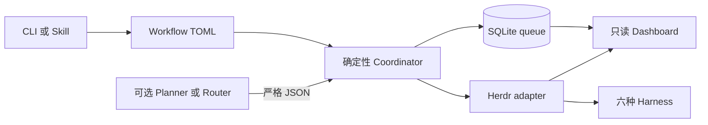

# Herdr Orchestrator
Active contributors: oldwinter, chendongdong

Herdr Orchestrator 是一个本地优先的多 harness 工作流控制面。它用确定性的 Python coordinator 管理 SQLite durable queue，再通过 Herdr 的持久 PTY 调度 Droid、Grok Build、Codex、pi、Claude Code 和 Hermes。模型可以选择 worker 或提出任务，但不能直接改变队列状态、执行任意 shell 命令或扩大外部操作权限。

## 适合谁

- 需要在一个本地仓库中并行使用多个 coding harness 的开发者；
- 需要 lease、重试、去重、收据和崩溃恢复，而不想让模型充当调度真源的维护者；
- 希望在 Herdr pane、tab 与原生 worktree 间自动选择执行位置的团队；
- 需要只读本地 Dashboard 查看 queue、agent、worktree 和 receipt 的操作者。

## 项目组成

| 区域 | 作用 |
| --- | --- |
| `src/herdr_orchestrator/` | Python 3.12+ 控制面、CLI、SQLite store、Herdr adapter 与 Dashboard |
| `workflows/` | 声明式 TOML 工作流与示例 prompt |
| `profiles/harnesses/` | 六种 harness 的紧凑 catalog 和按需加载的完整 profile |
| `bin/herdr-orchestrator.mjs` | npm 安装、升级、诊断、卸载和 runtime 转发入口 |
| `skills/herdr-orchestrator/SKILL.md` | 可独立安装的 agent 操作说明 |
| `tests/` | 生命周期、队列、安装器、Dashboard、交付协议和安全边界的行为测试 |

Python 包没有运行时第三方依赖，`pyproject.toml` 只声明 Python 3.12+。npm 包也没有运行时 npm 依赖，`package.json` 只暴露一个 Node.js 20+ wrapper。完整依赖和工具链见[依赖参考](../reference/dependencies.md)。

## 主要运行面

普通工作使用 durable queue，包括 `enqueue`、`run`、`retry`、`resume` 和 `gc`。显式触发的标准化交付使用另一套 ticket DAG、隔离 worktree、双轴 review 和有界 repair 流程，成功后停在隔离 integration branch。两条运行面不会混用状态语义，详见[系统架构](architecture.md)、[Durable execution](../features/durable-execution.md)和[标准化交付](../systems/standardized-delivery.md)。

## 快速链接

- [开始使用](getting-started.md)
- [系统架构](architecture.md)
- [术语表](glossary.md)
- [Coordinator 与 durable queue](../systems/coordinator-and-queue.md)
- [Herdr runtime](../systems/herdr-runtime.md)
- [本地 Dashboard](../systems/dashboard.md)
- [工作流配置参考](../reference/configuration.md)
- [调试与故障定位](../how-to-contribute/debugging.md)

## 安全边界

普通 queue 默认不授权 push、merge、发布、发送消息、删除 worktree、权限变更或生产操作。新 agent 会使用每个 CLI 支持的最高本地自动化参数，但这些参数只减少本地确认，不扩大任务授权。详细信任边界见[安全](../security.md)。

## 关键源文件

| 文件 | 作用 |
| --- | --- |
| `src/herdr_orchestrator/cli.py` | 命令解析、诊断、smoke 和运行入口 |
| `src/herdr_orchestrator/runner.py` | Coordinator、并发波次、路由和恢复 |
| `src/herdr_orchestrator/store.py` | SQLite schema、claim、lease、状态与 receipt |
| `src/herdr_orchestrator/herdr.py` | Herdr agent 生命周期和任务收据验证 |
| `src/herdr_orchestrator/model.py` | 跨模块领域枚举和不可变数据结构 |
| `workflows/multi-harness.toml` | 默认六 harness 工作流 |
