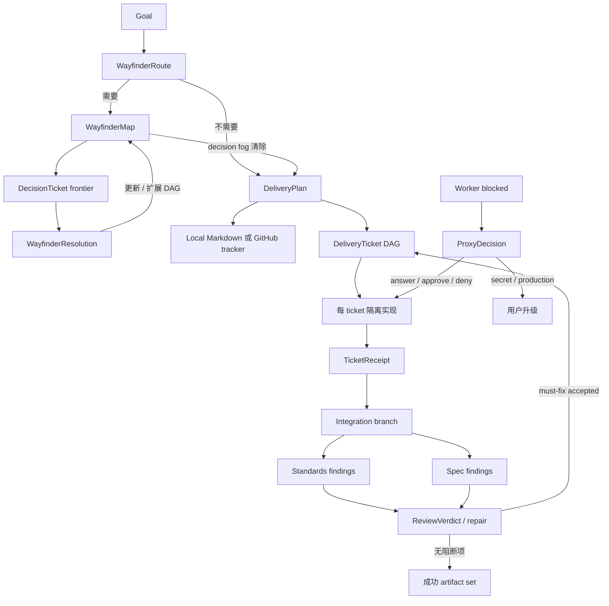

# 交付 Artifact
Active contributors: oldwinter, chendongdong

## Purpose

交付 artifact 是显式标准化交付运行面中，controller、worker、reviewer 与确定性 `StandardizedDelivery` 之间交换的严格 JSON。它们把 Wayfinder 决策、可执行规格、ticket 验收、双轴 review 和 principal-proxy 权限判断变成可验证、可恢复的领域对象。阶段编排和 worktree 集成细节见[标准化交付](../systems/standardized-delivery.md)；这些对象不复用普通 durable queue 的 `JobState` 或 SQLite receipt。

## 关键 dataclass / enum

### Wayfinder 与规格

| 类型 | 作用 |
| --- | --- |
| `WayfinderRoute` | `use_wayfinder` 与原因；在 `auto` 模式决定是否先消除 decision fog。 |
| `DecisionTicket` | 一个研究、原型、grilling 或 task 决策节点，含前置节点与可选 resolution。 |
| `WayfinderMap` | destination、notes、决策 DAG、尚未规格化项与 out-of-scope。 |
| `WayfinderResolution` | 解析一个 frontier decision，并可追加新的未解析决策。 |
| `DeliveryPlan` | 交付 slug、问题、方案、stories、实现/测试决策、seams 与 ticket DAG。 |
| `DeliveryTicket` | 单个 tracer-bullet 工作项、依赖和有序 acceptance criteria。 |

### 实现、评审与代理

| 类型 | 作用 |
| --- | --- |
| `AcceptanceResult` | 一条 criterion 的 pass/fail 与 evidence。 |
| `TicketReceipt` | ticket ID、commit、与规格逐项对齐的 acceptance、checks 和 summary。 |
| `FindingSeverity` | `must-fix` 或 `advisory`。 |
| `ReviewFinding` / `ReviewReport` | Standards 与 Spec 两个独立轴的 finding；`must_fix` 属性合并两个轴的阻断项。 |
| `ReviewVerdict` | 对候选 finding 做 accepted / dismissed 完整分区。 |
| `ProxyAction` | `answer`、`approve`、`deny`、`escalate`。 |
| `AuthorityCategory` | `local-reversible`、`spec-authorized`、`secret`、`production`。 |
| `ProxyDecision` | 有界 principal proxy 的动作、权限类别、响应和理由。 |

所有定义和 loader 的真源是 `src/herdr_orchestrator/delivery_protocol.py`。

## Artifact 关系与生命周期



运行中的阶段事件另记入 `.orchestrator/deliveries/<run-id>/decision-ledger.jsonl`；该 ledger 是可恢复的事件证据，不是 `delivery_protocol.py` 中的 JSON object dataclass。成功停在隔离 integration branch，不自动 push、merge 或 deploy。

## 通用验证规则

- 所有 loader 只接受 UTF-8 JSON object；缺文件、非法 JSON、非 object 分别产生稳定的 artifact error。
- 每类 artifact 都要求 **exact keys**，多字段与少字段同样拒绝。
- 必填文本会 `strip()`，必须非空且不超过该字段上限；可选文本仍必须是字符串。
- Object / string list 通常最多 100 项，并逐项校验类型、空白和长度。
- 标识符使用以下正则：

```text
slug      [a-z0-9][a-z0-9-]{0,62}
ticket ID \d{2,3}
commit    [0-9a-f]{7,64}
```

## 按 artifact 的验证规则

### Wayfinder

- Decision ID 在 map 内唯一，`kind` 只能是 `research`、`prototype`、`grilling`、`task`。
- `blocked_by` 必须只引用列表中更早出现的 decision，因此输入顺序本身就是拓扑顺序。
- Resolution 的 `ticket_id` 必须等于当前 selected ticket。
- 新 decision 不得与 known ID 重复、不得预先带 resolution；它的 blocker 必须已在当前 available ID 集中。每接受一项，新 ID 才加入 available 集。

### Delivery plan 与 ticket receipt

- Plan 至少有一个 ticket；`user_stories`、`implementation_decisions`、`testing_decisions` 和 `seams` 都不得为空。
- Ticket ID 唯一，blocker 必须先于被阻塞 ticket，且每个 ticket 至少有一条 acceptance criterion。
- `TicketReceipt.ticket_id` 必须与目标 ticket 相同，commit 必须是 7–64 位小写十六进制。
- Receipt 中 acceptance 的 criterion 序列必须与 ticket 的 acceptance criteria **逐项、同顺序完全相等**。
- Acceptance 不得为空且每项 `passed` 必须为 `true`；`checks` 也必须非空。任何失败都不能形成有效 receipt。

### Review 与 principal proxy

- Review axis 只能是 `standards` 或 `spec`；finding severity 必须属于 `FindingSeverity`。
- `ReviewVerdict.accepted` 与 `dismissed` 不能重叠，二者并集必须完整覆盖传入的 candidates。
- 非 `escalate` 的 proxy action 必须提供非空 response。
- `secret` 与 `production` 类别只允许 `escalate`；即使模型输出 `approve` 也由 loader 拒绝。

## 集成点：Artifact 与外部对象的关系

| Artifact | 确定性消费者 | 集成结果 |
| --- | --- | --- |
| `DeliveryPlan` | `StandardizedDelivery` + tracker | 发布 spec / ticket，计算可并行 frontier |
| `TicketReceipt` | delivery coordinator + tracker | 核验 commit / acceptance / checks，关闭对应 ticket |
| `ReviewReport` / axis findings | review 汇总与 repair loop | 判断是否进入有界 repair round |
| `ReviewVerdict` | controller | 对所有候选 finding 完整裁决 |
| `ProxyDecision` | blocked response loop | 规格内、本地问题可回答；敏感边界升级用户 |

默认配置在 `workflows/multi-harness.toml` 中声明：

- tracker 为 `local-markdown`；
- artifact root 为 `.orchestrator/deliveries`；
- Wayfinder 为 `auto`；
- ticket 并发上限为 3；
- review repair 最多 2 轮。

Tracker 可以把同一 `DeliveryPlan` 投影成本地 Markdown 或 GitHub issues；artifact loader 仍是内部 schema 真源。Tracker 的幂等和冲突保护属于系统集成，不改变这些 dataclass，参见[标准化交付](../systems/standardized-delivery.md)与[数据模型参考](../reference/data-models.md)。

## 修改入口

| 目标 | 首选入口 | 必须同步 |
| --- | --- | --- |
| 改 JSON shape、enum、上限或 DAG 规则 | `src/herdr_orchestrator/delivery_protocol.py` | 所有 artifact prompt、恢复兼容性和 protocol tests |
| 改 artifact 生成顺序或 repair lifecycle | `src/herdr_orchestrator/delivery.py` | decision ledger、已有 run 恢复和 integration tests |
| 改 tracker 投影 | `src/herdr_orchestrator/tracker.py` | 本地冲突检测与 GitHub issue 行为 |
| 改默认 artifact root / Wayfinder / 并发 / repair | `workflows/multi-harness.toml` | config validation 与 CLI bounded override |

不要只改 dataclass 而不改 loader：系统只信任 loader 产出的对象；也不要放宽 exact-key 或敏感类别升级规则来容忍模型输出。

## 关键源文件

- `src/herdr_orchestrator/delivery_protocol.py`
- `src/herdr_orchestrator/model.py`
- `src/herdr_orchestrator/delivery.py`
- `src/herdr_orchestrator/tracker.py`
- `workflows/multi-harness.toml`
- `tests/test_delivery_protocol.py`
- `tests/test_delivery.py`
- `tests/test_tracker.py`
