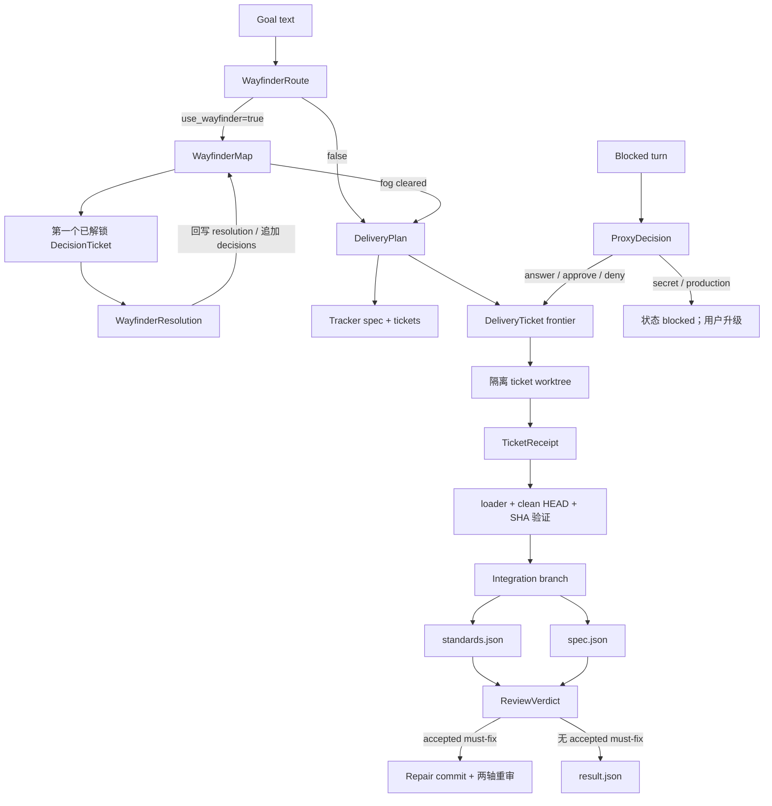
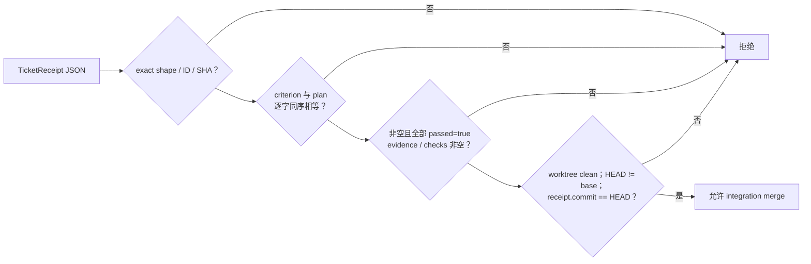

# 交付 Artifact
Active contributors: oldwinter, chendongdong

## Purpose

交付 artifact 是 opt-in 标准化交付中，controller、worker、reviewer 与确定性 coordinator 之间的**严格、可验证、可恢复**的数据协议。它们把 decision fog、accepted spec、ticket DAG、commit 验收、双轴 review 和 principal-proxy 权限判断变成 `frozen=True, slots=True` 的领域对象；agent 只能写协议允许的 JSON，只有 loader 接受后的对象才能推进状态。

这些 artifact 不复用普通 durable queue 的 SQLite `JobState`、attempt receipt 或 task receipt。标准化交付的阶段机见[标准化交付](../systems/standardized-delivery.md)，普通 queue 数据见[数据模型](../reference/data-models.md)，worktree 与 checkout 隔离见[Placement 与 worktree](placement-and-worktrees.md)，secret / production 边界见[安全与信任边界](../security.md)。

下文所有源码和测试路径均为从仓库根开始的完整路径。

## 目录与文件布局

### 协议实现

```text
src/herdr_orchestrator/
├── delivery_protocol.py  # dataclass、enum、正则、exact-key loader
├── delivery_prompts.py   # artifact producer 看到的 exact schema
├── delivery.py           # artifact lifecycle、落盘、复用与确定性消费
├── tracker.py            # DeliveryPlan / TicketReceipt 的外部投影
└── git_workspace.py      # receipt commit 对应的 Git 事实

tests/
├── test_delivery_protocol.py
├── test_delivery.py
└── test_tracker.py
```

类型与 loader 的单一真源是 [`src/herdr_orchestrator/delivery_protocol.py`](../../src/herdr_orchestrator/delivery_protocol.py)。[`src/herdr_orchestrator/delivery_prompts.py`](../../src/herdr_orchestrator/delivery_prompts.py) 负责要求 agent 生成同一 shape，但 prompt 不是验证器；最终仍以 loader 结果为准。

### 运行 artifact set

```text
<artifact_root>/<run-id>/
├── state.json
├── result.json
├── decision-ledger.jsonl
├── delivery-plan.json
├── wayfinder-route.json
├── wayfinder-map.json
├── wayfinder/resolution-<id>.json
├── routes/<digest>.json
├── proxy/<agent>-<round>.json
├── receipts/ticket-<id>.json
├── reviews/round-<n>/
│   ├── standards.json
│   ├── spec.json
│   └── verdict.json
└── worktrees/
    ├── integration/
    └── ticket-<id>/
```

这个目录混合了四种不同性质的对象：

1. **Agent protocol artifact**：Wayfinder、plan、receipt、review、verdict、proxy；由 `delivery_protocol.py` 的 loader 校验。
2. **Router artifact**：`routes/*.json`；由 worker-selection loader 按 enabled harness allowlist 校验。
3. **Coordinator runtime metadata**：`state.json`、`result.json`、`decision-ledger.jsonl`；由 [`src/herdr_orchestrator/delivery.py`](../../src/herdr_orchestrator/delivery.py) 写入和读取，不是 protocol dataclass。
4. **Git evidence**：`worktrees/` 及 branch/HEAD/clean 状态；必须由 [`src/herdr_orchestrator/git_workspace.py`](../../src/herdr_orchestrator/git_workspace.py) 验证，不能只信 receipt 文本。

## 关键抽象

协议层用不可变 dataclass 表达阶段数据，用 enum 限制有授权含义的离散值；每个对象都必须由对应 loader 从不可信 JSON 构造。

### Wayfinder 与 accepted spec

| 类型 | 关键字段 | 领域含义 |
| --- | --- | --- |
| `WayfinderRoute` | `use_wayfinder`, `reason` | `auto` 模式是否先清除 decision fog。 |
| `DecisionTicket` | ID、question、kind、blockers、resolution | 一项 research / prototype / grilling / task 决策节点。 |
| `WayfinderMap` | destination、decisions、fog、out-of-scope | 形成完整规格前的 dependency-ordered decision map。 |
| `WayfinderResolution` | selected ID、resolution、new decisions、remaining fog | 一次 fresh turn 对单个 frontier decision 的解析。 |
| `DeliveryPlan` | slug、problem/solution、stories、decisions、seams、tickets | Accepted spec 与可执行 ticket DAG。 |
| `DeliveryTicket` | ID、what-to-build、blockers、acceptance criteria | 一个 fresh context 可完成的 tracer-bullet 垂直切片。 |

### 实现、审查与 principal proxy

| 类型 / enum | 值或字段 | 领域含义 |
| --- | --- | --- |
| `AcceptanceResult` | criterion、passed、evidence | 一条 acceptance criterion 的可观察证明。 |
| `TicketReceipt` | ticket ID、commit、acceptance、checks、summary | 把 plan criterion 与 clean worktree HEAD 绑定的完成证明。 |
| `FindingSeverity` | `must-fix`, `advisory` | Finding 是否可能阻断最终 gate。 |
| `ReviewFinding` | severity、summary、evidence、source | Standards 或 Spec reviewer 的带引用候选结论。 |
| `ReviewReport` | standards、spec | 两轴 finding 聚合；`must_fix` 是计算属性，不单独持久化。 |
| `ReviewVerdict` | accepted、dismissed、rationale | Controller 对候选 finding 的完整且不重叠分区。 |
| `ProxyAction` | `answer`, `approve`, `deny`, `escalate` | 对一个 blocked worker 问题的动作。 |
| `AuthorityCategory` | `local-reversible`, `spec-authorized`, `secret`, `production` | Principal-proxy authority 分类。 |
| `ProxyDecision` | action、category、response、rationale | 有界代理决策；protected category 只能 escalate。 |

## Artifact 生命周期



Artifact 是阶段边界，而不是自描述命令。`DeliveryPlan` 不允许嵌入 shell command 或预定文件路径；`TicketReceipt` 不能要求 coordinator 执行任意命令；`ProxyDecision` 也不能扩大 accepted spec 或 tracker 文本授予的权限。

## 通用验证规则

[`src/herdr_orchestrator/delivery_protocol.py`](../../src/herdr_orchestrator/delivery_protocol.py) 的所有 loader 都遵循以下规则：

- 输入文件必须存在，内容必须能解析为 UTF-8 JSON object；
- object 的 key 集必须**恰好匹配**，额外字段与缺失字段同样拒绝；
- 必填文本会 `strip()`，必须非空且不超过该字段上限；
- 可选文本仍必须是字符串并受长度限制；
- object/string list 通常最多 100 项，每项逐一校验类型、空白和长度；
- enum 必须是定义值，不能把未知字符串静默降级；
- dependency edge 必须指向列表中已经出现的节点，因此输入顺序本身就是拓扑顺序；
- loader 返回不可变 dataclass；调用方不应绕过 loader 直接构造来自模型的对象。

标识符正则为：

```text
slug       [a-z0-9][a-z0-9-]{0,62}
ticket ID  \d{2,3}
commit     [0-9a-f]{7,64}
```

稳定错误以 artifact 和字段命名，例如 `delivery_plan_tickets_empty`、`ticket_blocker_must_precede_ticket`、`ticket_receipt_acceptance_mismatch`、`review_verdict_incomplete`、`proxy_decision_must_escalate`。

## 各 artifact 契约

### Wayfinder route、map 与 resolution

| Artifact | Exact keys | 额外不变量 |
| --- | --- | --- |
| `wayfinder-route.json` | `use_wayfinder`, `reason` | `use_wayfinder` 必须是 bool；只在 `auto` 模式需要。 |
| `wayfinder-map.json` | `destination`, `notes`, `decisions`, `not_yet_specified`, `out_of_scope` | Decision ID 唯一；kind 只允许四种；blocker 必须先出现。 |
| `wayfinder/resolution-<id>.json` | `ticket_id`, `resolution`, `new_decisions`, `not_yet_specified`, `out_of_scope` | `ticket_id` 必须等于当前 selected decision；新 ID 未使用、不可预先 resolved，blocker 必须已知。 |

Map 中每个 decision 的 exact keys 为 `id`、`title`、`question`、`kind`、`blocked_by`、`resolution`。Coordinator 每次只接受当前 frontier 的一个 resolution，然后把其结果确定性地重写回 map；全部 decision resolved 后，`not_yet_specified` 仍非空也不能进入 plan。

### Delivery plan

`delivery-plan.json` 的 exact keys 是：

```text
slug, title, problem_statement, solution,
user_stories, implementation_decisions, testing_decisions,
out_of_scope, further_notes, seams, tickets
```

每个 ticket 的 exact keys 是 `id`、`title`、`what_to_build`、`blocked_by`、`acceptance_criteria`。关键约束：

- 至少一个 ticket；
- `user_stories`、`implementation_decisions`、`testing_decisions`、`seams` 都非空；
- ticket ID 唯一；
- blocker 只能引用更早的 ticket；
- acceptance criteria 至少一项；
- ticket 数和各 list 长度受上限约束。

`DeliveryPlan` 同时被 coordinator 和 tracker 消费：前者计算 frontier、生成 implementation/review prompt，后者投影为 spec 与 issue 文本。Tracker 投影不改变 plan 的内部协议真源。

### Ticket receipt

`receipts/ticket-<id>.json` 的 exact keys 是 `ticket_id`、`commit`、`acceptance`、`checks`、`summary`；每条 acceptance 的 exact keys 是 `criterion`、`passed`、`evidence`。

Loader 与 Git 验证共同形成验收：



因此 receipt 不是 agent 的自我声明：合法 JSON 仍必须与当前 worktree Git 事实一致。任何 failed criterion 都不能形成有效成功 receipt。

### Review axis 与 verdict

`standards.json` 只允许顶层 `standards`，`spec.json` 只允许顶层 `spec`。每个 finding 的 exact keys 是 `severity`、`summary`、`evidence`、`source`；severity 只能是 `must-fix` 或 `advisory`。

Coordinator 按稳定顺序给候选编号为 `standards:<n>` 与 `spec:<n>`。`verdict.json` 只允许 `accepted`、`dismissed`、`rationale`，并要求：

- accepted 与 dismissed 不重叠；
- 两者并集完整覆盖传入的所有 candidate ID；
- 不能漏掉、重复分类或凭空增加 finding。

Finding 只是 reviewer 的 hypothesis；只有 controller 接受的 `must-fix` 才进入 repair。协议完整性保证每个候选被裁决，但不替代 citation 的语义判断。

### Principal-proxy decision

`proxy/<agent>-<round>.json` 只允许 `action`、`category`、`response`、`rationale`。

- 非 `escalate` action 必须提供非空 response；
- `secret` 和 `production` category 只允许 `escalate`；
- 即使模型对 protected category 输出 `approve`，loader 也返回 `proxy_decision_must_escalate`；
- 实际发给 worker 的 response 不写入 decision ledger；ledger 只保留 question hash、action、category 与 rationale。

在生成这个 artifact 之前，[`src/herdr_orchestrator/delivery.py`](../../src/herdr_orchestrator/delivery.py) 还会对 blocked output 做敏感关键词检查。Schema guard 与前置内容 guard 是两层独立控制。

## Coordinator runtime metadata

下列文件属于同一恢复目录，但不是 `delivery_protocol.py` 的 agent artifact：

| 文件 | 写入者 / 读取者 | 语义 |
| --- | --- | --- |
| `state.json` | `StandardizedDelivery` | 当前/终止 status 与 stage；异常时保存异常类型。 |
| `decision-ledger.jsonl` | `StandardizedDelivery` | 追加 route、plan、worker、tracker、ticket、review、repair 与 proxy 决策事件；每行含 event、时间与 details。 |
| `routes/<digest>.json` | Controller → worker-selection loader | 精确 `{"harness":"..."}`，且 harness 必须在本次 enabled worker pool。 |
| `result.json` | `StandardizedDelivery` | 仅成功后写入；包含 run ID、artifact root、tracker references、integration branch/commit、完成数与 review 次数。 |
| `worktrees/` | `GitWorkspace` + Git | Checkout、branch、index 与 HEAD；不是 JSON schema，按 Git 事实验证。 |

`result.json` 有独立 exact-shape 和值校验：run ID 必须匹配当前确定性 run，status 必须为 `succeeded`，artifact root 必须解析到文件父目录，计数字段必须是真正的整数。合法 completed result 会短路重复运行。

## 持久化、复用与冲突

Coordinator 自己写入或重写的 state、result 与 map 通过同目录临时文件原子 replace；agent 负责产出的 artifact 不因此自动获得原子写保证，消费前必须重新经过 loader。已有 agent artifact 只有在路径存在且 loader 仍接受时才可复用；`TicketReceipt` 恢复还必须重新验证 worktree clean commit 与 SHA。缺失的必需 artifact 会在同一 ready agent 上重试一次生成，不能由普通 prose 代替。

Local Markdown tracker 以 `DeliveryPlan` 和 `TicketReceipt` 生成外部文件：

```text
<tracker_root>/<slug>/
├── spec.md
└── issues/
    └── <ticket-id>-<title>.md
```

匹配内容可复用；不匹配的 spec、ready ticket 或 completed ticket 产生 `tracker_artifact_conflict`，不会覆盖人工修改。GitHub tracker 把同一 plan/receipt 投影为 issue create/edit/close；GitHub URL 或登录态不属于 artifact schema，也不能扩大交付权限。

失败和 principal-proxy 升级会保留 artifact 与 worktree。恢复时应同时核对 JSON loader、ledger、tracker 和 Git 事实；删除现场、force-reset branch 或手改 receipt 会破坏恢复证据。运行语义见[标准化交付](../systems/standardized-delivery.md)与 [`.agents/skills/standardized-delivery/references/recovery.md`](../../.agents/skills/standardized-delivery/references/recovery.md)。

## 集成点

| 上下游 | Artifact 接口 | 约束 |
| --- | --- | --- |
| Prompt producer | [`src/herdr_orchestrator/delivery_prompts.py`](../../src/herdr_orchestrator/delivery_prompts.py) | 向 agent 展示 exact schema、角色权限和唯一输出路径；不能替代 loader。 |
| Deterministic lifecycle | [`src/herdr_orchestrator/delivery.py`](../../src/herdr_orchestrator/delivery.py) | 只消费已验证对象，拥有 frontier、状态转换、retry bound 与最终成功。 |
| Git | [`src/herdr_orchestrator/git_workspace.py`](../../src/herdr_orchestrator/git_workspace.py) | 独立验证 receipt 指向 clean、非 base 的当前 HEAD。 |
| Tracker | [`src/herdr_orchestrator/tracker.py`](../../src/herdr_orchestrator/tracker.py) | 把 plan/receipt 投影为 Markdown 或 GitHub issue，不反向改变内部 schema。 |
| Config | [`src/herdr_orchestrator/model.py`](../../src/herdr_orchestrator/model.py)、[`workflows/multi-harness.toml`](../../workflows/multi-harness.toml) | 决定 artifact root、Wayfinder、tracker、frontier 并发与 repair 上限。 |
| Queue / Dashboard | [Coordinator 与队列](../systems/coordinator-and-queue.md)、[数据模型](../reference/data-models.md) | Delivery artifact 不写 SQLite jobs/receipts；当前 Dashboard 不解析 delivery run root。 |
| Security | [安全与信任边界](../security.md) | 模型输出、tracker 文本和 terminal output 都不可信；exact schema 不等于 sandbox 或外部授权。 |

默认 [`workflows/multi-harness.toml`](../../workflows/multi-harness.toml) 使用 Local Markdown tracker、`.orchestrator/deliveries` artifact root、`wayfinder=auto`、最多 3 个并行 ticket worktree、最多 2 轮 review repair。

## 修改入口

| 想修改的行为 | 首要入口 | 必须同步检查 |
| --- | --- | --- |
| JSON shape、enum、正则、文本/列表上限 | [`src/herdr_orchestrator/delivery_protocol.py`](../../src/herdr_orchestrator/delivery_protocol.py) | [`src/herdr_orchestrator/delivery_prompts.py`](../../src/herdr_orchestrator/delivery_prompts.py)、旧 artifact 恢复兼容和 [`tests/test_delivery_protocol.py`](../../tests/test_delivery_protocol.py)。 |
| DAG edge 或 Wayfinder 新 decision 规则 | [`src/herdr_orchestrator/delivery_protocol.py`](../../src/herdr_orchestrator/delivery_protocol.py) | Frontier 选择、plan prompt、stalled error 与 [`tests/test_delivery.py`](../../tests/test_delivery.py)。 |
| Receipt 与 Git 绑定 | [`src/herdr_orchestrator/delivery_protocol.py`](../../src/herdr_orchestrator/delivery_protocol.py)、[`src/herdr_orchestrator/git_workspace.py`](../../src/herdr_orchestrator/git_workspace.py) | Criteria 同序匹配、dirty/missing commit、SHA mismatch、merge gate 与恢复。 |
| Artifact 生成顺序、目录、复用或 result | [`src/herdr_orchestrator/delivery.py`](../../src/herdr_orchestrator/delivery.py) | Run ID、state/ledger、已完成 run 短路、原子写入和 [`tests/test_delivery.py`](../../tests/test_delivery.py)。 |
| Review candidate ID 或 adjudication | [`src/herdr_orchestrator/delivery.py`](../../src/herdr_orchestrator/delivery.py)、[`src/herdr_orchestrator/delivery_protocol.py`](../../src/herdr_orchestrator/delivery_protocol.py) | 两轴 prompt、完整分区、must-fix repair 和 repair bound。 |
| Tracker Markdown / GitHub 投影 | [`src/herdr_orchestrator/tracker.py`](../../src/herdr_orchestrator/tracker.py) | Plan/receipt 字段、冲突保护、权限范围和 [`tests/test_tracker.py`](../../tests/test_tracker.py)。 |
| Principal-proxy category 或 action | [`src/herdr_orchestrator/delivery_protocol.py`](../../src/herdr_orchestrator/delivery_protocol.py)、[`.agents/skills/standardized-delivery/references/authority.md`](../../.agents/skills/standardized-delivery/references/authority.md) | 敏感前置检查、prompt、ledger、退出码和安全页；protected category 必须继续 fail closed。 |

不要只改 dataclass 而不改 loader，也不要只改 prompt 而放宽验证器来迁就模型输出。新增字段若影响已保存 artifact，必须定义明确的向后兼容或迁移策略。

## Key source files

| 文件 | 为什么关键 |
| --- | --- |
| [`src/herdr_orchestrator/delivery_protocol.py`](../../src/herdr_orchestrator/delivery_protocol.py) | Artifact dataclass/enum、exact-key schema、正则、长度/数量、DAG 和 protected-category 不变量。 |
| [`src/herdr_orchestrator/delivery_prompts.py`](../../src/herdr_orchestrator/delivery_prompts.py) | 每个 artifact producer 的角色、权限、exact schema 与唯一写入路径。 |
| [`src/herdr_orchestrator/delivery.py`](../../src/herdr_orchestrator/delivery.py) | Artifact 生成、加载、复用、ledger、frontier、review lifecycle 与 completed result。 |
| [`src/herdr_orchestrator/git_workspace.py`](../../src/herdr_orchestrator/git_workspace.py) | TicketReceipt 的 commit、clean tree、base commit 与 integration merge 事实。 |
| [`src/herdr_orchestrator/tracker.py`](../../src/herdr_orchestrator/tracker.py) | DeliveryPlan / TicketReceipt 到 Local Markdown 或 GitHub Issues 的投影。 |
| [`src/herdr_orchestrator/model.py`](../../src/herdr_orchestrator/model.py) | 标准化交付配置 enum/dataclass 与默认运行参数的类型层。 |
| [`tests/test_delivery_protocol.py`](../../tests/test_delivery_protocol.py) | Dependency order、verdict completeness、secret/production escalation 等 loader 契约。 |
| [`tests/test_delivery.py`](../../tests/test_delivery.py) | Artifact retry/reuse、parallel frontier、Wayfinder、proxy 与双轴 review 的生命周期契约。 |
| [`tests/test_tracker.py`](../../tests/test_tracker.py) | Plan/receipt 投影、Local 冲突保护与 GitHub issue mutation 范围。 |
