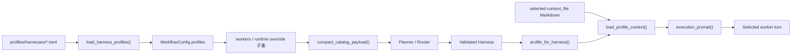

# Harness profile
Active contributors: oldwinter, chendongdong

## Purpose

Harness profile 是 worker 能力与执行约束的 canonical description。每个 harness 有一份紧凑 TOML，供 planner/router 选择；另有一份完整 Markdown，只在该 harness 已选中后交给 worker。两层共享同一个 `HarnessProfile`，但读取时机不同。

Profile 描述“适合做什么、应如何工作”，不授予动作权限。即使某 harness 支持自动批准、联网工具或 worktree，也不能据此推导 push、发布、删除、权限或生产操作授权。选择链路见 [Harness catalog 与路由](../systems/catalog-and-routing.md)，启动与 readiness 见 [Harness readiness 与自动化](../features/harness-readiness-and-automation.md)。

下文源码路径均为仓库根目录完整路径。

## 目录布局

```text
profiles/harnesses/
├── droid.toml       # compact metadata
├── droid.md         # full execution context
├── grok.toml
├── grok.md
├── codex.toml
├── codex.md
├── pi.toml
├── pi.md
├── claude.toml
├── claude.md
├── hermes.toml
└── hermes.md

src/herdr_orchestrator/model.py          # Harness 与 HarnessProfile
src/herdr_orchestrator/catalog.py        # schema、loader、compact/full payload
src/herdr_orchestrator/config.py         # profile 与 workflow worker 交叉校验
src/herdr_orchestrator/planner.py        # compact catalog 消费方
src/herdr_orchestrator/runner.py         # dispatch 前完整 context 消费方
workflows/multi-harness.toml              # 六 profile 全量启用
workflows/grok-research.toml              # 只启用 Grok worker
tests/test_catalog.py                    # 两级 profile 行为契约
```

## 关键抽象

| 类型 / 函数 | 完整源码路径 | 关系 |
| --- | --- | --- |
| `Harness` | [`src/herdr_orchestrator/model.py`](../../src/herdr_orchestrator/model.py) | Profile、worker、job 与 Herdr launch 共用的稳定身份枚举。 |
| `HarnessProfile` | [`src/herdr_orchestrator/model.py`](../../src/herdr_orchestrator/model.py) | 保存 TOML 路由元数据与已校验的 `context_file: Path`。 |
| `WorkerConfig` | [`src/herdr_orchestrator/model.py`](../../src/herdr_orchestrator/model.py) | Workflow 启用哪些 harness，并定义 replicas 与可选 placement；`capabilities` 不是路由真源。 |
| `PlannerConfig` | [`src/herdr_orchestrator/model.py`](../../src/herdr_orchestrator/model.py) | 进一步收窄 controller 可见的 worker harness 集。 |
| `WorkflowConfig` | [`src/herdr_orchestrator/model.py`](../../src/herdr_orchestrator/model.py) | 同时保存全 profiles、当前 workers 与 planner 配置。 |
| `load_harness_profiles()` | [`src/herdr_orchestrator/catalog.py`](../../src/herdr_orchestrator/catalog.py) | 解析 `*.toml`，验证 exact keys、值边界、context path 与 harness 唯一性。 |
| `compact_catalog_payload()` | [`src/herdr_orchestrator/catalog.py`](../../src/herdr_orchestrator/catalog.py) | 生成不含完整 context 的 schema v1 payload。 |
| `load_profile_context()` | [`src/herdr_orchestrator/catalog.py`](../../src/herdr_orchestrator/catalog.py) | Dispatch 时读取 Markdown，校验非空与 50,000 字符上限。 |
| `execution_prompt()` | [`src/herdr_orchestrator/catalog.py`](../../src/herdr_orchestrator/catalog.py) | 拼接一个 selected profile 与 task packet。 |

## 两级加载工作流



### Compact 层

TOML 的字段只服务于路由和查找：

| 字段 | 约束 |
| --- | --- |
| `schema_version` | integer，当前只能为 `1`；bool 不算 integer |
| `harness` | 必须能转为六值 `Harness`，目录内唯一 |
| `display_name` | 非空，最长 80 字符 |
| `summary` | 非空，最长 300 字符 |
| `strengths` | 1–12 项；每项非空、最长 120 字符 |
| `best_for` | 1–12 项；每项非空、最长 160 字符 |
| `avoid_for` | 1–12 项；每项非空、最长 160 字符 |
| `traits` | 1–12 项；每项非空、最长 160 字符 |
| `context_file` | 非空相对路径，最长 255 字符，目标文件必须存在 |

[`src/herdr_orchestrator/catalog.py`](../../src/herdr_orchestrator/catalog.py) 的 `PROFILE_KEYS` 是 exact allowlist；额外字段会报 `profile_unknown_keys`。Loader 按 TOML 文件名排序，目录不存在、没有 profile 或同一 harness 重复均失败。

Compact JSON 为每个 harness 增加 `profile_ref = "harness:<name>"`，但不读取 Markdown。`render_compact_catalog()` 使用 `ensure_ascii=False`、缩进和 key 排序，便于 controller 与 CLI 消费。

### Full context 层

`context_file` 的安全边界是：

- 只能是 profile 目录内的相对路径；
- 不能是绝对路径，path components 中不能含 `..`；
- `resolve()` 后仍必须位于 profile directory；
- 目标必须是已有文件；
- dispatch 时 `strip()` 后不能空，长度不能超过 `50_000` 字符。

`HarnessProfile` 不缓存 Markdown 内容。`full_profile_payload()` 和 `execution_prompt()` 每次调用都会通过 `load_profile_context()` 读取当前文件。因此 profile TOML 可在 workflow load 时稳定校验，而 Markdown 更新能在下一次 dispatch 生效。

`execution_prompt()` 只注入 selected profile：

```text
# Dynamically loaded harness profile
Selected harness: codex (OpenAI Codex CLI)

<codex.md>

# Task packet
<job prompt>
```

未选 profile 不进入 turn，完整 context 也不会持久化到 queue database。

## 默认 profile 集

| Harness | Display name | TOML 路由定位 | 完整 Markdown 的工作重点 |
| --- | --- | --- | --- |
| `droid` | Factory Droid | 通用 operator、端到端仓库与工具编排 | 检查 dirty state，复用仓库入口，执行最小验证，禁止未授权外部动作 |
| `grok` | Grok Build | 快速工程实现、探索、结构化 JSON、并行构建 | 最小可验证改动；并行任务声明隔离范围；自动批准不等于授权 |
| `codex` | OpenAI Codex CLI | 精确实现、TDD 修复、重构、可验证 diff | 外科手术式改动，不覆盖用户工作，最后重跑验证 |
| `pi` | pi | 快速分析、局部检查、小修复 | 最少上下文、短结构化输出；任务过大时停止并建议改派 |
| `claude` | Claude Code | 架构、长上下文、深度评审、方案权衡 | 区分事实/推断/建议，评审给证据，不把 `done` 当正确性 |
| `hermes` | Hermes Agent | 研究、资料综合、探索性调查 | 遵守来源边界，区分一手/二手/推断，不自动执行外部动作 |

这些内容来自 [`profiles/harnesses/`](../../profiles/harnesses/) 当前 canonical files，而不是 `[[workers]].capabilities`。后者只是兼容字段。

## Profile 与 workflow 的关系

1. [`src/herdr_orchestrator/config.py`](../../src/herdr_orchestrator/config.py) 解析 `profiles_dir`，加载目录中所有 compact profiles。
2. `[[workers]]` 决定当前 workflow 实际启用的 harness；每个 worker 都必须有 profile。
3. `planner.worker_harnesses` 或 runtime override 可以继续收窄 controller 可见集合，但不能扩大 workers。
4. 显式 controller 可以不在 worker pool 中，但也必须有 profile。
5. Controller 只见 compact JSON，输出仍须通过 allowlist。
6. Coordinator 在 job harness 已确定、准备 dispatch 时才展开对应 Markdown。

[`workflows/multi-harness.toml`](../../workflows/multi-harness.toml) 启用六个 profiles；[`workflows/grok-research.toml`](../../workflows/grok-research.toml) 只声明 Grok worker，使用 10 replicas，并把默认 placement 固定为 pane。Profile 决定能力提示，replica 与 placement 属于 worker/topology 配置。

## 验证与失败模式

[`tests/test_catalog.py`](../../tests/test_catalog.py) 固定以下契约：

- Canonical profile 集完整覆盖 `set(Harness)`；
- Compact catalog 有 `profile_ref` 与摘要，但没有 Markdown 标题或 `Operating contract`；
- Full payload 能按需读到 selected context；
- Execution prompt 只含 selected profile；
- Catalog load 后修改 Markdown，下一次 prompt 读到新版本；
- `../outside.md` 之类 context path 被拒绝。

[`tests/test_config.py`](../../tests/test_config.py) 进一步固定 workflow worker/profile 关联、六 harness 样例、单 Grok 样例，以及 planner controller 可以在 worker pool 外但仍需 profile 的边界。

常见稳定错误包括 `profiles_dir_not_found`、`profiles_empty`、`profile_unknown_keys`、`profile_harness_duplicate`、`worker_profile_missing`、`harness_profile_not_found`、`profile_context_path_invalid`、`profile_context_empty` 与 `profile_context_too_large`。Config loader 将 `CatalogError` 转成 `ConfigError`，保留原因文本。

## 集成点

| 上下游 | 接口 |
| --- | --- |
| Catalog/router | [Harness catalog 与路由](../systems/catalog-and-routing.md) 使用 compact metadata 建立候选池和 route prompt。 |
| Workflow config | [`src/herdr_orchestrator/config.py`](../../src/herdr_orchestrator/config.py) 装载 `profiles_dir` 并校验 workers/controller；字段见[配置参考](../reference/configuration.md)。 |
| Planner | [`src/herdr_orchestrator/planner.py`](../../src/herdr_orchestrator/planner.py) 只消费 compact JSON 与 allowed harness values。 |
| Coordinator | [`src/herdr_orchestrator/runner.py`](../../src/herdr_orchestrator/runner.py) 在 dispatch 前查找 profile 并生成 execution packet。 |
| Herdr runtime | [`src/herdr_orchestrator/herdr.py`](../../src/herdr_orchestrator/herdr.py) 根据同一 `Harness` 选择 native command；profile 本身不控制 flags。 |
| Placement | `WorkerConfig.placement` 属于 topology default，优先级见 [Placement 与 worktree](placement-and-worktrees.md)。 |
| CLI | [`src/herdr_orchestrator/cli.py`](../../src/herdr_orchestrator/cli.py) 的 `catalog` 展示 compact worker 子集，`profile` 展开完整 context。 |

## 修改入口

| 目标 | 修改位置 | 注意事项 |
| --- | --- | --- |
| 调整路由可见描述 | [`profiles/harnesses/<harness>.toml`](../../profiles/harnesses/) | 保持 exact keys、条数/长度边界和相对 `context_file`。 |
| 调整 worker 执行契约 | [`profiles/harnesses/<harness>.md`](../../profiles/harnesses/) | 只在 selected dispatch 时加载；保留仓库 dirty state、验证和外部授权边界。 |
| 改 schema 或 payload | [`src/herdr_orchestrator/catalog.py`](../../src/herdr_orchestrator/catalog.py) | 同步 `HarnessProfile`、planner/router prompt、配置文档与 catalog tests。 |
| 新增 harness 身份 | [`src/herdr_orchestrator/model.py`](../../src/herdr_orchestrator/model.py) | 同步 TOML/Markdown、workflow worker、Herdr launch spec、CLI enum 与完整覆盖测试。 |
| 改 workflow worker/profile 关系 | [`src/herdr_orchestrator/config.py`](../../src/herdr_orchestrator/config.py) | 不得绕过 missing profile 和 duplicate harness fail-closed 规则。 |
| 改默认 worker 集 | [`workflows/*.toml`](../../workflows/) | Planner allowlist 必须是 worker 子集；replicas 与 placement 不应写入 profile。 |

最小验证入口：

```bash
PYTHONPATH=src python3 -m unittest -v tests.test_catalog tests.test_config tests.test_planner tests.test_selection
```

## Key source files

| 仓库根目录完整路径 | 作用 |
| --- | --- |
| [`src/herdr_orchestrator/model.py`](../../src/herdr_orchestrator/model.py) | `Harness`、`HarnessProfile`、`WorkerConfig`、`PlannerConfig`、`WorkflowConfig`。 |
| [`src/herdr_orchestrator/catalog.py`](../../src/herdr_orchestrator/catalog.py) | Profile exact schema、path containment、compact/full payload 与 execution packet。 |
| [`src/herdr_orchestrator/config.py`](../../src/herdr_orchestrator/config.py) | Profile directory、worker 与 controller 的交叉校验。 |
| [`src/herdr_orchestrator/planner.py`](../../src/herdr_orchestrator/planner.py) | Compact catalog 的 controller-facing prompt。 |
| [`src/herdr_orchestrator/runner.py`](../../src/herdr_orchestrator/runner.py) | Worker 子集选择与 dispatch 前完整 profile 注入。 |
| [`src/herdr_orchestrator/cli.py`](../../src/herdr_orchestrator/cli.py) | `catalog` 与 `profile` 查询面。 |
| [`profiles/harnesses/`](../../profiles/harnesses/) | 六组 TOML + Markdown profile canonical source。 |
| [`workflows/multi-harness.toml`](../../workflows/multi-harness.toml) | 全 profile worker pool 示例。 |
| [`workflows/grok-research.toml`](../../workflows/grok-research.toml) | 单 profile、多 replica、pane default 示例。 |
| [`tests/test_catalog.py`](../../tests/test_catalog.py) | 两级读取、selected-only 注入与路径逃逸契约。 |
| [`tests/test_config.py`](../../tests/test_config.py) | Profile/worker/controller 配置集成契约。 |
| [`tests/test_planner.py`](../../tests/test_planner.py) | Compact catalog 与 allowed pool 消费契约。 |
