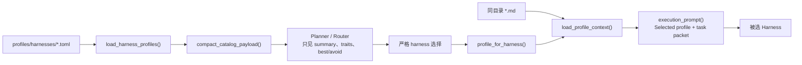

# Harness profile
Active contributors: oldwinter, chendongdong

## Purpose

Harness profile 把“供 controller 选择的能力摘要”和“只供被选 worker 使用的完整执行契约”分成两层。这样 planner/router 不会一次加载六套长上下文，coordinator 也只在 dispatch 前注入已选 harness 的 Markdown profile。路由系统流程见[Harness catalog 与路由](../systems/catalog-and-routing.md)，runtime 启动契约见[Harness readiness 与自动化](../features/harness-readiness-and-automation.md)，工作流字段见[工作流配置参考](../reference/configuration.md)。

## 关键 dataclass / enum

| 类型 | 关键字段 | 关系 |
| --- | --- | --- |
| `Harness` | 六个固定字符串值 | TOML profile、worker、job 与 runtime launch spec 的共同身份。 |
| `HarnessProfile` | `schema_version`、`harness`、`display_name`、`summary`、五类字符串元数据、`context_file` | 一个 `*.toml` 紧凑 profile 加一个按需读取的 `*.md`。 |
| `WorkerConfig` | `name`、`harness`、`capabilities`、`replicas`、可选 `placement` | Workflow 启用哪些 profile，并给出 slot 与默认 topology。 |
| `PlannerConfig` | controller harness、`worker_harnesses` | 限定 planner/router 可以选择的 worker 集。 |
| `WorkflowConfig` | `profiles_dir`、`profiles`、`workers` | 配置加载后的完整 catalog 与当前 workflow 子集。 |

这些共享对象位于 `src/herdr_orchestrator/model.py`，解析和两级渲染位于 `src/herdr_orchestrator/catalog.py`。

## 两级加载关系

`profile_ref` 形如 `harness:codex`，只是 catalog 内的稳定引用；完整 Markdown 不进入 compact payload。`execution_prompt()` 明确分成 `# Dynamically loaded harness profile` 与 `# Task packet`，只包含一个被选 profile。

## 默认 profile 集

| Harness | Display name | 主要定位 | Canonical files |
| --- | --- | --- | --- |
| `droid` | Factory Droid | 端到端仓库任务、工具编排、运营和多步骤交付 | `profiles/harnesses/droid.toml` + `droid.md` |
| `grok` | Grok Build | 快速工程实现、仓库探索、结构化 JSON 和并行构建 | `profiles/harnesses/grok.toml` + `grok.md` |
| `codex` | OpenAI Codex CLI | 精确实现、测试驱动修复、重构和可验证 diff | `profiles/harnesses/codex.toml` + `codex.md` |
| `pi` | pi | 低延迟分析、局部配置检查和短任务 | `profiles/harnesses/pi.toml` + `pi.md` |
| `claude` | Claude Code | 架构、长上下文、深度评审和风险权衡 | `profiles/harnesses/claude.toml` + `claude.md` |
| `hermes` | Hermes Agent | 资料搜集、跨来源综合和探索性研究 | `profiles/harnesses/hermes.toml` + `hermes.md` |

Profile 描述能力，不授予动作权限。各 Markdown 都重申：工具或自动批准能力不等于联网、push、发布、删除、权限或生产操作授权。

## 验证规则

### TOML shape

- 只允许 `schema_version`、`harness`、`display_name`、`summary`、`strengths`、`best_for`、`avoid_for`、`traits`、`context_file`；未知 key 直接报错。
- `schema_version` 当前只能为整数 `1`，bool 不被当作 int 接受。
- `harness` 必须能转成 `Harness`；同一目录不得出现重复 harness，目录必须至少有一个合法 profile。
- `display_name` 最长 80，`summary` 最长 300；都必须是非空字符串。
- 四个能力列表必须非空、最多 12 项；`strengths` 单项最长 120，其余列表单项最长 160。

### Context 边界

- `context_file` 最长 255，必须是相对路径，不能含 `..`，resolve 后必须仍位于 profile 目录且已经存在。
- Markdown 在 dispatch 时读取而不是 catalog load 时读取；因此文件更新会被后续 dispatch 看见。
- 去除首尾空白后 context 不得为空，长度不得超过 `50_000` 字符。
- `profiles_for_workers()` 要求每个 worker harness 都有 profile；`profile_for_harness()` 对缺失选择失败关闭。

默认 profile contract 测试还要求 canonical 目录覆盖 `Harness` 的全部六个值，并证明 compact catalog 不含 `## Operating contract` 等完整上下文。

## 生命周期与关系

1. Workflow loader 解析 `profiles_dir`，加载全部 compact profile。
2. `workers` 决定当前 workflow 的可用 worker 子集；planner 的 `worker_harnesses` 还会进一步收窄模型选择。
3. Controller 只收到 compact JSON，并只能返回已启用的 harness。
4. Coordinator 对选择重新校验，再在 dispatch 前查找 profile。
5. Catalog 此时读取该 harness 的 Markdown，并与 task prompt 拼成执行 packet。
6. Worker settlement 后，profile 不进入 SQLite；durable queue 只保存 harness 身份与任务事实。

`workflows/multi-harness.toml` 启用六个 worker；`workflows/grok-research.toml` 只启用 Grok、10 replicas，并把 worker 默认 placement 设为 pane。Queue 和 slot 关系见[任务与收据](jobs-and-receipts.md)。

## 集成点

- `config.py` 把 workflow、worker 与 profile 校验为 `WorkflowConfig`。
- `planner.py` / worker router 使用 compact catalog，而不是完整 Markdown。
- `runner.py` 调用 `execution_prompt()`，将所选 profile 注入 task packet。
- `herdr.py` 根据同一个 `Harness` 选择启动命令和 agent 行为。
- `WorkerConfig.placement` 比 hybrid 静态信号优先；见[Placement 与 worktree](placement-and-worktrees.md)。

## 修改入口

| 目标 | 修改位置 | 注意事项 |
| --- | --- | --- |
| 调整路由可见的能力摘要 | `profiles/harnesses/<harness>.toml` | 保持 exact keys、长度上限和相对 `context_file` |
| 调整 worker 的完整执行契约 | `profiles/harnesses/<harness>.md` | 只会在该 harness 被选中后加载 |
| 调整 catalog schema 或 payload | `src/herdr_orchestrator/catalog.py` | 同步 planner/router prompt 和 schema 测试 |
| 新增 harness 身份 | `src/herdr_orchestrator/model.py` | 还要补 profile、workflow worker、runtime launch spec 与测试；只改 enum 不够 |
| 改某 workflow 的 worker 集或 replicas | `workflows/*.toml` | planner allowlist 必须引用已配置 worker |

## 关键源文件

- `src/herdr_orchestrator/model.py`
- `src/herdr_orchestrator/catalog.py`
- `profiles/harnesses/`
- `workflows/multi-harness.toml`
- `workflows/grok-research.toml`
- `tests/test_catalog.py`
- `tests/test_config.py`
