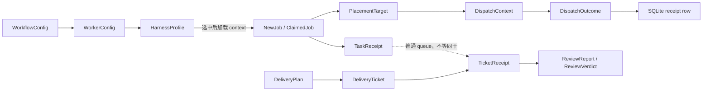

# 领域原语
Active contributors: oldwinter, chendongdong

本节索引四组跨系统复用的最小领域对象：job/receipt、harness profile、placement/worktree 和 delivery artifact。每个子页关注“对象是什么、由谁验证、在哪里持久化”，完整执行流程则由[系统架构](../overview/architecture.md)和各 system 页面说明。

## 原语导航

| 页面 | 核心问题 | 主要对象与真源 |
| --- | --- | --- |
| [任务与收据](jobs-and-receipts.md) | Job 如何 claim、续租、重试、阻塞、恢复，并留下 attempt 证据？ | `NewJob`、`ClaimedJob`、`TaskReceipt`、`DispatchOutcome`；`src/herdr_orchestrator/model.py`、`src/herdr_orchestrator/store.py` |
| [Harness profile](harness-profiles.md) | Controller 预先看到什么，何时才加载完整执行 context？ | `HarnessProfile`、`WorkerConfig`；`src/herdr_orchestrator/catalog.py`、`profiles/harnesses/` |
| [Placement 与 worktree](placement-and-worktrees.md) | Task 在 pane、tab 或隔离 checkout 中运行？ | `PlacementMode`、`PlacementTarget`、`DispatchContext`；`src/herdr_orchestrator/model.py`、`src/herdr_orchestrator/topology.py` |
| [交付 Artifact](delivery-artifacts.md) | Opt-in 交付如何表达决策、规格、验收和 review？ | `DeliveryPlan`、`TicketReceipt`、`ReviewReport`、`ProxyDecision`；`src/herdr_orchestrator/delivery_protocol.py` |

## 对象关系

三种“receipt”必须区分：

1. `TaskReceipt` 是普通 queue 在 dispatch 前声明的 output/file 内容验收条件。
2. SQLite `receipts` 行记录一次 dispatch 或 resume observation，形成 attempt 时间线。
3. `TicketReceipt` 是标准化交付对 ticket commit、acceptance criteria 和 checks 的证明文件。

字段表和 SQLite schema 见[数据模型](../reference/data-models.md)。

## 共同验证规则

- **封闭枚举**：harness、job/agent 状态、placement、receipt kind、proxy action 与 finding severity 都使用 `StrEnum` allowlist。
- **先校验后推进**：Planner、router 或 worker 输出必须先解析成受约束对象，不能直接改变 queue 或交付阶段。
- **稳定身份**：普通 job 以 `(workflow, dedupe_key)` 去重；交付 decision/ticket 使用 2–3 位数字 ID，并要求 blocker 先出现。
- **失败关闭**：已声明 `TaskReceipt` 时只有 `task_verified=true` 能成功；secret/production proxy decision 只能 escalation。
- **路径受限**：Profile context 不得逃出 profile 目录；worktree 与 delivery artifact root 必须留在 workspace 的受控 runtime 路径。
- **分层加载**：Compact harness metadata 可用于 route；完整 Markdown 只在 harness 已选中时加载。

配置范围和默认值见[配置](../reference/configuration.md)。

## 生命周期集成点

| 原语 | 生产者 | 消费者 | 相关系统 |
| --- | --- | --- | --- |
| Workflow/profile | TOML loader、catalog | Router、planner、coordinator、execution prompt | [Catalog 与路由](../systems/catalog-and-routing.md) |
| Job/task receipt | CLI、seed、planner、SQLite store | Coordinator、retry/resume、Dashboard | [Coordinator 与 queue](../systems/coordinator-and-queue.md)、[Durable execution](../features/durable-execution.md) |
| Placement/terminal | 显式值、静态规则或 topology controller | Store、Herdr layout、Git worktree | [Herdr runtime](../systems/herdr-runtime.md)、[拓扑派发](../features/topology-aware-dispatch.md) |
| Delivery artifact | Delivery controller、worker、reviewer | Strict loader、tracker、repair loop | [标准化交付](../systems/standardized-delivery.md) |

## 修改入口

| 想改变的契约 | 首选完整路径 | 必须同步检查 |
| --- | --- | --- |
| 共享 enum/dataclass | `src/herdr_orchestrator/model.py` | TOML/JSON 值、SQLite migration、CLI 与测试 |
| Profile metadata/context | `profiles/harnesses/*.toml`、`profiles/harnesses/*.md` | `src/herdr_orchestrator/catalog.py` 与 catalog 测试 |
| Queue 状态或 receipt | `src/herdr_orchestrator/store.py` | Migration、lease、retry、resume 和 Dashboard 投影 |
| Placement 决策 | `src/herdr_orchestrator/topology.py`、`src/herdr_orchestrator/herdr_layout.py` | Git-aware validation、cleanup、worktree 保留 |
| Delivery JSON schema | `src/herdr_orchestrator/delivery_protocol.py` | Agent prompts、恢复兼容、protocol/delivery 测试 |

## 关键源文件

| 完整路径 | 用途 |
| --- | --- |
| `src/herdr_orchestrator/model.py` | 共享 enum 和 dataclass |
| `src/herdr_orchestrator/store.py` | Job、attempt receipt 与状态迁移 |
| `src/herdr_orchestrator/catalog.py` | Harness profile 与动态 context |
| `src/herdr_orchestrator/topology.py` | Placement 决策 |
| `src/herdr_orchestrator/herdr_layout.py` | Terminal/worktree provisioning |
| `src/herdr_orchestrator/delivery_protocol.py` | Delivery artifact dataclass 与严格 loader |
| `workflows/multi-harness.toml` | 领域对象的声明式组合样例 |
| `profiles/harnesses/` | 六个 harness profile 真源 |
