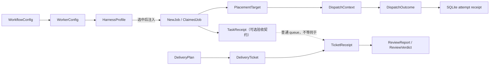

# 领域原语
Active contributors: oldwinter, chendongdong

## Purpose

本节描述控制面在模块之间传递、校验和持久化的最小领域对象。它回答“一个值是什么、谁能改变它、什么条件下它有效”，而不重复 coordinator、Herdr runtime 或标准化交付的完整系统流程。跨系统控制流请转到[系统架构](../overview/architecture.md)。

## 原语导航

| 页面 | 核心问题 | 主要对象 |
| --- | --- | --- |
| [任务与收据](jobs-and-receipts.md) | Job 如何 claim、续命、重试、阻塞、恢复并留下 attempt 证据？ | `NewJob`、`ClaimedJob`、`TaskReceipt`、`DispatchOutcome`、`JobState` |
| [Harness profile](harness-profiles.md) | Controller 能看到哪些紧凑能力信息，何时才加载完整执行契约？ | `Harness`、`HarnessProfile`、`WorkerConfig` |
| [Placement 与 worktree](placement-and-worktrees.md) | Task 在共享 pane、独立 tab 或隔离 checkout 中运行？ | `PlacementMode`、`PlacementTarget`、`DispatchContext`、`ProvisionedTerminal` |
| [交付 Artifact](delivery-artifacts.md) | 显式标准化交付如何用严格 JSON 表达决策、规格、验收和 review？ | `DeliveryPlan`、`DeliveryTicket`、`TicketReceipt`、`ReviewReport`、`ProxyDecision` |

## 关系图

普通 queue 的 `TaskReceipt` 是 dispatch 前声明的机器验收条件；SQLite `receipts` 行是每次 attempt 的审计记录；标准化交付的 `TicketReceipt` 则证明一个交付 ticket 的 commit、全部 acceptance criterion 和 checks。三者名称相近，但生命周期和持久化位置不同。

## 关键 dataclass / enum

| 分类 | Enum | Dataclass |
| --- | --- | --- |
| Queue | `Harness`、`JobState`、`AgentState`、`ReceiptKind` | `NewJob`、`TaskReceipt`、`ClaimedJob`、`DispatchOutcome` |
| Catalog | `Harness` | `HarnessProfile`、`WorkerConfig`、`PlannerConfig` |
| Topology | `PlacementMode`、`PlacementTarget` | `PlacementConfig`、`DispatchContext`、`ProvisionedTerminal` |
| Delivery | `ProxyAction`、`AuthorityCategory`、`FindingSeverity` | `WayfinderMap`、`DeliveryPlan`、`TicketReceipt`、`ReviewReport`、`ProxyDecision` |

`src/herdr_orchestrator/model.py` 中的共享对象均使用 `dataclass`，核心值对象使用 `frozen=True, slots=True`；交付协议对象在 `src/herdr_orchestrator/delivery_protocol.py` 中采用相同约定。Enum 使用 `StrEnum`，其字符串值同时是 TOML、JSON、SQLite 和 CLI 自动化接口的一部分。

## 验证规则

- **先解析、后推进**：模型输出不能直接改变 queue 或交付阶段；必须先转成受约束对象。
- **封闭词汇**：harness、状态、placement、receipt kind、代理权限和 finding 严重度均由 enum allowlist 限定。
- **精确 shape**：Harness profile 拒绝未知 TOML key；交付 JSON loader 要求 key 集合完全相等。
- **身份稳定**：普通 job 以 `(workflow, dedupe_key)` 去重；交付 ticket 使用 2–3 位数字 ID，并对依赖顺序做 DAG 校验。
- **失败关闭**：声明 `TaskReceipt` 后，`task_verified` 不是 `true` 就不能成功；secret 或 production 的 proxy decision 只能 `escalate`。
- **路径受限**：profile context 必须是 profile 目录内的相对现有文件；worktree 坐标由 workflow 与 task key 确定生成。

更完整的字段表见[数据模型参考](../reference/data-models.md)，配置边界见[工作流配置参考](../reference/configuration.md)。

## 生命周期与集成点

| 原语边界 | 生产者 | 消费者 | 系统说明 |
| --- | --- | --- | --- |
| Workflow / profile | TOML loader 与 catalog | router、planner、coordinator、dispatch prompt | [Harness catalog 与路由](../systems/catalog-and-routing.md)、[Harness readiness 与自动化](../features/harness-readiness-and-automation.md) |
| Job / attempt receipt | CLI、seed、planner、SQLite store | coordinator、Dashboard、retry / resume | [Coordinator 与 durable queue](../systems/coordinator-and-queue.md)、[Durable execution](../features/durable-execution.md) |
| Placement / terminal | 静态规则或 topology controller | store、`HerdrLayout`、Herdr CLI | [Herdr runtime](../systems/herdr-runtime.md)、[拓扑感知派发](../features/topology-aware-dispatch.md) |
| Delivery artifacts | delivery controller、worker、reviewer | `StandardizedDelivery`、tracker、repair loop | [标准化交付](../systems/standardized-delivery.md) |

## 修改入口

| 想改变的契约 | 首选入口 | 同步检查 |
| --- | --- | --- |
| 新增或改变共享 enum / dataclass | `src/herdr_orchestrator/model.py` | TOML/JSON 值、SQLite migration、CLI 与相关测试 |
| 改 harness 能力描述 | `profiles/harnesses/<harness>.toml` | 紧凑 catalog 测试 |
| 改选中 harness 的执行契约 | `profiles/harnesses/<harness>.md` | 动态加载和 prompt 隔离测试 |
| 改 queue 状态或收据语义 | `src/herdr_orchestrator/store.py` | schema 向后迁移、lease、retry、resume 测试 |
| 改 topology 决策或终端创建 | `src/herdr_orchestrator/topology.py`、`src/herdr_orchestrator/herdr_layout.py` | Git-aware validation、cleanup 与 worktree 保留测试 |
| 改交付 JSON schema | `src/herdr_orchestrator/delivery_protocol.py` | prompt 生产者、恢复兼容性、protocol 与 delivery 测试 |

## 关键源文件

- `src/herdr_orchestrator/model.py`
- `src/herdr_orchestrator/store.py`
- `src/herdr_orchestrator/catalog.py`
- `src/herdr_orchestrator/topology.py`
- `src/herdr_orchestrator/herdr_layout.py`
- `src/herdr_orchestrator/delivery_protocol.py`
- `workflows/multi-harness.toml`
- `profiles/harnesses/`
