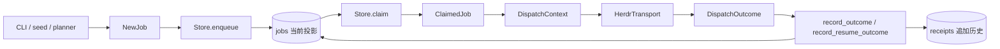
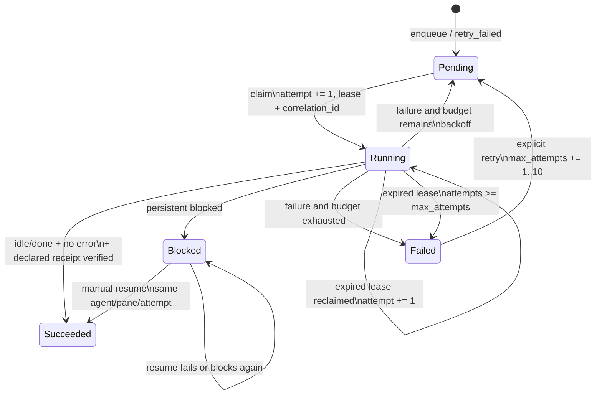
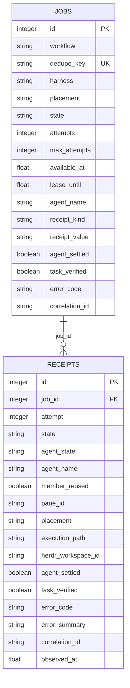

# 任务与收据
Active contributors: oldwinter, chendongdong

## Purpose

Job 是普通 durable queue 的调度与恢复单位；receipt 是任务声明和每次执行观测的证据。这个原语层说明共享 enum/dataclass、SQLite 投影与状态约束，不负责解释完整调度流程。端到端行为见[Durable execution](../features/durable-execution.md)和[任务收据与恢复](../features/receipts-and-recovery.md)，系统所有权见[Coordinator 与 durable queue](../systems/coordinator-and-queue.md)。

## 布局

一个 job 在模块间按不可变值对象传递，SQLite 保存最新投影与追加历史：

### 关键 enum 与 dataclass

| 类型 | 关键字段或值 | 契约 |
| --- | --- | --- |
| `Harness` | `droid`、`grok`、`codex`、`pi`、`claude`、`hermes` | 固定可识别的 runtime kind |
| `JobState` | `pending`、`running`、`succeeded`、`blocked`、`failed` | SQLite durable 状态；只有 Store 推进 |
| `AgentState` | `idle`、`working`、`blocked`、`done`、`unknown` | Herdr lifecycle 观测，不直接等于 job state |
| `ReceiptKind` | `output-prefix`、`file` | Task receipt 的两种机器验证策略 |
| `NewJob` | workflow、title、harness、prompt、dedupe、budget、placement、receipt | 入队值对象；默认 placement 为 `tab`，`None` 表示待决策 |
| `TaskReceipt` | `kind`、`value` | Enqueue 时可选声明的机器契约 |
| `ClaimedJob` | job ID、attempt、agent name、placement、receipt、correlation ID | Claim 后交给 dispatcher 的不可变快照 |
| `DispatchContext` | placement、title、task/batch key、worktree root、receipt | Coordinator 交给 transport 的执行上下文 |
| `DispatchOutcome` | agent state/identity、错误、拓扑、settlement、verification、timing | Transport 返回给 durable Store 的事实包 |

这些类型的真源是 `src/herdr_orchestrator/model.py`。新增 enum 值或 dataclass 字段会跨越 config、CLI、Store、transport、Dashboard 与测试，不应只修改单个调用点。

## 三种 receipt 概念

| 名称 | 所属运行面 | 产生时机 | 证明什么 | 存放位置 |
| --- | --- | --- | --- | --- |
| `TaskReceipt` | 普通 queue | Enqueue 时声明，turn 后验证 | 本 turn 产生指定 output-prefix 或变化后的非空 file | `jobs.receipt_kind/value`；结果写 `task_verified` |
| Attempt receipt | 普通 queue | 每次 dispatch/resume 结束时追加 | 某次 attempt 的 job state、agent state、pane、错误与验证事实 | SQLite `receipts` 表 |
| `TicketReceipt` | 标准化交付 | Ticket worker 完成时 | Commit 和 acceptance criteria 的交付证据 | Delivery artifact；见[交付 Artifact](delivery-artifacts.md) |

不要把三者互换。尤其是 `idle` / `done` 只支持 `agent_settled=true`；声明 `TaskReceipt` 时还必须 `task_verified=true`。未声明 task receipt 时 `task_verified=null`，仍可走向兼容成功，但没有机器验收声明。

## Job 生命周期

### State 映射

`Store.record_outcome()` 使用以下顺序决定 durable state：

1. Job 声明 receipt 但 `task_verified is not True` 时，先产生 receipt 错误（若 transport 没有更具体错误）。
2. 无 error 且 agent state 为 `idle` / `done`：`succeeded`。
3. Agent state 为 `blocked`：`blocked`。
4. 其他结果且 `attempt < max_attempts`：回到 `pending`，设置退避后的 `available_at`。
5. 其他结果且 budget 耗尽：`failed`。

没有其他 error code 的 `working` / `unknown` 会归一为 `agent_not_settled`。Store 计算 `agent_settled` 时优先使用 outcome 明确值，否则由 `idle` / `done` 推导。

### Claim、lease 与 slot

- `Store.claim()` 在 `BEGIN IMMEDIATE` 中选择 placement 已确定的可运行 job。
- Pending 必须已到 `available_at`；running 必须 lease 已过期；两者都要求 `attempts < max_attempts`。
- Claim 遵守 `allowed_harnesses`、每 harness replica count 与已占用 agent name。
- Tab/pane 从确定性 slot 名选择；worktree 使用 `harness:worktree:job_id` 任务专属 key。
- 成功 claim 增加 attempt，写 lease、agent name 和新的 `uuid4().hex` correlation ID。
- 退避公式是 `min(60, 2 ** max(0, attempt - 1))` 秒。

Lease 到期允许重复执行，不提供 exactly-once；外部副作用需要任务自己的幂等契约。

### Dedupe、retry 与 resume

- `(workflow, dedupe_key)` 有 SQLite 唯一约束；重复 enqueue 返回原 ID 与 `created=False`。
- `retry_failed()` 只接受 failed；`extra_attempts` 为 1–10；保留 ID、dedupe、attempt 数和历史 receipts，清空当前错误/settlement/verification/correlation 投影。
- Blocked 不是 retryable；`claim_blocked_for_resume()` 读取最新 receipt 的 pane，只添加临时 resume lease，不增加 attempt。
- `record_resume_outcome()` 只允许原 blocked job 与 attempt；成功进入 succeeded，其余保持 blocked，并追加 receipt。

## SQLite 持久关系

`jobs` 是最新投影；`receipts` 是 append-only 时间线。`record_outcome()` 在同一事务中更新 job 与插入 receipt，并核对 job 仍为同一 running attempt；`record_resume_outcome()` 核对 job 仍为同一 blocked attempt。前置条件不匹配时返回 `job_lease_lost`，阻止迟到写入覆盖新事实。

Schema 当前版本为 v4。初始化必须顺序支持 v1→v2→v3→v4：先补 placement/execution 字段，再补 task receipt/settlement/verification/summary，最后补 correlation ID。任何字段变更都必须保持旧 SQLite 文件可迁移。

## Receipt 验证抽象

### Output-prefix

`HerdrTransport` 在 turn 前后读取 `recent-unwrapped`，只从相对 baseline 新增的行匹配 prefix；prefix 只在旧输出时缺失，prompt 的独立同前缀行会判 `task_receipt_ambiguous`。已知 UI marker 可被剥离，但不接受完整 transcript 作为一般正确性证明。

### File

路径相对于 execution workspace。Transport 拒绝绝对路径、`..`、root 外解析和路径链 symlink；前后比较 `exists/size/sha256`，要求当前文件存在、非空且发生变化。对应稳定错误包括 `task_receipt_missing`、`task_receipt_invalid`、`task_receipt_stale`、`task_receipt_path_invalid` 与 `task_receipt_unreadable`。

字段与行为细节见[任务收据与恢复](../features/receipts-and-recovery.md)。

## 关键抽象

| 抽象 | 责任 | 完整路径（仓库根目录相对） |
| --- | --- | --- |
| `JobState`, `AgentState`, `ReceiptKind` | 跨模块 enum vocabulary | `src/herdr_orchestrator/model.py` |
| `NewJob`, `TaskReceipt`, `ClaimedJob` | 入队声明与 claim 快照 | `src/herdr_orchestrator/model.py` |
| `DispatchContext`, `DispatchOutcome` | Coordinator/transport/store 边界对象 | `src/herdr_orchestrator/model.py` |
| `Store` | Schema、事务、dedupe、claim、状态转换和 receipt history | `src/herdr_orchestrator/store.py` |
| `Coordinator` | 构造上下文、dispatch、resume 与 GC | `src/herdr_orchestrator/runner.py` |
| `HerdrTransport` | 生成 runtime outcome 并验证 task receipt | `src/herdr_orchestrator/herdr.py` |

## 集成

- CLI、seed 和 planner 构造 `NewJob`；Coordinator 调用 `Store.enqueue()`。
- Topology 决定 `placement=None` 的 job 在 claim 前落到 pane/tab/worktree；见[Placement 与 worktree](placement-and-worktrees.md)。
- Store claim 返回 `ClaimedJob`；Coordinator 将 placement、receipt 和 task/batch key放入 `DispatchContext`。
- Herdr transport 返回 `DispatchOutcome`；Store 原子更新 `jobs` 并追加 `receipts`。
- `status`、run 报告、retry、resume、GC、telemetry 与 Dashboard 都以 Store 为 durable 真源。
- [本地 Dashboard](../systems/dashboard.md)只读 job/receipt 白名单字段，不读取 `jobs.prompt` 或 terminal transcript。
- 总体状态机见 `docs/architecture.md`，证据层级与错误码见 `docs/runtime-troubleshooting.md`。

## 修改入口

| 变更 | 首选入口 | 必须保持 / 验证 |
| --- | --- | --- |
| Enum / dataclass 字段 | `src/herdr_orchestrator/model.py` | 所有构造点、序列化与兼容默认值 |
| SQLite schema / 状态转换 | `src/herdr_orchestrator/store.py` | 顺序 migration、事务前置条件、receipt 追加历史 |
| Claim/lease/replica | `src/herdr_orchestrator/store.py` | 并发 claim、expired lease、allowed pool、slot naming |
| Task receipt 验证 | `src/herdr_orchestrator/herdr.py` | 当前 turn freshness、prompt echo、防越界 execution root |
| CLI receipt/retry/resume 参数 | `src/herdr_orchestrator/cli.py` | Prefix/file 互斥、稳定错误、automation JSON |
| Dashboard 数据面 | `src/herdr_orchestrator/dashboard.py` | 不读取 prompt/transcript、字段 additive compatibility |

## Key source files

- `src/herdr_orchestrator/model.py`
- `src/herdr_orchestrator/store.py`
- `src/herdr_orchestrator/runner.py`
- `src/herdr_orchestrator/herdr.py`
- `src/herdr_orchestrator/cli.py`
- `docs/architecture.md`
- `docs/runtime-troubleshooting.md`
- `tests/test_store.py`
- `tests/test_runner.py`
- `tests/test_herdr.py`
