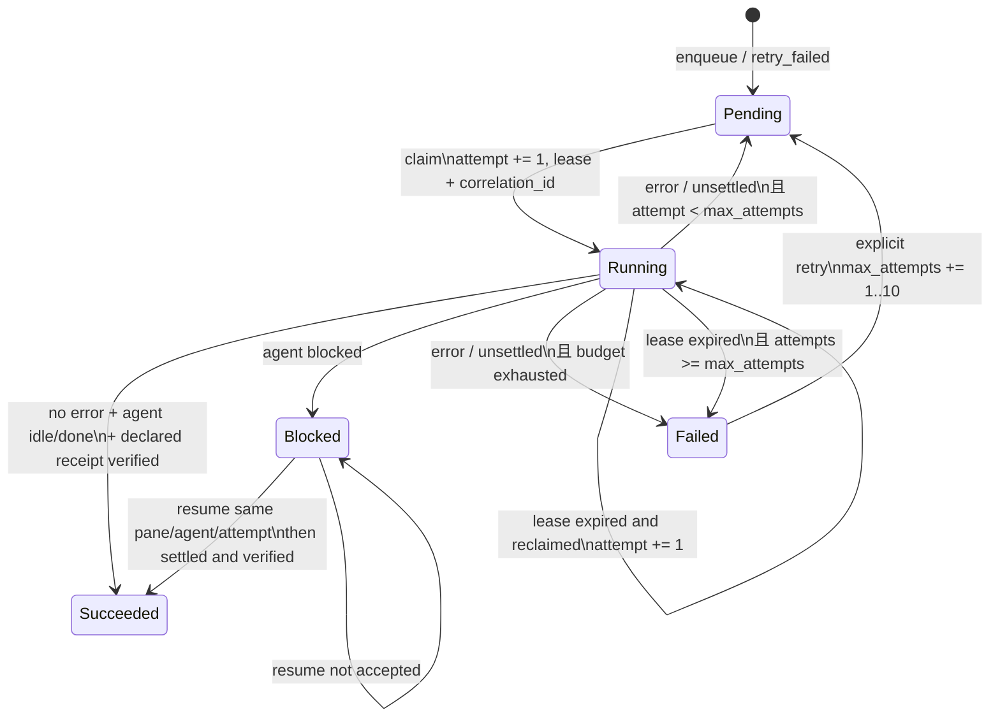
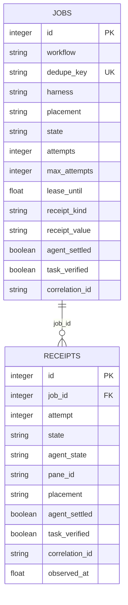

# 任务与收据
Active contributors: oldwinter, chendongdong

## Purpose

Job 是普通 durable queue 的调度单位。它把用户任务固定为 workflow、harness、prompt、去重键、attempt budget、placement 和可选机器验收契约；SQLite store 独占 claim、lease、重试和终态推进。完整并发控制流见[Coordinator 与 durable queue](../systems/coordinator-and-queue.md)，操作与恢复行为见[Durable execution](../features/durable-execution.md)和[任务收据与恢复](../features/receipts-and-recovery.md)。

## 关键 dataclass / enum

| 类型 | 关键字段或值 | 作用 |
| --- | --- | --- |
| `Harness` | `droid`、`grok`、`codex`、`pi`、`claude`、`hermes` | 固定 worker runtime 类型。 |
| `JobState` | `pending`、`running`、`succeeded`、`blocked`、`failed` | SQLite job 的 durable 状态。 |
| `AgentState` | `idle`、`working`、`blocked`、`done`、`unknown` | Herdr 对当前 turn 的观测结果；不直接等同于 job 状态。 |
| `ReceiptKind` | `output-prefix`、`file` | 可选 `TaskReceipt` 的验证方式。 |
| `NewJob` | `workflow`、`dedupe_key`、`max_attempts`、`placement`、`receipt` | 入队值对象；默认 placement 是 `tab`，显式 `None` 表示尚未决定。 |
| `TaskReceipt` | `kind`、`value` | dispatch 前声明的机器验收契约。 |
| `ClaimedJob` | `job_id`、`attempt`、`agent_name`、`placement`、`correlation_id` | claim 成功后携带 lease 身份的不可变任务快照。 |
| `DispatchOutcome` | agent 状态、pane、错误、execution path、settlement、verification、timing | Herdr adapter 返回、store 用来推进状态的事实包。 |

以上共享类型的真源是 `src/herdr_orchestrator/model.py`。

## 三种“收据”

| 名称 | 何时产生 | 证明什么 | 存放位置 |
| --- | --- | --- | --- |
| `TaskReceipt` | 入队时可选声明 | 本次 turn 的输出前缀或目标文件满足机器条件 | `jobs.receipt_kind` / `jobs.receipt_value`，claim 后进入 `DispatchContext` |
| Attempt receipt | 每次 `record_outcome` 或 `record_resume_outcome` | agent state、job state、pane、placement、错误、settlement、verification 等观测事实 | SQLite `receipts` 表，一次 attempt 可有多行 |
| `TicketReceipt` | 标准化交付 ticket 完成时 | commit 与全部 acceptance criteria 已验证 | 交付 artifact；见[交付 Artifact](delivery-artifacts.md) |

`idle` / `done` 只说明 agent settled。若 job 声明了 `TaskReceipt`，还必须有 `task_verified is True`；否则 store 注入 `task_receipt_missing` 或 `task_receipt_invalid` 并按失败路径处理。

## 生命周期

### Claim 与 lease

1. `Store.claim()` 在 `BEGIN IMMEDIATE` 事务中先把 lease 已过期且 budget 耗尽的 running job 标为 `failed/lease_expired`。
2. 候选必须属于 workflow、placement 非空、`attempts < max_attempts`，并且是已到 `available_at` 的 pending job或 lease 已过期的 running job。
3. Claim 遵守 `allowed_harnesses` 和每个 harness 的 replica slot；worktree job 使用包含 job ID 的独立 slot key。
4. 成功 claim 时 attempt 加一、生成 `uuid4().hex` correlation ID、写入 agent name 和 lease。
5. 普通失败回到 pending 的退避为 `min(60, 2 ** (attempt - 1))` 秒。

### Blocked、resume 与 retry

- `blocked` 是普通 queue 的 terminal attention 状态，不会自动回答。
- `claim_blocked_for_resume()` 要求最新 receipt 有 pane、job 有 agent 与 placement；它只加临时 lease，不增加 attempt。
- `record_resume_outcome()` 只允许同一个 blocked job 和 attempt：成功则 `succeeded`，其余保持 `blocked`，并追加一行 attempt receipt。
- `retry_failed()` 只接受 `failed` job，`extra_attempts` 必须在 1–10；它清空旧错误、verification 和 correlation ID，但保留 attempt 历史。

## 验证规则

- `(workflow, dedupe_key)` 有 SQLite 唯一约束；重复 enqueue 返回已有 ID 与 `created=False`。
- `record_outcome()` 和 `record_resume_outcome()` 都检查当前 durable state 与 attempt；不匹配时报 `job_lease_lost`，防止迟到 worker 覆盖新 lease。
- `running + idle/done` 只有在没有 error code 时成功；`working` / `unknown` 缺少其他错误时归一为 `agent_not_settled`。
- 声明 receipt 却没有 `task_verified=True` 时失败关闭；输出前缀不能仅来自 prompt echo 或更早的 turn。
- Output receipt 从 Herdr `recent-unwrapped` 输出核验；file receipt 的文件证据由 transport 在 execution workspace 中核验。
- `error_summary` 在持久化前经过 observability `sanitize()`；空结果保存为 `NULL`。
- Schema 当前为 v4；初始化按 v1→v2→v3→v4 顺序补 placement、execution、receipt、settlement、verification、summary 与 correlation 字段，不能跳过向后迁移。

## 持久关系

`jobs` 保存最新投影，`receipts` 保存 attempt 时间线。Dashboard 只读投影这些白名单字段，不读取 prompt 或 terminal transcript；参见[本地 Dashboard](../systems/dashboard.md)。

## 集成点

- CLI / seed / planner 构造 `NewJob`，coordinator 调用 `Store.enqueue()`。
- `Store.claim()` 产出 `ClaimedJob`；coordinator 再把 receipt 与 placement 放入 `DispatchContext`。
- Herdr transport 生成 `DispatchOutcome`，store 原子更新 job 并插入 receipt。
- `status`、`run-until-idle`、`retry`、`resume`、`gc` 和 Dashboard 都以 store 为状态真源。
- Placement 如何从 `None` 变为可 claim 的 target，见[Placement 与 worktree](placement-and-worktrees.md)。

## 修改入口

| 变更 | 首选入口 | 必须保持 |
| --- | --- | --- |
| Job / outcome 字段 | `src/herdr_orchestrator/model.py` | dataclass 调用者与序列化兼容 |
| SQLite 状态或 schema | `src/herdr_orchestrator/store.py` | 旧 DB 顺序 migration、事务前置条件 |
| Receipt 的实际验证 | `src/herdr_orchestrator/herdr.py` | prompt echo / prior turn 防伪与 execution root |
| CLI receipt 参数 | `src/herdr_orchestrator/cli.py` | `--receipt-prefix` 与 `--receipt-file` 互斥和自动化输出 |

字段级定义另见[数据模型参考](../reference/data-models.md)。

## 关键源文件

- `src/herdr_orchestrator/model.py`
- `src/herdr_orchestrator/store.py`
- `tests/test_store.py`
- `tests/test_runner.py`
- `tests/test_herdr.py`
