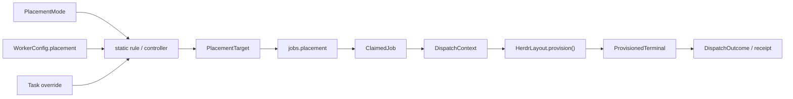
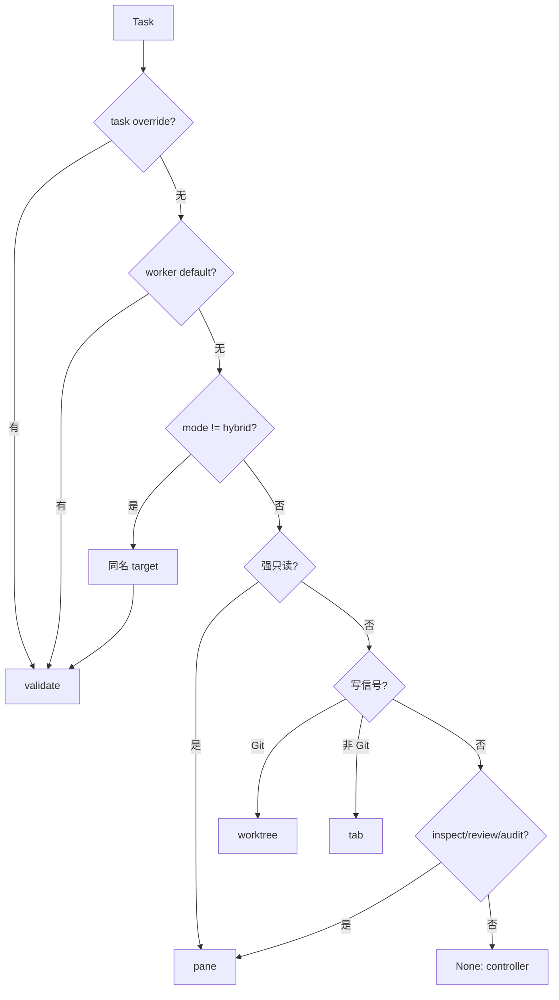
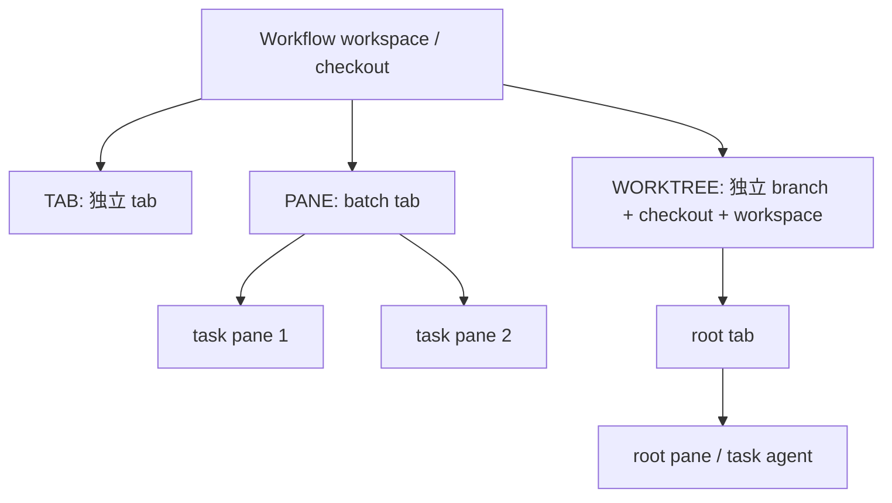
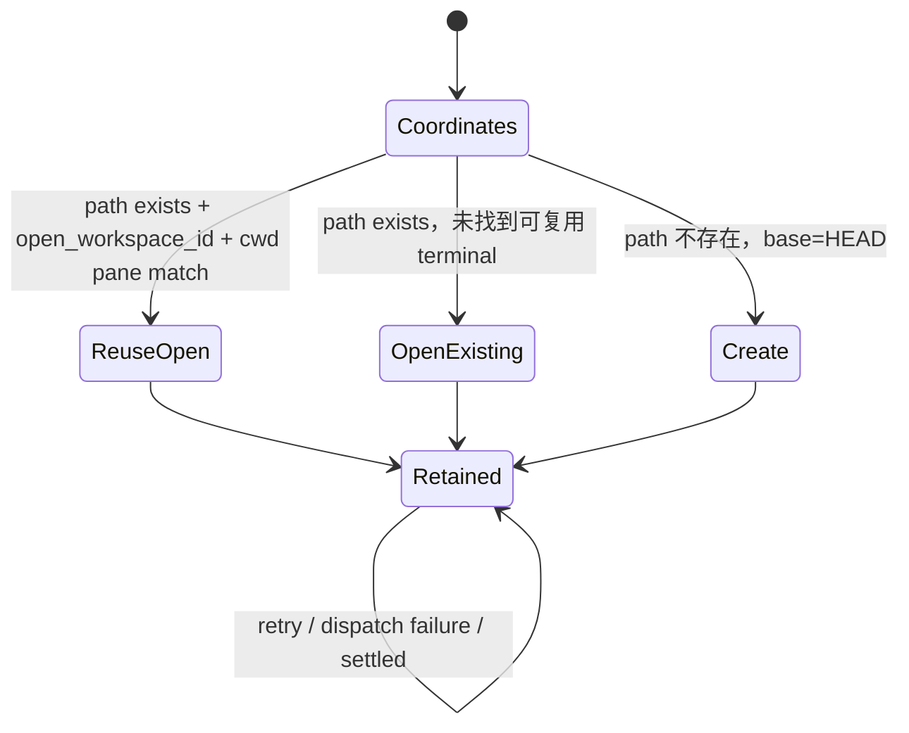

# Placement 与 worktree
Active contributors: oldwinter, chendongdong

## Purpose

Placement 是“任务在哪个 Herdr topology 中运行”的领域值。它选择 terminal 粒度、checkout/cwd 和恢复坐标，不选择 harness，也不授予权限。`worktree` 只隔离 Git checkout；它不是 secret、网络、端口、数据库或生产环境沙箱。

本页聚焦数据模型、验证规则与三种 target 的生命周期。决策功能见[拓扑感知派发](../features/topology-aware-dispatch.md)，PTY 生命周期见 [Herdr runtime](../systems/herdr-runtime.md)，job 持久化见[任务与收据](jobs-and-receipts.md)。

下文源码路径均为仓库根目录完整路径。

## 目录布局

```text
src/herdr_orchestrator/model.py          # PlacementMode/Target/Config、DispatchContext
src/herdr_orchestrator/topology.py       # 决策、worktree capability、label、stable slug
src/herdr_orchestrator/config.py         # TOML mode/root/worker default
src/herdr_orchestrator/runner.py         # target 持久化前置、slot 与 context
src/herdr_orchestrator/store.py          # job/receipt placement 与 execution coordinates
src/herdr_orchestrator/herdr_layout.py   # ProvisionedTerminal、原生 topology 操作
src/herdr_orchestrator/herdr.py          # agent cwd/identity、terminal cleanup
workflows/multi-harness.toml              # hybrid + runtime worktree root
workflows/grok-research.toml              # Grok worker 默认 pane
tests/test_topology.py                    # placement 决策与验证
tests/test_herdr_layout.py                # terminal 与 worktree 生命周期
```

## 关键抽象

| 类型 | 字段 / 值 | 完整源码路径 | 作用 |
| --- | --- | --- | --- |
| `PlacementMode` | `hybrid`、`tab`、`pane`、`worktree` | [`src/herdr_orchestrator/model.py`](../../src/herdr_orchestrator/model.py) | Workflow 级策略；`hybrid` 允许逐任务求 target。 |
| `PlacementTarget` | `tab`、`pane`、`worktree` | [`src/herdr_orchestrator/model.py`](../../src/herdr_orchestrator/model.py) | 已落定、可写入 job/receipt 的执行位置。 |
| `PlacementConfig` | `mode`、`worktree_root` | [`src/herdr_orchestrator/model.py`](../../src/herdr_orchestrator/model.py) | Workflow topology 配置。 |
| `WorkerConfig.placement` | 可选 `PlacementTarget` | [`src/herdr_orchestrator/model.py`](../../src/herdr_orchestrator/model.py) | Harness 级默认值，优先于 workflow mode/hybrid 规则。 |
| `NewJob.placement` | 可为 `None` | [`src/herdr_orchestrator/model.py`](../../src/herdr_orchestrator/model.py) | 入队时可已确定，也可等待 claim 前决策。 |
| `ClaimedJob.placement` | 必为 target | [`src/herdr_orchestrator/model.py`](../../src/herdr_orchestrator/model.py) | Claim 后的不可变 placement。 |
| `DispatchContext` | placement、title、task/batch key、worktree root、receipt | [`src/herdr_orchestrator/model.py`](../../src/herdr_orchestrator/model.py) | Coordinator 交给 layout/transport 的 topology packet。 |
| `ProvisionedTerminal` | pane/tab/workspace IDs、cwd、placement、cleanup kind/id | [`src/herdr_orchestrator/herdr_layout.py`](../../src/herdr_orchestrator/herdr_layout.py) | Provision 后的真实 terminal facts 与局部 cleanup capability。 |

## 领域关系



关键不变量有三条：

1. `PlacementMode.HYBRID` 是 policy，不是可 provision 的 target；
2. 未落定 placement 的 job 不能 claim；
3. `ProvisionedTerminal` 记录 Herdr 返回的真实 ID，不预测 pane/tab/workspace identity。

## 配置与验证

[`src/herdr_orchestrator/config.py`](../../src/herdr_orchestrator/config.py) 把可选 `[placement]` 解析为：

```toml
[placement]
mode = "hybrid"
worktree_root = ".orchestrator/worktrees"
```

- `mode` 默认 `hybrid`，只接受 `PlacementMode` 四值；
- `worktree_root` 默认 `.orchestrator/worktrees`，相对路径以 workflow workspace 为基准；
- root 必须位于 workspace 内，且 path components 中包含 `.orchestrator`；
- `[[workers]].placement` 可为 `auto`、`tab`、`pane`、`worktree`；`auto` 在内存中表示 `None`；
- Seed 或 enqueue 的 `placement` 是 task override；
- Coordinator 当前用 `workspace/.git` 是否存在判断能否使用 worktree。

完整字段表见[配置参考](../reference/configuration.md)。默认 [`workflows/multi-harness.toml`](../../workflows/multi-harness.toml) 使用 `hybrid`；[`workflows/grok-research.toml`](../../workflows/grok-research.toml) 同样是 `hybrid`，但 Grok worker 默认 `pane`，因此不会进入后续文本信号。

## Placement 决策



[`src/herdr_orchestrator/topology.py`](../../src/herdr_orchestrator/topology.py) 保证 task override → worker default → 固定 mode → hybrid signals → controller 的优先级。强只读信号先于写信号；非 Git workspace 的写任务退到 `tab`。Controller 的 exact JSON 仍要经过 `PlacementTarget` 枚举与 worktree 能力校验。

Job 在 placement 决定前可为 `NULL`。[`src/herdr_orchestrator/store.py`](../../src/herdr_orchestrator/store.py) 只允许 `pending + attempts=0 + placement IS NULL` 的 job 设置一次，claim 查询只选 placement 非空的行。结果一旦持久化，retry 继续使用同一 target。

## 三种 terminal 关系



| Target | Provision 行为 | Execution cwd | 复用与 cleanup |
| --- | --- | --- | --- |
| `tab` | 在 workflow workspace 创建非聚焦 tab，label 为短 task title | Workflow workspace | 每任务独立 tab；失败可关本次 terminal；显式 GC 只关 owned pane |
| `pane` | 同一 batch 首任务创建 run tab，后续从最大 pane split | Workflow workspace | 每任务独立 pane/agent；batch root 与子 pane 的 cleanup 范围不同 |
| `worktree` | 复用 open terminal、打开已有 path，或基于 `HEAD` 创建 branch/path | Stable worktree path | Retry 回到同一坐标；从不自动 close/delete/merge |

### Tab

[`src/herdr_orchestrator/herdr_layout.py`](../../src/herdr_orchestrator/herdr_layout.py) 调用：

```text
herdr tab create --workspace <id> --cwd <workspace> --label <short-title> --no-focus
```

JSON response 必须含 `root_pane` 与 `tab`；workspace ID 可用当前 workflow workspace ID。`ProvisionedTerminal.cleanup_kind` 为 `tab`，表示新 terminal 在局部失败时可由 layout 关闭。复用 agent 时仅刷新可见 tab label。

### Pane

Pane placement 必须提供非空 `batch_key`，否则报 `placement_batch_key_missing`。一个 `HerdrLayout` 实例以 `_BatchTab` 缓存每个 batch 的 tab 与 pane IDs：

1. 首任务创建 batch tab，root pane 即该任务 terminal；
2. 后续任务读取 layout 中所有合法矩形；
3. 选择 `width × height` 最大的 pane；
4. 当 `width >= 2 × height` 时向右 split，否则向下 split；
5. 把 Herdr 返回的新 pane ID 加入 cache。

首任务 terminal 的 cleanup kind 是 `tab`；其失败会删除整个 batch cache entry。后续 terminal 的 cleanup kind 是 `pane`；只关闭自身并从 cache 移除该 pane ID。

### Worktree

Worktree placement 必须有 `DispatchContext.worktree_root`，否则报 `placement_worktree_root_missing`。稳定坐标由 [`src/herdr_orchestrator/herdr_layout.py`](../../src/herdr_orchestrator/herdr_layout.py) 生成：

```text
digest     = sha256("<workflow>\0<task_key>")[:7]
slug       = stable_slug(title, maximum=32)
identifier = <slug>-<digest>
path       = <worktree_root>/<stable_slug(workflow, maximum=32)>/<identifier>
branch     = ho/<stable_slug(workflow)>/<identifier>
```

`stable_slug()` 先 `casefold()`，再把所有非 `[a-z0-9]` 段替换为 `-`，裁剪长度并应用 fallback。Title 提供可读部分；workflow + task key 摘要承担常见碰撞隔离。



打开已有 path 时，layout 先调用 `herdr worktree list --cwd <workspace>`，只接受 path 精确匹配的 `open_workspace_id`；随后 `herdr pane list --workspace <id>`，只复用 cwd 精确匹配 path 的 pane。任何一层不匹配都不冒充复用，而是调用 `herdr worktree open`。

`cleanup_failed()` 与 `close_temporary()` 都不会关闭 worktree。Checkout、branch 与 workspace 作为 durable task evidence 保留给人工审查；普通 queue 也不会自动 merge。

## Label、slug 与 identity

这三个值不可混用：

- **Label**：`short_display_label()` 面向用户。压缩空白，默认最长 32 字符，超长以 `…` 结尾，不附加 hash。
- **Slug**：`stable_slug()` 用于 worktree path/branch，可读但会折叠字符并截断。
- **Agent identity**：由 [`src/herdr_orchestrator/herdr.py`](../../src/herdr_orchestrator/herdr.py) 根据 workflow、workspace、harness、replica/placement 或 worktree job ID 生成；用于复用与 GC 所有权。

变更 title 可以改变可见 label。Worktree 恢复依赖稳定 title + task key 坐标；若修改坐标算法，必须考虑仓库中已存在的 checkout。不能用 label 或 slug 替代 live pane/workspace ID 校验。

## 验证规则与超时

- Tab/worktree create response 必须给出 object 类型的 `root_pane`、`tab`，以及可得的非空 workspace ID；否则 `herdr_invalid_response`。
- Pane split response 必须有 object 类型的 `pane` 与非空 `pane_id`。
- Pane layout 至少有一个包含 integer `width`/`height` 的合法 pane。
- 常规 layout 控制命令 timeout 为 10 秒；worktree create/open timeout 为 130 秒。
- `execution_workspace()` 对 `tab`/`pane` 返回 workflow workspace，对 `worktree` 返回稳定 path。
- `worktree` 无 Git 支持时在 topology validation 阶段拒绝；layout 不负责放宽该边界。
- Worktree 不能进入普通 GC 的自动清理候选。

[`tests/test_topology.py`](../../tests/test_topology.py) 覆盖 override、read/write/ambiguous 与非 Git worktree 拒绝；[`tests/test_herdr_layout.py`](../../tests/test_herdr_layout.py) 覆盖短 label、batch tab 共用、最大 pane split、cache cleanup 和 worktree retention。

## 集成点

| 上下游 | 接口 |
| --- | --- |
| Workflow loader | [`src/herdr_orchestrator/config.py`](../../src/herdr_orchestrator/config.py) 创建 `PlacementConfig` 和 worker default。 |
| Topology router | [`src/herdr_orchestrator/topology.py`](../../src/herdr_orchestrator/topology.py) 把 policy 求值为 `PlacementTarget`。 |
| Durable queue | [`src/herdr_orchestrator/store.py`](../../src/herdr_orchestrator/store.py) 保存 placement、execution path、Herdr workspace 与 attempt receipt。 |
| Coordinator | [`src/herdr_orchestrator/runner.py`](../../src/herdr_orchestrator/runner.py) 构造 batch/task keys、worktree root 与 agent slots。 |
| Herdr transport | [`src/herdr_orchestrator/herdr_layout.py`](../../src/herdr_orchestrator/herdr_layout.py) provision terminal；[`src/herdr_orchestrator/herdr.py`](../../src/herdr_orchestrator/herdr.py) 校验 agent cwd/identity/readiness。 |
| Dashboard | Runtime projection 按 `project → worktree/workspace → tab → pane` 展示，不改变 placement。 |
| Recovery / GC | Retry 恢复同 target；GC 跳过 worktree，只对证据充分的普通 owned pane 生效。 |

## 修改入口

| 目标 | 首选入口 | 必须同步 |
| --- | --- | --- |
| 改 enum / dataclass | [`src/herdr_orchestrator/model.py`](../../src/herdr_orchestrator/model.py) | Config parser、Store schema/migration、runner match、layout、CLI/Dashboard serialization。 |
| 改 mode/root/worker default | [`src/herdr_orchestrator/config.py`](../../src/herdr_orchestrator/config.py)、[`workflows/*.toml`](../../workflows/) | [`docs/workflow-schema.md`](../../docs/workflow-schema.md)、[配置参考](../reference/configuration.md)、config tests。 |
| 改 hybrid/controller 决策 | [`src/herdr_orchestrator/topology.py`](../../src/herdr_orchestrator/topology.py) | [`tests/test_topology.py`](../../tests/test_topology.py)、feature page。 |
| 改 tab/pane/worktree provision | [`src/herdr_orchestrator/herdr_layout.py`](../../src/herdr_orchestrator/herdr_layout.py) | [`tests/test_herdr_layout.py`](../../tests/test_herdr_layout.py)、transport readiness/cleanup。 |
| 改 worktree naming | [`src/herdr_orchestrator/herdr_layout.py`](../../src/herdr_orchestrator/herdr_layout.py) | 已有 branch/path 恢复兼容，避免产生重复 checkout。 |
| 改 job placement 持久化 | [`src/herdr_orchestrator/store.py`](../../src/herdr_orchestrator/store.py)、[`src/herdr_orchestrator/runner.py`](../../src/herdr_orchestrator/runner.py) | Claim gate、retry、receipt/status、migration 与 stale writer 保护。 |
| 改 cleanup | [`src/herdr_orchestrator/herdr_layout.py`](../../src/herdr_orchestrator/herdr_layout.py)、[`src/herdr_orchestrator/herdr.py`](../../src/herdr_orchestrator/herdr.py) | 永不自动删除 worktree；只关闭有所有权证据的普通 terminal。 |

最小验证入口：

```bash
PYTHONPATH=src python3 -m unittest -v tests.test_topology tests.test_herdr_layout tests.test_config
```

## Key source files

| 仓库根目录完整路径 | 作用 |
| --- | --- |
| [`src/herdr_orchestrator/model.py`](../../src/herdr_orchestrator/model.py) | Placement policy/target/config 与 dispatch/receipt 数据模型。 |
| [`src/herdr_orchestrator/topology.py`](../../src/herdr_orchestrator/topology.py) | Target 决策、Git-aware validation、label 与 slug。 |
| [`src/herdr_orchestrator/config.py`](../../src/herdr_orchestrator/config.py) | Workflow placement table、worktree root containment、worker default。 |
| [`src/herdr_orchestrator/runner.py`](../../src/herdr_orchestrator/runner.py) | Placement 落库前置、slot map 与 `DispatchContext`。 |
| [`src/herdr_orchestrator/store.py`](../../src/herdr_orchestrator/store.py) | Job/receipt placement、claim gate 与执行坐标。 |
| [`src/herdr_orchestrator/herdr_layout.py`](../../src/herdr_orchestrator/herdr_layout.py) | `ProvisionedTerminal`、Herdr tab/pane/worktree 操作与局部 cleanup。 |
| [`src/herdr_orchestrator/herdr.py`](../../src/herdr_orchestrator/herdr.py) | Stable agent identity、execution cwd 校验与 owned-pane cleanup。 |
| [`workflows/multi-harness.toml`](../../workflows/multi-harness.toml) | 默认 hybrid policy 与 worktree runtime root。 |
| [`workflows/grok-research.toml`](../../workflows/grok-research.toml) | Worker pane default 示例。 |
| [`tests/test_topology.py`](../../tests/test_topology.py) | Placement 优先级、controller shape、Git capability 与 label 契约。 |
| [`tests/test_herdr_layout.py`](../../tests/test_herdr_layout.py) | 原生 command、batch split、cache cleanup 与 worktree retention 契约。 |
| [`tests/test_config.py`](../../tests/test_config.py) | Mode/root/default 与样例 workflow 配置契约。 |
