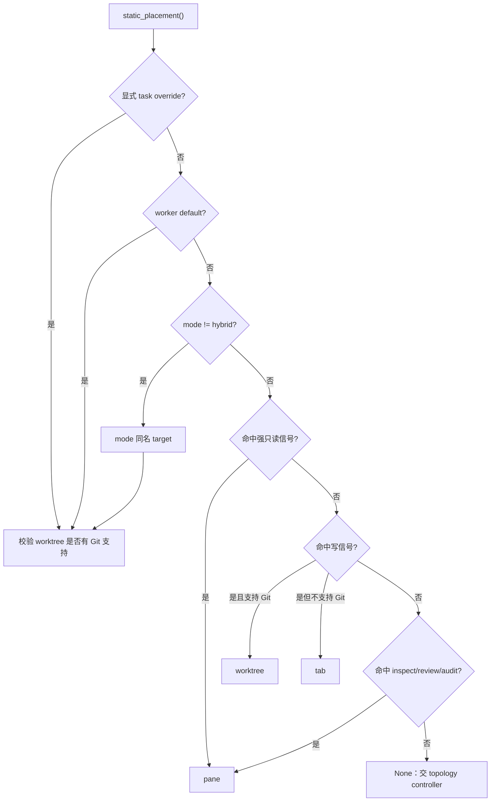
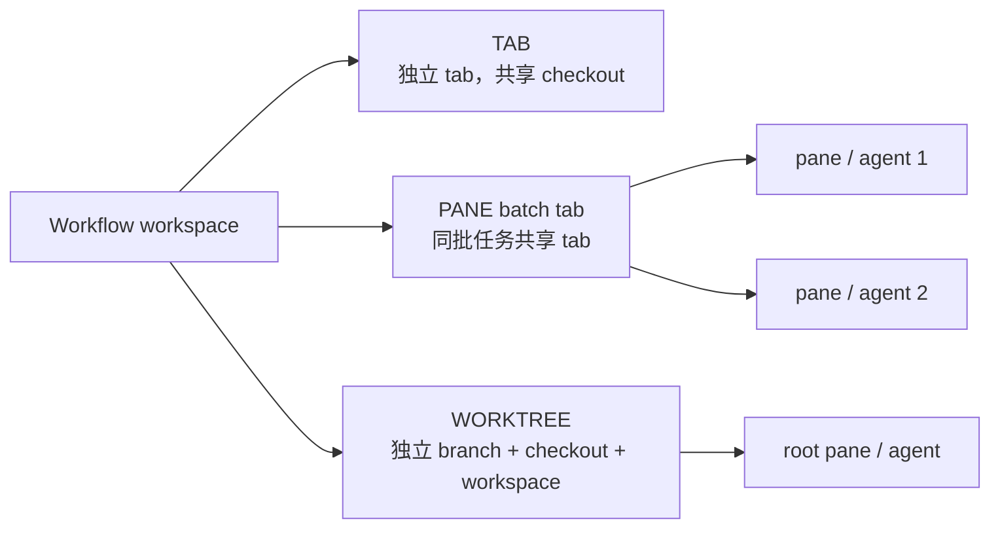
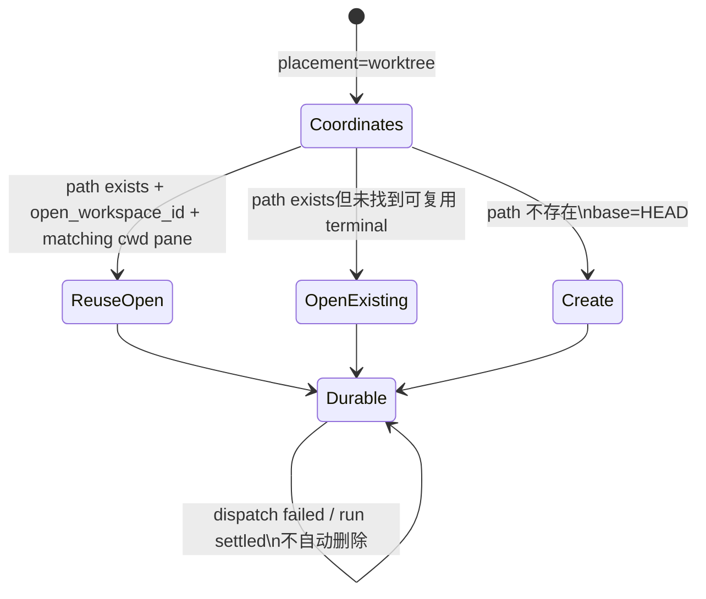

# Placement 与 worktree
Active contributors: oldwinter, chendongdong

## Purpose

Placement 描述一个已接受 task 在 Herdr topology 中占用的执行位置。它只决定 terminal / checkout 隔离和 cwd，不改变 harness 权限，也不把 worktree 变成安全沙箱。Herdr 的 agent 生命周期见[Herdr runtime](../systems/herdr-runtime.md)，完整路由功能见[拓扑感知派发](../features/topology-aware-dispatch.md)，queue claim 语义见[任务与收据](jobs-and-receipts.md)。

## 关键 dataclass / enum

| 类型 | 值或字段 | 作用 |
| --- | --- | --- |
| `PlacementMode` | `hybrid`、`tab`、`pane`、`worktree` | Workflow 级策略；`hybrid` 允许规则和 controller 逐任务决定。 |
| `PlacementTarget` | `tab`、`pane`、`worktree` | 已落定、可写入 job 并交给 layout 的具体位置。 |
| `PlacementConfig` | `mode`、`worktree_root` | Workflow 的 topology 配置。 |
| `WorkerConfig.placement` | 可选 target | Worker 级默认值，优先于 mode 的静态信号。 |
| `DispatchContext` | placement、title、task key、batch key、worktree root、receipt | Coordinator 传给 Herdr layout / transport 的执行上下文。 |
| `ProvisionedTerminal` | pane、tab、workspace、cwd、placement、cleanup coordinates | 创建或复用 terminal 后的事实记录。 |

共享类型位于 `src/herdr_orchestrator/model.py`；`ProvisionedTerminal` 位于 `src/herdr_orchestrator/herdr_layout.py`。

## 决策优先级



优先级严格为 **task override → worker default → 非 hybrid mode → hybrid 文本信号 → controller**。强只读词先于写词判断，因此“不得修改”不会因附近出现“修改”而误路由到 worktree。

Hybrid 识别中，强只读和写信号同时覆盖中英文；一般读信号为 `inspect`、`review`、`audit`。这是一组保守启发式，不是自然语言分类器。

## Controller 输出验证

静态规则返回 `None` 时，controller 只负责 topology 决策，不执行 task。输出必须是精确 JSON：

```json
{"placement":"tab|pane|worktree","rationale":"..."}
```

- key 集必须恰好是 `placement` 与 `rationale`。
- rationale 必须是 1–2,000 字符的非空字符串。
- placement 必须能转成 `PlacementTarget`。
- 非 Git checkout 的 prompt 不提供 `worktree` 选项；即使伪造该值，loader 仍报 `topology_worktree_requires_git`。
- Job 的 placement 在决定前可为 `NULL`，此时不能 claim；`Store.set_placement()` 只允许更新 `pending + attempts=0 + placement IS NULL` 的 job。

## 三种 terminal 关系



| Target | Provision 行为 | Execution cwd | 失败 / 临时 cleanup |
| --- | --- | --- | --- |
| `tab` | 在 workflow workspace 创建带短 task label 的非聚焦 tab | workflow workspace | 关闭本次创建的 tab，并清理 batch cache 引用 |
| `pane` | `batch_key` 首次创建一个 run tab；后续从当前面积最大 pane 分割 | workflow workspace | batch root 关闭整 tab；其余只关闭本 pane |
| `worktree` | 复用已打开 workspace，或 open 已存在 path，或基于 `HEAD` 创建 branch / checkout | 独立 worktree path | **永不自动关闭、删除 workspace、checkout 或 branch** |

Pane 分割在最大 pane 的 `width >= 2 * height` 时向右，否则向下。Tab label 经 `short_display_label()` 归一空白并截到 32 字符，超长以 `…` 结尾；agent name 保持稳定，不随可见 label 改名。

## Worktree 坐标与生命周期

`HerdrLayout._worktree_coordinates()` 生成确定性坐标：

```text
digest     = sha256("<workflow>\0<task_key>")[:7]
identifier = "<stable_slug(title, max=32)>-<digest>"
path       = <worktree_root>/<stable_slug(workflow, max=32)>/<identifier>
branch     = ho/<stable_slug(workflow)>/<identifier>
```

`stable_slug()` 把大小写折叠后所有非 `[a-z0-9]` 段变成 `-`，并应用长度上限和 fallback。相同 workflow / task key 会回到相同坐标，title 负责可读部分，digest 防止常见碰撞。



默认 workflow 在 `workflows/multi-harness.toml` 中使用 `mode = "hybrid"` 与 `.orchestrator/worktrees`。`grok-research` workflow 把 Grok worker 默认固定为 pane，因此该默认值在 hybrid 文本信号之前生效。

## 验证规则

- `pane` provisioning 必须有非空 `batch_key`；否则报 `placement_batch_key_missing`。
- `worktree` provisioning 必须有 `worktree_root`；否则报 `placement_worktree_root_missing`。
- Herdr JSON 必须提供非空 pane、tab 和 workspace ID；缺 shape 时统一失败为 `herdr_invalid_response`。
- 打开已有 worktree 时，只有 `path`、`open_workspace_id` 和 pane `cwd` 全部匹配才复用。
- 所有常规 layout 控制命令有 10 秒 timeout；原生 worktree create / open 使用 130 秒。
- Worktree 是 durable task evidence，不进入普通 `gc` 的自动关闭候选。

## 集成点

- `config.py` 解析 workflow `placement` 与 worker 默认值；字段表见[工作流配置参考](../reference/configuration.md)。
- `topology.py` 做静态或 controller JSON 决策；`store.py` 只 claim 已落定 target。
- `runner.py` 生成 batch key、task key 与 worktree root，构造 `DispatchContext`。
- `herdr_layout.py` 把 target 投影为 Herdr tab、pane 或原生 worktree 命令。
- `DispatchOutcome.execution_path` 与 `herdr_workspace_id` 回写 job 和 attempt receipt，供恢复和 Dashboard 投影。

## 修改入口

| 目标 | 首选入口 | 必须同步 |
| --- | --- | --- |
| 改 hybrid 信号或 controller schema | `src/herdr_orchestrator/topology.py` | `tests/test_topology.py` |
| 改 tab / pane / worktree 创建与 cleanup | `src/herdr_orchestrator/herdr_layout.py` | `tests/test_herdr_layout.py` |
| 改 mode、root 或 worker 默认 | `workflows/*.toml` | config schema 与 Git-aware behavior |
| 新增 target | `src/herdr_orchestrator/model.py` | topology、store migration、layout、CLI、Dashboard 和全部 match 分支 |

## 关键源文件

- `src/herdr_orchestrator/model.py`
- `src/herdr_orchestrator/topology.py`
- `src/herdr_orchestrator/herdr_layout.py`
- `src/herdr_orchestrator/store.py`
- `workflows/multi-harness.toml`
- `workflows/grok-research.toml`
- `tests/test_topology.py`
- `tests/test_herdr_layout.py`
