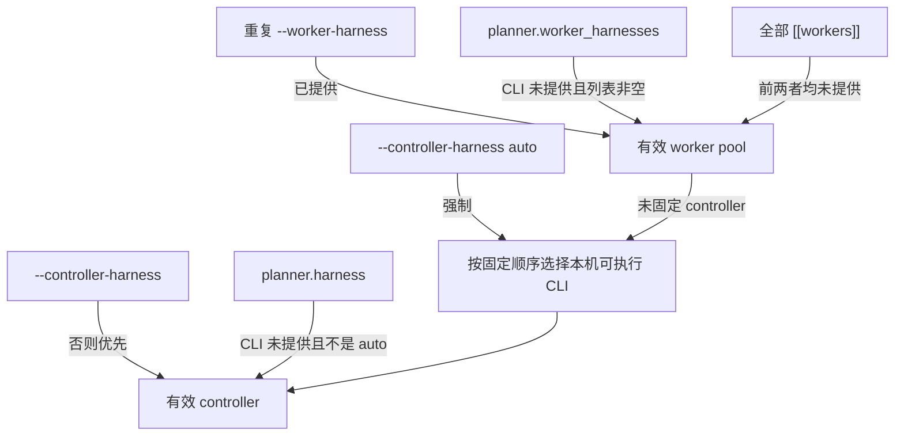

# 配置参考
Active contributors: oldwinter, chendongdong

Workflow 真源是 TOML。仓库内两个完整样例分别是 `workflows/multi-harness.toml` 与 `workflows/grok-research.toml`；字段 loader 位于 `src/herdr_orchestrator/config.py`，拓扑决策位于 `src/herdr_orchestrator/topology.py`，controller/worker 选择位于 `src/herdr_orchestrator/selection.py`。修改字段时应同时遵守 `docs/workflow-schema.md`。

## 加载与路径规则

每个 Python runtime 子命令都先加载 `--workflow`，配置无效时不会进入命令处理逻辑。

| 路径字段 | 相对路径基准 | 额外约束 |
| --- | --- | --- |
| `workspace`、`state_db`、`profiles_dir` | workflow TOML 所在目录 | `workspace` 必须已存在且是目录 |
| `[planner].prompt_file`、`[planner].output_file` | workflow TOML 所在目录 | prompt 必须是已有文件；output 必须在 workspace 内，且解析后路径组成中包含 `.orchestrator` |
| `[[seed_jobs]].prompt_file` | workflow TOML 所在目录 | 必须是已有文件 |
| `[placement].worktree_root` | workspace | 必须在 workspace 内，且解析后路径组成中包含 `.orchestrator` |
| `[standardized_delivery].tracker_root`、`artifact_root` | workspace | `artifact_root` 必须在 workspace 内，且路径组成中包含 `.orchestrator` |
| profile 的 `context_file` | 该 profile TOML 所在目录 | 只接受目录内相对路径；禁止绝对路径和 `..`；目标必须存在 |

除 profile `context_file` 外，上述 loader 可接收绝对路径。字符串会去掉首尾空白。Workflow loader 当前不把未知 key 当作扩展机制进行校验；不要依赖未知字段被忽略的行为。Harness profile 则会拒绝任何未声明 key。

## 覆盖优先级

### Controller 与 worker pool

- 自动 controller 顺序固定为 `droid → grok → codex → claude → hermes → pi`，并且只在有效 worker pool 中检查可执行文件。
- 显式 controller 可以不在 worker pool 中，但必须有可加载 profile；真正运行时还需要对应 CLI。
- `--worker-harness` 可重复，整个 override 会替代 TOML 候选池；每项仍必须对应一个已声明 worker，且不能重复。
- `enqueue --harness <harness>` 是单任务 worker 选择，并不扩大有效 worker pool。省略或传 `auto` 时，controller 只在有效 pool 的 compact catalog 中路由。

### Placement

单任务 placement 的决策顺序是：

1. `enqueue --placement tab|pane|worktree` 或 seed job 的显式 `placement`；
2. 对应 `[[workers]].placement`；
3. `[placement].mode`：若不是 `hybrid`，直接使用该固定模式；
4. `hybrid` 的确定性语义规则：硬只读/只读信号选 `pane`，写入信号在 Git workspace 选 `worktree`，非 Git workspace 退回 `tab`；
5. 仍然模糊时由 controller 生成严格的 topology JSON，再由 coordinator 校验。

`worktree` 在非 Git workspace 中会被拒绝。CLI 中的 `--placement auto` 表示“不覆盖”，不是一个持久化 placement 枚举值。

### 标准化交付

`deliver` 上的 `--tracker-backend`、`--tracker-root`、`--github-repository`、`--wayfinder`、`--max-parallel` 与 `--review-repair-rounds` 逐字段覆盖 `[standardized_delivery]`。CLI 的相对 `--tracker-root` 由进程当前目录解析；TOML 的相对 `tracker_root` 由 workspace 解析。未给 CLI override 时使用 TOML 值；table 或字段缺失时使用下文默认值。

## 顶层字段

| 字段 | 必需 | 类型、范围或格式 | 默认值 | 说明 |
| --- | --- | --- | --- | --- |
| `schema_version` | 是 | integer，当前只能是 `1`；bool 不算 integer | 无 | Workflow schema 版本 |
| `name` | 是 | `[a-z][a-z0-9_-]{0,63}` | 无 | Workflow 标识，也是 queue scope |
| `workspace` | 是 | 非空 path string，最长 4096 字符 | 无 | Worker cwd；必须是已有目录 |
| `state_db` | 是 | 非空 path string，最长 4096 字符 | 无 | SQLite runtime state；父目录可在初始化时创建 |
| `profiles_dir` | 否 | 非空 path string，最长 4096 字符 | `../profiles/harnesses` | Compact catalog 目录；必须至少包含一个合法 profile |

## `[coordinator]`

该 table 必需，且所有字段都必需。

| 字段 | 类型与范围 | 默认值 | 语义 |
| --- | --- | --- | --- |
| `poll_seconds` | integer，1–3600 | 无 | 空闲轮询间隔 |
| `max_parallel` | integer，1–16 | 无 | 单个 wave 最多 claim 的 job 数 |
| `lease_seconds` | integer，30–86400 | 无 | running lease |
| `max_attempts` | integer，1–10 | 无 | 新 job 的总 attempt budget |
| `agent_timeout_seconds` | integer，10–3600 | 无 | 单次完整 dispatch deadline |

跨字段约束：`lease_seconds >= agent_timeout_seconds + 90`。这 90 秒窗口用于 topology provisioning、Herdr 控制与 receipt 提交，避免旧 turn 尚未结束时 lease 已被重新 claim。

## `[placement]`

该 table 可省略。

| 字段 | 类型与范围 | 默认值 | 语义 |
| --- | --- | --- | --- |
| `mode` | `hybrid`、`tab`、`pane`、`worktree` | `hybrid` | 全局 topology policy |
| `worktree_root` | 非空 path string，最长 4096 字符 | `.orchestrator/worktrees` | Herdr 原生 worktree 根 |

`mode=hybrid` 允许 job 暂以 `placement = NULL` 入库，待确定性规则或 controller 决策后才可 claim。`worktree_root` 无论当前 mode 是否使用 worktree 都必须通过 runtime 目录 containment 校验。

## `[[workers]]`

至少需要一个 worker。支持的 harness 只有 `droid`、`grok`、`codex`、`pi`、`claude`、`hermes`。

| 字段 | 必需 | 类型与范围 | 默认值 | 语义 |
| --- | --- | --- | --- | --- |
| `name` | 是 | `[a-z][a-z0-9_-]{0,31}` | 无 | Worker 配置名；全 workflow 唯一 |
| `harness` | 是 | 六个受支持值之一 | 无 | 同一 harness 只能声明一次 |
| `capabilities` | 否 | string array，最多 32 项，每项非空 | `[]` | 兼容字段；路由描述真源仍是 profile |
| `replicas` | 否 | integer，1–16 | `1` | 该 harness 的总并发 slot 数 |
| `placement` | 否 | `auto`、`tab`、`pane`、`worktree` | `auto` | Worker topology 默认；`auto` 在内存中表示无 worker override |

由于 harness 本身要求唯一，v1 最多能声明六种 worker；同 harness 的并发必须使用 `replicas`，不能复制 `[[workers]]`。

## `[planner]`

该 table 必需。`enabled=false` 时字段仍要通过完整加载校验。

| 字段 | 必需 | 类型与范围 | 默认值 | 语义 |
| --- | --- | --- | --- | --- |
| `enabled` | 是 | boolean | 无 | 是否按 interval 运行 planner |
| `harness` | 否 | `auto` 或六个 harness 之一 | `auto` | Planner/router controller；`auto` 在内存中为 `None` |
| `worker_harnesses` | 否 | 非空、无重复的 harness array | 省略时使用全部 worker | Controller 可选择的 worker pool |
| `interval_seconds` | 是 | integer，60–86400 | 无 | Planner turn 最短间隔 |
| `prompt_file` | 是 | 已有非空 path string，最长 4096 字符 | 无 | Planner 基础约束 |
| `output_file` | 是 | 非空 path string，最长 4096 字符 | 无 | Planner 唯一 runtime JSON 输出 |
| `max_tasks` | 是 | integer，1–100 | 无 | 单次 planner output 最多 task 数 |

跨字段与 catalog 校验：

- `worker_harnesses` 的每个值都必须在 `[[workers]]` 中存在。
- 显式 `harness` 不必是 worker，但必须在 `profiles_dir` 中有 profile。
- 每个 worker 也必须有对应 profile。
- `output_file` 必须在 workspace 的 `.orchestrator` runtime 路径内；不能借此写入已跟踪 prompt 或源码。

## `[standardized_delivery]`

该 table 可省略；只有显式 `deliver` 才会使用该流程。

| 字段 | 类型与范围 | 默认值 | 语义 |
| --- | --- | --- | --- |
| `tracker_backend` | `local-markdown` 或 `github` | `local-markdown` | Spec/ticket tracker |
| `tracker_root` | 非空 path string，最长 4096 字符 | `.scratch/standardized-delivery` | Local Markdown 根目录 |
| `artifact_root` | 非空 path string，最长 4096 字符 | `.orchestrator/deliveries` | 恢复 artifact 与 worktree 根 |
| `github_repository` | 非空 string，最长 200 字符，可省略 | 无 | GitHub backend 的 `owner/repo` |
| `wayfinder` | `auto`、`always`、`never` | `auto` | 是否先消除 decision fog |
| `max_parallel` | integer，1–3 | `3` | 一个 ticket frontier 的最大并发 |
| `review_repair_rounds` | integer，0–2 | `2` | accepted must-fix finding 的最大 repair 次数 |

`tracker_backend=github` 时 `github_repository` 必填；tracker 实例化时还会验证
`[A-Za-z0-9_.-]+/[A-Za-z0-9_.-]+`。`artifact_root` 必须留在 workspace 的
`.orchestrator` runtime 下。GitHub backend 是显式外部写操作。

## `[[seed_jobs]]`

该 array of tables 可完全省略。`seed` 依赖 `(workflow, dedupe_key)` 唯一约束实现幂等。

| 字段 | 必需 | 类型与范围 | 默认值 | 语义 |
| --- | --- | --- | --- | --- |
| `title` | 是 | 非空 string，最长 200 字符 | 无 | Job 标题 |
| `harness` | 是 | 已声明 worker 的 harness | 无 | 固定 worker |
| `prompt_file` | 是 | 已有非空 path string，最长 4096 字符 | 无 | Seed prompt |
| `dedupe_key` | 是 | `[A-Za-z0-9][A-Za-z0-9._:/-]{0,127}` | 无 | Workflow 内唯一 |
| `placement` | 否 | `auto`、`tab`、`pane`、`worktree` | `auto` | 单任务 topology override |

同一 TOML 内 seed `dedupe_key` 不得重复。Seed job 当前不能在 TOML 中声明 task receipt；receipt 是 `enqueue` CLI 契约。

## Harness profile TOML

Profile 真源位于 `profiles/harnesses/droid.toml`、`profiles/harnesses/grok.toml`、`profiles/harnesses/codex.toml`、`profiles/harnesses/pi.toml`、`profiles/harnesses/claude.toml` 与 `profiles/harnesses/hermes.toml`。每个 profile 的 key 集必须精确匹配下表，未知 key 会失败。

| 字段 | 约束 |
| --- | --- |
| `schema_version` | integer，只能是 `1` |
| `harness` | 六个受支持 harness 之一；整个目录内唯一 |
| `display_name` | 非空 string，最长 80 |
| `summary` | 非空 string，最长 300 |
| `strengths` | 1–12 个非空 string，每项最长 120 |
| `best_for` | 1–12 个非空 string，每项最长 160 |
| `avoid_for` | 1–12 个非空 string，每项最长 160 |
| `traits` | 1–12 个非空 string，每项最长 160 |
| `context_file` | 目录内相对 path，最长 255，文件必须存在 |

Compact metadata 会在 catalog/router 阶段加载；`context_file` 内容只在选定 harness 后读取，去空白后必须非空且不超过 50,000 字符。

## 仓库样例的关键差异

| 配置 | Controller/planner | Worker pool | 并发与 topology |
| --- | --- | --- | --- |
| `workflows/multi-harness.toml` | planner 关闭，controller `auto` | 六个 harness | `max_parallel=6`，每 worker 默认一个 replica，`hybrid` |
| `workflows/grok-research.toml` | planner 开启并固定 `grok` | 仅 `grok` | `max_parallel=10`、`replicas=10`、worker placement=`pane` |
