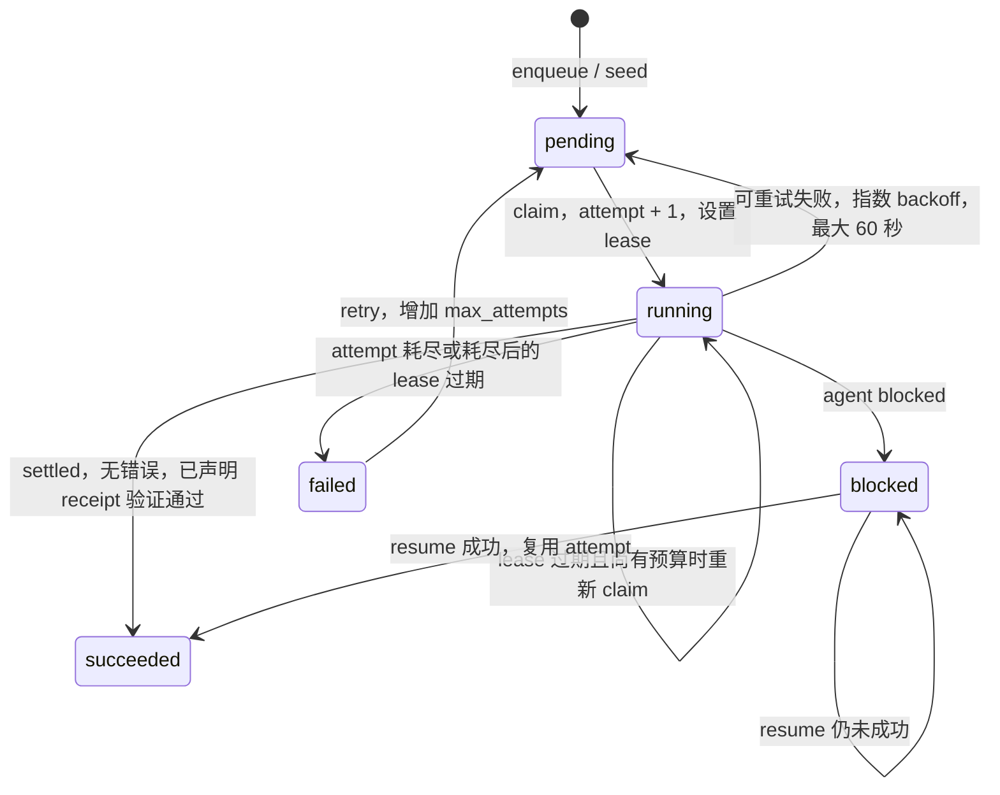
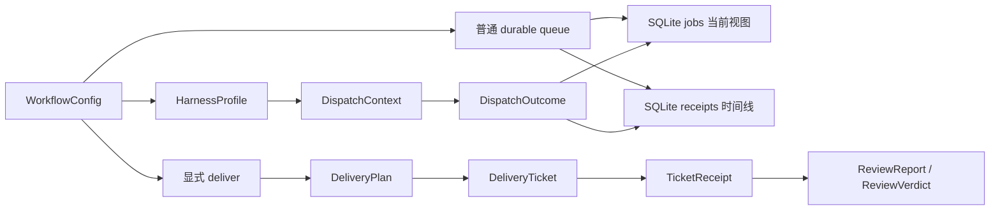

# 数据模型
Active contributors: oldwinter, chendongdong

herdr-orchestrator 有三类不能混用的数据：`src/herdr_orchestrator/model.py` 中的进程内对象、`src/herdr_orchestrator/store.py` 中的 durable queue 表，以及 `src/herdr_orchestrator/delivery_protocol.py` 校验的 opt-in 交付 JSON。前者是 frozen dataclass，后两者分别是 SQLite 持久化契约和文件 artifact 契约。

## 共享枚举

| Enum | 值 | 使用位置 |
| --- | --- | --- |
| `Harness` | `droid`, `grok`, `codex`, `pi`, `claude`, `hermes` | Workflow、catalog、job、CLI |
| `JobState` | `pending`, `running`, `succeeded`, `blocked`, `failed` | Durable queue |
| `AgentState` | `idle`, `working`, `blocked`, `done`, `unknown` | Herdr outcome observation |
| `PlacementMode` | `hybrid`, `tab`, `pane`, `worktree` | Workflow 全局 policy |
| `PlacementTarget` | `tab`, `pane`, `worktree` | 已确定的 job topology |
| `ReceiptKind` | `output-prefix`, `file` | 普通 queue 的内容验收 |
| `TrackerBackend` | `local-markdown`, `github` | 标准化交付 tracker |
| `WayfinderMode` | `auto`, `always`, `never` | Wayfinder route policy |

`src/herdr_orchestrator/delivery_protocol.py` 另定义 `ProxyAction`、`AuthorityCategory` 和 `FindingSeverity`。Secret 或 production 权限类别只能得到 `escalate` 决策；review finding 只有 `must-fix` 与 `advisory` 两级。

## 进程内 dataclass

`src/herdr_orchestrator/model.py` 中的 dataclass 都使用 `frozen=True, slots=True`，用于模块间不可变传递。它们包含 `Path`、enum 和 tuple，不应被当成可直接消费的公共 JSON schema。

### 配置与 catalog

| Dataclass | 作用 |
| --- | --- |
| `CoordinatorConfig` | Poll、parallelism、lease、attempt 和 agent timeout |
| `PlacementConfig` | 全局 placement mode 与 worktree root |
| `StandardizedDeliveryConfig` | Tracker、artifact root、Wayfinder 与 repair bounds |
| `PlannerConfig` | Planner 开关、controller、worker pool、文件和 cadence |
| `HarnessProfile` | Compact metadata 与完整 context 文件引用 |
| `WorkerConfig` | Worker 名、harness、replica 与默认 placement |
| `SeedJobConfig` | 可幂等 seed packet |
| `WorkflowConfig` | 完整解析结果 |

`PlannerConfig.harness=None` 表示 `auto`；`WorkerConfig.placement=None` 表示没有 worker override。`src/herdr_orchestrator/catalog.py` 的 compact payload 使用 `schema_version=1`，只输出能力字段和 `profile_ref`；full payload 才附加 `context`。

### Queue 与 dispatch

| Dataclass | 关键字段和阶段 |
| --- | --- |
| `TaskReceipt` | `kind + value`，在 dispatch 前声明验收条件 |
| `NewJob` | Workflow、title、harness、prompt、dedupe、attempt、placement、receipt |
| `ClaimedJob` | Job id、attempt、agent slot、确定 placement、correlation id |
| `DispatchContext` | Topology、task/batch key、worktree root、receipt、correlation id |
| `DispatchOutcome` | Agent state、pane/workspace、error、settlement、verification、phase timing |
| `PlannerTask` | Planner JSON 校验后的 title、harness、prompt、dedupe |

`DispatchOutcome.state` 只是 agent 生命周期观察。Job 成功还要满足没有 `error_code`，且已声明 receipt 时 `task_verified is True`；`idle` 或 `done` 本身不是内容验收。

## SQLite schema v4

`Store.initialize()` 在 `src/herdr_orchestrator/store.py` 中创建四张表和 runnable index，并按 v1 → v2 → v3 → v4 顺序迁移旧数据库。连接启用 foreign keys 和 WAL；涉及 claim、outcome、retry、resume 的复合写入使用 `BEGIN IMMEDIATE`。

### `jobs`

`jobs` 是每个 job 的当前视图。

| 列组 | 列 |
| --- | --- |
| 身份 | `id`, `workflow`, `title`, `harness`, `prompt`, `dedupe_key` |
| 调度 | `placement`, `state`, `attempts`, `max_attempts`, `available_at`, `lease_until` |
| Agent/topology | `agent_name`, `execution_path`, `herdr_workspace_id` |
| Receipt/结果 | `receipt_kind`, `receipt_value`, `agent_settled`, `task_verified` |
| 错误/关联 | `error_code`, `error_summary`, `correlation_id` |
| 时间 | `created_at`, `updated_at` |

`UNIQUE(workflow, dedupe_key)` 提供幂等 enqueue；`jobs_runnable` 覆盖 `(workflow, state, available_at, lease_until)`。只有 placement 已确定、attempt 尚有预算、可运行或 lease 已过期的记录能被 claim。

### `receipts`

`receipts` 为每次 outcome observation 追加一行：

| 列组 | 列 |
| --- | --- |
| 身份 | `id`, `job_id`, `attempt` |
| 状态 | `state`, `agent_state`, `agent_name`, `member_reused` |
| Topology | `pane_id`, `placement`, `execution_path`, `herdr_workspace_id` |
| 结果 | `error_code`, `error_summary`, `agent_settled`, `task_verified` |
| 关联与时间 | `correlation_id`, `observed_at` |

Blocked job 的人工 `resume` 复用 agent、pane、placement 和同一个 attempt，因此同一 attempt 可以有多条 receipt。表通过 `job_id REFERENCES jobs(id)` 关联，但 schema 没有把它声明成不可变审计日志；外部代码不应绕过 `Store` 写表。

### 其他表

- `schema_meta(version INTEGER NOT NULL)` 保存数据库 schema version。
- `metadata(key TEXT PRIMARY KEY, value TEXT NOT NULL, updated_at REAL NOT NULL)` 保存 coordinator 的少量 runtime metadata，例如 planner cadence；它不是通用配置表。

## Queue 状态迁移

普通 task receipt 的三态是：

- `task_verified=true`：声明的 output prefix 或文件已经验证。
- `task_verified=false`：receipt 明确无效。
- `task_verified=null`：兼容 job 未声明 receipt，或 transport 没有报告；已声明 receipt 时此值会 fail closed。

更完整的恢复语义见[任务与收据](../primitives/jobs-and-receipts.md)和[收据与恢复](../features/receipts-and-recovery.md)。

## 标准化交付 artifact

`src/herdr_orchestrator/delivery_protocol.py` 的 loader 要求 JSON 顶层和嵌套对象 key 精确匹配，额外或缺失字段都会失败。交付对象同样使用 frozen、slotted dataclass。

| Artifact | 对象 | 关键不变量 |
| --- | --- | --- |
| `wayfinder-route.json` | `WayfinderRoute` | `use_wayfinder` 必须是 boolean |
| `wayfinder-map.json` | `WayfinderMap`、`DecisionTicket` | Decision id 唯一；kind 受 allowlist 限制；blocker 必须先出现 |
| `wayfinder/resolution-ID.json` | `WayfinderResolution` | 必须匹配选中的 decision；新 decision 不得预先 resolved |
| `delivery-plan.json` | `DeliveryPlan`、`DeliveryTicket` | 至少一个 ticket；acceptance 非空；依赖只指向前序 ticket |
| `receipts/ticket-ID.json` | `TicketReceipt`、`AcceptanceResult` | Commit 为 7–64 位小写十六进制；criterion 文本和顺序精确匹配；全部通过 |
| `reviews/round-N/standards.json`、`spec.json` | `ReviewFinding` | 各文件只含对应 axis |
| `reviews/round-N/verdict.json` | `ReviewVerdict` | accepted/dismissed 不重叠，并完整划分候选 finding id |
| `proxy/*.json` | `ProxyDecision` | 非 escalation 必须提供 response；secret/production 必须 escalation |

Delivery slug 最长 63 字符，只含小写字母、数字和连字符；ticket/decision id 是 2–3 位数字。普通 queue 的 `TaskReceipt`、SQLite `receipts` 行和交付 `TicketReceipt` 名称相近，但生命周期、验证条件和存储位置完全不同。完整说明见[交付 Artifact](../primitives/delivery-artifacts.md)。

## 关系图

## 关键源文件

| 完整路径 | 用途 |
| --- | --- |
| `src/herdr_orchestrator/model.py` | 共享 enum 与 dataclass |
| `src/herdr_orchestrator/config.py` | 配置对象的构建与交叉校验 |
| `src/herdr_orchestrator/catalog.py` | Harness profile、compact/full payload |
| `src/herdr_orchestrator/store.py` | SQLite schema、迁移、claim、outcome、retry、resume |
| `src/herdr_orchestrator/delivery_protocol.py` | 交付 JSON dataclass 与严格 loader |
| `docs/workflow-schema.md` | Workflow schema v1 |
