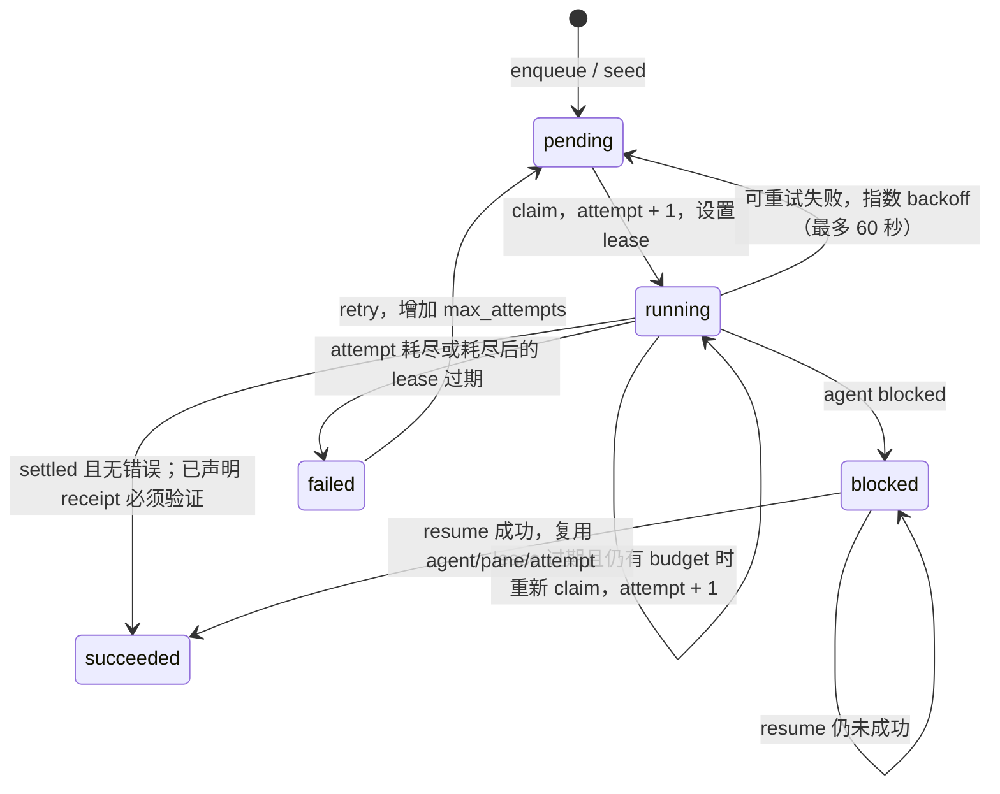
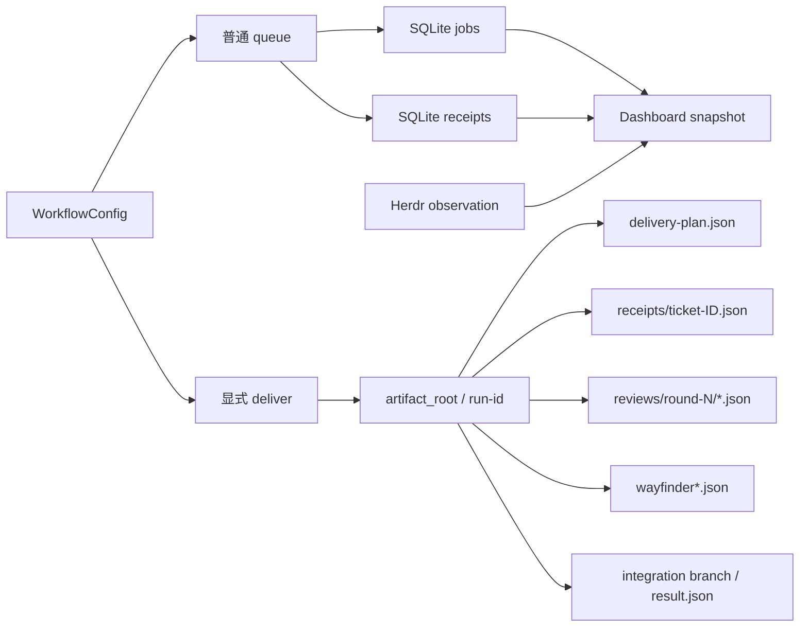

# 数据模型
Active contributors: oldwinter, chendongdong

本页区分四层数据：Python 内存对象、普通 queue 的 SQLite 状态、Dashboard 只读投影，以及 opt-in 标准化交付 artifact。核心定义分别位于 `src/herdr_orchestrator/model.py`、`src/herdr_orchestrator/store.py`、`src/herdr_orchestrator/dashboard/observer.py`、`src/herdr_orchestrator/dashboard/projector.py` 与 `src/herdr_orchestrator/delivery_protocol.py`。

> 稳定性提示：dataclass 都是 `frozen=True, slots=True`，适合模块间不可变传递，但字段本身不是通用 JSON API。公共消费者应使用有 `schema_version` 或严格 loader 的输出，而不是依赖 Python 对象布局。

## 核心 enum

| Enum | 值 | 用途 |
| --- | --- | --- |
| `Harness` | `droid`, `grok`, `codex`, `pi`, `claude`, `hermes` | Controller/worker kind |
| `JobState` | `pending`, `running`, `succeeded`, `blocked`, `failed` | Durable queue 状态 |
| `AgentState` | `idle`, `working`, `blocked`, `done`, `unknown` | 一次 Herdr agent observation |
| `PlacementMode` | `hybrid`, `tab`, `pane`, `worktree` | Workflow 全局 topology policy |
| `PlacementTarget` | `tab`, `pane`, `worktree` | 已确定的 job topology |
| `ReceiptKind` | `output-prefix`, `file` | 普通 queue 的 task receipt 类型 |
| `TrackerBackend` | `local-markdown`, `github` | 标准化交付 tracker |
| `WayfinderMode` | `auto`, `always`, `never` | 标准化交付 route policy |

`src/herdr_orchestrator/delivery_protocol.py` 另定义：

| Enum | 值 |
| --- | --- |
| `ProxyAction` | `answer`, `approve`, `deny`, `escalate` |
| `AuthorityCategory` | `local-reversible`, `spec-authorized`, `secret`, `production` |
| `FindingSeverity` | `must-fix`, `advisory` |

## 核心 dataclass

### 配置对象

| Dataclass | 角色 |
| --- | --- |
| `CoordinatorConfig` | poll、parallelism、lease、attempt 与 agent timeout |
| `PlacementConfig` | 全局 mode 与 worktree runtime 根 |
| `StandardizedDeliveryConfig` | tracker、artifact、Wayfinder 与 repair bounds |
| `PlannerConfig` | planner 开关、controller/pool、prompt/output 与 cadence |
| `HarnessProfile` | compact catalog metadata 与完整 context 引用 |
| `WorkerConfig` | worker 名、harness、replica 与默认 placement |
| `SeedJobConfig` | 可幂等 seed packet |
| `WorkflowConfig` | 已解析、已交叉校验的完整 workflow 聚合 |

这些对象中的 `Path` 已按配置规则解析；`PlannerConfig.harness=None` 和
`WorkerConfig.placement=None` 分别表示 `auto`/无 override。

### Durable queue 与 dispatch 对象

| Dataclass | 生命周期与关键字段 |
| --- | --- |
| `TaskReceipt` | `kind + value`；声明内容级成功条件 |
| `NewJob` | 入库 packet：workflow、canonical workspace、title、harness、prompt、dedupe、attempt budget、placement、receipt |
| `ClaimedJob` | claim 后的 job 快照：job id、attempt、agent slot、确定 placement、correlation id |
| `DispatchContext` | 交给 transport 的 topology、task/batch key、worktree root 与 receipt |
| `DispatchOutcome` | transport observation：agent state、pane/workspace、error、settlement、verification 与 timings |
| `PlannerTask` | 通过 planner schema 校验后可入队的 title/harness/prompt/dedupe |

`DispatchOutcome.state` 只说明 agent 生命周期；job 是否成功还要结合 `error_code` 和
`task_verified`。`idle`/`done` 不是独立质量证明。

### 标准化交付对象

| 阶段 | Dataclass |
| --- | --- |
| Wayfinder route/map | `WayfinderRoute`, `DecisionTicket`, `WayfinderMap`, `WayfinderResolution` |
| Spec 与 ticket DAG | `DeliveryTicket`, `DeliveryPlan` |
| 实现验收 | `AcceptanceResult`, `TicketReceipt` |
| 双轴 review | `ReviewFinding`, `ReviewReport`, `ReviewVerdict` |
| Principal proxy | `ProxyDecision` |
| 最终运行结果 | `DeliveryResult`（定义于 `src/herdr_orchestrator/delivery.py`） |

`ReviewReport.must_fix` 是从 Standards 与 Spec 两轴中筛选 `must-fix` finding 的计算属性，不是单独持久化表。

## SQLite durable queue

当前 schema version 是 **7**。`Store.initialize()` 创建 `schema_meta`、`jobs`、
`receipts`、`metadata`、`harness_health` 和 runnable index，并能按顺序迁移 v1 → v2 → v3 → v4
→ v5 → v6 → v7。
SQLite 使用 foreign keys、WAL journal 和写事务 `BEGIN IMMEDIATE`。

### `jobs`

`jobs` 保存 job 的当前状态。

| 列组 | 列与 SQLite 声明 |
| --- | --- |
| 标识 | `id INTEGER PRIMARY KEY AUTOINCREMENT`; `workflow TEXT NOT NULL`; `workspace TEXT NULL`; `UNIQUE(workflow, dedupe_key)` |
| 输入 | `title TEXT NOT NULL`, `harness TEXT NOT NULL`, `prompt TEXT NOT NULL`, `dedupe_key TEXT NOT NULL` |
| 调度 | `placement TEXT NULL`, `state TEXT NOT NULL`, `attempts INTEGER NOT NULL DEFAULT 0`, `max_attempts INTEGER NOT NULL`, `available_at REAL NOT NULL`, `lease_until REAL NULL` |
| Agent/runtime | `agent_name TEXT NULL`, `execution_path TEXT NULL`, `herdr_workspace_id TEXT NULL`, `correlation_id TEXT NULL` |
| 成功/错误 | `error_code TEXT NULL`, `error_summary TEXT NULL`, `agent_settled INTEGER NULL`, `task_verified INTEGER NULL` |
| Receipt 声明 | `receipt_kind TEXT NULL`, `receipt_value TEXT NULL` |
| 时间 | `created_at REAL NOT NULL`, `updated_at REAL NOT NULL` |

索引 `jobs_runnable` 覆盖 `(workflow, state, available_at, lease_until)`。`placement=NULL`
表示 topology 尚未决策；claim 只选择 placement 已确定、attempt 未耗尽且可运行或 lease
已过期的记录。

### `receipts`

`receipts` 保存每次 outcome observation；blocked job 恢复时可以在**同一个 attempt**
追加第二条 receipt。

| 列组 | 列与 SQLite 声明 |
| --- | --- |
| 标识 | `id INTEGER PRIMARY KEY AUTOINCREMENT`, `job_id INTEGER NOT NULL REFERENCES jobs(id)`, `attempt INTEGER NOT NULL` |
| Durable/agent 状态 | `state TEXT NOT NULL`, `agent_state TEXT NOT NULL`, `agent_name TEXT NOT NULL` |
| 所有权/topology | `member_reused INTEGER NOT NULL`, `pane_id TEXT NULL`, `placement TEXT NULL`, `execution_path TEXT NULL`, `herdr_workspace_id TEXT NULL` |
| 成功/错误 | `error_code TEXT NULL`, `error_summary TEXT NULL`, `agent_settled INTEGER NULL`, `task_verified INTEGER NULL` |
| 关联与时间 | `correlation_id TEXT NULL`, `observed_at REAL NOT NULL` |

`jobs` 是当前视图，`receipts` 是 outcome 时间线来源。实现目前追加 receipt，但数据库
schema 没有把它声明成不可变审计日志；外部代码不应绕过 `Store` 直接写表。

### 其他表

- `schema_meta(version INTEGER NOT NULL)`：数据库 schema version。
- `metadata(key TEXT PRIMARY KEY, value TEXT NOT NULL, updated_at REAL NOT NULL)`：当前用于 coordinator 的少量运行 metadata，例如 planner cadence；它不是通用配置存储。
- `harness_health(workflow, workspace, harness)`：readiness health projection。它保存 `status`、
  `reason`、`source`、`observed_at`、`expires_at`、`cooldown_until`、`retryable_failures` 和
  compare-and-set probe lease；不保存 prompt 或 terminal output。当前 schema version 为 `7`。

### 状态迁移

Receipt 三态语义：

- `task_verified=true`：声明的 output/file receipt 已验证。
- `task_verified=false`：receipt 明确无效。
- `task_verified=null`：兼容 job 未声明 receipt，或 transport 未报告验证；若 job 声明了 receipt，未报告会 fail closed。

## Dashboard snapshot

Dashboard 不直接暴露数据库行。`SqliteObserver` 以只读 SQLite URI 读取白名单列，
`HerdrObserver` 读取并过滤当前 workspace 的 Herdr topology，`RuntimeProjector` 再把两者关联成 `schema_version=1` snapshot。

| 顶层字段 | 内容 |
| --- | --- |
| `schema_version` | 当前为 `1` |
| `workflow`, `generated_at` | Scope 与生成时间 |
| `source_health` | queue/Herdr observation 健康度和受限 error code |
| `summary` | Job state counts、active agents、worktrees、attention count |
| `jobs` | 不含 prompt 的 job 投影、匹配到的 runtime agent、drift code |
| `attention` | blocked/failed、source failure、runtime drift、stale job |
| `topology` | 兼容的 workspace 视图，以及 project → worktree/workspace → tab → pane；agent 作为 pane 数据而非额外图节点 |
| `timeline` | 合成 enqueue event 与 SQLite receipt event；按时间倒序，最多 100 项 |

HTTP `/api/snapshot` 外层是 `{"event_id": ..., "snapshot": ...}`；SSE
`/api/events` 的 `snapshot` event data 是 snapshot 本身。投影明确不读取或输出 job
prompt、环境变量和 terminal output；Herdr 对象也只保留
`src/herdr_orchestrator/dashboard/observer.py` 中的字段白名单。

Snapshot 中的 `runtime`、`topology` 来自当次观察，会随 Herdr 状态变化；`drift` 是 queue
与 runtime 的派生比较，不会回写 SQLite。除顶层 `schema_version` 所描述的结构外，调用方
不应把 Herdr 的可变内部字段当作 queue 的公共持久化承诺。

## 标准化交付 artifact 与其他模型的关系

普通 queue 与 `deliver` 共用 workflow、harness profile 和 Herdr transport，但
`deliver` 有独立的恢复目录、ticket DAG、worktree/integration 流程和 receipt。当前
Dashboard 只投影 SQLite jobs/receipts 与 Herdr topology，**不会解析标准化交付目录**。
Local Markdown tracker 的 spec/ticket 文件位于 `tracker_root/<slug>/`，也不属于 SQLite。

### 严格 JSON artifact

`src/herdr_orchestrator/delivery_protocol.py` 的 loader 要求对象 key 集精确匹配，额外或缺失字段都会失败。

| Artifact | 精确结构与关键不变量 |
| --- | --- |
| `wayfinder-route.json` | `use_wayfinder`, `reason` |
| `wayfinder-map.json` | `destination`, `notes`, `decisions`, `not_yet_specified`, `out_of_scope`；decision 含 `id/title/question/kind/blocked_by/resolution` |
| `wayfinder/resolution-ID.json` | `ticket_id`, `resolution`, `new_decisions`, `not_yet_specified`, `out_of_scope`；必须匹配当前 decision |
| `delivery-plan.json` | `slug`, `title`, problem/solution、story/decision/scope/seam arrays、`tickets`；至少一个 ticket |
| `receipts/ticket-ID.json` | `ticket_id`, `commit`, `acceptance`, `checks`, `summary`；criterion 必须与 ticket acceptance criteria 文本和顺序完全一致且全部通过 |
| `reviews/round-N/standards.json` | 只含 `standards` finding array |
| `reviews/round-N/spec.json` | 只含 `spec` finding array |
| `reviews/round-N/verdict.json` | `accepted`, `dismissed`, `rationale`；两组不重叠且完整划分候选 finding id |
| `proxy/*.json` | `action`, `category`, `response`, `rationale`；secret/production 必须 `escalate` |

共同约束包括：slug 为最多 63 字符的小写数字/连字符形式；ticket/decision id 是 2–3 位数字；
dependency 必须引用列表中更早出现的 ticket；receipt commit 是 7–64 位小写十六进制；
review severity 只能是 `must-fix` 或 `advisory`。

恢复目录还包含 `state.json`、`decision-ledger.jsonl`、`routes/`、`worktrees/` 与最终
`result.json`。这些是 `src/herdr_orchestrator/delivery.py` 的运行/恢复实现面，不应与
`delivery_protocol.py` 中受严格校验的 agent artifact 混为同一个公共 schema。
