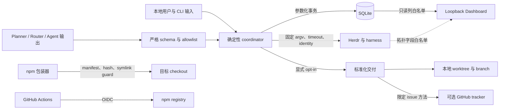
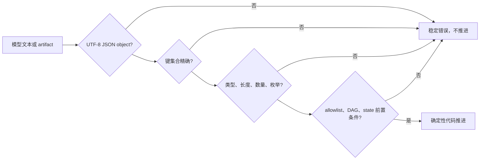

# 安全与信任边界
Active contributors: oldwinter, chendongdong

Herdr Orchestrator 不是 OS 沙箱。它的安全目标是让**状态推进、成功证据、terminal ownership、
文件 ownership 和外部副作用授权**由确定性代码约束，而不是由模型文本、终端画面或一个
可用 credential 决定。

当前安全政策支持最新 npm release 与 `main`。敏感漏洞请使用 GitHub 私有漏洞报告：

<https://github.com/oldwinter/herdr-orchestrator/security/advisories/new>

不得在公开 issue 中粘贴 credential、prompt、完整 terminal output 或 exploit details。

## 安全模型

系统没有应用登录层。权限来自当前 OS 用户、本地文件权限、Herdr session、harness 登录态和
用户显式命令。`.factory/threat-model.md` 的当前版本是 1.1.0；
`.factory/security-config.json` 启用 SQL/command injection、XSS、path/symlink traversal、
auth bypass、IDOR、terminal ownership、receipt confusion、secret disclosure 和
untrusted CI execution 等模式。

## 关键资产与明确假设

需要保护的资产：

- 源码、未提交修改、未跟踪文件、Git index、branch、worktree 与 integration commit；
- `.orchestrator/` 中的 prompt、queue、lease、attempt、receipt、telemetry 和 delivery artifact；
- 用户及其他运行创建的 workspace、tab、pane、agent；
- 环境变量、keychain、provider/GitHub/npm 登录态；
- npm manifest、Herdr config、manager-light plugin ownership；
- accepted spec、tracker reference、review evidence 与 blocked response。

当前接受的信任假设：

1. **同一 OS 用户属于同一信任域。** 能同时篡改 SQLite、terminal 和 checkout 的本地进程
   可以伪造证据；系统不提供多租户隔离或密码学审计。
2. **Herdr、Git、Node、Python、GitHub CLI 与 harness binary 是受信本地依赖。**
   控制面验证结构化输出和 identity，不验证这些二进制的进程完整性。
3. **Worktree 只隔离 checkout。** 它不隔离进程、凭据、网络、端口、其他目录或生产系统。
4. **Receipt 不是签名。** Output receipt 证明当前 turn 有新行；file receipt 证明文件字节
   发生变化。二者都不证明作者身份或业务质量。
5. **Dashboard 安全前提是只读且 loopback-only。** 扩大 bind 或增加 mutation route
   必须重新设计认证、授权、CSRF、审计和连接预算。

## STRIDE 风险摘要

| 类别 | 主要风险 | 当前控制 | 剩余风险 |
| --- | --- | --- | --- |
| 冒充 | 外部 agent 使用稳定名称；pane 被替换；伪造 manifest/plugin ownership | agent/kind/pane/workspace/cwd/state 联合校验；创建 receipt；manifest package/schema/hash；plugin canonical path | 同 OS 用户可同时篡改事实源；无密码学身份 |
| 篡改 | 路径逃逸、symlink 重定向、模型 command、SQL injection、旧 receipt、resume 竞态 | containment、逐层 `lstat`、argv 无 shell、参数化 SQL、strict schema、前后 hash/size、state/attempt transaction | File 检查与读取存在本地 TOCTOU；同用户信任假设仍成立 |
| 抵赖 | Retry、resume、cleanup 或 tracker 动作无法还原 | Append-only attempt receipt、correlation ID、delivery ledger、稳定 CLI error | Ledger 不保存真实代理回答；调用只归因 OS 用户 |
| 信息泄露 | Prompt、response、terminal、secret、路径经 Dashboard/telemetry/report 外泄 | 字段白名单、prompt/output 排除、sanitize、有界摘要、exporter 默认关闭 | SQLite 与 delivery artifact 含敏感本地数据；元数据并非匿名 |
| 拒绝服务 | 无界模型输出、等待、文件、SSE thread、重试占用资源 | 长度/数量/并发/attempt/deadline 上限；poll 范围；retry backoff | File receipt 整文件读取；每 SSE 连接一线程；本地进程可施压 |
| 权限提升 | 模型触发 shell/生产动作；普通 queue 获得 proxy；GC 关闭用户 pane | Planner 无 command；两条运行面分离；exact opt-in；ownership GC；protected category escalation | Harness 最大自动化参数仍拥有 OS 用户实际能力；prompt 不是 sandbox |

## 输入与模型输出

本地参数也不是无害输入。Workflow、prompt/response/goal 文件、job ID、receipt 值和 project
path 在进入文件系统、SQLite、Herdr、Git 或 tracker 前必须验证。

模型输出始终先经过确定性 loader：

- `src/herdr_orchestrator/planner.py` 只接受 bounded task 列表或单一 harness route；
- `src/herdr_orchestrator/topology.py` 只接受允许的 placement 和 rationale；
- `src/herdr_orchestrator/delivery_protocol.py` 对 map、plan、ticket DAG、receipt、review、
  verdict 与 proxy decision 使用 exact-key 和有界规则；
- Planner task 没有 shell command 字段；
- `src/herdr_orchestrator/protocol.py`、`tracker.py`、`git_workspace.py` 和 manager 包使用
  argv 数组，不执行模型生成的 shell 字符串。

Schema 只证明 shape 和局部不变量，不证明计划合理、代码正确或外部动作已授权。

## Secret、PII 与本地敏感状态

Secret 只能来自环境变量、keychain 或 harness-native 登录态。不得写入源码、workflow、
goal、prompt、receipt、tracker 正文、delivery ledger、Dashboard、telemetry 或安全报告。

`src/herdr_orchestrator/observability.py::sanitize()` 会：

- 对 authorization、cookie、credential、password、prompt、secret、session、terminal、
  token 等敏感 key 整值替换；
- 擦除常见 GitHub/OpenAI/Bearer token 和 secret assignment 形状；
- 递归清洗 mapping/sequence，压缩空白并把字符串限制到 300 字符；
- 在 `src/herdr_orchestrator/store.py` 持久化 `error_summary` 前复用。

这只是事故缓解，不是通用 DLP；任意格式的密钥、姓名、邮箱、客户数据和其他 PII 未必被
正则识别。

| 本地位置 | 可能内容 | 处理原则 |
| --- | --- | --- |
| `.orchestrator/state.db` 与 WAL | 原始 job prompt、receipt 值、路径、agent/pane、attempt | 不提交；用 OS 权限与明确 retention 管理 |
| `.orchestrator/telemetry/*.jsonl` | 已清洗事件、指标、alert、correlation ID | 仍是操作数据；exporter 默认关闭 |
| `.orchestrator/deliveries/` | spec、plan、review、ledger、worktree 坐标 | 不放 secret/production 数据；失败默认保留以恢复 |
| `.scratch/standardized-delivery/` | 本地 tracker 规格和 ticket evidence | 视为业务敏感文档 |
| `.secrets.baseline` | detector baseline 和 hash | 不是存放真实 secret 的位置 |

可选 Sentry、PostHog 与 webhook exporter 由 feature flag 控制，默认关闭；非法布尔值、缺
配置或非 HTTPS endpoint 均 fail closed，请求 timeout 为 2 秒。

## Queue、receipt 与 terminal ownership

### 状态与 receipt

`idle/done` 只会产生 `agent_settled=true`。声明 task receipt 后，还必须：

- Output-prefix 来自当前 turn baseline 后的新行，且 prompt 的独立行不能与 prefix 歧义；
- File 位于 execution root 下、无绝对路径/`..`/symlink、存在且非空，并在本 turn 改变；
- Agent 最终是 settled success，而不是 blocked、working、unknown 或 timeout。

`Store.record_outcome()` 再次 fail closed：声明 receipt 但
`task_verified is not True`，不能把 lifecycle success 写成 job success。Attempt receipt
保存 attempt、agent、pane、placement、settlement、verification、error 和 correlation；
旧 attempt 在 lease 被重新 claim 后不能覆盖新 attempt。

### Resume 与 GC

普通 queue 不自动回答 blocked。`resume --response-file` 必须匹配最新 receipt 的原
agent、pane、attempt 和 execution workspace，并通过 literal pane text + Enter 继续原 turn。

GC 默认 dry-run，且只关闭同时满足以下条件的 terminal：

1. Job 属于显式 succeeded 或 failed scope；
2. Placement 是 tab/pane，不是 worktree；
3. Agent name 属于当前 workflow 的稳定 allowlist；
4. 创建 receipt 证明 `member_reused=false` 且 pane ID 未变；
5. 当前 identity、cwd/workspace、settled state 再次匹配；
6. 没有 active job 仍引用该 agent。

Blocked、worktree、复用、foreign、active 或 ownership 不完整的资源都跳过。详见
[收据与恢复](features/receipts-and-recovery.md)和
[拓扑感知派发](features/topology-aware-dispatch.md)。

## Harness 最大自动化与 Claude trust

`src/herdr_orchestrator/herdr.py` 为六个 harness 固定最高自动化参数；workflow、planner 和
task 不能覆盖。这些 flag 只减少 harness-native 确认，不授权 push、merge、publish、
messaging、permission 或 production 操作。

Claude 没有 workspace trust bypass。控制面只在**新 Claude agent 的 startup** 中同时看到：

- `Accessing workspace:`
- `Quick safety check:`
- `Yes, I trust this folder`
- 与预期 execution root 完全相等的独立路径行

才自动发送一次 Enter。不同目录、登录、secret、一般 approval、需求澄清或 marker 缺失都
不会自动回答。测试真源是 `tests/test_harness_automation.py`。

## Dashboard 网络边界

`src/herdr_orchestrator/dashboard/server.py` 当前没有认证，因为网络面被严格限制：

- 只接受 bind `127.0.0.1` 或 `localhost`；
- 每个 GET 校验 Host hostname 和实际端口；失败返回 421；
- 只允许 `/`、`/api/health`、`/api/snapshot`、`/api/events` 和五个静态资源；
- 没有 POST、retry、resume、focus、pane input 或其他 mutation route；
- 静态资源带 self-only CSP、`no-store`、`nosniff`、`no-referrer`；
- SQLite observer 使用 `mode=ro` 和显式列，不读取 prompt；
- Herdr observer 只读取仓库相关拓扑字段，不读取 terminal output。

Snapshot 仍可含 title、dedupe key、路径、branch、cwd、workspace/pane ID 和已清洗错误摘要。
这些是本地敏感元数据。Loopback 不是多用户认证；不要通过反向代理或宽 bind 暴露。

## npm 安装器、manager 与 manager-light

### 项目安装 ownership

`bin/herdr-orchestrator.mjs` 只允许 manifest 管理：

- `.herdr-orchestrator/`
- `.agents/skills/herdr-orchestrator/`
- `.orchestrator/.gitignore`

Manifest 要求 schema 1、正确 package、字符串版本、唯一受支持 harness 和合法 SHA-256。
路径拒绝绝对值、反斜线、`..` 和 allowlist 外条目；读写前逐层 `lstat`。Git-local
`info/exclude` 同样拒绝 symlink 和非普通文件。

非托管冲突在项目写入前停止；内容相同的外部 Skill 可复用但不接管；用户修改过的 owned
file 在 install/upgrade/uninstall 中保留。Doctor 检查 missing、modified 和 version skew。

### 手动 manager

`manager/AGENTS.md` 把 terminal output 与 agent message 视为不可信观察，不允许 manager
自己变成第二个 scheduler。`herdr-manager` 薄包只以固定 argv 转发，不使用 shell；默认候选
只来自 `grok → codex → claude`。Manager 必须在 `HERDR_ENV=1` 内运行，且无权从 idle 推断
任务成功。

### Manager-light

`plugins/manager-light/configure.mjs` 管理一个带 marker 的 `[ui.sidebar.agents]` block 和
包内 plugin link。它：

- 要求 Herdr 0.8.2+；
- 拒绝 symlink config、损坏/修改 marker、外部 Agent rows 和同名外部 plugin；
- 保留区块外字节与原文件 mode；
- 先对临时候选执行 `herdr config check`，再原子 rename；
- Plugin link 失败时回滚 config；
- 卸载只移除 owned block/plugin。

Manager 进程的蓝色 metadata token 是 best-effort；上报失败不得阻止 harness 启动。

## 标准化交付权限

标准化交付只由显式 `deliver`、Skill 或规定的精确触发语句启用。成功停在隔离 integration
branch，不 push、不创建 PR、不合并用户分支、不 release、不 deploy。

Principal proxy 只可回答 accepted spec 内、本地、可逆的问题：

| 类别 | 行为 |
| --- | --- |
| `local-reversible` | 可回答本地可逆实现/测试默认值 |
| `spec-authorized` | 可回答 accepted spec 已授权的 repo edit、隔离 commit/merge、tracker reconcile、repair |
| 超出 spec | deny |
| `secret` / `production` | 必须 escalate 给用户 |

每个 blocked turn 最多 8 轮。Ledger 只记录问题 hash、action、category 和 rationale，不记录
具体 response。GitHub tracker 只实现 issue create/edit/close；可用 `gh` credential 不等于
获得 push、PR、release 或 deploy 权限。

## CI 与供应链

`.github/workflows/ci.yml` 维持以下边界：

1. PR 与 `main` 的 test 都在 GitHub-hosted `ubuntu-latest`，checkout 不持久化 credential；
2. Actions 用 immutable commit SHA，Python/Node/uv/just 和 dev dependency 有版本/lock；
3. PR 写权限位于不 checkout contributor code 的 `pr-review` job；
4. 默认分支 security 失败时，独立 `security-insight` job 才有 `issues: write`；
5. Persistent self-hosted runner 只处理通过测试的可信 `main` release plan；
6. 真正 npm publish 回到 GitHub-hosted runner，使用 Environment `npm` 和 OIDC；
7. Publish 无长期 npm token，`npm ci --ignore-scripts` 后按双包版本 gate 发布；
8. `contents: write` 只用于创建运行包 GitHub Release，`id-token: write` 用于 npm。

不得让 pull request code 进入 persistent runner，也不得把 OIDC publish 移到 self-hosted
runner；npm Trusted Publishing 不支持该环境。

## 扫描、报告与证据含义

`just security` 的实际 gate：

1. `detect-secrets-hook` 对 tracked/unignored 文件使用 `.secrets.baseline`；
2. Bandit 扫描 `src/` 的 medium/high 结果并写
   `.orchestrator/quality/bandit.json`；
3. `pip-audit --local` 写 `.orchestrator/quality/pip-audit.json`。

CI 先用 `continue-on-error` 收集证据，最后统一强制 security outcome 成功。质量 artifact
保留 14 天。

`security-findings.json` 当前是
`origin/main..staged`、23 个文件、0 finding、威胁模型 1.1.0 的一次**时间点快照**。它不由
`just security` 消费，不能证明当前工作树、依赖或未来 release 没有漏洞。
`.factory/security-config.json` 同样是评审 policy：扫描频率标为 `on_commit`，
CRITICAL 阻断 merge，HIGH/CRITICAL 要求 review；它不替代 CI scanner exit code。

当前没有统一 freshness/schema 工具把 factory finding、Bandit、pip-audit 和 secret scan
合并为一份机器真源。这个有证据的维护机会见[清理机会](cleanup-opportunities.md)。

## 响应顺序

1. 记录稳定 error code、job/attempt/correlation ID 和最小复现，不复制完整 prompt/output。
2. 本地运行 `just security`，检查 `.orchestrator/quality/` 的机器结果。
3. 怀疑 exporter 泄漏时关闭所有 `HERDR_FEATURE_*`，并在 credential 所属服务轮换。
4. 添加拒绝路径回归测试，运行最小测试后执行 `just check`。
5. 默认分支恢复绿色后再关闭 insight。
6. 已发布 npm 版本不可变；修复后发布新版本，必要时 deprecate 受影响版本。

## 安全回归索引

| 边界 | 主要测试 |
| --- | --- |
| Harness flags 与 Claude trust | `tests/test_harness_automation.py` |
| Agent/pane/cwd、turn、receipt、runtime error | `tests/test_herdr.py` |
| Lease、attempt、migration、receipt fail closed | `tests/test_store.py` |
| Blocked resume 与 GC ownership | `tests/test_runner.py` |
| Dashboard scope、prompt 排除、Host/CSP | `tests/test_dashboard.py` |
| Telemetry redaction、HTTPS 与默认关闭 | `tests/test_observability.py` |
| Principal proxy 与 delivery artifact | `tests/test_delivery.py`、`tests/test_delivery_protocol.py` |
| Tracker 限权 | `tests/test_tracker.py` |
| Installer ownership 与 symlink | `tests/test_distribution.py` |
| Manager-light marker/plugin/config | `tests/test_manager_light.py` |
| Registry gate、runner 与 OIDC | `tests/test_release.py` |

安全边界变更必须测试拒绝路径；`blocked`、`unknown`、timeout、缺 artifact、stale receipt 和
ambiguous receipt 都不是成功。
