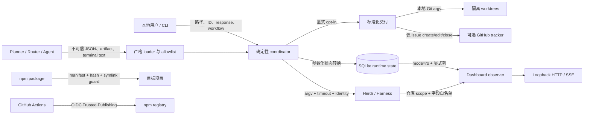
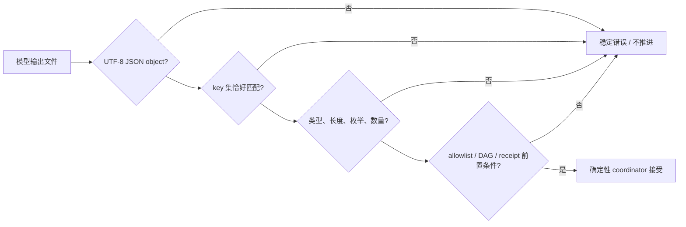

# 安全与信任边界
Active contributors: oldwinter, chendongdong

Herdr Orchestrator 的安全模型不是“限制 agent 能做什么”的沙箱，而是**用确定性控制面限制什么输入可以推进状态、什么证据可以算成功、什么本地或外部动作获得了授权**。系统默认信任当前操作系统账号、本地文件系统、Herdr 与已安装 harness；不信任模型输出、终端文本、planner artifact、HTTP Host、manifest 内容或陈旧的 pane/receipt 身份。

相关页面：[系统架构](overview/architecture.md) · [Herdr runtime](systems/herdr-runtime.md) · [本地 Dashboard](systems/dashboard.md) · [任务收据与恢复](features/receipts-and-recovery.md) · [标准化交付](systems/standardized-delivery.md) · [安装与分发](systems/installation-and-distribution.md) · [设计决策](background/design-decisions.md) · [配置参考](reference/configuration.md) · [清理机会](cleanup-opportunities.md)

## 安全目标与明确假设

需要保护的资产包括：

- 源码、未提交修改、未跟踪文件、Git branch、index 和 worktree；
- `.orchestrator/` 中的 prompt、queue、lease、attempt、receipt、交付 artifact 与 telemetry；
- Herdr workspace、tab、pane、agent identity 及其他运行创建的 terminal；
- 环境变量、keychain、harness 登录态、GitHub/npm/provider 凭据；
- npm 安装器的 ownership manifest，以及目标项目已有的用户文件；
- 标准化交付的 accepted spec、tracker reference、integration commit 与审查证据。

当前边界有四个重要前提：

1. **同一 OS 用户是信任域。** 任何能以同一账号改写 SQLite、terminal 或 checkout 的进程，都能破坏本地证据；系统不提供多租户隔离。
2. **Herdr、Git、GitHub CLI 和 harness 二进制是受信本地依赖。** Python/Node 控制面验证它们的结构化返回与身份，但不验证二进制供应链或进程完整性。
3. **Worktree 只隔离 checkout。** 它不隔离进程、网络、凭据、端口、主仓库之外的文件或生产系统。
4. **Receipt 是保守证据，不是签名。** output-prefix 证明当前 turn 出现了新行，file receipt 证明字节发生变化；二者都不能证明作者身份或业务质量。

系统没有应用登录层。权限来自 OS 用户、当前 Herdr session、harness 自身登录态和用户显式调用。Dashboard 只有在保持 loopback-only、只读和字段白名单时，才符合当前威胁模型。

## Trust boundaries

| 边界 | 不可信或部分可信输入 | 高价值 sink | 当前控制 |
| --- | --- | --- | --- |
| 本地调用者 → CLI | workflow、prompt/response 文件、job ID、receipt 值 | SQLite、Herdr、文件系统 | argparse 枚举、存在性/非空检查、路径与数值边界 |
| 模型 → coordinator | planner、route、topology、delivery artifact、terminal 输出 | queue、placement、交付阶段 | exact-key schema、长度/数量上限、harness/placement allowlist、DAG 校验 |
| Coordinator → SQLite | job/outcome/lease/attempt | durable 状态真源 | 参数化 SQL、`BEGIN IMMEDIATE`、state/attempt 前置条件、WAL |
| Coordinator → Herdr | agent、pane、workspace、cwd、lifecycle sequence | PTY 输入、pane 关闭、成功判定 | argv 调用、总 deadline、identity/cwd/pane 校验、创建 receipt |
| npm wrapper → 项目 | project path、manifest、现有文件、Git exclude | 用户 checkout | 托管根 allowlist、SHA-256 ownership、symlink fail closed、冲突预检 |
| Dashboard → 浏览器 | 本地 HTTP、Host、SSE client | queue/runtime 投影 | loopback bind、Host/port 校验、CSP、资源与字段白名单、无写路由 |
| 标准化交付 → Git/tracker | accepted plan、worker/reviewer 输出 | branch、worktree、GitHub issues | 精确 opt-in、principal-proxy 边界、参数化 argv、限定 tracker 方法 |
| CI → registry/repository | `main` 提交、registry 版本响应 | npm publish、GitHub release | test/version gate、GitHub-hosted OIDC publish、environment、无长期 npm token |

## STRIDE 风险与现有缓解

| 类别 | 主要风险 | 已有缓解 | 剩余风险 / 不应误解之处 |
| --- | --- | --- | --- |
| **Spoofing** | 外部 agent 使用确定性名称；pane 被移动或替换；伪造 manifest ownership | 复用与恢复校验 agent name、harness、pane、workspace、`cwd`/`foreground_cwd`、状态；GC 还要求本 workflow 的创建 receipt；manifest 校验 package/schema/hash | 同 OS 用户若能同时篡改数据库和 Herdr 事实，仍可伪造证据；没有密码学身份 |
| **Tampering** | 路径逃逸或 symlink 重定向；模型注入 command；SQL 注入；旧 receipt 冒充本 turn；并发 resume 覆盖 | 相对路径 containment、symlink 拒绝、argv 而非 shell、参数化 SQL、strict schema、前后 SHA-256/size、sequence 与 state/attempt 前置条件 | File receipt 检查与读取不是跨进程原子操作；本地可信账号仍可产生 TOCTOU |
| **Repudiation** | 无法还原一次 retry、blocked response、cleanup 或 tracker 修改 | SQLite attempt receipts 保存 attempt、agent、pane、placement、error、settlement、verification、correlation ID；交付 ledger 保存问题 hash、动作、类别和理由 | Ledger 故意不保存具体代理回答；普通本地调用只归因到 OS 用户；没有不可抵赖审计日志 |
| **Information disclosure** | prompt、response、terminal transcript、secret、PII 或路径经 telemetry/Dashboard/报告泄漏 | telemetry 中央清洗；Dashboard 不读 prompt/terminal output，字段显式白名单；错误摘要有界；exporter 默认关闭且仅 HTTPS | SQLite 本身保存 prompt 与 receipt value；Dashboard 仍展示 title、dedupe key、执行/拓扑路径和 runtime ID，但不展示 receipt value；这些仍是本地敏感数据而非匿名数据 |
| **Denial of service** | 无界模型输出、等待、文件读取、HTTP/SSE client 或重试耗尽本机资源 | planner/artifact/文本长度上限、worker/repair/proxy 次数上限、Herdr deadline、子进程 timeout、retry backoff、Dashboard poll 范围 | File receipt 当前一次性读入全部字节；SSE 是每连接线程；loopback 上的恶意本地进程仍可施压 |
| **Elevation of privilege** | 模型输出直接执行 shell；普通 queue 隐式获得 principal-proxy；GC 关闭用户 pane；已有 CLI credential 被当作授权 | planner 无 command 字段；普通 queue 与交付面分离；标准交付 exact opt-in；blocked 默认人工恢复；GC 排除 blocked/worktree/reused/active/foreign agent；tracker 只实现 issue 操作 | Harness 使用最大自动化参数，仍拥有当前 OS 用户的实际能力；prompt 策略不能替代 OS 沙箱或用户授权 |

威胁模型真源是 `.factory/threat-model.md`，版本和启用的模式集合记录在 `.factory/security-config.json`。该模型把同 OS 用户篡改、worktree 非沙箱、receipt 非签名列为接受风险，而不是已消除风险。

## Secret、PII 与本地敏感状态

### Secret 的唯一合规位置

凭据只能来自环境变量、keychain 或 harness 自身登录态。不得写入源码、workflow、goal、planner/delivery artifact、tracker 正文、receipt、decision ledger、Dashboard、telemetry 或安全报告。

`src/herdr_orchestrator/observability.py` 的 `sanitize()` 在本地持久化与外发前执行：

- key 命中 authorization、cookie、credential、password、prompt、secret、session、terminal 或 token 时，整值替换为 `[REDACTED]`；
- 擦除常见 GitHub/OpenAI/Bearer token 形状与 secret assignment；
- 递归处理 mapping 和 sequence，归一空白，字符串最长 300 字符；
- `src/herdr_orchestrator/store.py` 在保存 `error_summary` 前复用同一清洗器。

这是一层事故缓解，不是通用 DLP。任意格式的密钥、姓名、邮箱、IP、客户数据或自然语言敏感内容未必被正则识别；调用方仍不得把它们放入 telemetry fields。

### 哪些本地文件含敏感信息

| 位置 | 可能内容 | 处理原则 |
| --- | --- | --- |
| `.orchestrator/state.db` 及 WAL | 原始 job prompt、title、receipt 值、路径、agent/pane、错误摘要 | 本地 runtime state，不提交；按 OS 权限和操作者保留策略保护 |
| `.orchestrator/telemetry/*.jsonl` | 已清洗的事件、耗时、alert、correlation ID | Best-effort 本地记录；仍视为操作数据 |
| `.orchestrator/deliveries/` | accepted plan、review、receipt、ledger、worktree | 不放 secret/production 数据；失败现场默认保留以便恢复 |
| `.scratch/standardized-delivery/` | 本地 tracker 的 spec/ticket/commit evidence | 可能包含业务规格；不应视为匿名 telemetry |
| `.secrets.baseline` | 已审查的 detector baseline 和哈希 | 只记录 detector 元数据/哈希，不是存放真实 secret 的位置 |

可选 Sentry、PostHog 与 webhook exporter 由 typed feature flag 控制，默认 false；配置缺失、布尔值非法或 endpoint 非 HTTPS 时 fail closed，请求 timeout 为 2 秒。生命周期与退出条件见 `docs/feature-flags.md` 和[可观测性与 Attention](features/observability-and-attention.md)。

## 模型输出：schema 是授权闸门

模型输出永远先被当作不可信文件或文本：

- `src/herdr_orchestrator/planner.py` 只接受顶层 `{"tasks":[...]}`；每项必须恰好包含 `title`、`harness`、`prompt`、`dedupe_key`。Title 最长 200、prompt 最长 50,000、dedupe key 最长 128，任务数受 workflow `max_tasks` 限制。
- 同一模块的 worker router 只接受一个 `harness` key，且结果必须属于当前启用的 worker allowlist。
- `src/herdr_orchestrator/topology.py` 只接受 `placement` 与 `rationale` 两个 key；placement 只能是本次环境允许的 `pane`、`tab` 或 `worktree`。
- `src/herdr_orchestrator/delivery_protocol.py` 对 Wayfinder、plan、ticket DAG、ticket receipt、review、verdict 与 proxy decision 使用 exact-key loader、枚举、长度/数量、依赖顺序和 commit 格式校验。
- Planner task 没有 command 字段；`src/herdr_orchestrator/protocol.py`、`src/herdr_orchestrator/tracker.py` 和 `src/herdr_orchestrator/git_workspace.py` 都以 argv 列表调用子进程，不执行模型生成的 shell 字符串。

Schema 只证明 shape 和局部不变量，不证明计划合理、代码正确或动作已获外部授权。最终状态仍由 coordinator、Git/receipt 检查和双轴 review 推进。

## Claude trust：精确 execution-root guard

`src/herdr_orchestrator/herdr.py` 只对 Claude 的已知 workspace trust 首屏自动发送一次 Enter。以下条件必须同时成立：

1. 当前 harness 精确等于 `Harness.CLAUDE`；
2. 仅在 startup 返回 `agent_not_ready`，或 start payload 明确为 `blocked` 时尝试；
3. 有界读取 detection source 最近 160 行成功；
4. 输出同时包含 `Accessing workspace:`、`Quick safety check:`、`Yes, I trust this folder`；
5. 当前 placement 的 `execution_workspace.resolve()` 必须作为**独立整行**出现，允许行首尾空白，但不允许子串或其他 execution root；
6. 全部匹配后才执行 `herdr agent send-keys <name> enter`，随后有界 `agent wait`。

登录、认证、不同目录、缺 marker 或读取失败都不会自动回答。`tests/test_harness_automation.py` 固定了成功、blocked-start、认证提示和错误 workspace 的正反例。这个 guard 只批准“信任精确 execution root”，不批准 Claude 随后提出的文件、网络、secret 或生产操作。

## Dashboard：loopback、Host、CSP 与白名单

`src/herdr_orchestrator/dashboard/server.py` 的 HTTP 面没有认证，因为它被限制在本地、只读范围：

- 构造器只接受 `127.0.0.1` 或 `localhost`，拒绝 `0.0.0.0` 等非 loopback bind；
- 每个 GET 必须携带 Host，hostname 只能是 `127.0.0.1`/`localhost`，显式端口必须等于实际 server port；否则返回 421；
- 只提供 `/`、`/api/health`、`/api/snapshot`、`/api/events` 与五个静态资源；任意其他 asset/path 返回 404；
- 静态资源 CSP 为 `default-src 'self'`，connect/style/script 限制为 self，图片只额外允许 `data:`，并禁止 base、form 与 frame ancestor；
- 资产和 JSON 使用 `no-store`、`nosniff`；静态页面另有 `no-referrer`；
- 没有 POST、retry、resume、focus、pane input、push 或其他 mutation endpoint。

`src/herdr_orchestrator/dashboard/observer.py` 使用 SQLite `mode=ro`、workflow 条件和显式列，不读取 `jobs.prompt`。Herdr topology 再按当前仓库路径收窄，并分别经过 workspace/tab/pane/agent/worktree 字段白名单；它不读取 terminal transcript。

白名单并不等于“没有敏感元数据”：snapshot 可含 title、dedupe key、execution path、cwd、branch、workspace/pane ID 和已清洗错误摘要。`receipt_value` 保存在 SQLite 中，并可由 CLI 状态面返回，但不会进入 Dashboard snapshot。不要把 secret 放进这些业务字段，也不要把 Dashboard 暴露到非 loopback。若未来增加远程绑定或写路由，必须另行设计认证、授权、CSRF、连接预算和审计，不能沿用当前“本地无认证”假设。

`tests/test_dashboard.py` 验证 prompt 不被查询、Herdr 未知字段被丢弃、非 loopback bind 被拒绝、恶意 Host 返回 421，以及静态资源带 CSP。

## Receipt、pane ownership 与路径安全

### Task receipt

`src/herdr_orchestrator/herdr.py` 在 prompt 前记录 baseline，只在当前 turn settled 后验证：

- **Output-prefix**：读取有界的 `recent-unwrapped` 120 行，仅在 baseline 后的新行中查找；prompt 中若有一整行以同 prefix 开头则报 `task_receipt_ambiguous`，旧 turn 的 prefix 不算新证据。
- **File**：必须是 execution root 下非空相对路径；拒绝绝对路径、空 parts、任何 `..`、路径链上的 symlink 和 resolve 后逃逸 root。前后比较 `{exists, size, sha256}`，文件必须存在、非空且发生变化。
- Agent 为 blocked/working/unknown 时，即使可见 prefix 或文件存在，也不会得到 `task_verified=true`。

`src/herdr_orchestrator/store.py` 再次 fail closed：声明了 receipt 却没有 `task_verified is True` 时，`idle`/`done` 也不能成为成功。测试覆盖 prompt echo、旧 turn、旧文件、symlink、pane 变化和同 attempt resume。

### Attempt receipt 与 terminal ownership

SQLite receipt 保存 attempt、agent、pane、placement、workspace、settlement、verification、错误和 correlation ID。`record_outcome()` 要求数据库仍处于同一 `running` attempt；blocked resume 要求原 agent、最新 pane receipt、placement 和临时 lease仍有效。

GC 默认 dry-run，并且只关闭：

1. 状态是显式选择的 `succeeded` 或 `failed`；
2. placement 是 tab/pane；
3. agent 名属于当前 workflow/workspace/config 推导的 allowlist；
4. receipt 证明本 workflow 曾以 `member_reused=0` 创建该 pane；
5. 同名 agent 没有被其他活动状态引用；
6. 当前 agent 的 pane、workspace、cwd 与 settled 状态再次匹配。

Blocked、worktree、复用、外部名称、活动 agent 均跳过。该边界见 `src/herdr_orchestrator/runner.py`、`src/herdr_orchestrator/store.py`、`tests/test_runner.py` 和 `tests/test_herdr.py`。

## 安装器：symlink 与 ownership

`bin/herdr-orchestrator.mjs` 只允许 manifest 管理：

- `.herdr-orchestrator/`
- `.agents/skills/herdr-orchestrator/`
- `.orchestrator/.gitignore`

Manifest 必须声明 schema 1、正确 package、字符串版本、唯一且受支持的 harness 列表，以及每个允许路径的 SHA-256。路径拒绝绝对值、反斜线、`..` 和托管根之外的条目；读写前逐层 `lstat`，任一 symlink 都 fail closed。Git-local `info/exclude` 也必须是安全普通文件；真实 linked worktree 的 common Git directory被允许，但 symlink 伪装的 `.git`/exclude 会被拒绝。

Ownership 规则保护用户修改：

- 非托管、不同内容的文件在写入前触发冲突；
- 内容相同但由其他工具安装的 Skill 可复用，但不取得 ownership；
- 已由本包管理但后来被用户修改的文件，在 install/upgrade/uninstall 中都保留；
- 卸载只删除仍等于 manifest hash 的文件；
- doctor 检查 missing、modified 和 manifest/runtime version skew。

`tests/test_distribution.py` 以真实临时 Git 仓库覆盖 symlink、路径逃逸、linked worktree、用户修改、既有 Skill、卸载和打包后 checkout 外安装。

## Standardized delivery：principal proxy 与 tracker 限权

标准化交付只在显式 Skill 关键词或 `deliver` CLI 下启用；普通实现、修复、review、orchestrate 或 queue 命令不会自动进入此模式。成功也只停在隔离 integration branch，不 push、不合并用户分支、不创建 PR、不 release、不 deploy。

`src/herdr_orchestrator/delivery.py` 的 principal proxy 只可回答 accepted spec 内的本地问题：

| 类别 | 允许结果 |
| --- | --- |
| `local-reversible` | 本地、可逆的实现/测试默认值可回答 |
| `spec-authorized` | Accepted spec 已授权的 repo edit、隔离 commit/merge、tracker reconcile 和 repair 可回答 |
| 超出 accepted spec | deny，不能扩张目标 |
| `secret` / `production` | 必须 escalate，不能回答 |

Blocked worker output 先经过 secret/production 关键词 fail-closed，再交给 controller 生成 exact `ProxyDecision`；protected category 的非-escalate 决策会被 `src/herdr_orchestrator/delivery_protocol.py` 拒绝。每个 blocked turn 最多 8 轮，controller 自己 blocked、读取失败、敏感内容、显式 escalation 或达到轮数上限都会停止。Ledger 只记录 worker、问题 hash、action、category 与 rationale，不记录实际 response。`tests/test_delivery.py` 验证 spec-authorized 回答和 production token 问题不被回答。

Tracker 权限同样有限：

- 默认 `LocalMarkdownTracker` 只写配置的 tracker root，已有内容不匹配时拒绝覆盖；
- `GithubTracker` 只调用 `gh issue create`、`gh issue edit` 和 `gh issue close`，仓库名必须匹配 `owner/repo`，单命令 timeout 30 秒；
- tracker credential 可用不代表获得 push、PR、branch merge、release 或 deploy 权限；
- `src/herdr_orchestrator/git_workspace.py` 只在本地创建 ticket/integration worktree、验证 clean commit，并用 `--no-ff` 合并隔离 branch。

Tracker 文本、worker 输出和 review finding 都是不可信数据，不能扩大 principal-proxy authority。详细阶段和 artifact 边界见[标准化交付](systems/standardized-delivery.md)与[交付 Artifact](primitives/delivery-artifacts.md)。

## CI 与 npm OIDC

当前真源是 `.github/workflows/ci.yml`：

1. PR 和 `main` 的 `test` job 都在 `ubuntu-latest` 运行，checkout 不持久化 credential；工具版本或 lockfile 固定，质量步骤最终统一强制成功。
2. PR 的写权限在独立 `pr-review` job 中，仅用于更新自动化评论；该 job 不 checkout contributor code。
3. 只有 `main` 安全 gate 失败时，独立 `security-insight` job 获得 `issues: write`，创建或更新同标题 insight。
4. 只有 `main` test 成功后，仓库专属 self-hosted runner 才执行 `scripts/npm-release-plan.mjs`；registry 查询失败会停止，已存在版本为成功 no-op。
5. 只有版本缺失时，GitHub-hosted `publish` job 才启动。它受 `npm` environment 保护，实际权限是 `contents: write` 与 `id-token: write`：OIDC 用于 npm Trusted Publishing，contents write 用于随后创建 GitHub release notes。
6. Publish 不设置 `NODE_AUTH_TOKEN` 或长期 npm token，使用精确版本的 OIDC-capable npm，执行 `npm ci --ignore-scripts` 后 `npm publish --access public`。

Pull request 代码不会进入 persistent self-hosted runner；OIDC publish 也不能迁移到 self-hosted runner，因为 npm Trusted Publishing 不支持该运行面。Actions 使用 commit SHA，`tests/test_release.py` 固定 runner 数量、main/version gate、OIDC、无 npm token、action pinning 与 registry failure。

## 扫描、报告与响应流程

### 当前自动化

`SECURITY.md` 规定当前 npm release 与 `main` 接受安全修复。报告敏感漏洞时使用 GitHub private vulnerability reporting：

<https://github.com/oldwinter/herdr-orchestrator/security/advisories/new>

不要用公开 issue 提交 credential、prompt、terminal output 或 exploit details。

本地 `just security` 执行三类检查：

1. `detect-secrets-hook` 对 Git 已跟踪及未忽略的新文件使用 `.secrets.baseline`；
2. Bandit 扫描 `src/` 的 medium/high 结果，JSON 写入 run-scoped bundle；
3. `pip-audit --local` 写入同一 run-scoped bundle。

CI 即使先以 `continue-on-error` 收集各类证据，最后也会检查 security outcome 并使 gate 失败。质量 JSON/摘要作为 run artifact 保留 14 天；PR automation 只发布摘要。默认分支失败时，`security-insight` 只写 commit 和 Actions run link，并按标题复用一个 issue，不把 exploit 或原始 terminal 内容复制到公开正文。

`.factory/security-config.json` 记录 threat-model version、`on_commit` 扫描频率、CRITICAL merge block、HIGH/CRITICAL review 门槛和启用的漏洞模式；它是安全评审配置，不替代实际 `just security` 命令。`security-findings.json` 是一次 `origin/main..worktree`、14 个文件、零 finding 的时间点快照，不能证明当前树或未来 release 没有漏洞。

当前树中不存在 `scripts/check_security_report.py`，也没有脚本把 `security-findings.json` 与 Bandit、pip-audit、secret scan 或 `.factory/security-config.json` 统一校验。因此不得声称该静态快照就是 CI 的实时安全 gate；这个证据链的收敛机会记录在[清理机会](cleanup-opportunities.md)。

### 响应顺序

1. 不复制完整 prompt/terminal output，先记录稳定 error code、job/attempt/correlation ID 和最小复现。
2. 本地运行 `just security`，并检查 `.orchestrator/quality/` 的机器结果；依赖/runtime finding 再对照 `docs/observability.md` 与 `docs/runtime-troubleshooting.md`。
3. 怀疑 exporter 泄漏时，把全部 `HERDR_FEATURE_*` 关闭，在凭据所属服务中轮换，不把旧值写入报告。
4. 用聚焦回归测试修复，随后运行最小测试与 `just check`。
5. 只有默认分支恢复绿色后才关闭 insight。已发布 npm 版本不可变，应修复后发布新版本，必要时 deprecate 受影响版本。

## 安全回归测试索引

| 边界 | 主要测试 |
| --- | --- |
| Claude trust、最大自动化参数 | `tests/test_harness_automation.py` |
| Agent identity、pane/cwd、turn sequence、receipt、runtime error | `tests/test_herdr.py` |
| Lease、attempt、receipt fail-closed、migration | `tests/test_store.py` |
| Blocked resume 与 owned-agent GC | `tests/test_runner.py` |
| Dashboard prompt 排除、scope、字段白名单、Host/CSP/loopback | `tests/test_dashboard.py` |
| Telemetry redaction、HTTPS、默认关闭 exporter | `tests/test_observability.py` |
| Principal proxy、artifact/review/receipt | `tests/test_delivery.py`、`tests/test_delivery_protocol.py` |
| Tracker 幂等、冲突与 GitHub issue 命令范围 | `tests/test_tracker.py` |
| Installer path/symlink/ownership/uninstall | `tests/test_distribution.py` |
| npm registry gate、runner、OIDC、token absence | `tests/test_release.py` |

变更安全边界时，测试应覆盖拒绝路径而不只覆盖成功路径；`blocked`、`unknown`、timeout、缺 artifact 和 receipt ambiguity 都不是成功。
