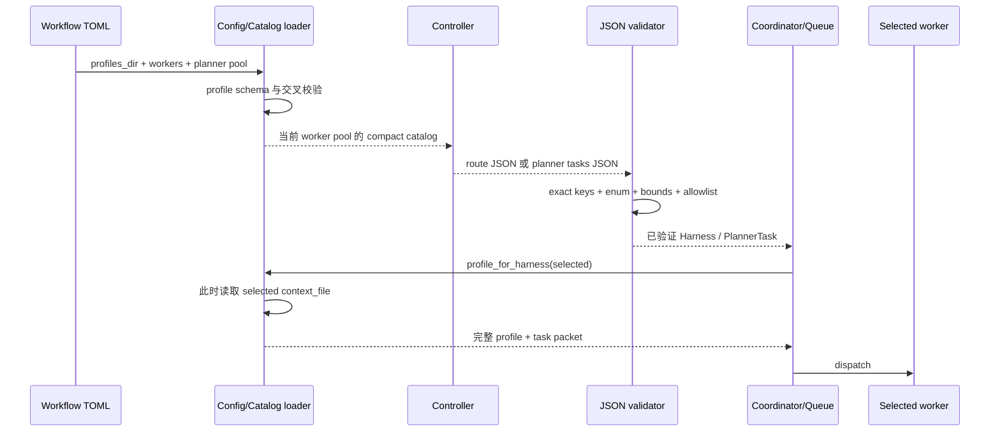

# Harness catalog 与路由
Active contributors: oldwinter, chendongdong

## Purpose

Catalog 与路由系统负责回答“当前 workflow 允许使用哪些 harness”以及“一个任务应交给谁”。它不负责 claim、lease 或执行位置；前者属于 [Coordinator 与队列](coordinator-and-queue.md)，后者属于[拓扑感知派发](../features/topology-aware-dispatch.md)。

系统采用两级 profile：controller 只读取紧凑 TOML 元数据，worker 确定后才读取对应 Markdown 执行契约。这样既控制 controller prompt 大小，也避免未选中 harness 的完整上下文进入 task turn。模型给出的 route 或 planner task 只是候选输入，必须通过 exact-shape JSON、枚举和当前 worker pool 校验后才能入队。

下文源码路径均为仓库根目录完整路径。

## 目录布局

```text
src/herdr_orchestrator/catalog.py       # profile schema、compact catalog、按需 context
src/herdr_orchestrator/planner.py       # planner/router prompt 与严格 JSON loader
src/herdr_orchestrator/selection.py     # 有效 worker pool 与 controller 选择
src/herdr_orchestrator/config.py        # workflow、worker、profile 的交叉校验
src/herdr_orchestrator/model.py         # Harness、HarnessProfile、PlannerTask
src/herdr_orchestrator/runner.py        # queue router、周期 planner、dispatch 注入
src/herdr_orchestrator/cli.py           # catalog/profile 命令
profiles/harnesses/
├── droid.toml / droid.md
├── grok.toml / grok.md
├── codex.toml / codex.md
├── pi.toml / pi.md
├── claude.toml / claude.md
└── hermes.toml / hermes.md
workflows/
├── multi-harness.toml                  # 六 worker，planner 默认关闭
└── grok-research.toml                  # 单 Grok worker，planner 开启
```

## 关键抽象

| 抽象 | 完整源码路径 | 责任 |
| --- | --- | --- |
| `Harness` | [`src/herdr_orchestrator/model.py`](../../src/herdr_orchestrator/model.py) | 六个稳定身份：`droid`、`grok`、`codex`、`pi`、`claude`、`hermes`。 |
| `HarnessProfile` | [`src/herdr_orchestrator/model.py`](../../src/herdr_orchestrator/model.py) | 保存已校验的 compact metadata 与 `context_file` 路径，不缓存 Markdown 内容。 |
| `load_harness_profiles()` | [`src/herdr_orchestrator/catalog.py`](../../src/herdr_orchestrator/catalog.py) | 按文件名排序装载 `*.toml`，拒绝空目录、重复 harness、未知字段和路径逃逸。 |
| `profiles_for_workers()` | [`src/herdr_orchestrator/catalog.py`](../../src/herdr_orchestrator/catalog.py) | 按 workflow worker 顺序取 profile；worker 缺 profile 时 fail closed。 |
| `render_compact_catalog()` | [`src/herdr_orchestrator/catalog.py`](../../src/herdr_orchestrator/catalog.py) | 生成 controller 可见的 JSON，不读取完整 Markdown。 |
| `execution_prompt()` | [`src/herdr_orchestrator/catalog.py`](../../src/herdr_orchestrator/catalog.py) | Dispatch 时读取一个已选 profile，并与 task packet 拼接。 |
| `effective_worker_harnesses()` | [`src/herdr_orchestrator/selection.py`](../../src/herdr_orchestrator/selection.py) | 解析 CLI override、`planner.worker_harnesses` 与全部 workers 的优先级。 |
| `select_controller_harness()` | [`src/herdr_orchestrator/selection.py`](../../src/herdr_orchestrator/selection.py) | 解析显式 controller 或按固定顺序探测本机 CLI。 |
| `PlannerTask` | [`src/herdr_orchestrator/model.py`](../../src/herdr_orchestrator/model.py) | Planner 产出的 `title`、`harness`、`prompt`、`dedupe_key`。 |
| Router / planner loaders | [`src/herdr_orchestrator/planner.py`](../../src/herdr_orchestrator/planner.py) | 校验 route 与批量 task JSON；不接受 shell command 字段。 |

## 工作流



### 1. Workflow 先封闭候选池

[`src/herdr_orchestrator/config.py`](../../src/herdr_orchestrator/config.py) 先解析 `profiles_dir` 与 `[[workers]]`。Worker 名和 harness 都必须唯一；每个 worker 必须有 profile。`planner.worker_harnesses` 若存在，只能引用已声明 worker。显式 `planner.harness` 可以不属于 worker pool，但仍必须有 catalog profile；真正 dispatch 时对应 CLI 也必须可用。

有效 worker pool 的优先级由 [`src/herdr_orchestrator/selection.py`](../../src/herdr_orchestrator/selection.py) 固定：

1. 运行时重复传入的 `--worker-harness`，整体替换 TOML 候选；
2. 非空的 `planner.worker_harnesses`；
3. 全部 `[[workers]]`。

空池、重复 harness 或没有对应 worker 的 override 都会失败。这个有效池同时限制 planner catalog、单任务自动路由以及本次 queue claim，不能借模型输出扩大。

### 2. Compact catalog 只暴露路由信息

每个 [`profiles/harnesses/*.toml`](../../profiles/harnesses/) 只含：

- `schema_version`、`harness`、`display_name`、`summary`；
- `strengths`、`best_for`、`avoid_for`、`traits`；
- 指向同目录 Markdown 的 `context_file`。

`compact_catalog_payload()` 输出上述路由字段，并增加 `profile_ref = "harness:<name>"`。输出中没有 `context`。`context_file` 只保存为已校验路径，直到 `full_profile_payload()` 或 `execution_prompt()` 调用 `load_profile_context()` 才读取。因此 catalog 装载后更新 Markdown，后续 dispatch 会看到新内容；[`tests/test_catalog.py`](../../tests/test_catalog.py) 固定了这一行为。

当前元数据的主定位如下；它是路由提示，不是权限表：

| Harness | 路由定位 |
| --- | --- |
| `droid` | 端到端仓库任务、工具编排、运营型工作、多步骤交付 |
| `grok` | 快速工程实现、仓库探索、结构化输出、并行构建 |
| `codex` | 精确修改、测试驱动修复、重构、可验证 diff |
| `pi` | 低延迟分析、局部检查、边界清晰的短任务 |
| `claude` | 架构设计、长上下文理解、深度评审、风险权衡 |
| `hermes` | 资料搜集、跨来源综合、探索性研究 |

完整字段与长度约束见 [Harness profile](../primitives/harness-profiles.md)。

### 3. Controller 与 worker 是两次独立选择

Controller 是执行 planner/router turn 的 harness，不等于最终 worker。显式 CLI override 优先于 workflow 配置；未指定时，[`src/herdr_orchestrator/selection.py`](../../src/herdr_orchestrator/selection.py) 只在有效 worker pool 内按以下顺序寻找本机 executable：

```text
droid → grok → codex → claude → hermes → pi
```

`force_auto` 会忽略已配置 controller。显式 controller 不经过 executable 探测直接返回，运行时不可用会在 dispatch 层失败。

Queue 单任务自动路由由 [`src/herdr_orchestrator/runner.py`](../../src/herdr_orchestrator/runner.py) 完成。Controller 只获准在 runtime 目录写一个稳定命名的 `route-<digest>.json`：

```json
{"harness":"codex"}
```

[`src/herdr_orchestrator/planner.py`](../../src/herdr_orchestrator/planner.py) 要求对象只有 `harness` 一个 key，值必须能转换为 `Harness` 且位于当前 allowlist。Turn 必须无 transport error 并以 `idle` 或 `done` 结束。临时 route 文件最终删除；本次新建的临时 controller agent 也会关闭，复用 agent 则保留。

显式 `enqueue --harness <name>` 跳过这次 router turn，但仍不能选择有效 worker pool 之外的 worker。

### 4. Planner 只能提任务

启用 planner 后，[`src/herdr_orchestrator/runner.py`](../../src/herdr_orchestrator/runner.py) 按 `interval_seconds` 运行 controller，并只接受：

```json
{
  "tasks": [
    {
      "title": "Review config",
      "harness": "claude",
      "prompt": "只读检查配置。",
      "dedupe_key": "review-config-v1"
    }
  ]
}
```

[`src/herdr_orchestrator/planner.py`](../../src/herdr_orchestrator/planner.py) 的 loader 要求顶层仅有 `tasks`，每项 key 恰为 `title`、`harness`、`prompt`、`dedupe_key`；同时限制任务数、字符串长度、dedupe 格式与批内唯一性。任何 `command` 等额外字段都会被 shape 校验拒绝。Loader 负责枚举校验，Coordinator 入队前再检查 harness 是否属于当前有效 pool。

Planner 是 queue 的可选输入源，不拥有 claim、lease、retry 或 dispatch 决策。默认 [`workflows/multi-harness.toml`](../../workflows/multi-harness.toml) 明确关闭 planner；[`workflows/grok-research.toml`](../../workflows/grok-research.toml) 展示固定 Grok controller 与单 harness worker pool。

### 5. Dispatch 才展开完整 profile

Job 已确定 harness 并被 claim 后，[`src/herdr_orchestrator/runner.py`](../../src/herdr_orchestrator/runner.py) 查找该 harness profile，再调用 `execution_prompt()`。最终 packet 只有两段：

```text
# Dynamically loaded harness profile
<selected Markdown context>

# Task packet
<job prompt>
```

未选 profile 不会进入该 turn。完整 profile 不写入 SQLite；queue 持久化的是 harness 身份与任务事实。Profile 只约束 worker 的工作方式，不授予联网、push、发布或生产操作权限。

## 集成点

| 上下游 | 接口 |
| --- | --- |
| 配置 | [`src/herdr_orchestrator/config.py`](../../src/herdr_orchestrator/config.py) 把 TOML、workers 和 profiles 组装为 `WorkflowConfig`；字段表见[配置参考](../reference/configuration.md)。 |
| Queue | [`src/herdr_orchestrator/runner.py`](../../src/herdr_orchestrator/runner.py) 消费 worker pool、router/planner 结果，并在 dispatch 前注入完整 profile。 |
| CLI | [`src/herdr_orchestrator/cli.py`](../../src/herdr_orchestrator/cli.py) 的 `catalog` 只列 workflow workers；`profile` 展开一个完整 profile。 |
| Herdr runtime | [`src/herdr_orchestrator/herdr.py`](../../src/herdr_orchestrator/herdr.py) 使用同一个 `Harness` 选择 native launch 行为，但不参与能力路由。 |
| Topology | [拓扑感知派发](../features/topology-aware-dispatch.md) 在 harness 已知后决定 `tab`、`pane` 或 `worktree`，与 worker selection 解耦。 |
| Standardized delivery | [`src/herdr_orchestrator/delivery.py`](../../src/herdr_orchestrator/delivery.py) 复用 compact catalog、worker selection schema 与按需 profile，route artifact 则保存在 delivery runtime 中。 |

## 修改入口

| 想修改的行为 | 首要入口 | 必须同步 |
| --- | --- | --- |
| 调整某 harness 的路由描述 | [`profiles/harnesses/<harness>.toml`](../../profiles/harnesses/) | 保持 exact keys、长度上限与相对 `context_file`；运行 [`tests/test_catalog.py`](../../tests/test_catalog.py)。 |
| 调整完整执行契约 | [`profiles/harnesses/<harness>.md`](../../profiles/harnesses/) | 检查权限边界；确认 compact catalog 仍不含 Markdown。 |
| 改 compact schema / context 加载 | [`src/herdr_orchestrator/catalog.py`](../../src/herdr_orchestrator/catalog.py) | [`src/herdr_orchestrator/model.py`](../../src/herdr_orchestrator/model.py)、[`tests/test_catalog.py`](../../tests/test_catalog.py)、配置文档。 |
| 改 planner/router JSON | [`src/herdr_orchestrator/planner.py`](../../src/herdr_orchestrator/planner.py) | [`src/herdr_orchestrator/runner.py`](../../src/herdr_orchestrator/runner.py)、[`tests/test_planner.py`](../../tests/test_planner.py)。 |
| 改候选池或 controller 顺序 | [`src/herdr_orchestrator/selection.py`](../../src/herdr_orchestrator/selection.py) | [`tests/test_selection.py`](../../tests/test_selection.py)、CLI override 说明。 |
| 新增 harness | [`src/herdr_orchestrator/model.py`](../../src/herdr_orchestrator/model.py) | Profile TOML/Markdown、runtime launch spec、workflow worker、CLI choices 与所有枚举覆盖测试。 |
| 改 workflow 关联规则 | [`src/herdr_orchestrator/config.py`](../../src/herdr_orchestrator/config.py) | [`docs/workflow-schema.md`](../../docs/workflow-schema.md)、[配置参考](../reference/configuration.md)、[`tests/test_config.py`](../../tests/test_config.py)。 |

## Key source files

| 仓库根目录完整路径 | 作用 |
| --- | --- |
| [`src/herdr_orchestrator/catalog.py`](../../src/herdr_orchestrator/catalog.py) | Profile exact schema、compact payload、按需 context 与 execution packet。 |
| [`src/herdr_orchestrator/planner.py`](../../src/herdr_orchestrator/planner.py) | Planner/router prompt 与严格 JSON loader。 |
| [`src/herdr_orchestrator/selection.py`](../../src/herdr_orchestrator/selection.py) | Worker pool 和 controller 选择优先级。 |
| [`src/herdr_orchestrator/config.py`](../../src/herdr_orchestrator/config.py) | Workflow、worker、planner、profile 交叉校验。 |
| [`src/herdr_orchestrator/model.py`](../../src/herdr_orchestrator/model.py) | `Harness`、`HarnessProfile`、`PlannerTask`、配置 dataclass。 |
| [`src/herdr_orchestrator/runner.py`](../../src/herdr_orchestrator/runner.py) | 自动 route、周期 planner 与 dispatch 前 profile 注入。 |
| [`src/herdr_orchestrator/cli.py`](../../src/herdr_orchestrator/cli.py) | `catalog` / `profile` 命令。 |
| [`profiles/harnesses/`](../../profiles/harnesses/) | 六个 compact TOML 与完整 Markdown 的 canonical source。 |
| [`workflows/multi-harness.toml`](../../workflows/multi-harness.toml) | 六 worker 默认 workflow。 |
| [`workflows/grok-research.toml`](../../workflows/grok-research.toml) | 单 worker、多 replica、planner 开启示例。 |
| [`tests/test_catalog.py`](../../tests/test_catalog.py) | 两级加载、context 新鲜度与路径逃逸测试。 |
| [`tests/test_planner.py`](../../tests/test_planner.py) | Exact shape、allowed pool、dedupe 与额外字段拒绝测试。 |
| [`tests/test_selection.py`](../../tests/test_selection.py) | Controller 顺序、显式 override 与 worker pool 测试。 |
| [`tests/test_config.py`](../../tests/test_config.py) | Workflow/profile/worker 关联与样例配置测试。 |
