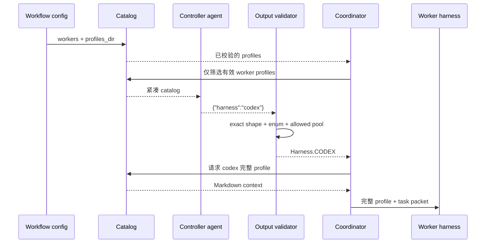

# Harness catalog 与路由
Active contributors: oldwinter, chendongdong

Active contributors: oldwinter, chendongdong

## Purpose

Catalog 与路由系统把“有哪些 harness”与“本次任务选哪个 harness”分开处理。Planner 和 router 只看到当前 workflow 允许的紧凑能力描述；coordinator 校验选择结果后，才在 dispatch 前读取该 harness 的完整执行上下文。

这种两级加载减少 controller prompt 体积，也把模型输出限制为结构化任务或单个 harness 名称。Harness profile 的字段含义见 [Harness profiles](../primitives/harness-profiles.md)，workflow 选项见[配置参考](../reference/configuration.md)。

## 布局

```text
src/herdr_orchestrator/
├── catalog.py             # Profile 装载、紧凑视图与完整上下文
├── config.py              # Workflow/profile/worker 关联校验
├── planner.py             # Planner 与 router 的提示和 JSON 校验
├── selection.py           # Worker pool 与 controller 选择
├── runner.py              # Queue 中的自动路由、planner 和 dispatch
├── delivery.py            # 标准化交付中的自动路由
└── model.py               # Harness、HarnessProfile、PlannerTask 等模型
profiles/harnesses/
├── droid.toml             # 紧凑元数据
├── droid.md               # 完整执行上下文
└── ...                    # grok、codex、pi、claude、hermes
workflows/
├── multi-harness.toml
├── grok-research.toml
└── prompts/
    └── planner.md
```

## 关键抽象

| 抽象 | 所在文件 | 作用 |
| --- | --- | --- |
| `Harness` | `src/herdr_orchestrator/model.py` | 六个受支持 harness 的稳定枚举：`droid`、`grok`、`codex`、`pi`、`claude`、`hermes`。 |
| `HarnessProfile` | `src/herdr_orchestrator/model.py` | 保存 TOML 元数据及已校验的 Markdown context 路径。 |
| `load_harness_profiles()` | `src/herdr_orchestrator/catalog.py` | 按文件名排序装载 profile，拒绝空 catalog、重复 harness、未知字段和越界 context 路径。 |
| `render_compact_catalog()` | `src/herdr_orchestrator/catalog.py` | 输出不含完整 Markdown context 的 JSON catalog。 |
| `execution_prompt()` | `src/herdr_orchestrator/catalog.py` | 在 dispatch 时把已选 profile 的完整 context 与 task packet 拼接。 |
| `effective_worker_harnesses()` | `src/herdr_orchestrator/selection.py` | 从 CLI override、planner worker 列表或 workflow workers 计算有效候选池。 |
| `select_controller_harness()` | `src/herdr_orchestrator/selection.py` | 解析显式 controller 或按固定优先序选择本机可执行 controller。 |
| `worker_selection_prompt()` / `load_worker_selection()` | `src/herdr_orchestrator/planner.py` | 定义并校验单任务路由的 `{"harness":"..."}` 协议。 |
| `planner_prompt()` / `load_planner_tasks()` | `src/herdr_orchestrator/planner.py` | 定义并校验批量任务规划协议。 |

## How it works



### 1. Workflow 先封闭候选集合

`load_workflow()` 在 `src/herdr_orchestrator/config.py` 中解析 `profiles_dir` 和 `[[workers]]`。它要求每个 worker 有唯一名称、唯一 harness 和对应 profile；`planner.worker_harnesses` 中的每一项也必须有已配置 worker。显式 `planner.harness` 可以位于 worker pool 之外，但仍必须有 profile。

`effective_worker_harnesses()` 在 `src/herdr_orchestrator/selection.py` 中应用运行时 `--worker-harness` override。若没有 override，则优先用非空的 `planner.worker_harnesses`，否则使用全部 configured workers。空集合、重复项或没有 worker 的 harness 都会失败。

### 2. TOML 是紧凑索引，Markdown 是执行上下文

每个 `profiles/harnesses/*.toml` 声明 `display_name`、`summary`、`strengths`、`best_for`、`avoid_for`、`traits` 和相对 `context_file`。`src/herdr_orchestrator/catalog.py` 只允许 schema version 1，context 必须位于 profile 目录内、存在且不能通过绝对路径或 `..` 逃逸。

紧凑 catalog 只输出路由字段和形如 `harness:codex` 的 `profile_ref`，不会提前读取 Markdown 内容。`load_profile_context()` 在 `full_profile_payload()` 或 `execution_prompt()` 被调用时才读取 context，并限制为 50,000 字符。`tests/test_catalog.py` 还固定了一个重要行为：catalog 装载后修改 context，随后 dispatch 会读到新内容。

当前 profile 的路由倾向来自 `profiles/harnesses/*.toml`：

| Harness | 主要定位 |
| --- | --- |
| `droid` | 端到端仓库任务、工具编排和多步骤交付 |
| `grok` | 快速工程实现、仓库探索和结构化输出 |
| `codex` | 精确实现、测试驱动修复和可验证 diff |
| `pi` | 低延迟、小范围检查和短任务 |
| `claude` | 架构设计、长上下文理解和深度评审 |
| `hermes` | 研究、跨来源综合和探索性调查 |

### 3. Controller 只产生受限输出

自动 controller 的优先序由 `AUTO_CONTROLLER_ORDER` 在 `src/herdr_orchestrator/selection.py` 固定为 `droid → grok → codex → claude → hermes → pi`。自动模式只在有效 worker pool 中寻找本机可执行 CLI；显式 CLI override 或 workflow 中的 controller 则直接优先于自动探测。`force_auto` 会忽略已配置 controller。

Queue 的自动路由位于 `Coordinator._select_worker_harness()`，见 `src/herdr_orchestrator/runner.py`。它：

1. 用 workflow 名和 `dedupe_key` 生成稳定摘要，并在 planner runtime 目录下创建临时 `route-*.json`；
2. 向 controller 发送任务标题、prompt、紧凑 catalog、允许的 harness 列表和唯一输出路径；
3. 只接受 `IDLE` 或 `DONE` 且无 transport error 的 turn；
4. 通过 `load_worker_selection()` 要求输出对象只有 `harness` 一个字段，并再次校验 allowed pool；
5. 删除临时 route 文件；若 controller agent 是本次新建的，还会关闭该临时 agent。

标准化交付的 `StandardizedDelivery._select_worker()` 在 `src/herdr_orchestrator/delivery.py` 中复用相同 prompt 和 validator，但把路由 artifact 保存在该次 delivery 的 `routes/` 下，以便恢复时复用选择。

### 4. Planner 能拆任务，但不能提交命令

启用 `planner.enabled` 后，`Coordinator._run_planner_if_due()` 按 `interval_seconds` 运行 controller。`planner_prompt()` 要求唯一输出为：

```json
{
  "tasks": [
    {
      "title": "...",
      "harness": "codex",
      "prompt": "...",
      "dedupe_key": "..."
    }
  ]
}
```

`load_planner_tasks()` 在 `src/herdr_orchestrator/planner.py` 中要求顶层和每项字段完全匹配 schema，限制任务数量和字符串长度，校验 dedupe key 格式及批内唯一性，并把 harness 转换为稳定枚举。任何额外的 `command` 字段都会因 shape 不匹配而被拒绝；`src/herdr_orchestrator/runner.py` 入队前还会再次确认所有 harness 都在有效 worker pool 中。

### 5. Dispatch 才展开完整 profile

当 job 已经拥有确定 harness 后，`Coordinator._dispatch_job()` 在 `src/herdr_orchestrator/runner.py` 中调用 `profile_for_harness()`，再用 `execution_prompt()` 生成“完整 profile + task packet”。未选中的 Markdown profile 不进入 worker prompt。标准化交付的实现与 repair dispatch 也遵循同一加载方式。

## 集成点

- `src/herdr_orchestrator/cli.py` 的 `catalog` 命令只展示当前 workflow workers 对应的紧凑 profiles；`profile` 命令用于查看单个完整 profile。
- `src/herdr_orchestrator/config.py` 把 `workflows/*.toml`、`profiles/harnesses/*.toml` 和 worker 定义组装为 `WorkflowConfig`。
- `src/herdr_orchestrator/runner.py` 同时消费 catalog、router、planner 和 controller selection；最终 dispatch 进入 Herdr transport。
- `src/herdr_orchestrator/delivery.py` 共享同一 worker pool 与路由协议，避免标准化交付形成第二套 harness 选择规则。
- `skills/herdr-orchestrator/SKILL.md` 要求真实派发前先运行 `doctor` 和读取 compact catalog，再显式约束 controller 与 candidate pool。

## 修改入口

新增或调整 harness 能力描述时，同时修改对应的 `profiles/harnesses/<name>.toml` 与 `profiles/harnesses/<name>.md`，并从 `tests/test_catalog.py` 验证紧凑/完整两级契约。修改自动优先序或 override 规则时从 `src/herdr_orchestrator/selection.py` 和 `tests/test_selection.py` 开始；修改模型输出 schema 时必须同步更新 `src/herdr_orchestrator/planner.py`、调用方和 `tests/test_planner.py`。

若修改 workflow 字段，不要绕过 `src/herdr_orchestrator/config.py` 的跨字段校验，并同步更新[配置参考](../reference/configuration.md)和 `tests/test_config.py`。

## 关键源文件表

| 文件 | 作用 |
| --- | --- |
| `src/herdr_orchestrator/catalog.py` | Profile schema、紧凑 catalog、完整 context 和执行 prompt。 |
| `src/herdr_orchestrator/planner.py` | Planner/router 提示模板与严格 JSON 输出校验。 |
| `src/herdr_orchestrator/selection.py` | Worker pool 与 controller 选择。 |
| `src/herdr_orchestrator/config.py` | Workflow、worker、planner 和 profile 的装载及关联校验。 |
| `src/herdr_orchestrator/runner.py` | Queue 自动路由、周期 planner 和 dispatch 前 profile 注入。 |
| `src/herdr_orchestrator/delivery.py` | 标准化交付中的持久路由 artifact 与 profile 注入。 |
| `src/herdr_orchestrator/cli.py` | `catalog` 与 `profile` 命令入口。 |
| `src/herdr_orchestrator/model.py` | `Harness`、`HarnessProfile`、`PlannerTask` 和配置数据模型。 |
| `profiles/harnesses/*.toml` | 六个 harness 的紧凑路由元数据。 |
| `profiles/harnesses/*.md` | 六个 harness 的完整执行契约。 |
| `workflows/multi-harness.toml` | 默认六 worker catalog 与关闭的 planner。 |
| `workflows/grok-research.toml` | 启用 Grok planner、单 harness 多副本的示例。 |
| `workflows/prompts/planner.md` | 默认 planner 的权限边界与任务质量要求。 |
| `tests/test_catalog.py` | 两级 profile、按需读取和路径逃逸测试。 |
| `tests/test_planner.py` | Router/planner schema、allowed pool 和禁止额外命令测试。 |
| `tests/test_selection.py` | 自动 controller 顺序与 override 测试。 |
| `tests/test_config.py` | Workflow 与 profile/worker 关联测试。 |
