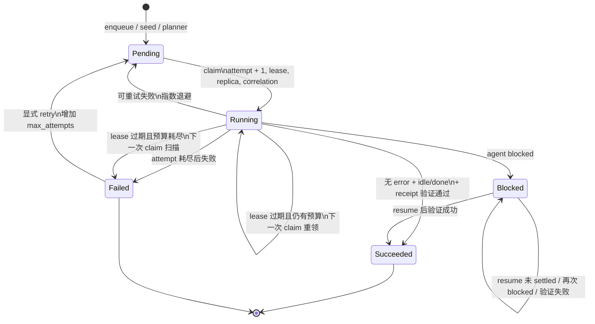

# Coordinator 与队列
Active contributors: oldwinter, chendongdong

## Purpose

Coordinator 是普通 durable queue 的确定性控制面：它把已验证的 workflow 配置、worker catalog、SQLite 状态和 Herdr transport 组合起来，但不把状态推进权交给模型。模型可以参与 worker 路由、planner 任务生成或 topology 选择；这些输出必须先通过严格 schema 和 allowlist，之后才能影响入队或 placement。真正的 claim、attempt、lease、退避、恢复和终态判定都由 Python 与 SQLite 完成。

这一运行面与 opt-in 标准化交付严格分离：普通 `enqueue` / `run` / `retry` / `resume` / `gc` 使用 queue；只有显式 `deliver` 才进入另一套交付阶段机。Dashboard 也不在控制回路内，只读取 SQLite 与 Herdr topology。

本文聚焦调度机制及其不变量。任务与 receipt 的字段级语义请转到：

- [durable execution（`droid-wiki/features/durable-execution.md`）](../features/durable-execution.md)
- [receipts and recovery（`droid-wiki/features/receipts-and-recovery.md`）](../features/receipts-and-recovery.md)
- [jobs and receipts（`droid-wiki/primitives/jobs-and-receipts.md`）](../primitives/jobs-and-receipts.md)

下文所有源码路径均为从仓库根开始的完整路径。

## 目录与文件布局

```text
src/herdr_orchestrator/
├── runner.py          # Coordinator、wave、dispatch、resume 与 GC
├── store.py           # SQLite schema、claim、状态转换、retry 与查询
├── model.py           # Job/Agent 状态及不可变领域对象
├── observability.py   # 本地 JSONL telemetry、脱敏和可选 exporter
├── cli.py             # queue 命令入口、退出码和 JSON 输出
├── config.py          # TOML -> WorkflowConfig 及边界校验
├── planner.py         # planner/router 模型输出的严格解析
├── topology.py        # placement 决策与模型输出校验
├── catalog.py         # compact catalog 与 dispatch 前完整 profile 注入
├── herdr.py           # Dispatcher 实现、PTY lifecycle 与 receipt 验证
└── herdr_layout.py    # tab/pane/worktree 的创建、定位和所有权

workflows/multi-harness.toml  # 默认 queue、worker replica 与 timeout 策略
tests/test_runner.py          # Coordinator、wave、resume、GC 行为契约
tests/test_store.py           # claim、lease、状态、迁移与 retry 契约
tests/test_observability.py   # 脱敏、correlation 与 exporter 契约
tests/test_cli.py             # queue CLI 参数、scope 与默认安全行为
```

## 关键抽象

| 抽象 | 所在文件 | 责任与不变量 |
| --- | --- | --- |
| `Coordinator` | [`src/herdr_orchestrator/runner.py`](../../src/herdr_orchestrator/runner.py) | 组合 planner、placement、Store、Dispatcher 和 observability；控制 dispatch wave，但不自行保存 durable 状态。 |
| `Store` | [`src/herdr_orchestrator/store.py`](../../src/herdr_orchestrator/store.py) | queue 状态真源。所有 claim 和关键状态写入使用事务与状态前置条件。 |
| `JobState` | [`src/herdr_orchestrator/model.py`](../../src/herdr_orchestrator/model.py) | Durable 状态：`pending`、`running`、`succeeded`、`blocked`、`failed`。它不等同于 PTY 中的 agent lifecycle。 |
| `AgentState` | [`src/herdr_orchestrator/model.py`](../../src/herdr_orchestrator/model.py) | Transport 观测：`idle`、`working`、`blocked`、`done`、`unknown`；Store 将其与 error、attempt budget、receipt 一起折叠为 `JobState`。 |
| `NewJob` | [`src/herdr_orchestrator/model.py`](../../src/herdr_orchestrator/model.py) | 入队边界，携带 workflow、harness、dedupe key、attempt 上限、可选 placement 与声明式 receipt。 |
| `ClaimedJob` | [`src/herdr_orchestrator/model.py`](../../src/herdr_orchestrator/model.py) | 一次 claim 的不可变快照，固定 attempt、replica agent 名、placement、receipt 与 correlation ID。 |
| `DispatchContext` | [`src/herdr_orchestrator/model.py`](../../src/herdr_orchestrator/model.py) | 将 task key、wave batch、worktree root、placement 和 receipt 传给 transport。 |
| `DispatchOutcome` | [`src/herdr_orchestrator/model.py`](../../src/herdr_orchestrator/model.py) | Transport 的有界结果；Store 不直接相信 `done`，还会检查 error 与 `task_verified`。 |
| `Dispatcher` protocol | [`src/herdr_orchestrator/runner.py`](../../src/herdr_orchestrator/runner.py) | Coordinator 对 Herdr 的窄接口：新 turn 用 `dispatch`，人工恢复原 turn 用 `respond`。生产实现是 `HerdrTransport`。 |
| `Observability` | [`src/herdr_orchestrator/observability.py`](../../src/herdr_orchestrator/observability.py) | 以 correlation ID 串联 dispatch 事件、耗时和 attention alert；telemetry 失败不能阻断 queue。 |

## 数据持久化与事务边界

[`src/herdr_orchestrator/store.py`](../../src/herdr_orchestrator/store.py) 当前维护 schema version 4：

- `jobs` 保存最新投影，包括 durable 状态、attempt budget、可运行时间、lease、agent identity、placement、验证结果和 correlation ID。
- `receipts` 对每次 dispatch outcome 追加不可变观察记录；同一 job 的 blocked turn 与后续 resume 可以在同一 attempt 下产生多条记录。
- `metadata` 保存 planner 上次尝试时间等轻量调度元数据。
- `schema_meta` 驱动 v1 → v2 → v3 → v4 的顺序迁移。

连接启用 foreign keys 和 WAL。`claim`、`record_outcome`、blocked claim 与 resume outcome 使用 `BEGIN IMMEDIATE`，避免多个 coordinator 同时选择同一候选。`UNIQUE(workflow, dedupe_key)` 和 `ON CONFLICT DO NOTHING` 令 seed/enqueue 幂等；重复请求返回原 job ID，不重新运行自动 router。

`record_outcome` 只接受数据库中仍为 `running` 且 `attempts == ClaimedJob.attempt` 的写入，否则报稳定错误 `job_lease_lost`。这使已被新 claim 接管的旧 worker 不能覆盖较新的 attempt。Resume 写入同样校验 job 仍为 `blocked` 且 attempt 未变化。

## 入队到 dispatch 的单个 wave

`Coordinator.run_once()` 的顺序是固定的：

1. `initialize()` 创建或迁移数据库。
2. 若 planner 已启用且到期，controller 生成任务文件；[`src/herdr_orchestrator/planner.py`](../../src/herdr_orchestrator/planner.py) 校验 exact shape、任务上限和 harness allowlist 后才逐项入队。默认 [`workflows/multi-harness.toml`](../../workflows/multi-harness.toml) 关闭 planner。
3. 对 `placement IS NULL` 的 pending job 先求 placement。静态策略、显式 override 或 worker default 能决定时不调用模型；模糊任务才经 [`src/herdr_orchestrator/topology.py`](../../src/herdr_orchestrator/topology.py) 校验 controller 输出。未 placement 的任务不会被 claim。
4. 生成本 wave 的 `batch_key`，计算每个 harness/placement 的确定性 replica 名称及 replica 上限。
5. `Store.claim()` 在一个写事务中选择最多 `max_parallel` 个 job。
6. `ThreadPoolExecutor` 并发调用 `_dispatch_job()`；dispatch 前才由 [`src/herdr_orchestrator/catalog.py`](../../src/herdr_orchestrator/catalog.py) 注入被选中 harness 的完整 profile。
7. future 完成后调用 `Store.record_outcome()`。未处理的 dispatcher 异常被折叠为 `AgentState.UNKNOWN` + `dispatcher_unhandled_error`，不会被算作成功。
8. 返回本 wave 的状态计数、claimed 数以及整个 workflow 的 queue 快照。

默认策略来自 [`workflows/multi-harness.toml`](../../workflows/multi-harness.toml)：`max_parallel = 6`、`lease_seconds = 32400`、`max_attempts = 2`、`agent_timeout_seconds = 28800`。这些是配置值而非 Store 内部常量。

## Claim、lease 与 replica

### Claim 算法

`Store.claim()` 的事务内步骤如下：

1. 把“lease 已过期且 attempt 已耗尽”的 `running` job 标为 `failed`，错误码为 `lease_expired`。
2. 统计仍有有效 lease 的 `running` job，得到每个 harness 的 busy 数量与已占用 agent 名。
3. 按 `created_at, id` 选择已 placement 的候选：到达 `available_at` 的 `pending`，或 lease 已过期且仍有 attempt 预算的 `running`。
4. 应用本次运行的 worker harness allowlist、每 harness replica 上限和 agent-name 可用性。
5. 原子更新候选为 `running`，令 `attempts += 1`，设置 `lease_until`、确定性 `agent_name` 和新的 UUID correlation ID，然后返回 `ClaimedJob`。

候选是 FIFO，但容量判断是按 harness 汇总的；`max_parallel` 限制整个 wave，worker 的 `replicas` 限制该 harness 同时持有有效 lease 的 job 数。

### Lease 语义

Lease 是 crash recovery 边界，而不是成功信号：

- 未过期的 `running` job 不会被第二个 coordinator claim。
- lease 过期且尚有预算时，下次 claim 会重领同一 job、增加 attempt 并生成新 correlation ID。
- lease 过期且预算耗尽时，下次 claim 扫描把它置为 `failed/lease_expired`。
- outcome 到达时仍必须通过 state + attempt 前置条件；旧 attempt 在重领后会得到 `job_lease_lost`。
- Coordinator 不把 timeout、`unknown` 或 `working` 当作成功；未 settled 且没有更具体错误时记录 `agent_not_settled`。

### Replica slot

[`src/herdr_orchestrator/runner.py`](../../src/herdr_orchestrator/runner.py) 的 `_slot_names()` 与 [`src/herdr_orchestrator/herdr.py`](../../src/herdr_orchestrator/herdr.py) 的命名函数共同建立稳定映射：

- `tab` / `pane` 使用 workflow、workspace、harness、replica index 推导固定 agent 名，可跨 wave 复用。
- `worktree` 名称包含 job ID，每个 job 获得独立名称，但仍受该 harness 的 replica 并发上限约束。
- Store 从候选名称中挑选当前未 busy 的名称；调用方没有提供 slot map 时回退为 `ho-<harness>`，因而默认每 harness 一槽。

稳定名称既是复用机制，也是 GC 所有权校验的一部分；不能只改命名函数的一侧。

## Wave 与 drain

`Coordinator.run_until_idle()` 重复执行 `run_once()`，每次循环算一个 wave，并聚合各 wave 的终态结果：

- 所有 planner、topology 和 worker dispatch 都共享一个 monotonic 总 deadline；传给单次 dispatch 的 timeout 是 agent timeout 与剩余 drain 时间的较小值。
- worker pool 中出现任何 `blocked` 时立即以 `idle=false, reason=blocked` 返回，普通 queue 不会自动替用户回答。
- worker pool 的 `pending`、`running`、`blocked` 全为零时结束。若全局 queue 仍有被本次 harness filter 排除的任务，结果为 `reason=worker_pool_idle`、`worker_pool_idle=true`、`queue_idle=false`。
- 如果本 wave 没 claim 到任务但 worker pool 仍不 idle，会在 deadline 范围内按 `poll_seconds` 睡眠；这覆盖 backoff 尚未到期或 slot 暂忙的情况。
- 超过总 deadline 始终返回 `idle=false, reason=drain_timeout`，即使最后一个 worker 刚好让 queue 变空；CLI 据此返回非零。

因此 wave 是一次“规划/placement + 有界 claim + 并发 dispatch + 原子收口”，不是 attempt，也不是 replica。

## Retry 与结果折叠

`Store.record_outcome()` 按以下优先级折叠结果：

1. 若声明了 task receipt，而 `task_verified is not True`，即使 agent 报 `done` 也生成 `task_receipt_missing` 或 `task_receipt_invalid`，fail closed。
2. 仅“无 error 且 agent 为 `idle` / `done`”进入 `succeeded`。
3. agent 为 `blocked` 进入 `blocked`，不会消耗新的 attempt 或自动重试。
4. 其余失败若 `attempt < max_attempts`，回到 `pending`，`available_at` 使用 `min(60, 2 ** (attempt - 1))` 秒的指数退避。
5. attempt 已耗尽则进入 `failed`。

自动 retry 保留既有 attempt budget。显式 `Store.retry_failed()` 只接受 `failed` job 和 `1..10` 个额外 attempts：它增加 `max_attempts`、保留已用 `attempts`，清理最近错误/验证/correlation 投影并重新置为可立即 claim 的 `pending`。CLI 接口位于 [`src/herdr_orchestrator/cli.py`](../../src/herdr_orchestrator/cli.py) 的 `retry --job-id ... --extra-attempts ...`。

## Blocked resume

Resume 是对原 agent、原 pane、原 attempt 的人工续答，不是重新入队：

1. [`src/herdr_orchestrator/cli.py`](../../src/herdr_orchestrator/cli.py) 读取非空 response file。
2. `Store.claim_blocked_for_resume()` 连接最新 receipt，要求 job 为 `blocked`，且存在原 `agent_name`、`pane_id` 和 placement；有效 resume lease 会拒绝第二个并发响应。
3. Coordinator 用 `batch_key=resume-<job-id>-<attempt>` 构建 context，并调用 `Dispatcher.respond()`，同时传入 `expected_pane_id`，避免误答到另一个 PTY。
4. 无 error 且 agent settled 为 `idle` / `done` 才转为 `succeeded`；任何其他结果都保持 `blocked`，清除 resume lease，并追加同 attempt receipt，允许稍后再次人工恢复。

Resume 不增加 attempt，也不走自动 backoff。dispatcher 异常会变成 `resume_unhandled_error` 并保持 blocked。

## GC

GC 清理的是 Herdr terminal，不删除 job、receipt 或 worktree。`gc --succeeded-agents` 与 `gc --failed-agents` 默认 dry-run，只有显式 `--apply` 才关闭目标 terminal。

`Coordinator._gc_agents()` 只有在以下条件全部满足时才把 agent 列为候选：

1. job 处于所选终态 `succeeded` 或 `failed`；
2. placement 是 `tab` 或 `pane`，不是 `worktree`；
3. agent 名属于当前 workflow/workspace/config 推导出的 replica allowlist；
4. receipt 证明该 pane 是本 workflow 创建的，即 `member_reused = 0` 且记录了 pane ID；
5. 同名 agent 没有被任何非目标状态 job 引用。

候选按 agent 名去重，并用 receipt 中的精确 pane ID 调用 `close_agent_terminal(..., expected_pane_id=...)`。Blocked agent、预先存在而被复用的 agent、外部名称、worktree agent 和仍被活动 job 使用的 agent均不会关闭。相关所有权回归测试位于 [`tests/test_runner.py`](../../tests/test_runner.py)。

## 状态机



GC 不在图中改变状态：它只释放由 queue 创建、且已无活动引用的 terminal 资源。

## Observability 与 correlation

每次 claim 生成 correlation ID，并写入 `jobs`；正常 dispatch outcome 与 attempt receipt 继承同一 ID。Coordinator 在 [`src/herdr_orchestrator/observability.py`](../../src/herdr_orchestrator/observability.py) 中记录：

- `dispatch_started` event；
- `dispatch_finished` event；
- `dispatch_duration_seconds` metric；
- error 或 blocked 时的 `dispatch_needs_attention` alert。

默认落盘位置是 state DB 同级的 `telemetry/events.jsonl`、`metrics.jsonl` 和 `alerts.jsonl`。写文件、webhook 或 exporter 失败都 fail-soft，不改变 queue 结果。字段先经 `sanitize()`：敏感 key 整值替换、常见 token/assignment 形状擦除、字符串压缩并截断到 300 字符。Sentry、PostHog 和 webhook 均受显式 feature flag 控制；外发 URL 必须是 HTTPS，请求 timeout 为 2 秒。

Store 也用同一 sanitizer 约束持久化的 `error_summary`，但原 prompt 仍只属于 queue 数据，不进入 telemetry。

## 集成点

| 上下游 | 接口 | Queue 侧约束 |
| --- | --- | --- |
| TOML 配置 | [`src/herdr_orchestrator/config.py`](../../src/herdr_orchestrator/config.py) → `WorkflowConfig` | timeout、attempt、worker、replica、路径和 placement 在 Coordinator 构造前验证。 |
| CLI / `justfile` | [`src/herdr_orchestrator/cli.py`](../../src/herdr_orchestrator/cli.py) | `run --once`、`run --until-idle`、`retry`、`resume`、`gc` 输出适合 automation 的 JSON；blocked/timeout drain 非零退出。 |
| Planner / router | [`src/herdr_orchestrator/planner.py`](../../src/herdr_orchestrator/planner.py) | 模型只能提交 schema 合法、数量有界且 harness 在当前 worker pool 内的任务或单一 route。 |
| Topology | [`src/herdr_orchestrator/topology.py`](../../src/herdr_orchestrator/topology.py) | 只接受允许的 placement；不支持 worktree 时不能选择 worktree。 |
| Catalog | [`src/herdr_orchestrator/catalog.py`](../../src/herdr_orchestrator/catalog.py) | Router 只见 compact profile；worker 确定后才加载完整 context。 |
| Herdr runtime | [`src/herdr_orchestrator/herdr.py`](../../src/herdr_orchestrator/herdr.py) | Transport 返回结构化 outcome；Coordinator 不读取任意 shell 状态来推断成功。 |
| SQLite | [`src/herdr_orchestrator/store.py`](../../src/herdr_orchestrator/store.py) | Store 是 job/attempt/receipt 真源；事务和前置条件抵御 stale writer。 |
| Dashboard | [`src/herdr_orchestrator/dashboard/projector.py`](../../src/herdr_orchestrator/dashboard/projector.py) | 只读投影，不 claim、不 retry、不 resume，也不读取 prompt 或 terminal output。 |
| 标准化交付 | [`src/herdr_orchestrator/delivery.py`](../../src/herdr_orchestrator/delivery.py) | 独立 opt-in 运行面，不复用普通 queue 状态机。 |

## 修改入口

| 想修改的行为 | 首要入口 | 必须同步检查 |
| --- | --- | --- |
| 新增/改变 job 状态 | [`src/herdr_orchestrator/model.py`](../../src/herdr_orchestrator/model.py)、[`src/herdr_orchestrator/store.py`](../../src/herdr_orchestrator/store.py) | `record_outcome`、resume、`status_counts`、`_queue_is_idle`、CLI/Dashboard 投影及状态迁移测试。 |
| 改 claim、lease 或退避 | [`src/herdr_orchestrator/store.py`](../../src/herdr_orchestrator/store.py) | `BEGIN IMMEDIATE`、stale attempt 防护、lease reclaim、FIFO 与 [`tests/test_store.py`](../../tests/test_store.py)。 |
| 改 replica 并发或名称 | [`src/herdr_orchestrator/runner.py`](../../src/herdr_orchestrator/runner.py)、[`src/herdr_orchestrator/herdr.py`](../../src/herdr_orchestrator/herdr.py) | `slot_limits`、worktree job ID、GC owned-name allowlist 与 [`tests/test_runner.py`](../../tests/test_runner.py)。 |
| 改 drain/wave 退出条件 | [`src/herdr_orchestrator/runner.py`](../../src/herdr_orchestrator/runner.py) | 总 deadline 是否覆盖 planner/topology/dispatch、worker-pool 与 global queue 的差异、CLI 退出码。 |
| 改 retry/resume | [`src/herdr_orchestrator/store.py`](../../src/herdr_orchestrator/store.py)、[`src/herdr_orchestrator/runner.py`](../../src/herdr_orchestrator/runner.py) | attempt 是否增加、pane identity、receipt 追加、blocked 是否仍为人工边界。 |
| 改数据库字段 | [`src/herdr_orchestrator/store.py`](../../src/herdr_orchestrator/store.py) | 增加顺序 migration、提升 `SCHEMA_VERSION`、保留旧 DB 兼容，并扩展 v1 migration 回归。 |
| 改 telemetry | [`src/herdr_orchestrator/observability.py`](../../src/herdr_orchestrator/observability.py) | 先脱敏、默认关闭 exporter、HTTPS、bounded timeout、telemetry 故障不影响调度。 |
| 改 GC 范围 | [`src/herdr_orchestrator/runner.py`](../../src/herdr_orchestrator/runner.py) | 默认 dry-run、created-vs-reused 证据、expected pane ID、active name 和 worktree 排除。 |

## 关键源文件

| 文件 | 为什么关键 |
| --- | --- |
| [`src/herdr_orchestrator/runner.py`](../../src/herdr_orchestrator/runner.py) | Coordinator 主循环、planner/placement 前置、replica slot、dispatch wave、drain、resume 和 GC。 |
| [`src/herdr_orchestrator/store.py`](../../src/herdr_orchestrator/store.py) | SQLite schema/migration、幂等入队、事务 claim、状态折叠、retry、resume 与 receipt append。 |
| [`src/herdr_orchestrator/model.py`](../../src/herdr_orchestrator/model.py) | Queue 与 transport 共享的枚举、配置和不可变 packet。 |
| [`src/herdr_orchestrator/observability.py`](../../src/herdr_orchestrator/observability.py) | Correlation、隐私安全 telemetry 和可选外发边界。 |
| [`src/herdr_orchestrator/cli.py`](../../src/herdr_orchestrator/cli.py) | 人与 automation 进入 queue 的稳定命令面和退出码。 |
| [`src/herdr_orchestrator/herdr.py`](../../src/herdr_orchestrator/herdr.py) | Agent lifecycle、真实 settlement、receipt verification 与 terminal cleanup 实现。 |
| [`workflows/multi-harness.toml`](../../workflows/multi-harness.toml) | 默认 poll、parallelism、lease、attempt、timeout、worker 与 planner 策略真源。 |
| [`tests/test_runner.py`](../../tests/test_runner.py) | 多 wave drain、deadline、worker filter、resume 同 pane/attempt 与 GC ownership 契约。 |
| [`tests/test_store.py`](../../tests/test_store.py) | 幂等、replica claim、receipt fail-closed、lease reclaim、retry 与 migration 契约。 |
| [`tests/test_observability.py`](../../tests/test_observability.py) | 脱敏、local telemetry、HTTPS exporter 与 fail-closed feature flag 契约。 |
| [`tests/test_cli.py`](../../tests/test_cli.py) | `run`、`retry`、`resume`、`gc` 的参数边界和默认 dry-run 契约。 |
